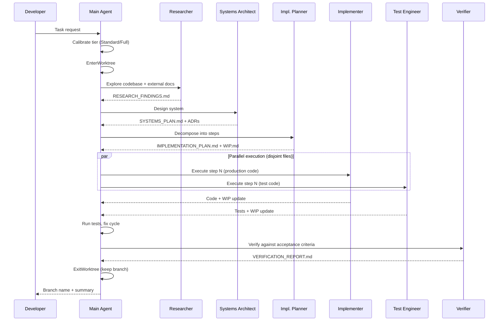
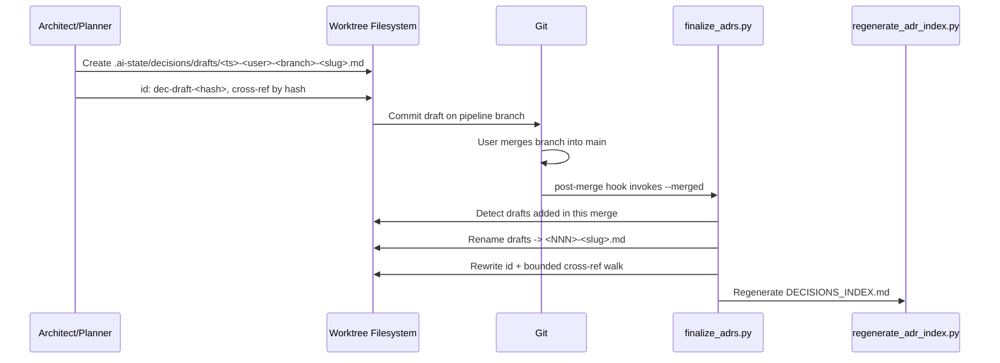
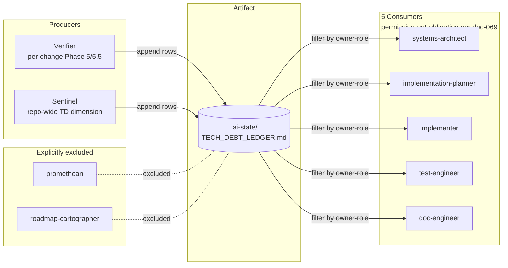

# Architecture

<!-- Design-target architecture document. Abstracts above concrete code to define the space of valid
     implementations. Component names may be abstract; file paths are illustrative; planned components
     are included with Status markers. For code-verified developer navigation, see docs/architecture.md.
     Created by systems-architect, updated by implementer, validated by verifier/sentinel.
     See skills/software-planning/references/architecture-documentation.md for the full methodology. -->

## 1. Overview

<!-- OWNER: systems-architect | LAST UPDATED: 2026-04-12 by systems-architect -->

| Attribute | Value |
|-----------|-------|
| **System** | Praxion |
| **Type** | AI development meta-framework (plugin + MCP servers + knowledge artifacts) |
| **Language / Framework** | Python 3.13+ (MCP servers), Markdown (skills/agents/rules/commands), Shell/Python (hooks, scripts) |
| **Architecture pattern** | Plugin-based knowledge ecosystem with progressive disclosure and agent pipeline orchestration |
| **Source stage** | Phase 5 creation, 2026-04-10 by systems-architect |
| **Last verified** | 2026-04-26 (praxion-first-class feature shipped Built: `hooks/inject_subagent_context.py` + `hooks/inject_process_framing.py` + `hooks/auto_complete_install.py` + `scripts/render_claude_md.py` + §Praxion Process canonical block in `commands/onboard-project.md`/`commands/new-project.md`; three draft ADRs under `.ai-state/decisions/drafts/` awaiting finalize); prior: 2026-04-24 (project-metrics feature shipped Built: `/project-metrics` slash command + `scripts/project_metrics/` package + `docs/metrics/README.md` schema reference + `docs/metrics/index.html` trend-visualization page; five `/project-metrics` draft ADRs awaiting finalize. Tech-debt-integration shipped Built end-to-end: `.ai-state/TECH_DEBT_LEDGER.md` empty artifact + 15-field schema in `rules/swe/agent-intermediate-documents.md` + `scripts/finalize_tech_debt_ledger.py` post-merge dedupe + hook-chain wiring in `scripts/git-post-merge-hook.sh` + verifier Phase 5/5.5 ledger writes + sentinel TD01-TD05 dimension + 5 consumer-contract additions across systems-architect / implementation-planner / implementer / test-engineer / doc-engineer + `## Technical Debt` removed from LEARNINGS template; three draft ADRs under `.ai-state/decisions/drafts/` finalize to stable `dec-NNN` at merge-to-main) |

Praxion is a meta-project that provides the operational infrastructure for AI-assisted software development. Rather than being an application itself, it is an ecosystem of reusable skills, specialized agents, declarative rules, slash commands, lifecycle hooks, and MCP servers that compose into a coherent development workflow. It ships as the `i-am` Claude Code plugin, with secondary targets for Claude Desktop and Cursor.

The architecture is organized around three core concerns: **knowledge delivery** (skills and rules that bring domain expertise into agent context windows), **agent orchestration** (a pipeline of specialized agents that collaborate through shared documents), and **persistent intelligence** (MCP servers that maintain memory and observability state across sessions). This document defines the design space — the set of valid implementations and their relationships — rather than documenting what currently exists on disk. For code-verified navigation, see [docs/architecture.md](../docs/architecture.md).

## 2. System Context

<!-- OWNER: systems-architect | LAST UPDATED: 2026-04-30 by implementer (migrated Mermaid block to LikeC4-sourced SVG — structurizr-d2-diagrams pipeline Step 6) -->
<!-- L0 diagram: system boundary + external actors/dependencies. -->


*LikeC4 source: [`docs/diagrams/architecture.c4`](../docs/diagrams/architecture.c4). The pre-commit hook (`scripts/diagram-regen-hook.sh`) regenerates the SVG above when the source changes.*

> **Component detail:** [Components](#3-components)
> **Code-verified paths:** [docs/architecture.md](../docs/architecture.md)

## 3. Components

<!-- OWNER: systems-architect (skeleton), implementer (as-built) | LAST UPDATED: 2026-04-30 by implementer (migrated Mermaid block to LikeC4-sourced SVG — structurizr-d2-diagrams pipeline Step 6) -->
<!-- L1 diagram: major building blocks and their relationships.
     Status values: Designed (interface defined, not yet implemented), Built (code exists on disk),
     Planned (roadmap item, no interface yet), Deprecated (scheduled for removal). -->


*LikeC4 source: [`docs/diagrams/architecture.c4`](../docs/diagrams/architecture.c4). The pre-commit hook (`scripts/diagram-regen-hook.sh`) regenerates the SVG above when the source changes.*

| Component | Responsibility | Status | Key Files (illustrative) |
|-----------|---------------|--------|--------------------------|
| Skills | Domain expertise delivered via progressive disclosure (metadata, body, references). 35 skills as of 2026-04-16; Phase 4 added `llm-prompt-engineering` (end-user prompt engineering — few-shot, CoT, structured output, injection hardening) | Built | `skills/*/SKILL.md`, `skills/*/references/`, `skills/llm-prompt-engineering/` |
| Agents | Autonomous subprocesses with distinct specialties for multi-step software engineering work | Built | `agents/*.md` |
| Rules | Declarative conventions auto-loaded by relevance into every session | Built | `rules/swe/`, `rules/writing/` |
| Commands | User-invoked slash commands for repeatable workflows | Built | `commands/*.md` |
| Hooks | Python/shell scripts triggered by Claude Code lifecycle events for enforcement and observability | Built | `hooks/*.py`, `hooks/*.sh`, `hooks/hooks.json` |
| Memory MCP | Persistent dual-layer memory: curated institutional knowledge (JSON) + zero-cost automatic observations (JSONL). `session_start()` auto-rotates observations.jsonl above 10 MiB (best-effort, never blocks) | Built | `memory-mcp/src/memory_mcp/` |
| Chronograph MCP | Agent pipeline observability via OpenTelemetry spans with HTTP event ingestion and OTLP export | Built | `task-chronograph-mcp/src/task_chronograph_mcp/` |
| `.ai-state/` | Persistent project intelligence: ADRs, specs, sentinel reports, architecture docs, memory store | Built | `.ai-state/decisions/`, `.ai-state/memory.json` |
| `.ai-work/` | Ephemeral pipeline documents scoped by task slug; gitignored, worktree-isolated | Built | `.ai-work/<task-slug>/` |
| Installers | Target-specific deployment scripts (Claude Code, Claude Desktop, Cursor) | Built | `install.sh`, `install_claude.sh`, `install_cursor.sh` |
| Scripts | Developer tooling: worktree management, merge drivers, daemon control, ADR index generation | Built | `scripts/` |
| Roadmap-cartographer | Project-level roadmap generator orchestrating **project-derived lens-set** parallel audit, synthesis, and user-gated ROADMAP.md emission for any project (deterministic / agentic / hybrid); SPIRIT is one exemplar lens set among DORA / SPACE / FAIR / CNCF Platform Maturity / Custom | Designed | `agents/roadmap-cartographer.md`, `skills/roadmap-synthesis/` (dec-029, dec-030, dec-035, dec-036) |
| Eval framework | Out-of-band quality measurement via `/eval` command and CI; tiered (behavioral + regression first, cost + decision-quality + LLM-judge as Tier 2 stubs); reads completed artifacts and Phoenix traces without mutating live pipeline state | Built | `eval/pyproject.toml`, `eval/src/praxion_evals/`, `commands/eval.md`, `.ai-state/evals/` (dec-040, dec-041) |
| Greenfield project onboarding | Top-level entry point that scaffolds a Claude-ready project then hands off to an interactive Claude session pre-loaded with `/new-cc-project`. Hybrid bash + slash-command orchestration (dec-055) with prompt-over-template discipline (dec-053): Praxion ships prose specifications and a discovery hook (`external-api-docs`), no code templates, no pinned SDK signatures. Default app is Python + `uv` + Claude Agent SDK + FastAPI; per-run `onboarding_for_mushi_busy_ppl.md` is generated against real on-disk paths | Built | `new_cc_project.sh` (repo root, 101 L, +x), `commands/new-cc-project.md` (259 L), `docs/project-onboarding.md` (123 L), `tests/new_cc_project_test.sh` (230 L, +x) (dec-053, dec-054, dec-055) |
| Concurrency & collaboration model | Unified three-mode story (solo-on-main / multi-session-solo / multi-user-team) around shared primitives: fragment ADR naming at `.ai-state/decisions/drafts/<YYYYMMDD-HHMM>-<user>-<branch>-<slug>.md`, unified worktree home at `.claude/worktrees/`, finalize-at-merge protocol (`scripts/finalize_adrs.py` invoked by post-merge hook + `/merge-worktree`), two-layer squash-merge safety (command refuse + post-merge warn), opt-in auto-memory orphan cleanup. Git remains the only shared synchronization substrate; no CRDTs, no shared daemons, no real-time broadcast. Author identity encoded from day one via `git config` for multi-user forward compatibility | Built | `.ai-state/decisions/drafts/`, `scripts/finalize_adrs.py`, `scripts/check_squash_safety.py`, `scripts/migrate_worktree_home.sh`, `commands/clean-auto-memory.md`, `rules/swe/vcs/pr-conventions.md`; six ADRs pending finalize — see `.ai-state/decisions/drafts/` (promoted to stable `dec-NNN` at merge-to-main) |
| Tech-debt ledger | Living `.ai-state/TECH_DEBT_LEDGER.md` artifact — one Markdown table with stable `td-NNN` IDs and 15-field schema (14 row fields + structural `dedup_key`). Producers: verifier (per-change Phase 5/5.5) and sentinel (repo-wide TD dimension TD01–TD05). Consumers: five existing agents (`systems-architect`, `implementation-planner`, `implementer`, `test-engineer`, `doc-engineer`) via a single-line input contract framed as permission-not-obligation per dec-069. Excluded: promethean, roadmap-cartographer, `/project-metrics`, `/project-coverage` (signal sources only). Worktree concurrency handled by append-only convention + post-merge dedupe (`scripts/finalize_tech_debt_ledger.py`, modeled on `scripts/finalize_adrs.py`); notes-merge separator is ` // ` (chosen over ` | ` to avoid collision with the Markdown table column delimiter). Owner-role heuristic (class → owner-role mapping) lives in `rules/swe/agent-intermediate-documents.md` adjacent to the schema; both producers reference this single anchor. Three draft ADRs under `.ai-state/decisions/drafts/`: ledger artifact, producer integration, consumer contract — finalize to stable `dec-NNN` at merge-to-main. Ledger file exists on disk (empty, header-only) pending first producer write. | Built | `.ai-state/TECH_DEBT_LEDGER.md` (empty artifact on disk, schema pointer to rule), `rules/swe/agent-intermediate-documents.md` (schema + heuristic registration + worktree-merge sequence diagram), `scripts/finalize_tech_debt_ledger.py` (post-merge dedupe), `scripts/git-post-merge-hook.sh` (chain step 2.5 invokes finalize_tech_debt_ledger after finalize_adrs), `agents/verifier.md` (Phase 5/5.5 ledger writes), `agents/sentinel.md` (TD01-TD05 dimension), `agents/{systems-architect,implementation-planner,implementer,test-engineer,doc-engineer}.md` (single-line consumer contract), `skills/software-planning/references/document-templates.md` (`## Technical Debt` section removed) |
| Project metrics command | `/project-metrics` user-invoked slash command that computes a curated set of project complexity/health metrics (SLOC, CCN, cognitive, cyclic deps, churn, entropy, truck factor, ownership, hot-spots, coverage) on any Praxion-onboarded repo. Plugin architecture: Tier 0 universal (`git` + Python stdlib, with optional `scc` enrichment) and Tier 1 Python (`lizard`, `complexipy`, `pydeps`, `coverage.py` artifact parse) for v1; Tier 1 TS/Go/Rust deferred to v2 via the same collector protocol. Produces per-run JSON canonical + MD derived artifact pair in `.ai-state/METRICS_REPORT_YYYY-MM-DD_HH-MM-SS.{json,md}` plus an append-only `.ai-state/METRICS_LOG.md` summary table with a frozen aggregate-block column contract. Graceful degradation per-collector with uniform skip markers when optional tools are absent | Built | `commands/project-metrics.md` (slash-command wrapper); `scripts/project_metrics/__init__.py`, `__main__.py`, `cli.py`, `schema.py`, `runner.py` (orchestration); `scripts/project_metrics/collectors/base.py`, `git_collector.py`, `scc_collector.py`, `lizard_collector.py`, `complexipy_collector.py`, `pydeps_collector.py`, `coverage_collector.py` (six collectors); `scripts/project_metrics/hotspot.py`, `trends.py`, `report.py`, `logappend.py` (composition layer); `scripts/project_metrics/tests/` (16 test modules including `test_integration.py`, `test_aggregate.py`, `test_stdlib_sloc.py` + session-autouse fixtures under `tests/fixtures/` built from `build_fixtures.py`); `docs/metrics/README.md` (complete JSON schema reference). Draft ADRs pending finalize under `.ai-state/decisions/drafts/`: `dec-062` (storage schema + aggregate freeze), `dec-063` (collector protocol), `dec-064` (graceful degradation policy), `dec-065` (hotspot formula) |
| Praxion-as-First-Class enforcement surfaces | Three-layer enforcement of the principle that Praxion's process is the default mode and the behavioral contract reaches every subagent including host-native ones. **L1**: existing always-loaded rules (no change). **L2**: a new `§Praxion Process` canonical block in onboarded `CLAUDE.md` files, byte-identically mirrored across `commands/onboard-project.md` Phase 6 and `commands/new-project.md`. **L3**: two new hooks — `hooks/inject_subagent_context.py` (PreToolUse matcher `Agent\|Task`) injecting a compact ~180-char preamble into every subagent prompt via `updatedInput.prompt` (host-native subagents always; Praxion-native skipped by default with `PRAXION_INJECT_NATIVE_SUBAGENTS=1` opt-in); `hooks/inject_process_framing.py` (UserPromptSubmit) emitting a compact ~120-char `additionalContext` reminder gated on `.ai-state/` presence + non-continuation + non-trivial. Hygiene work: `inject_memory.py`'s dead `SubagentStart` `additionalContext` branch is removed (the event is observational-only per official docs); `skills/hook-crafting/references/output-patterns.md` is corrected. Total always-loaded surface stays under the 25k-token budget. | Built (2026-04-26) | `hooks/inject_subagent_context.py` (new), `hooks/inject_process_framing.py` (new), `hooks/hooks.json` (event registrations active), `hooks/inject_memory.py` (SubagentStart removal done), `commands/onboard-project.md` (Phase 6 §Praxion Process done), `commands/new-project.md` (mirror done), `skills/hook-crafting/references/output-patterns.md` (correction done). See dec-075. |
| Install-path completeness mechanism | First-session auto-completion converges all install paths (clone / marketplace+complete-install / marketplace-only) on the same end state — eliminating the no-asymmetry gap between marketplace-only operators and clone-installers. **Mechanism**: a new `hooks/auto_complete_install.py` (SessionStart) detects missing global surfaces (`~/.claude/CLAUDE.md` symlink, `~/.claude/rules/swe/agent-behavioral-contract.md`, marker `~/.claude/.praxion-complete-installed`) and runs the completion logic non-interactively (using `git config user.email`/`user.name` defaults) or interactively (single confirm prompt with 30-second timeout-accept). Idempotent — fast-skips in <50 ms after first successful run via marker-file detection. **Refactor**: `install_claude.sh::render_claude_md()` extracted to `scripts/render_claude_md.py` — provides `render_claude_md(template_path, output_path, values)` and `derive_defaults()` (git config → fallback `anon@unknown`); `install_claude.sh` delegates to it. **Command retention**: `/praxion-complete-install` is retained as an explicit re-invocation path (description and leading paragraph updated to communicate the new role: reconfiguration via `--reconfigure`, recovery from corrupted state, or explicit operator preference — no longer the standard finisher). | Built (2026-04-26) | `hooks/auto_complete_install.py` (new), `hooks/hooks.json` (SessionStart registration active), `scripts/render_claude_md.py` (extracted helper), `install_claude.sh` (delegates `render_claude_md` to script), `commands/praxion-complete-install.md` (description update). See dec-074. |

## 4. Interfaces

<!-- OWNER: systems-architect (design), implementer (as-built) | LAST UPDATED: 2026-04-12 by systems-architect -->
<!-- Key APIs, contracts, and integration points between components. -->

| Interface | Type | Provider | Consumer(s) | Contract |
|-----------|------|----------|-------------|----------|
| Plugin manifest | JSON | `plugin.json` | Claude Code plugin system | Skills/commands via directory globs, agents via explicit paths, MCP via command+args |
| Hook lifecycle | JSON (stdin/stdout) | Claude Code | `hooks/*.py` | Exit 0 = allow + process stdout JSON; exit 2 = block + stderr feedback. Sync PreToolUse Python hooks (`check_code_quality`, `remind_adr`, `remind_memory`, `promote_learnings`) are fronted by shell-gate wrappers (`commit_gate.sh`, `cleanup_gate.sh`) that skip Python startup on non-matching Bash payloads |
| Hook events HTTP | HTTP POST | `hooks/send_event.py` | Chronograph MCP | `localhost:8765/api/events` with event payload |
| Memory MCP | stdio (MCP) | `memory-mcp` | Claude Code, agents, hooks | 18 tools + 2 resources; schema v2.0 |
| Chronograph MCP | stdio (MCP) + HTTP | `task-chronograph-mcp` | Claude Code (stdio), hooks (HTTP) | 3 MCP tools; HTTP daemon on port 8765 |
| OTLP export | HTTP | Chronograph MCP | Arize Phoenix | OTLP HTTP to `localhost:6006/v1/traces` |
| Pipeline documents | Markdown files | Upstream agents | Downstream agents | Shared `.ai-work/<task-slug>/` directory; fragment files for parallel writes |
| Skill progressive disclosure | YAML frontmatter + Markdown | `SKILL.md` files | Claude Code skill loader | 3 tiers: metadata (startup), body (activation), references (on-demand) |
| Hook registration | JSON | `hooks/hooks.json` | Claude Code plugin system | Event type, command, timeout, sync/async per hook |
| `/roadmap` command | Slash command | `commands/roadmap.md` | User | Modes: fresh (default), diff (incremental re-run), `<focus-area>` (scoped audit); delegates to `roadmap-cartographer` (dec-029). Per `dec-092`, Praxion does not carry a living `ROADMAP.md` instance — the cartographer regenerates one on demand if invoked. |
| `/eval` command | Slash command | `commands/eval.md` | User | Tiers: `behavioral --task-slug <slug>`, `regression --baseline <path>`, `judge`, `list` (default); shells to `uv run --project eval praxion-evals <tier>` (dec-040) |
| Scripts install filter | Shell predicate | `install_claude.sh::relink_all` | User running install | Links only files matching `[ -f && -x ]` AND not matching `merge_driver_*` or `git-*-hook.sh`; `clean_stale_symlinks` sweeps `~/.local/bin/` for orphaned symlinks on upgrade (dec-042) |
| `new_cc_project.sh` CLI | Bash positional args | Repo-root script | User | `<project-name>` required; `[target-dir]` defaults `$PWD`; exit codes `0`/`2`/`3`/`4`/`5`/`6` for success/usage/no-claude/no-plugin/no-git/target-collision; `exec`s `claude --permission-mode acceptEdits "/new-cc-project"` (dec-054, dec-055) |
| `/new-cc-project` slash command | Slash command | `commands/new-cc-project.md` | User (post-handoff) | Single user question ("what to build?"); branches default-app vs custom-app; prose specs only — no code or pinned SDK signatures; mandates `external-api-docs` lookup before generating SDK or `uv` code (dec-053) |
| Canonical Praxion paragraph | Markdown sentinel-fenced block | `commands/new-cc-project.md` | Slash command flow + generated `onboarding_for_mushi_busy_ppl.md` | Copied verbatim by sentinel marker — never paraphrased — into each generated mushi doc (dec-053) |

## 5. Data Flow

<!-- OWNER: systems-architect | LAST UPDATED: 2026-04-12 by systems-architect -->

### Agent Pipeline Execution (Standard/Full Tier)



### Memory and Observability Flow

```mermaid
graph LR
    subgraph Session
        Hook[Lifecycle Hooks]
        Agent[Agent Work]
    end
    subgraph Memory["Memory MCP"]
        Curated[(memory.json<br/>Curated)]
        Obs[(observations.jsonl<br/>session.id + trace_id + span_id)]
    end
    subgraph Chronograph["Chronograph MCP"]
        ES[EventStore<br/>In-memory]
        OTel[OTel Exporter<br/>session.id on every span]
    end
    Phoenix[(Arize Phoenix<br/>SQLite)]

    Hook -->|inject_memory| Agent
    Agent -->|remember()| Curated
    Hook -->|capture_session| Obs
    Hook -->|capture_memory + trace_id/span_id| Obs
    Hook -.->|send_event HTTP| ES
    ES --> OTel
    OTel -.->|OTLP| Phoenix
    Agent -->|recall/search| Curated
```

**Cross-layer correlation (dec-048).** Observations (`observations.jsonl`) and chronograph spans both carry the canonical OpenInference `session.id` attribute — the chronograph relay emits it on every span type including tool spans (formerly `praxion.session_id`). Observations additionally carry top-level `trace_id`, `span_id`, `traceparent`, and `parent_span_id` fields populated from W3C trace-context. Flow: the MCP tool request envelope surfaces `params._meta.traceparent`; the memory-mcp `remember()` / `recall()` handlers parse it via `correlation.parse_traceparent()` and forward the parsed IDs through the response `additionalContext`; the `capture_memory.py` hook reads `additionalContext` and writes those IDs into the observation row. `ObservationStore.query(trace_id=...)` supports exact-match filtering. Historical JSONL rows lacking these fields deserialize as `None` via `dict.get`, preserving backward compatibility.

### ADR Finalize Flow



The finalize flow activates only when `.ai-state/decisions/drafts/` has entries; the concurrency-model component (Section 3) describes the full primitive set. `scripts/finalize_adrs.py` is idempotent and guarded by an advisory `fcntl` lock.

### Tech-Debt Ledger Flow



Two producers write rows, five consumers read and filter by `owner-role`. `/project-metrics` and `/project-coverage` are signal sources for the sentinel TD dimension — their `METRICS_REPORT_*.md` outputs feed sentinel's `TD01–TD04` checks but neither command writes to the ledger directly. Promethean (project-level ideation) and roadmap-cartographer (lens-set audit synthesis) are explicitly excluded — strategic horizons, not in-flight debt. Append-only writes plus the post-merge dedupe sequence (`scripts/finalize_tech_debt_ledger.py` — see `rules/swe/agent-intermediate-documents.md § TECH_DEBT_LEDGER.md`) keep concurrent worktree pipelines safe.

## 6. Dependencies

<!-- OWNER: systems-architect (initial), implementer (as-built) | LAST UPDATED: 2026-04-12 by systems-architect -->
<!-- External dependencies the system relies on. -->

| Dependency | Version | Purpose | Criticality |
|-----------|---------|---------|-------------|
| Claude Code | latest | Host runtime for plugin, hooks, agents, commands | Critical |
| Python | 3.13+ | MCP server runtime, hook execution | Critical |
| uv | latest | Python project management, MCP server launch | Critical |
| FastMCP | latest | MCP server framework (memory, chronograph) | Critical |
| OpenTelemetry SDK | latest | Span creation and OTLP export in chronograph | Non-critical (observability degrades) |
| Arize Phoenix | latest | Trace storage and visualization | Non-critical (external, optional) |
| Commitizen | latest | Version bumping and changelog generation | Non-critical (manual workflow) |
| ruff | latest | Python formatting and linting in hooks | Non-critical (code quality degrades) |
| Git | 2.x+ | Worktree management, merge drivers, version control | Critical |
| Cursor | latest | Secondary installation target | Non-critical (alternative IDE) |

## 7. Constraints

<!-- OWNER: systems-architect | LAST UPDATED: 2026-04-12 by systems-architect -->
<!-- Known limitations, performance boundaries, quality attributes, and compatibility requirements. -->

| Constraint | Type | Rationale |
|-----------|------|-----------|
| Always-loaded content under 25,000 tokens | Performance | Root CLAUDE.md + rules share a finite context window budget; exceeding it degrades all sessions |
| Skills target under 500 lines per SKILL.md | Performance | Progressive disclosure keeps activation cost manageable; overflow goes to `references/` |
| 10-12 nodes max per Mermaid diagram | Quality | Readability ceiling for architecture and flow diagrams |
| Hooks must have finite timeouts | Performance | Runaway hooks block the agent lifecycle; all hooks in hooks.json specify timeout |
| Async hooks cannot deliver agent feedback | Technical | Exit code and stderr from async hooks are silently dropped by Claude Code |
| Memory schema v2.0 required | Compatibility | MCP server crashes on v1.x files in non-praxion projects without migration |
| Python 3.13+ for MCP servers | Compatibility | uv venv with system Python 3.11 causes import failures in MCP subprojects |
| No `isolation: "worktree"` on Agent tool | Technical | Creates nested worktrees with opaque names when session is already in a worktree; use `EnterWorktree` instead |
| Single `hooks.json` authority | Configuration | All hooks registered in `hooks/hooks.json`; duplicating in `settings.json` causes double-firing |
| Agent depth 3+ requires user confirmation | Quality | Prevents runaway agent chains from compounding hallucination risk |
| Four-behavior agent behavioral contract applies to all write/plan/review agents | Behavioral | Surface Assumptions, Register Objection, Stay Surgical, Simplicity First — enforced via `rules/swe/agent-behavioral-contract.md` (always loaded) and six named failure-mode tags in verifier reports; sentinel checks BC01–BC04 audit integrity. Cross-cutting layer, not a component |
| Git is the only shared synchronization substrate for inter-session and inter-user coordination | Architectural | CRDTs, real-time broadcast, and shared MCP daemons explicitly rejected for artifact reconciliation; git's offline eventual-consistency is fit-for-purpose at file-granularity, minute-to-day convergence scale — see draft ADRs under `.ai-state/decisions/drafts/` (promoted to `dec-NNN` at merge-to-main) |
| ADRs created in a pipeline use fragment naming; stable NNN assigned at merge-to-main | Architectural | Prevents sequential-NNN cross-branch collisions and broken cross-references; author identity encoded from day one for multi-user forward-compatibility — draft filename schema `<YYYYMMDD-HHMM>-<user>-<branch>-<slug>.md`, finalized via `scripts/finalize_adrs.py` |

## 8. Decisions

<!-- OWNER: systems-architect | LAST UPDATED: 2026-04-28 by systems-architect (deduplicated per dec-021's "never duplicate ADR rationale" intent) -->

Architectural decisions are recorded as ADRs in [`.ai-state/decisions/`](decisions/). The canonical, auto-generated cross-reference is [`DECISIONS_INDEX.md`](decisions/DECISIONS_INDEX.md) (regenerated from frontmatter; never edited manually). In-flight pipeline ADRs live as fragments under [`decisions/drafts/`](decisions/drafts/) and are promoted to stable `dec-NNN` at merge-to-main by `scripts/finalize_adrs.py`.

Inline `dec-NNN` references in this document's component, interface, and constraint rows are the sole architectural cross-references — sentinel AC04 validates that they resolve.

## 9. Test Topology

<!-- OWNER: systems-architect (skeleton, ownership boundaries) | LAST UPDATED: 2026-04-28 by systems-architect -->
<!-- Architect-facing design-target view of the test-topology subsystem. The artifact at
     .ai-state/TEST_TOPOLOGY.md is created on first-write by whichever agent populates the first group;
     this section names ownership boundaries, sentinel/ledger integration, and ADR cross-references.
     For the developer-facing code-verified view, see docs/architecture.md §9. -->

### 9.1 Purpose

The test-topology subsystem makes test selection and execution a first-class concern of the agent pipeline. It declares **what** tests cover **which** subsystems, **how** they execute (parallel-safe, fixture scope, runtime envelope), and **which integration boundaries** they cross. Three execution tiers (`step` / `phase` / `pipeline`) and a sentinel-driven refactor trigger emerge from this declaration.

The subsystem is **language-agnostic at the trunk** and **per-language at the leaves** — see ADR `dec-091` for the registry primitive that makes this true.

### 9.2 Artifact Map

| Artifact | Path | Status | Owner | Purpose |
|---|---|---|---|---|
| Trunk reference | `skills/testing-strategy/references/test-topology.md` | Designed (this pipeline) | testing-strategy skill maintainer | Schema, identifier registries, document conventions, refactor-trigger semantics |
| Python leaf | `skills/testing-strategy/references/python-testing.md` (extension) | Designed (this pipeline) | testing-strategy skill maintainer | pytest-globs, pytest-markers registry rows; xdist scheduler; filelock recipe; pyproject snippet |
| Project topology | `.ai-state/TEST_TOPOLOGY.md` | **Planned** (no population in Praxion per ADR `dec-087`) | systems-architect (Subsystems table) + test-engineer (groups) + implementation-planner (per-pipeline integration_boundaries) | Per-project populated topology; first consumer project's M2 pipeline creates it |
| Sentinel TT family | `agents/sentinel.md` Check Catalog `### Test Topology (TT)` | Designed (this pipeline) | sentinel agent maintainer | TT01 subsystem cross-ref, TT02 glob expansion, TT03 coupling drift, TT04 envelope drift, TT05 marker-id consistency |
| Tech-debt class | `rules/swe/agent-intermediate-documents.md` `class` enum row | Designed (this pipeline) | rule maintainer | New `topology-drift` value; producer = sentinel; owner-role = implementation-planner |
| Document-schema additions | `IMPLEMENTATION_PLAN.md` `**Tests:**` field; `WIP.md` `Tests:`; `TEST_RESULTS.md` `Tier:` `Groups:` `Parallelism:` `Per-group results:` lines | Designed (this pipeline) | software-planning skill + agent-pipeline-details reference maintainer | Optional additive fields; absence preserves today's full-suite behavior |

### 9.3 Section Ownership (per `.ai-state/TEST_TOPOLOGY.md`)

When a project populates the topology, the file's sections are governed by section ownership:

| Section | Owner | Edit conditions |
|---|---|---|
| `## 2. Subsystems` (cross-reference table) | systems-architect | Updated when ARCHITECTURE.md §3 components change |
| `## 3. Groups` per-group YAML blocks | test-engineer | Updated when test code is added/refactored within an existing group |
| Per-group `integration_boundaries` field | implementation-planner | Updated during a pipeline when a step crosses a previously-undeclared bridge |
| `## 1. Overview` metadata | systems-architect | Updated alongside Subsystems table |

### 9.4 Cross-References

- **Components (§3)** — every `subsystems` value in `TEST_TOPOLOGY.md` resolves to a `Status: Built` component in this document's §3 (sentinel TT01 enforces).
- **Constraints (§7)** — the four-behavior contract row applies to test-topology agents; the "no leaf code in trunk artifacts" rule from `HANDOFF_CONSTRAINTS.md` is registered as an additional behavioral expectation in the trunk reference file.
- **Decisions (§8)** — eight test-topology ADRs (`dec-091`, `dec-088`, `dec-086`, `dec-084`, `dec-089`, `dec-085`, `dec-090`, `dec-087`) — each row appears in §8 above.

### 9.5 Trunk / Leaf Boundary

The architect's primary structural commitment, restated:

- **Trunk** owns the schema fields, the `tier` vocabulary, the `integration_boundaries` closure semantics (one-hop), the registries' existence and shape, the document conventions (`Tests:` field, `TEST_RESULTS.md` extension), the sentinel TT01–TT05 wording, the tech-debt-ledger `topology-drift` class.
- **Leaves** own the registered identifier rows (e.g., Python's `pytest-globs`, `pytest-markers`, `pytest-xdist-loadfile`), the marker registration recipe (Python: pyproject markers list), the parallel runner's concrete invocation, and any per-language helper recipes (Python: `filelock` for session fixtures).

A new language leaf is purely additive: a new reference file, new registry rows, no trunk modifications. The hypothetical Go module worked example in `.ai-work/test-partitioning/SYSTEMS_PLAN.md` is the proof.

### 9.6 Activation State

At this milestone (M1, post-this-pipeline), the test-topology subsystem is structurally complete but behaviorally inert in Praxion:

- All trunk and leaf artifacts exist (`Built`).
- Sentinel TT01–TT05 dimensions are defined (`Built`) but **conditionally inactive** — they self-deactivate when `.ai-state/TEST_TOPOLOGY.md` does not exist.
- `IMPLEMENTATION_PLAN.md` `**Tests:**` field is documented as optional in the schema (`Built`); current Praxion pipelines do not emit it.
- No populated `.ai-state/TEST_TOPOLOGY.md` exists in Praxion (`Planned`); the first consumer project that adopts the protocol creates it.

This dual state (Built schema + Planned activation) is the load-bearing record. It allows future agents to find the structural surface without confusing the "schema exists" signal with a "Praxion uses this protocol" signal.
