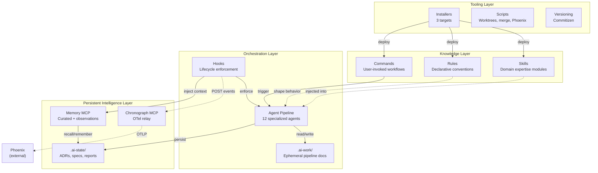
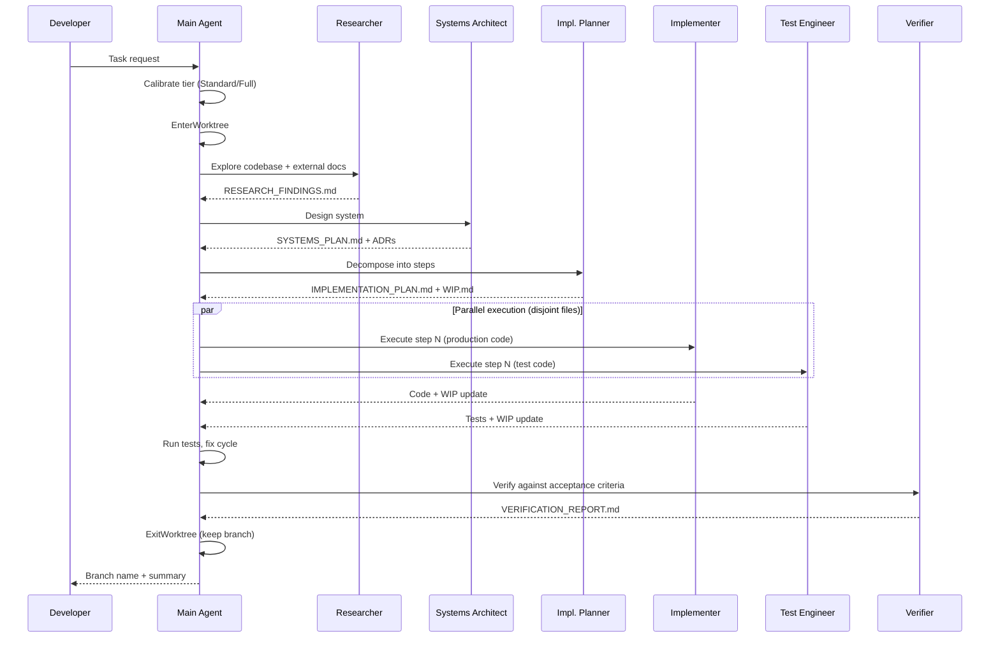
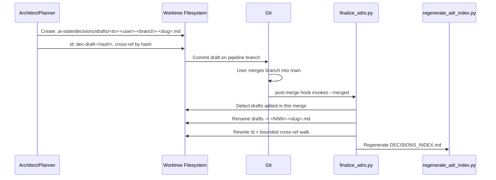

# Architecture

<!-- Design-target architecture document. Abstracts above concrete code to define the space of valid
     implementations. Component names may be abstract; file paths are illustrative; planned components
     are included with Status markers. For code-verified developer navigation, see docs/architecture.md.
     Created by systems-architect, updated by implementer, validated by verifier/sentinel.
     See skills/software-planning/references/architecture-documentation.md for the full methodology. -->

## 1. Overview

<!-- OWNER: systems-architect | LAST UPDATED: 2026-04-12 by systems-architect -->

| Attribute | Value |
|-----------|-------|
| **System** | Praxion |
| **Type** | AI development meta-framework (plugin + MCP servers + knowledge artifacts) |
| **Language / Framework** | Python 3.13+ (MCP servers), Markdown (skills/agents/rules/commands), Shell/Python (hooks, scripts) |
| **Architecture pattern** | Plugin-based knowledge ecosystem with progressive disclosure and agent pipeline orchestration |
| **Source stage** | Phase 5 creation, 2026-04-10 by systems-architect |
| **Last verified** | 2026-04-24 (project-metrics feature shipped Built: `/project-metrics` slash command + `scripts/project_metrics/` package + `docs/metrics/README.md` schema reference + `docs/metrics/index.html` trend-visualization page; five draft ADRs under `.ai-state/decisions/drafts/` awaiting finalize at merge-to-main) |

Praxion is a meta-project that provides the operational infrastructure for AI-assisted software development. Rather than being an application itself, it is an ecosystem of reusable skills, specialized agents, declarative rules, slash commands, lifecycle hooks, and MCP servers that compose into a coherent development workflow. It ships as the `i-am` Claude Code plugin, with secondary targets for Claude Desktop and Cursor.

The architecture is organized around three core concerns: **knowledge delivery** (skills and rules that bring domain expertise into agent context windows), **agent orchestration** (a pipeline of specialized agents that collaborate through shared documents), and **persistent intelligence** (MCP servers that maintain memory and observability state across sessions). This document defines the design space — the set of valid implementations and their relationships — rather than documenting what currently exists on disk. For code-verified navigation, see [docs/architecture.md](../docs/architecture.md).

## 2. System Context

<!-- OWNER: systems-architect | LAST UPDATED: 2026-04-12 by systems-architect -->
<!-- L0 diagram: system boundary + external actors/dependencies. -->


> **Component detail:** [Components](#3-components)
> **Code-verified paths:** [docs/architecture.md](../docs/architecture.md)

## 3. Components

<!-- OWNER: systems-architect (skeleton), implementer (as-built) | LAST UPDATED: 2026-04-23 by implementer (project-metrics feature landed Built end-to-end: six collectors + composition layer + CLI + slash-command wrapper + schema-reference doc + six integration tests) -->
<!-- L1 diagram: major building blocks and their relationships.
     Status values: Designed (interface defined, not yet implemented), Built (code exists on disk),
     Planned (roadmap item, no interface yet), Deprecated (scheduled for removal). -->



| Component | Responsibility | Status | Key Files (illustrative) |
|-----------|---------------|--------|--------------------------|
| Skills | Domain expertise delivered via progressive disclosure (metadata, body, references). 35 skills as of 2026-04-16; Phase 4 added `llm-prompt-engineering` (end-user prompt engineering — few-shot, CoT, structured output, injection hardening) | Built | `skills/*/SKILL.md`, `skills/*/references/`, `skills/llm-prompt-engineering/` |
| Agents | Autonomous subprocesses with distinct specialties for multi-step software engineering work | Built | `agents/*.md` |
| Rules | Declarative conventions auto-loaded by relevance into every session | Built | `rules/swe/`, `rules/writing/` |
| Commands | User-invoked slash commands for repeatable workflows | Built | `commands/*.md` |
| Hooks | Python/shell scripts triggered by Claude Code lifecycle events for enforcement and observability | Built | `hooks/*.py`, `hooks/*.sh`, `hooks/hooks.json` |
| Memory MCP | Persistent dual-layer memory: curated institutional knowledge (JSON) + zero-cost automatic observations (JSONL). `session_start()` auto-rotates observations.jsonl above 10 MiB (best-effort, never blocks) | Built | `memory-mcp/src/memory_mcp/` |
| Chronograph MCP | Agent pipeline observability via OpenTelemetry spans with HTTP event ingestion and OTLP export | Built | `task-chronograph-mcp/src/task_chronograph_mcp/` |
| `.ai-state/` | Persistent project intelligence: ADRs, specs, sentinel reports, architecture docs, memory store | Built | `.ai-state/decisions/`, `.ai-state/memory.json` |
| `.ai-work/` | Ephemeral pipeline documents scoped by task slug; gitignored, worktree-isolated | Built | `.ai-work/<task-slug>/` |
| Installers | Target-specific deployment scripts (Claude Code, Claude Desktop, Cursor) | Built | `install.sh`, `install_claude.sh`, `install_cursor.sh` |
| Scripts | Developer tooling: worktree management, merge drivers, daemon control, ADR index generation | Built | `scripts/` |
| Roadmap-cartographer | Project-level roadmap generator orchestrating **project-derived lens-set** parallel audit, synthesis, and user-gated ROADMAP.md emission for any project (deterministic / agentic / hybrid); SPIRIT is one exemplar lens set among DORA / SPACE / FAIR / CNCF Platform Maturity / Custom | Designed | `agents/roadmap-cartographer.md`, `skills/roadmap-synthesis/` (dec-029, dec-030, dec-035, dec-036) |
| Eval framework | Out-of-band quality measurement via `/eval` command and CI; tiered (behavioral + regression first, cost + decision-quality + LLM-judge as Tier 2 stubs); reads completed artifacts and Phoenix traces without mutating live pipeline state | Built | `eval/pyproject.toml`, `eval/src/praxion_evals/`, `commands/eval.md`, `.ai-state/evals/` (dec-040, dec-041) |
| Greenfield project onboarding | Top-level entry point that scaffolds a Claude-ready project then hands off to an interactive Claude session pre-loaded with `/new-cc-project`. Hybrid bash + slash-command orchestration (dec-055) with prompt-over-template discipline (dec-053): Praxion ships prose specifications and a discovery hook (`external-api-docs`), no code templates, no pinned SDK signatures. Default app is Python + `uv` + Claude Agent SDK + FastAPI; per-run `onboarding_for_mushi_busy_ppl.md` is generated against real on-disk paths | Built | `new_cc_project.sh` (repo root, 101 L, +x), `commands/new-cc-project.md` (259 L), `docs/project-onboarding.md` (123 L), `tests/new_cc_project_test.sh` (230 L, +x) (dec-053, dec-054, dec-055) |
| Concurrency & collaboration model | Unified three-mode story (solo-on-main / multi-session-solo / multi-user-team) around shared primitives: fragment ADR naming at `.ai-state/decisions/drafts/<YYYYMMDD-HHMM>-<user>-<branch>-<slug>.md`, unified worktree home at `.claude/worktrees/`, finalize-at-merge protocol (`scripts/finalize_adrs.py` invoked by post-merge hook + `/merge-worktree`), two-layer squash-merge safety (command refuse + post-merge warn), opt-in auto-memory orphan cleanup. Git remains the only shared synchronization substrate; no CRDTs, no shared daemons, no real-time broadcast. Author identity encoded from day one via `git config` for multi-user forward compatibility | Built | `.ai-state/decisions/drafts/`, `scripts/finalize_adrs.py`, `scripts/check_squash_safety.py`, `scripts/migrate_worktree_home.sh`, `commands/clean-auto-memory.md`, `rules/swe/vcs/pr-conventions.md`; six ADRs pending finalize — see `.ai-state/decisions/drafts/` (promoted to stable `dec-NNN` at merge-to-main) |
| Project metrics command | `/project-metrics` user-invoked slash command that computes a curated set of project complexity/health metrics (SLOC, CCN, cognitive, cyclic deps, churn, entropy, truck factor, ownership, hot-spots, coverage) on any Praxion-onboarded repo. Plugin architecture: Tier 0 universal (`git` + Python stdlib, with optional `scc` enrichment) and Tier 1 Python (`lizard`, `complexipy`, `pydeps`, `coverage.py` artifact parse) for v1; Tier 1 TS/Go/Rust deferred to v2 via the same collector protocol. Produces per-run JSON canonical + MD derived artifact pair in `.ai-state/METRICS_REPORT_YYYY-MM-DD_HH-MM-SS.{json,md}` plus an append-only `.ai-state/METRICS_LOG.md` summary table with a frozen aggregate-block column contract. Graceful degradation per-collector with uniform skip markers when optional tools are absent | Built | `commands/project-metrics.md` (slash-command wrapper); `scripts/project_metrics/__init__.py`, `__main__.py`, `cli.py`, `schema.py`, `runner.py` (orchestration); `scripts/project_metrics/collectors/base.py`, `git_collector.py`, `scc_collector.py`, `lizard_collector.py`, `complexipy_collector.py`, `pydeps_collector.py`, `coverage_collector.py` (six collectors); `scripts/project_metrics/hotspot.py`, `trends.py`, `report.py`, `logappend.py` (composition layer); `scripts/project_metrics/tests/` (16 test modules including `test_integration.py`, `test_aggregate.py`, `test_stdlib_sloc.py` + session-autouse fixtures under `tests/fixtures/` built from `build_fixtures.py`); `docs/metrics/README.md` (complete JSON schema reference). Draft ADRs pending finalize under `.ai-state/decisions/drafts/`: `dec-062` (storage schema + aggregate freeze), `dec-063` (collector protocol), `dec-064` (graceful degradation policy), `dec-065` (hotspot formula) |

## 4. Interfaces

<!-- OWNER: systems-architect (design), implementer (as-built) | LAST UPDATED: 2026-04-12 by systems-architect -->
<!-- Key APIs, contracts, and integration points between components. -->

| Interface | Type | Provider | Consumer(s) | Contract |
|-----------|------|----------|-------------|----------|
| Plugin manifest | JSON | `plugin.json` | Claude Code plugin system | Skills/commands via directory globs, agents via explicit paths, MCP via command+args |
| Hook lifecycle | JSON (stdin/stdout) | Claude Code | `hooks/*.py` | Exit 0 = allow + process stdout JSON; exit 2 = block + stderr feedback. Sync PreToolUse Python hooks (`check_code_quality`, `remind_adr`, `remind_memory`, `promote_learnings`) are fronted by shell-gate wrappers (`commit_gate.sh`, `cleanup_gate.sh`) that skip Python startup on non-matching Bash payloads |
| Hook events HTTP | HTTP POST | `hooks/send_event.py` | Chronograph MCP | `localhost:8765/api/events` with event payload |
| Memory MCP | stdio (MCP) | `memory-mcp` | Claude Code, agents, hooks | 18 tools + 2 resources; schema v2.0 |
| Chronograph MCP | stdio (MCP) + HTTP | `task-chronograph-mcp` | Claude Code (stdio), hooks (HTTP) | 3 MCP tools; HTTP daemon on port 8765 |
| OTLP export | HTTP | Chronograph MCP | Arize Phoenix | OTLP HTTP to `localhost:6006/v1/traces` |
| Pipeline documents | Markdown files | Upstream agents | Downstream agents | Shared `.ai-work/<task-slug>/` directory; fragment files for parallel writes |
| Skill progressive disclosure | YAML frontmatter + Markdown | `SKILL.md` files | Claude Code skill loader | 3 tiers: metadata (startup), body (activation), references (on-demand) |
| Hook registration | JSON | `hooks/hooks.json` | Claude Code plugin system | Event type, command, timeout, sync/async per hook |
| `/roadmap` command | Slash command | `commands/roadmap.md` | User | Modes: fresh (default), diff (incremental re-run), `<focus-area>` (scoped audit); delegates to `roadmap-cartographer` (dec-029, dec-032) |
| `/eval` command | Slash command | `commands/eval.md` | User | Tiers: `behavioral --task-slug <slug>`, `regression --baseline <path>`, `judge`, `list` (default); shells to `uv run --project eval praxion-evals <tier>` (dec-040) |
| Scripts install filter | Shell predicate | `install_claude.sh::relink_all` | User running install | Links only files matching `[ -f && -x ]` AND not matching `merge_driver_*` or `git-*-hook.sh`; `clean_stale_symlinks` sweeps `~/.local/bin/` for orphaned symlinks on upgrade (dec-042) |
| `new_cc_project.sh` CLI | Bash positional args | Repo-root script | User | `<project-name>` required; `[target-dir]` defaults `$PWD`; exit codes `0`/`2`/`3`/`4`/`5`/`6` for success/usage/no-claude/no-plugin/no-git/target-collision; `exec`s `claude --permission-mode acceptEdits "/new-cc-project"` (dec-054, dec-055) |
| `/new-cc-project` slash command | Slash command | `commands/new-cc-project.md` | User (post-handoff) | Single user question ("what to build?"); branches default-app vs custom-app; prose specs only — no code or pinned SDK signatures; mandates `external-api-docs` lookup before generating SDK or `uv` code (dec-053) |
| Canonical Praxion paragraph | Markdown sentinel-fenced block | `commands/new-cc-project.md` | Slash command flow + generated `onboarding_for_mushi_busy_ppl.md` | Copied verbatim by sentinel marker — never paraphrased — into each generated mushi doc (dec-053) |

## 5. Data Flow

<!-- OWNER: systems-architect | LAST UPDATED: 2026-04-12 by systems-architect -->

### Agent Pipeline Execution (Standard/Full Tier)



### Memory and Observability Flow

```mermaid
graph LR
    subgraph Session
        Hook[Lifecycle Hooks]
        Agent[Agent Work]
    end
    subgraph Memory["Memory MCP"]
        Curated[(memory.json<br/>Curated)]
        Obs[(observations.jsonl<br/>session.id + trace_id + span_id)]
    end
    subgraph Chronograph["Chronograph MCP"]
        ES[EventStore<br/>In-memory]
        OTel[OTel Exporter<br/>session.id on every span]
    end
    Phoenix[(Arize Phoenix<br/>SQLite)]

    Hook -->|inject_memory| Agent
    Agent -->|remember()| Curated
    Hook -->|capture_session| Obs
    Hook -->|capture_memory + trace_id/span_id| Obs
    Hook -.->|send_event HTTP| ES
    ES --> OTel
    OTel -.->|OTLP| Phoenix
    Agent -->|recall/search| Curated
```

**Cross-layer correlation (dec-048).** Observations (`observations.jsonl`) and chronograph spans both carry the canonical OpenInference `session.id` attribute — the chronograph relay emits it on every span type including tool spans (formerly `praxion.session_id`). Observations additionally carry top-level `trace_id`, `span_id`, `traceparent`, and `parent_span_id` fields populated from W3C trace-context. Flow: the MCP tool request envelope surfaces `params._meta.traceparent`; the memory-mcp `remember()` / `recall()` handlers parse it via `correlation.parse_traceparent()` and forward the parsed IDs through the response `additionalContext`; the `capture_memory.py` hook reads `additionalContext` and writes those IDs into the observation row. `ObservationStore.query(trace_id=...)` supports exact-match filtering. Historical JSONL rows lacking these fields deserialize as `None` via `dict.get`, preserving backward compatibility.

### ADR Finalize Flow



The finalize flow activates only when `.ai-state/decisions/drafts/` has entries; the concurrency-model component (Section 3) describes the full primitive set. `scripts/finalize_adrs.py` is idempotent and guarded by an advisory `fcntl` lock.

## 6. Dependencies

<!-- OWNER: systems-architect (initial), implementer (as-built) | LAST UPDATED: 2026-04-12 by systems-architect -->
<!-- External dependencies the system relies on. -->

| Dependency | Version | Purpose | Criticality |
|-----------|---------|---------|-------------|
| Claude Code | latest | Host runtime for plugin, hooks, agents, commands | Critical |
| Python | 3.13+ | MCP server runtime, hook execution | Critical |
| uv | latest | Python project management, MCP server launch | Critical |
| FastMCP | latest | MCP server framework (memory, chronograph) | Critical |
| OpenTelemetry SDK | latest | Span creation and OTLP export in chronograph | Non-critical (observability degrades) |
| Arize Phoenix | latest | Trace storage and visualization | Non-critical (external, optional) |
| Commitizen | latest | Version bumping and changelog generation | Non-critical (manual workflow) |
| ruff | latest | Python formatting and linting in hooks | Non-critical (code quality degrades) |
| Git | 2.x+ | Worktree management, merge drivers, version control | Critical |
| Cursor | latest | Secondary installation target | Non-critical (alternative IDE) |

## 7. Constraints

<!-- OWNER: systems-architect | LAST UPDATED: 2026-04-12 by systems-architect -->
<!-- Known limitations, performance boundaries, quality attributes, and compatibility requirements. -->

| Constraint | Type | Rationale |
|-----------|------|-----------|
| Always-loaded content under 25,000 tokens | Performance | Root CLAUDE.md + rules share a finite context window budget; exceeding it degrades all sessions |
| Skills target under 500 lines per SKILL.md | Performance | Progressive disclosure keeps activation cost manageable; overflow goes to `references/` |
| 10-12 nodes max per Mermaid diagram | Quality | Readability ceiling for architecture and flow diagrams |
| Hooks must have finite timeouts | Performance | Runaway hooks block the agent lifecycle; all hooks in hooks.json specify timeout |
| Async hooks cannot deliver agent feedback | Technical | Exit code and stderr from async hooks are silently dropped by Claude Code |
| Memory schema v2.0 required | Compatibility | MCP server crashes on v1.x files in non-praxion projects without migration |
| Python 3.13+ for MCP servers | Compatibility | uv venv with system Python 3.11 causes import failures in MCP subprojects |
| No `isolation: "worktree"` on Agent tool | Technical | Creates nested worktrees with opaque names when session is already in a worktree; use `EnterWorktree` instead |
| Single `hooks.json` authority | Configuration | All hooks registered in `hooks/hooks.json`; duplicating in `settings.json` causes double-firing |
| Agent depth 3+ requires user confirmation | Quality | Prevents runaway agent chains from compounding hallucination risk |
| Four-behavior agent behavioral contract applies to all write/plan/review agents | Behavioral | Surface Assumptions, Register Objection, Stay Surgical, Simplicity First — enforced via `rules/swe/agent-behavioral-contract.md` (always loaded) and six named failure-mode tags in verifier reports; sentinel checks BC01–BC04 audit integrity. Cross-cutting layer, not a component |
| Git is the only shared synchronization substrate for inter-session and inter-user coordination | Architectural | CRDTs, real-time broadcast, and shared MCP daemons explicitly rejected for artifact reconciliation; git's offline eventual-consistency is fit-for-purpose at file-granularity, minute-to-day convergence scale — see draft ADRs under `.ai-state/decisions/drafts/` (promoted to `dec-NNN` at merge-to-main) |
| ADRs created in a pipeline use fragment naming; stable NNN assigned at merge-to-main | Architectural | Prevents sequential-NNN cross-branch collisions and broken cross-references; author identity encoded from day one for multi-user forward-compatibility — draft filename schema `<YYYYMMDD-HHMM>-<user>-<branch>-<slug>.md`, finalized via `scripts/finalize_adrs.py` |

## 8. Decisions

<!-- OWNER: systems-architect | LAST UPDATED: 2026-04-12 by systems-architect -->
<!-- Architectural decisions are recorded as ADRs in .ai-state/decisions/.
     This section provides quick cross-references to decisions that shaped the architecture.
     Never duplicate ADR rationale here — just link. -->

| ADR | Decision | Impact on Architecture |
|-----|----------|----------------------|
| [dec-001](decisions/001-skill-wrapper-over-mcp-server.md) | Skill wrapper for context-hub integration | Skills are the primary knowledge delivery mechanism, not MCP tools |
| [dec-002](decisions/002-otel-relay-architecture.md) | Chronograph as OTel relay for hook telemetry | Hooks POST to chronograph HTTP; chronograph creates OTel spans — separation of collection from export |
| [dec-003](decisions/003-phoenix-isolated-venv.md) | Dedicated Phoenix venv separate from chronograph | Phoenix heavy deps isolated at `~/.phoenix/venv/`; chronograph stays lightweight |
| [dec-004](decisions/004-openinference-span-kinds.md) | CHAIN span kind for session root, AGENT for pipeline agents | OpenInference semantic conventions structure the trace hierarchy |
| [dec-005](decisions/005-dual-storage-eventstore-otel.md) | Dual storage: EventStore (real-time) + Phoenix (persistent) | In-memory for MCP queries; OTel/Phoenix for historical traces |
| [dec-006](decisions/006-commitizen-over-release-please.md) | Commitizen over Release Please for versioning | Local-first CLI workflow; PEP 440 dev releases; multi-file version sync |
| [dec-007](decisions/007-skill-centric-security-watchdog.md) | Skill-centric security watchdog instead of dedicated agent | Shared skill consumed by CI and verifier; avoids agent proliferation |
| [dec-009](decisions/009-dual-layer-memory-architecture.md) | Dual-layer memory (curated JSON + observations JSONL) | Two complementary stores: human-curated institutional knowledge + zero-cost automatic observations |
| [dec-010](decisions/010-zero-llm-observation-capture.md) | Zero-LLM observation capture via pattern extraction | Observations use regex, not LLM — zero marginal cost per event |
| [dec-012](decisions/012-command-hook-over-prompt-hook.md) | Deterministic duplication detection in hooks, LLM in verifier | AST/heuristic in PostToolUse hook; LLM judgment reserved for cross-module analysis |
| [dec-013](decisions/013-layered-duplication-prevention.md) | Layered duplication: rule + hook + verifier (no new agent) | Three enforcement layers reuse existing agents; preserves boundary discipline |
| [dec-017](decisions/017-deployment-skill-local-first-compose-center.md) | Docker Compose as deployment skill gravity center | Local-first deployment with primitives vocabulary |
| [dec-008](decisions/008-diff-mode-default-security-review.md) | Diff mode by default for security review | Changed-files-only by default; full-scan on explicit command — balances speed with coverage |
| [dec-011](decisions/011-adr-injection-memory-first-budget.md) | Memory-first budget allocation for ADR injection (SUPERSEDED by dec-023) | Original framing contradicted implementation; retained for audit trail |
| [dec-023](decisions/023-adr-first-hook-injection.md) | ADR-first budget allocation with memory filling remainder | SubagentStart hook prioritizes ADRs (2,000-char soft cap) then fills remainder with memory; corrects dec-011's framing |
| [dec-014](decisions/014-upstream-stewardship-skill-command-composition.md) | Skill+Command composition for upstream stewardship | Reusable skill + user-trigger command instead of dedicated agent; validates composition pattern |
| [dec-015](decisions/015-project-exploration-skill-command-composition.md) | Skill+Command composition for project exploration | Interactive exploration requires main conversation context; agent would lose interactivity |
| [dec-016](decisions/016-explore-project-naming.md) | Naming convention for project exploration components | `/explore-project` command + `project-exploration` skill; verb-first command, noun-first skill |
| [dec-018](decisions/018-deployment-skill-opinionated-defaults.md) | Opinionated tool defaults in deployment skill | Recommends specific tools (Caddy, Railway/Render) rather than equal-weight comparison |
| [dec-019](decisions/019-system-deployment-living-artifact.md) | Living SYSTEM_DEPLOYMENT.md in .ai-state/ | Persistent deployment doc with section ownership, staleness mitigation (not yet instantiated for Praxion) |
| [dec-020](decisions/020-architecture-md-living-artifact.md) | Living ARCHITECTURE.md in .ai-state/ | This document — persistent architecture doc maintained by pipeline agents (superseded by dec-021) |
| [dec-021](decisions/021-dual-audience-architecture-docs.md) | Dual-audience architecture documentation | Splits architecture docs into design target (.ai-state/) and navigation guide (docs/); distinct validation models |
| [dec-022](decisions/022-coordination-detail-extraction.md) | Coordination procedural content extracted to on-demand skill reference | Phase 1.1 token reclaim: coordination rules slimmed with summary-plus-pointer stubs; procedural detail in `skills/software-planning/references/coordination-details.md` |
| [dec-024](decisions/024-ci-test-pipeline.md) | CI test pipeline via GitHub Actions matrix over MCP servers | Single SHA-pinned workflow with `matrix.project=[memory-mcp, task-chronograph-mcp]` runs ruff + pytest per cell |
| [dec-025](decisions/025-memory-hygiene-rules.md) | Memory hygiene disposition rules (R1–R7) | Seven deterministic rules govern condense/consolidate/supersede operations; replaces ad-hoc judgment |
| [dec-027](decisions/027-principles-embedding-strategy.md) | Praxion-specific principles embedded via compact bullet + README prose | Four durable principles in `CLAUDE.md` (~320 chars) with anchor-target README section; anchored by dec-028 budget lever |
| [dec-028](decisions/028-diagram-conventions-path-scoping.md) | Narrow `rules/writing/diagram-conventions.md` path-scope from `**/*.md` to doc-authoring surfaces | Reclaims ~2,584 chars on non-doc sessions; enables principles embedding without budget violation |
| [dec-029](decisions/029-roadmap-creation-shape-b-hybrid.md) | Shape B-hybrid for roadmap-creation (agent + skill + command, no rule) | Adds `roadmap-cartographer` agent + `roadmap-synthesis` skill + `/roadmap` command as a cohesive project-level capability; no new always-loaded content |
| [dec-030](decisions/030-roadmap-planning-skill-coexistence.md) | `roadmap-planning` skill coexists with new `roadmap-synthesis` | Two skills paired by the cartographer: existing prioritization mechanics preserved, new audit-synthesis added; trigger-phrase disjointness enforced |
| [dec-031](decisions/031-roadmap-creation-pipeline-placement.md) | Roadmap-creation is user-initiated and standalone (sentinel-like) | Not inserted into the promethean→SDD chain; three-layer discovery (command, delegation-table entry, semantic activation) |
| [dec-032](decisions/032-roadmap-md-location-and-lifecycle.md) | `ROADMAP.md` at project root as living document with preserved Decision Log | User-visible; cross-run continuity via Decision Log; git history provides archival; `diff` mode for incremental re-runs |
| [dec-033](decisions/033-six-dimension-lens-placement.md) | Lens content placement — skill reference file + template asset + SKILL.md summary (generalized by dec-036) | Zero always-loaded cost; procedural content in tier 4 references; structural echo in tier 5 template; SKILL.md summary table for activation-time context |
| [dec-034](decisions/034-roadmap-budget-offset-via-prune.md) | Zero-net always-loaded budget via prune of redundant ASCII Coordination Pipeline block | Coordinator-awareness served via delegation-table entry with ≤0 net char delta; graceful-degradation escape hatch if offset infeasible |
| [dec-035](decisions/035-roadmap-parallel-audit-via-researchers.md) | Parallel audit fan-out via N=3–6 researchers, not a new auditor agent | Cartographer orchestrates researchers (boundary-disciplined); reuses proven fan-out; paradigm-agnostic by construction |
| [dec-036](decisions/036-lens-framework-project-derived.md) | Lens framework is project-derived; SPIRIT is an exemplar, not the canonical default | 4-step derivation methodology (project values + domain constraints + exemplar lens sets + user gate); exemplars: SPIRIT, DORA, SPACE, FAIR, CNCF Platform Maturity, Custom; replaces hardcoded six-dimension assumption |
| [dec-037](decisions/037-opportunities-forward-lines.md) | Opportunities (Forward Lines) as a first-class roadmap section; Motivation field generalization | Template expands 9 → 10 sections with new §4 Opportunities (O1…On) between Weaknesses and Improvement Roadmap; Improvement Roadmap items cite Motivation (Weakness / Opportunity / Evolution trend / Strategic bet / User request / Prior item) rather than only Weakness; cartographer Phase 4 classifies findings into four buckets (strengths / weaknesses / opportunities / improvements) |
| [dec-038](decisions/038-test-results-md-artifact.md) | TEST_RESULTS.md as formal implementer→verifier handoff artifact | Formalizes test outcome handoff in `.ai-work/<slug>/TEST_RESULTS.md`; per-implementer fragment files in parallel mode; verifier reads it (missing → WARN, not FAIL) |
| [dec-039](decisions/039-memory-gate-exemption-shared-constant.md) | Share memory-gate EXEMPT_AGENTS via `_hook_utils` single source of truth | EXEMPT_AGENTS frozenset lives in `hooks/_hook_utils.py` and is imported by both `validate_memory.py` and `remind_memory.py`; removes duplication-drift risk |
| [dec-040](decisions/040-eval-framework-out-of-band.md) | Eval framework out-of-band only (/eval command + CI, never hook-driven) | Eval code never runs inside a pipeline or from a hook; `eval/` package is standalone and side-effect-free; `.ai-state/evals/` holds baseline summary JSON (not raw traces) |
| [dec-041](decisions/041-pyright-over-mypy.md) | Pyright over mypy for MCP type checking | Both MCP servers gain a `[tool.pyright]` section and a CI step between ruff and pytest; staged rollout (observe → fix → enforce) avoids large PRs |
| [dec-042](decisions/042-scripts-filter-combined-predicate.md) | Scripts install filter: combined predicate + stale-symlink sweep | `install_claude.sh` filters by `-f && -x` plus `case` exclusion of `merge_driver_*` / `git-*-hook.sh`; `clean_stale_symlinks` extended to `~/.local/bin/` |
| [dec-043](decisions/043-behavioral-contract-layer.md) | Four-behavior Agent Behavioral Contract as first-class operational pillar | Cross-cutting behavioral layer across all write/plan/review agents; always-loaded rule + on-demand skill reference + README principle + CLAUDE.md anchors + 10 per-agent pointers + 6 verifier tags + sentinel BC01–BC04 checks. No new components |
| [dec-044](decisions/044-coding-style-path-scoping.md) | Path-scope `rules/swe/coding-style.md` to code-file globs | Reclaims ~1,900 always-loaded tokens on non-code sessions; funds the contract layer's ~498-token cost; executes ROADMAP Phase 1B |
| [dec-045](decisions/045-llm-prompt-engineering-skill.md) | Create `llm-prompt-engineering` skill as framework-agnostic prompt-design discipline | Adds new skill under Knowledge Layer; defers Claude-specific API details to `claude-ecosystem`, agent loops to `agentic-sdks`, multi-turn evals to `agent-evals`; 6 references + python/typescript contexts |
| [dec-046](decisions/046-staleness-detection-system.md) | Staleness detection via per-skill frontmatter + paths-scoped rule + sentinel checks | `last_reviewed` / `refresh_policy` frontmatter on skills; `rules/swe/staleness-policy.md` (paths-scoped, zero always-loaded budget); sentinel F07/F08/F09 checks; `/refresh-skill` manual entry point |
| [dec-047](decisions/047-cross-reference-validator.md) | Cross-reference validator as stdlib sibling script with soft-launch CI | `validate_references.py` parses 6 link classes with per-class FAIL/WARN/OK; ignore-marker mechanism for templates; CI job with `continue-on-error: true`, strict flip 2026-04-30 |
| [dec-048](decisions/048-observation-span-correlation.md) | Observation-span correlation via OpenInference `session.id` + W3C trace-context | Rename `praxion.session_id` → `session.id` on every chronograph span; add top-level `trace_id`/`span_id`/`parent_span_id` to Observation; memory-mcp extracts `params._meta.traceparent` at tool handlers; breaking schema accepted per user |
| [dec-049](decisions/049-reaffirm-dec022-coord-cohort.md) | Re-affirm dec-022; ship orthogonal D1–D6 cohort instead of delegation-checklist extraction | Delegation Checklists stay always-loaded in `rules/swe/swe-agent-coordination-protocol.md`; `claude/config/CLAUDE.md` condensed block gains three conditional deliverables + sync-contract pointer; new on-demand satellite `skills/software-planning/references/tier-templates.md` registered under software-planning skill; Lightweight tier gains 5 inline gap closures + tier-selector decision tree; no new tooling (reuses dec-047 validator) |
| [dec-050](decisions/050-always-loaded-budget-revision.md) | Raise always-loaded budget to 25,000 tokens and reframe as attention-relevance guardrail | Token ceiling raised from 15,000 to 25,000; reframed as failure-mode guardrail — every always-loaded token must earn its attention share (applied in >30% of sessions or unconditionally relevant); propagated across `CLAUDE.md`, `rules/CLAUDE.md`, `ROADMAP.md`, `README_DEV.md`, and `agents/sentinel.md` T02 check |
| [dec-051](decisions/051-pre-impl-design-synthesis.md) | Pre-implementation design-synthesis capability (H1-wide) | New activation-gated reference file `skills/software-planning/references/design-synthesis.md` composed from existing skills; REQ-ID stability formalized as the mechanical convergence signal; pointers wired from promethean, researcher, systems-architect, and refactoring — zero always-loaded delta |
| [dec-052](decisions/052-telemetry-span-model-v2.md) | Duration-aware OTel spans with openinference-standard attribution and parallel-execution markers | Chronograph tool spans switch from instant create-and-end to open-then-close pairs (PreToolUse/PostToolUse duration correlation); `tool.id`, `user.id`, `llm.*` follow OpenInference conventions; `fork_group` UUIDs cluster parallel subagent fan-outs; agent rollup spans summarize per-agent activity |
| [dec-053](decisions/053-prompt-over-template-greenfield-scaffold.md) | Prompt-over-template discipline for greenfield project scaffolding | Praxion ships prose specifications + `external-api-docs` discovery hook for greenfield onboarding rather than code templates or pinned SDK signatures; current SDK + `uv` signatures fetched from chub at run time so the product cannot bake in stale APIs |
| [dec-054](decisions/054-separate-new-cc-project-from-install.md) | Separate `new_cc_project.sh` from `install.sh` (sibling, not subcommand) | New top-level entry at repo root (sibling to `install*.sh`), one-time symlink published as `new-cc-project` on PATH via `install_claude.sh::relink_all`; preserves verb separation (configure host vs create project) |
| [dec-055](decisions/055-hybrid-bash-slash-command-orchestration.md) | Hybrid bash + slash-command orchestration for greenfield onboarding (Option C) | Bash handles deterministic prereqs and minimal scaffold; `/new-cc-project` slash command handles conversational flow, app generation, mushi doc generation; slash command reusable from any existing Claude session |
| [dec-056](decisions/056-concurrency-collab-research-fragment-adr-naming.md) | Fragment-ADR naming (timestamp+user+branch+slug) | ADRs created in a pipeline land as fragment files under `.ai-state/decisions/drafts/` with collision-safe filenames and `dec-draft-<hash>` ids; prevents cross-branch NNN collisions — finalized at merge to stable `dec-NNN` |
| [dec-057](decisions/057-concurrency-collab-research-unified-worktree-home.md) | Unified worktree home on `.claude/worktrees/` | `/create-worktree` + `/merge-worktree` migrate from `.trees/` to `.claude/worktrees/`; fixes `/merge-worktree` split-home bug; adds `.claude/worktrees/` to `.gitignore`; two-release deprecation window for `.trees/` |
| [dec-058](decisions/058-concurrency-collab-research-pr-conventions-rule.md) | PR-conventions rule path-scoped to PR surfaces | New `rules/swe/vcs/pr-conventions.md` covers branch naming, `.ai-state/` safety, merge policy, review expectations, multi-user forward path; `paths:` frontmatter keeps always-loaded budget at zero |
| [dec-059](decisions/059-concurrency-collab-research-squash-merge-safety.md) | Squash-merge safety — two-layer (command refuse + post-merge warn) | `/merge-worktree` refuses `git merge --squash` on `.ai-state/`-touching branches; new `scripts/check_squash_safety.py` at post-merge hook detects GitHub-UI squashes and warns with recovery steps |
| [dec-060](decisions/060-concurrency-collab-research-auto-memory-orphan-cleanup.md) | Auto-memory orphan cleanup via opt-in `/clean-auto-memory` | New command enumerates `~/.claude/projects/-<hash>-worktrees-*` orphans, compares vs `git worktree list`, batches deletion on user confirmation; never hook-driven; pattern-scoped to `-worktrees-*` |
| [dec-061](decisions/061-concurrency-collab-research-finalize-protocol.md) | ADR finalize protocol at merge-to-main | New `scripts/finalize_adrs.py` promotes drafts to stable NNN via post-merge hook and `/merge-worktree`; idempotent; advisory file lock; retires `reconcile_ai_state.py::reconcile_adr_numbers()` over one release |

[Add new rows as architecture-related ADRs are created.]
