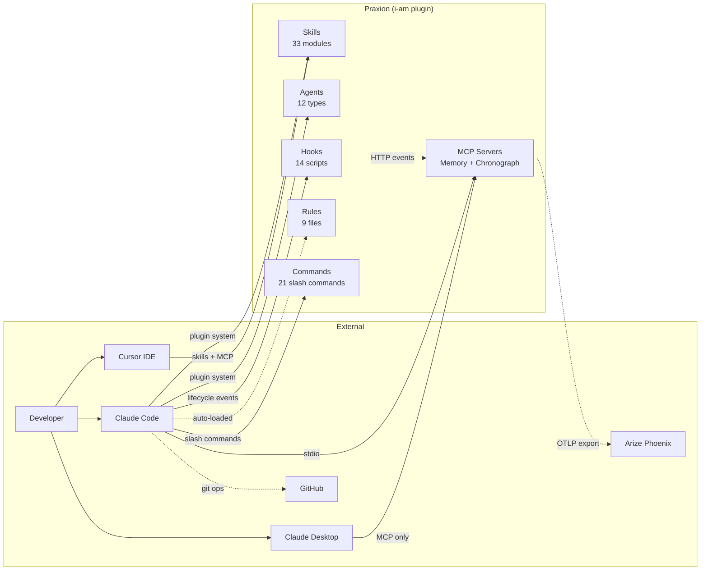
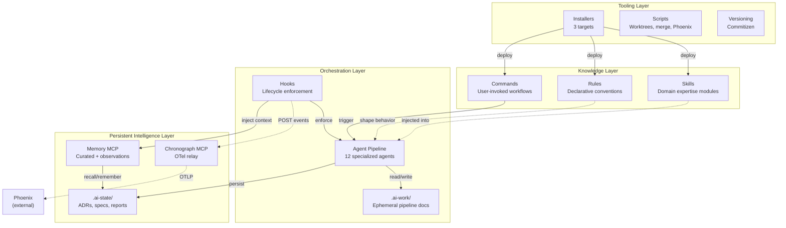
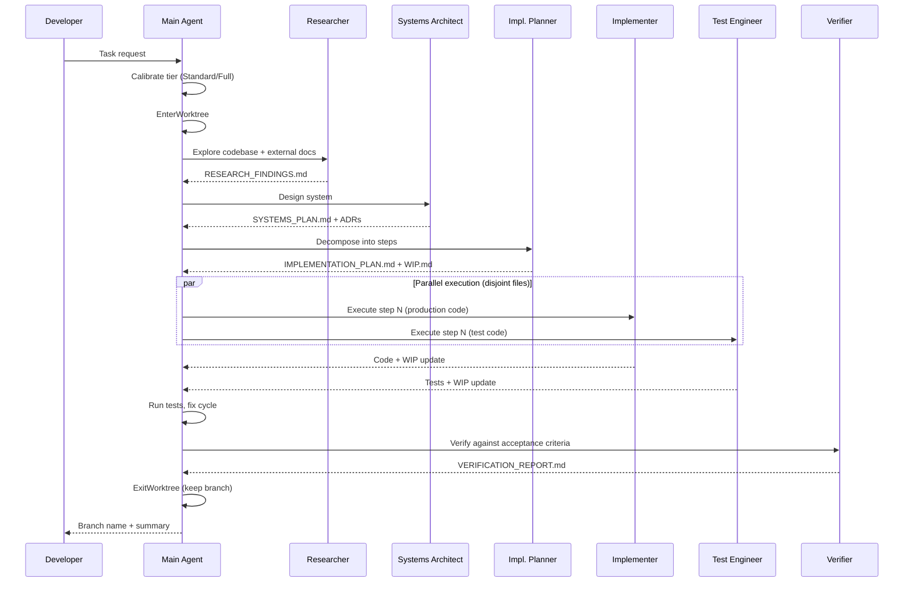

# Architecture

<!-- Design-target architecture document. Abstracts above concrete code to define the space of valid
     implementations. Component names may be abstract; file paths are illustrative; planned components
     are included with Status markers. For code-verified developer navigation, see docs/architecture.md.
     Created by systems-architect, updated by implementer, validated by verifier/sentinel.
     See skills/software-planning/references/architecture-documentation.md for the full methodology. -->

## 1. Overview

<!-- OWNER: systems-architect | LAST UPDATED: 2026-04-12 by systems-architect -->

| Attribute | Value |
|-----------|-------|
| **System** | Praxion |
| **Type** | AI development meta-framework (plugin + MCP servers + knowledge artifacts) |
| **Language / Framework** | Python 3.13+ (MCP servers), Markdown (skills/agents/rules/commands), Shell/Python (hooks, scripts) |
| **Architecture pattern** | Plugin-based knowledge ecosystem with progressive disclosure and agent pipeline orchestration |
| **Source stage** | Phase 3.8 creation, 2026-04-10 by systems-architect |
| **Last verified** | 2026-04-12 by systems-architect |

Praxion is a meta-project that provides the operational infrastructure for AI-assisted software development. Rather than being an application itself, it is an ecosystem of reusable skills, specialized agents, declarative rules, slash commands, lifecycle hooks, and MCP servers that compose into a coherent development workflow. It ships as the `i-am` Claude Code plugin, with secondary targets for Claude Desktop and Cursor.

The architecture is organized around three core concerns: **knowledge delivery** (skills and rules that bring domain expertise into agent context windows), **agent orchestration** (a pipeline of specialized agents that collaborate through shared documents), and **persistent intelligence** (MCP servers that maintain memory and observability state across sessions). This document defines the design space — the set of valid implementations and their relationships — rather than documenting what currently exists on disk. For code-verified navigation, see [docs/architecture.md](../docs/architecture.md).

## 2. System Context

<!-- OWNER: systems-architect | LAST UPDATED: 2026-04-12 by systems-architect -->
<!-- L0 diagram: system boundary + external actors/dependencies. -->



> **Component detail:** [Components](#3-components)
> **Code-verified paths:** [docs/architecture.md](../docs/architecture.md)

## 3. Components

<!-- OWNER: systems-architect (skeleton), implementer (as-built) | LAST UPDATED: 2026-04-12 by systems-architect -->
<!-- L1 diagram: major building blocks and their relationships.
     Status values: Designed (interface defined, not yet implemented), Built (code exists on disk),
     Planned (roadmap item, no interface yet), Deprecated (scheduled for removal). -->



| Component | Responsibility | Status | Key Files (illustrative) |
|-----------|---------------|--------|--------------------------|
| Skills | Domain expertise delivered via progressive disclosure (metadata, body, references) | Built | `skills/*/SKILL.md`, `skills/*/references/` |
| Agents | Autonomous subprocesses with distinct specialties for multi-step software engineering work | Built | `agents/*.md` |
| Rules | Declarative conventions auto-loaded by relevance into every session | Built | `rules/swe/`, `rules/writing/` |
| Commands | User-invoked slash commands for repeatable workflows | Built | `commands/*.md` |
| Hooks | Python/shell scripts triggered by Claude Code lifecycle events for enforcement and observability | Built | `hooks/*.py`, `hooks/*.sh`, `hooks/hooks.json` |
| Memory MCP | Persistent dual-layer memory: curated institutional knowledge (JSON) + zero-cost automatic observations (JSONL) | Built | `memory-mcp/src/memory_mcp/` |
| Chronograph MCP | Agent pipeline observability via OpenTelemetry spans with HTTP event ingestion and OTLP export | Built | `task-chronograph-mcp/src/task_chronograph_mcp/` |
| `.ai-state/` | Persistent project intelligence: ADRs, specs, sentinel reports, architecture docs, memory store | Built | `.ai-state/decisions/`, `.ai-state/memory.json` |
| `.ai-work/` | Ephemeral pipeline documents scoped by task slug; gitignored, worktree-isolated | Built | `.ai-work/<task-slug>/` |
| Installers | Target-specific deployment scripts (Claude Code, Claude Desktop, Cursor) | Built | `install.sh`, `install_claude.sh`, `install_cursor.sh` |
| Scripts | Developer tooling: worktree management, merge drivers, daemon control, ADR index generation | Built | `scripts/` |

## 4. Interfaces

<!-- OWNER: systems-architect (design), implementer (as-built) | LAST UPDATED: 2026-04-12 by systems-architect -->
<!-- Key APIs, contracts, and integration points between components. -->

| Interface | Type | Provider | Consumer(s) | Contract |
|-----------|------|----------|-------------|----------|
| Plugin manifest | JSON | `plugin.json` | Claude Code plugin system | Skills/commands via directory globs, agents via explicit paths, MCP via command+args |
| Hook lifecycle | JSON (stdin/stdout) | Claude Code | `hooks/*.py` | Exit 0 = allow + process stdout JSON; exit 2 = block + stderr feedback |
| Hook events HTTP | HTTP POST | `hooks/send_event.py` | Chronograph MCP | `localhost:8765/api/events` with event payload |
| Memory MCP | stdio (MCP) | `memory-mcp` | Claude Code, agents, hooks | 18 tools + 2 resources; schema v2.0 |
| Chronograph MCP | stdio (MCP) + HTTP | `task-chronograph-mcp` | Claude Code (stdio), hooks (HTTP) | 3 MCP tools; HTTP daemon on port 8765 |
| OTLP export | HTTP | Chronograph MCP | Arize Phoenix | OTLP HTTP to `localhost:6006/v1/traces` |
| Pipeline documents | Markdown files | Upstream agents | Downstream agents | Shared `.ai-work/<task-slug>/` directory; fragment files for parallel writes |
| Skill progressive disclosure | YAML frontmatter + Markdown | `SKILL.md` files | Claude Code skill loader | 3 tiers: metadata (startup), body (activation), references (on-demand) |
| Hook registration | JSON | `hooks/hooks.json` | Claude Code plugin system | Event type, command, timeout, sync/async per hook |

## 5. Data Flow

<!-- OWNER: systems-architect | LAST UPDATED: 2026-04-12 by systems-architect -->

### Agent Pipeline Execution (Standard/Full Tier)



### Memory and Observability Flow

```mermaid
graph LR
    subgraph Session
        Hook[Lifecycle Hooks]
        Agent[Agent Work]
    end
    subgraph Memory["Memory MCP"]
        Curated[(memory.json<br/>Curated)]
        Obs[(observations.jsonl<br/>Automatic)]
    end
    subgraph Chronograph["Chronograph MCP"]
        ES[EventStore<br/>In-memory]
        OTel[OTel Exporter]
    end
    Phoenix[(Arize Phoenix<br/>SQLite)]

    Hook -->|inject_memory| Agent
    Agent -->|remember()| Curated
    Hook -->|capture_session| Obs
    Hook -->|capture_memory| Obs
    Hook -.->|send_event HTTP| ES
    ES --> OTel
    OTel -.->|OTLP| Phoenix
    Agent -->|recall/search| Curated
```

## 6. Dependencies

<!-- OWNER: systems-architect (initial), implementer (as-built) | LAST UPDATED: 2026-04-12 by systems-architect -->
<!-- External dependencies the system relies on. -->

| Dependency | Version | Purpose | Criticality |
|-----------|---------|---------|-------------|
| Claude Code | latest | Host runtime for plugin, hooks, agents, commands | Critical |
| Python | 3.13+ | MCP server runtime, hook execution | Critical |
| uv | latest | Python project management, MCP server launch | Critical |
| FastMCP | latest | MCP server framework (memory, chronograph) | Critical |
| OpenTelemetry SDK | latest | Span creation and OTLP export in chronograph | Non-critical (observability degrades) |
| Arize Phoenix | latest | Trace storage and visualization | Non-critical (external, optional) |
| Commitizen | latest | Version bumping and changelog generation | Non-critical (manual workflow) |
| ruff | latest | Python formatting and linting in hooks | Non-critical (code quality degrades) |
| Git | 2.x+ | Worktree management, merge drivers, version control | Critical |
| Cursor | latest | Secondary installation target | Non-critical (alternative IDE) |

## 7. Constraints

<!-- OWNER: systems-architect | LAST UPDATED: 2026-04-12 by systems-architect -->
<!-- Known limitations, performance boundaries, quality attributes, and compatibility requirements. -->

| Constraint | Type | Rationale |
|-----------|------|-----------|
| Always-loaded content under 15,000 tokens | Performance | Root CLAUDE.md + rules share a finite context window budget; exceeding it degrades all sessions |
| Skills target under 500 lines per SKILL.md | Performance | Progressive disclosure keeps activation cost manageable; overflow goes to `references/` |
| 10-12 nodes max per Mermaid diagram | Quality | Readability ceiling for architecture and flow diagrams |
| Hooks must have finite timeouts | Performance | Runaway hooks block the agent lifecycle; all hooks in hooks.json specify timeout |
| Async hooks cannot deliver agent feedback | Technical | Exit code and stderr from async hooks are silently dropped by Claude Code |
| Memory schema v2.0 required | Compatibility | MCP server crashes on v1.x files in non-praxion projects without migration |
| Python 3.13+ for MCP servers | Compatibility | uv venv with system Python 3.11 causes import failures in MCP subprojects |
| No `isolation: "worktree"` on Agent tool | Technical | Creates nested worktrees with opaque names when session is already in a worktree; use `EnterWorktree` instead |
| Single `hooks.json` authority | Configuration | All hooks registered in `hooks/hooks.json`; duplicating in `settings.json` causes double-firing |
| Agent depth 3+ requires user confirmation | Quality | Prevents runaway agent chains from compounding hallucination risk |

## 8. Decisions

<!-- OWNER: systems-architect | LAST UPDATED: 2026-04-12 by systems-architect -->
<!-- Architectural decisions are recorded as ADRs in .ai-state/decisions/.
     This section provides quick cross-references to decisions that shaped the architecture.
     Never duplicate ADR rationale here — just link. -->

| ADR | Decision | Impact on Architecture |
|-----|----------|----------------------|
| [dec-001](decisions/001-skill-wrapper-over-mcp-server.md) | Skill wrapper for context-hub integration | Skills are the primary knowledge delivery mechanism, not MCP tools |
| [dec-002](decisions/002-otel-relay-architecture.md) | Chronograph as OTel relay for hook telemetry | Hooks POST to chronograph HTTP; chronograph creates OTel spans — separation of collection from export |
| [dec-003](decisions/003-phoenix-isolated-venv.md) | Dedicated Phoenix venv separate from chronograph | Phoenix heavy deps isolated at `~/.phoenix/venv/`; chronograph stays lightweight |
| [dec-004](decisions/004-openinference-span-kinds.md) | CHAIN span kind for session root, AGENT for pipeline agents | OpenInference semantic conventions structure the trace hierarchy |
| [dec-005](decisions/005-dual-storage-eventstore-otel.md) | Dual storage: EventStore (real-time) + Phoenix (persistent) | In-memory for MCP queries; OTel/Phoenix for historical traces |
| [dec-006](decisions/006-commitizen-over-release-please.md) | Commitizen over Release Please for versioning | Local-first CLI workflow; PEP 440 dev releases; multi-file version sync |
| [dec-007](decisions/007-skill-centric-security-watchdog.md) | Skill-centric security watchdog instead of dedicated agent | Shared skill consumed by CI and verifier; avoids agent proliferation |
| [dec-009](decisions/009-dual-layer-memory-architecture.md) | Dual-layer memory (curated JSON + observations JSONL) | Two complementary stores: human-curated institutional knowledge + zero-cost automatic observations |
| [dec-010](decisions/010-zero-llm-observation-capture.md) | Zero-LLM observation capture via pattern extraction | Observations use regex, not LLM — zero marginal cost per event |
| [dec-012](decisions/012-command-hook-over-prompt-hook.md) | Deterministic duplication detection in hooks, LLM in verifier | AST/heuristic in PostToolUse hook; LLM judgment reserved for cross-module analysis |
| [dec-013](decisions/013-layered-duplication-prevention.md) | Layered duplication: rule + hook + verifier (no new agent) | Three enforcement layers reuse existing agents; preserves boundary discipline |
| [dec-017](decisions/017-deployment-skill-local-first-compose-center.md) | Docker Compose as deployment skill gravity center | Local-first deployment with primitives vocabulary |
| [dec-008](decisions/008-diff-mode-default-security-review.md) | Diff mode by default for security review | Changed-files-only by default; full-scan on explicit command — balances speed with coverage |
| [dec-011](decisions/011-adr-injection-memory-first-budget.md) | Memory-first budget allocation for ADR injection (SUPERSEDED by dec-023) | Original framing contradicted implementation; retained for audit trail |
| [dec-023](decisions/023-adr-first-hook-injection.md) | ADR-first budget allocation with memory filling remainder | SubagentStart hook prioritizes ADRs (2,000-char soft cap) then fills remainder with memory; corrects dec-011's framing |
| [dec-014](decisions/014-upstream-stewardship-skill-command-composition.md) | Skill+Command composition for upstream stewardship | Reusable skill + user-trigger command instead of dedicated agent; validates composition pattern |
| [dec-015](decisions/015-project-exploration-skill-command-composition.md) | Skill+Command composition for project exploration | Interactive exploration requires main conversation context; agent would lose interactivity |
| [dec-016](decisions/016-explore-project-naming.md) | Naming convention for project exploration components | `/explore-project` command + `project-exploration` skill; verb-first command, noun-first skill |
| [dec-018](decisions/018-deployment-skill-opinionated-defaults.md) | Opinionated tool defaults in deployment skill | Recommends specific tools (Caddy, Railway/Render) rather than equal-weight comparison |
| [dec-019](decisions/019-system-deployment-living-artifact.md) | Living SYSTEM_DEPLOYMENT.md in .ai-state/ | Persistent deployment doc with section ownership, staleness mitigation (not yet instantiated for Praxion) |
| [dec-020](decisions/020-architecture-md-living-artifact.md) | Living ARCHITECTURE.md in .ai-state/ | This document — persistent architecture doc maintained by pipeline agents (superseded by dec-021) |
| [dec-021](decisions/021-dual-audience-architecture-docs.md) | Dual-audience architecture documentation | Splits architecture docs into design target (.ai-state/) and navigation guide (docs/); distinct validation models |
| [dec-022](decisions/022-coordination-detail-extraction.md) | Coordination procedural content extracted to on-demand skill reference | Phase 1.1 token reclaim: coordination rules slimmed with summary-plus-pointer stubs; procedural detail in `skills/software-planning/references/coordination-details.md` |
| [dec-024](decisions/024-ci-test-pipeline.md) | CI test pipeline via GitHub Actions matrix over MCP servers | Single SHA-pinned workflow with `matrix.project=[memory-mcp, task-chronograph-mcp]` runs ruff + pytest per cell |
| [dec-025](decisions/025-memory-hygiene-rules.md) | Memory hygiene disposition rules (R1–R7) | Seven deterministic rules govern condense/consolidate/supersede operations; replaces ad-hoc judgment |
| [dec-027](decisions/027-principles-embedding-strategy.md) | Praxion-specific principles embedded via compact bullet + README prose | Four durable principles in `CLAUDE.md` (~320 chars) with anchor-target README section; anchored by dec-028 budget lever |
| [dec-028](decisions/028-diagram-conventions-path-scoping.md) | Narrow `rules/writing/diagram-conventions.md` path-scope from `**/*.md` to doc-authoring surfaces | Reclaims ~2,584 chars on non-doc sessions; enables principles embedding without budget violation |

[Add new rows as architecture-related ADRs are created.]
