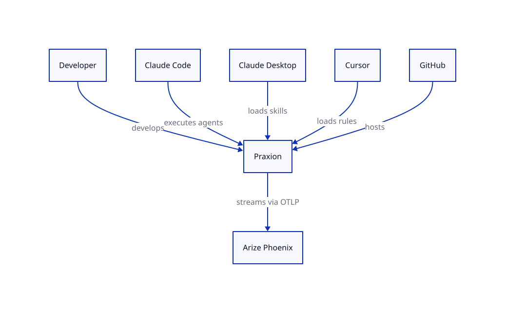
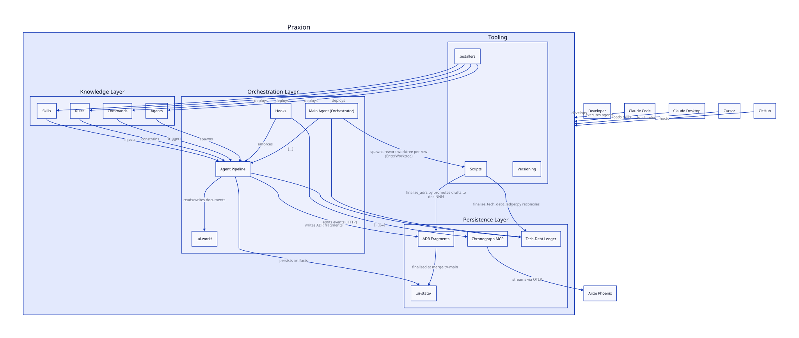
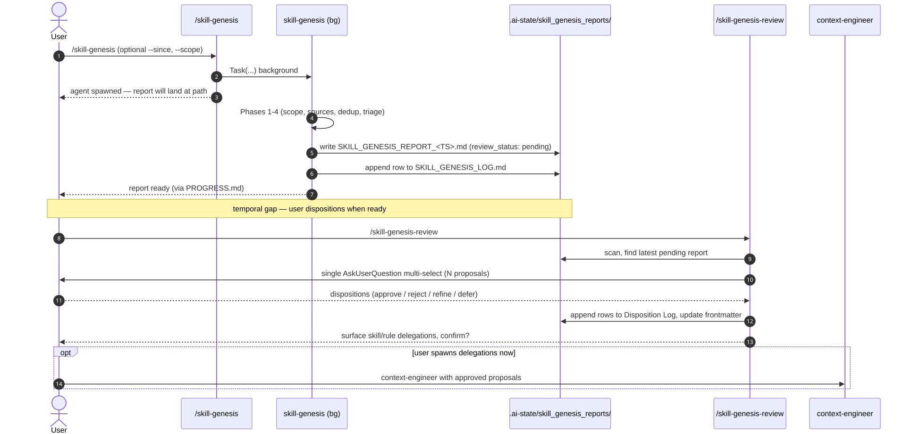

# Architecture

<!-- Design-target architecture document. Abstracts above concrete code to define the space of valid
     implementations. Component names may be abstract; file paths are illustrative; planned components
     are included with Status markers. For code-verified developer navigation, see docs/architecture.md.
     Created by systems-architect, updated by implementer, validated by verifier/sentinel.
     See skills/software-planning/references/architecture-documentation.md for the full methodology. -->

## 1. Overview

<!-- OWNER: systems-architect | LAST UPDATED: 2026-04-12 by systems-architect -->

| Attribute | Value |
|-----------|-------|
| **System** | Praxion |
| **Type** | AI development meta-framework (plugin + MCP servers + knowledge artifacts) |
| **Language / Framework** | Python 3.13+ (MCP servers), Markdown (skills/agents/rules/commands), Shell/Python (hooks, scripts) |
| **Architecture pattern** | Plugin-based knowledge ecosystem with progressive disclosure and agent pipeline orchestration |
| **Source stage** | Phase 5 creation, 2026-04-10 by systems-architect |
| **Last verified** | 2026-07-01 — dashboard-debt-trio (Pipeline Dashboard row: renderer-registry priority extension + `tutorial`/`how-to`/`concepts` shells + 5 per-artifact renderers, Built). Full per-feature verification history: [DESIGN_CHANGELOG.md](DESIGN_CHANGELOG.md). |

Praxion is a meta-project that provides the operational infrastructure for AI-assisted software development. Rather than being an application itself, it is an ecosystem of reusable skills, specialized agents, declarative rules, slash commands, lifecycle hooks, and MCP servers that compose into a coherent development workflow. It ships as the `praxion` Claude Code plugin, with secondary targets for Claude Desktop and Cursor.

The architecture is organized around three core concerns: **knowledge delivery** (skills and rules that bring domain expertise into agent context windows), **agent orchestration** (a pipeline of specialized agents that collaborate through shared documents), and **persistent intelligence** (MCP servers that maintain memory and observability state across sessions). This document defines the design space — the set of valid implementations and their relationships — rather than documenting what currently exists on disk. For code-verified navigation, see [docs/architecture.md](../docs/architecture.md).

## 2. System Context

<!-- OWNER: systems-architect | LAST UPDATED: 2026-04-30 by implementer (migrated Mermaid block to LikeC4-sourced SVG — structurizr-d2-diagrams pipeline Step 6) -->
<!-- L0 diagram: system boundary + external actors/dependencies. -->

*LikeC4 source: [`docs/diagrams/architecture/src/architecture.c4`](../docs/diagrams/architecture/src/architecture.c4). The pre-commit hook (`scripts/diagram-regen-hook.sh`) regenerates the SVG above when the source changes.*

> **Component detail:** [Components](#3-components)
> **Code-verified paths:** [docs/architecture.md](../docs/architecture.md)

## 3. Components

<!-- OWNER: systems-architect (skeleton), implementer (as-built) | LAST UPDATED: 2026-08-04 by orchestrator (split into 3a structural components / 3b capabilities; 3a is model-backed and reconcilable, 3b is a prose-owned feature log) -->
<!-- L1 diagram: major building blocks and their relationships.
     Status values: Designed (interface defined, not yet implemented), Built (code exists on disk),
     Planned (roadmap item, no interface yet), Deprecated (scheduled for removal). -->

*LikeC4 source: [`docs/diagrams/architecture/src/architecture.c4`](../docs/diagrams/architecture/src/architecture.c4). The pre-commit hook (`scripts/diagram-regen-hook.sh`) regenerates the SVG above when the source changes.*

> **Dual representation of Agents.** Praxion treats agents on two axes: the **authored Markdown family** under `agents/*.md` (a deployable knowledge surface, peer of skills / rules / commands — see the "Agents (authored definitions)" row) and the **spawned-subprocess runtime** that executes one of those definitions inside its own context window (orchestration concern — see the "Agent runtime / Pipeline" row). The two are linked by `knowledge.agents -> orchestration.pipeline "spawns"` in the LikeC4 model. See [`dec-164`](decisions/164-architecture-c4-dual-agent-representation.md).

This section is two-tier. **§3a** lists the structural building blocks: each row corresponds to a
`component` element in the LikeC4 model above, which is what makes it mechanically reconcilable
against that model. **§3b** lists capabilities — cross-cutting features and loops *composed from*
those building blocks. A capability names no single module and has no model element, so it is
prose-owned and cannot be reconciled; keeping the two in one table is what let this section grow
to 45 rows against a diagram of 14 nodes, each silently contradicting the other.

### 3a. Structural components

<!-- Every row here MUST correspond to a `component` element in
     docs/diagrams/architecture/src/architecture.c4, named explicitly in the Element column.
     A row without an element, or an element without a row, is drift, and
     scripts/check_architecture_projection.py fails the commit on either.

     The binding is by element id, not by title, because the two legitimately differ — a row
     reads "Agent runtime / Pipeline" where the element reads "Agent Pipeline". Title matching
     would miss real drift and invent false drift on a rename.

     *Structural* means no child component: the four layer containers group components and get
     no row, while a component whose only children are agents or documents still gets one.

     No flat node cap applies. ARCHITECTURE_TEMPLATE.md carries a 10-12 node budget inherited
     from Mermaid, which rules/writing/diagram-conventions.md explicitly exempts LikeC4 and D2
     from — they manage complexity through nesting and per-view scoping rather than a count.

     Consumers that read *components* — TEST_TOPOLOGY.md's `subsystems` field, sentinel
     TT01/TT06, AC06 — resolve against THIS subsection only. -->

| Component | Element | Responsibility | Status | Key Files (illustrative) |
|-----------|---------|---------------|--------|--------------------------|
| Skills | `knowledge.skills` | Domain expertise delivered via progressive disclosure (metadata, body, references). The skill catalog is enumerated by filesystem scan, not in this row. | Built | `skills/*/SKILL.md`, `skills/*/references/` |
| Agents (authored definitions) | `knowledge.agents` | The `.md` family on disk under `agents/` — peer authoring surface to skills/rules/commands. Each file is a subprocess *specification* (system prompt, tool/skill access, model tier). Lives in the Knowledge layer because it is deployed by installers and shapes runtime behavior, not because it executes there. The agent fleet is enumerated by filesystem scan, not in this row — a hardcoded count is a second catalog with no gate, and this one had drifted from 15 to 17 unnoticed. | Built | `agents/*.md` |
| Rules | `knowledge.rules` | Declarative conventions auto-loaded by relevance into every session. **Two-channel delivery (Designed, dec-167):** core rules + path-scoped rules continue to symlink into `~/.claude/rules/` via `link_rules()`; blacklistable always-loaded rules deliver via the new `inject_rules.py` SessionStart hook reading `rules/_manifest.yaml` + project-local `.claude/praxion-rules.yaml`. Frontmatter `core: true` is the single source of truth for non-disableability (dec-168). Taxonomy expressed via frontmatter + generated manifest; no rule file paths change (dec-166). | Built (current state) / Designed (manifest + hook + blacklist) | `rules/swe/`, `rules/writing/`, `rules/ml/`, `rules/_manifest.yaml` (Designed), `hooks/inject_rules.py` (Designed), `scripts/regenerate_rules_manifest.py` (Designed) |
| Commands | `knowledge.commands` | User-invoked slash commands for repeatable workflows | Built | `commands/*.md` |
| Agent runtime / Pipeline | `orchestration.pipeline` | The **runtime** side of agents — spawned subprocesses each holding their own context window, executing the agent definitions from the Knowledge layer. Coordinates through shared `.ai-work/<task-slug>/` documents and persists to `.ai-state/`. Receives skill / rule / command / agent injection from the Knowledge layer and lifecycle enforcement from Hooks. This is the Orchestration-layer correlate of the "Agents (authored definitions)" Knowledge-layer row. | Built | `.ai-work/<task-slug>/`, agent-spawning protocol in `rules/swe/swe-agent-coordination-protocol.md` |
| Hooks | `orchestration.hooks` | Python/shell scripts triggered by Claude Code lifecycle events for enforcement and observability | Built | `hooks/*.py`, `hooks/*.sh`, `hooks/hooks.json` |
| Chronograph MCP | `persistence.chronograph` | Agent pipeline observability via OpenTelemetry spans with HTTP event ingestion and OTLP export | Built | `task-chronograph-mcp/src/task_chronograph_mcp/` |
| `.ai-state/` | `persistence.aistate` | Persistent project intelligence: ADRs, specs, sentinel reports, architecture docs, observability log | Built | `.ai-state/decisions/`, `.ai-state/observations.jsonl` |
| `.ai-work/` | `orchestration.aiwork` | Ephemeral pipeline documents scoped by task slug; gitignored, worktree-isolated | Built | `.ai-work/<task-slug>/` |
| Installers | `tooling.installers` | Target-specific deployment scripts (Claude Code, Claude Desktop, Cursor) | Built | `install.sh`, `install_claude.sh`, `install_cursor.sh` |
| Scripts | `tooling.scripts` | Developer tooling: worktree management, merge drivers, daemon control, ADR index generation | Built | `scripts/` |
| Eval framework | `tooling.evals` | Out-of-band quality measurement through a single `/eval-praxion` entrypoint (CLI `praxion-evals`), spanning both the LLM-as-judge families and the free, auth-less mechanical surface (`--mechanical-only`); `--task-slug <slug>` adds the in-flight artifact-manifest scan. Reads completed artifacts without mutating live pipeline state. **v1 self-eval (Built 2026-05-26):** the `regression/` sub-package retired entirely (448 LOC removed — broken-by-design per td-005); the `harness/` sub-package adds `/eval-praxion` running two families (Pipeline-outcome fidelity over SPECs + ADRs + DECISIONS_INDEX.md; Behavioral-contract adherence over `VERIFICATION_REPORT.md`). Hybrid auth seam (`CLAUDE_CODE_OAUTH_TOKEN` → Agent SDK route; `ANTHROPIC_API_KEY` → direct Messages API; runtime env detection) is encapsulated by a single `JudgeClient` adapter — family code never imports an SDK directly. The Agent SDK route is **bounded and guarded** (hardening pass, draft `dec-206` re-affirming `dec-204`): `AgentSdkJudgeClient.__init__()` refuses construction with a three-part error when `CLAUDECODE=1` (nested-invocation deadlock, SDK issue #573); `AgentSdkJudgeClient.judge()` enforces a 120 s wall-clock ceiling via `asyncio.wait_for`, with a defense-in-depth `API_TIMEOUT_MS` set in `options.env` for the spawned CLI subprocess. The orchestrator emits per-family and per-LLM-check progress prints (`print(..., flush=True)`) so a slow run is distinguishable from a hung run. Reports land in `.ai-state/praxion_eval_reports/` with a sibling append-only `PRAXION_EVAL_LOG.md`. The `eval/` package is in the CI matrix (`.github/workflows/test.yml`) alongside `task-chronograph-mcp`. **Surface collapse (commit `b42cc59`, breaking, no shim):** the standalone `/eval` command and the `behavioral/` sub-package were folded into Family 1, the manifest scan moved to `harness/task_manifest.py`, and `stubs/` (deferred cost and decision-quality family sentinels) is the only remaining sibling sub-package. Partial supersession of `dec-040` (clause 3 narrowed to allow LLM-as-judge calls over completed artifacts; clauses 1, 2, 4 re-affirmed) per `dec-204` (to be finalized at merge). | Built | `eval/pyproject.toml`, `eval/src/praxion_evals/`, `eval/src/praxion_evals/harness/`, `eval/src/praxion_evals/stubs/`, `commands/eval-praxion.md`, `.ai-state/evals/`, `.ai-state/praxion_eval_reports/`, `.github/workflows/test.yml` (dec-040, dec-041, dec-204, dec-206) |
| Tech-debt ledger | `persistence.tdl` | Living `.ai-state/TECH_DEBT_LEDGER.md` + `TECH_DEBT_RESOLVED.md` pair holding grounded debt findings — one logical namespace by `td-NNN` / `dedup_key`. Producers: verifier (per-change), sentinel (repo-wide), orchestrator (user-direction), architect-validator (per-PR drift). Consumers: five reader agents (permission-not-obligation per dec-069). Worktree concurrency reconciles via post-merge `scripts/finalize_tech_debt_ledger.py`. Schema (14 row fields + structural `dedup_key`) and owner-role heuristic canonical in `skills/software-planning/references/tech-debt-ledger.md`. See dec-070..dec-072, dec-114. | Built | `.ai-state/TECH_DEBT_LEDGER.md`, `.ai-state/TECH_DEBT_RESOLVED.md`, `rules/swe/agent-intermediate-documents.md`, `scripts/finalize_tech_debt_ledger.py`, `agents/{verifier,sentinel,systems-architect,implementation-planner,implementer,test-engineer,doc-engineer}.md` |
| Pipeline Dashboard | `tooling.dashboard` | Praxion-bundled dashboard service providing a per-project visual entry point over arbitrary Praxion-managed projects. Seven surfaces (Architecture / Workshops / ADRs / Sentinel / Roadmap / Metrics / Documentation) read `.ai-state/`, `.ai-work/<task-slug>/`, and selected project-root surfaces directly — no new persistence layer; read-only by design (the one HTTP surface, `GET /api/diagram?path=<rel>`, streams allowlisted SVGs live per request through the same path-allowlist gate). Active runtime is `dashboard_app/` (Next.js App Router + TypeScript) served through `scripts/praxion-dashboard`; deterministic per-project ports remain sha256-derived in the 8501–9500 range; user-scoped Node home lives under `~/.praxion-dashboard/`. Redesign layer: a CSS-custom-property design-token system (the token layer plus the rest of the stylesheet was later split, commit `961371e` / td-030, from the single `globals.css` into a 6-file cascade — `tokens.css` / `base.css` / `app-chrome.css` / `surfaces.css` / `widgets.css` / `pages-and-viz.css` — imported by a now-minimal `globals.css` `@import` manifest; original intent was a single token file, but the monolith breached the 800-line file ceiling), a hand-rolled pan/zoom **diagram viewer**, a pure-SVG **ADR relationship graph** (status-colored nodes, supersedes/re-affirms edges, click-to-expand) and step DAG, a `recharts` **trend-chart** wrapper feeding the metrics charts and a sentinel health sparkline (historical series parsed from `METRICS_LOG.md` / `SENTINEL_LOG.md`), server-side **SVG sanitization** (`sanitize-html`) for any inline-injected SVG from an arbitrary project, a typed **renderer registry** — `resolveRenderer(renderer?, diataxis?, contentType?)` keys on the manifest `renderer:` field as **highest priority**, then falls back to `diataxis`, then `contentType`, terminating at `DefaultShell` (all three fallback levels preserved; the new leading param is optional, so every prior call site keeps working) — serving six Diátaxis shells (`reference`/`explanation`/`default` plus **`tutorial`/`how-to`/`concepts`, now dedicated components rather than `DefaultShell` aliases**), an `api_reference` shell (vendored Scalar over the raw spec) for API specs — OpenAPI/AsyncAPI/GraphQL auto-discovered by `build_doc_manifest.py`, dispatched via a `renderMode: "api"` branch that routes by `renderer` regardless of `type` (the documentation page dispatches through it) — and **five per-artifact renderers** in a new `src/components/renderers/` package (`metrics_view`, `plan_view`, `verification_report`, `idea_grid`, `architecture_explorer`), each reached solely via the manifest `renderer:` key (the only key that uniquely selects them without hijacking shared `diataxis`/`type` values) and each degrading to `DefaultShell` on malformed/absent input; `metrics_view` and `architecture_explorer` are deliberately thin Pathway-B previews reached through the documentation page — distinct from, and not reimplementations of, the existing Pathway-A full pages (`/metrics`, `/architecture`). No `documentation.ts` server-layer change was needed. See ADR `dec-265` (renderer-field-resolver-key) for the resolver-key rationale. Reusable chrome remains `ArtifactCard`, `EmptyState`, `EducationalPopover`, `Chip`, `Tabs`, `ErrorState`. Markdown bodies' relative diagram `` refs are rewritten server-side to `/api/diagram`; the explicit-diagrams scanner covers both `docs/diagrams/**/rendered/` and `.ai-state/diagrams/**/rendered/`. `validateProjectRoot` requires only `.ai-state/` (fresh projects work; `.ai-work/` absence → empty workshops); a missing `PRAXION_PROJECT_ROOT` renders an actionable error page. Workshops surface keeps mtime-keyed live refresh on the `PRAXION_DASHBOARD_POLL_SECONDS` interval (15 s default). `metrics-viewer.html.tmpl` is replaced by a static redirect stub pointing at the dashboard (still deployed by `/onboard-project` Phase 4 so bookmarks resolve); the committed `.ai-state/metrics_reports/index.html` is removed. The legacy Streamlit prototype (`streamlit_app/`) — originally retained in-tree as a retirement-pending parity reference — was removed in commit `313a50e`; the dashboard is now fully migrated to `dashboard_app/`. macOS daemon v1; Linux/Windows manual-launch documented; systemd v2. New deps: `sanitize-html`, `recharts`. See dec-121..dec-130 plus the dashboard-redesign drafts (diagram-serving-and-svg-sanitization, adr-graph-pure-svg [supersedes dec-125], charting-recharts [supersedes dec-130], renderer-registry-and-diataxis-shells, metrics-viewer-stub [supersedes dec-129], validate-project-root-relaxation, design-token-layer). | Built | `dashboard_app/` (incl. `src/app/api/diagram/route.ts`, `src/app/documentation/page.tsx`, `src/app/{tokens,base,app-chrome,surfaces,widgets,pages-and-viz}.css` + `globals.css` import manifest, `src/components/viz/`, `src/components/shells/` (`tutorial.tsx`, `how-to.tsx`, `concepts.tsx`), `src/components/renderers/` (`metrics-view.tsx`, `plan-view.tsx`, `verification-report.tsx`, `idea-grid.tsx`, `architecture-explorer.tsx`), `src/components/chrome/`, `src/components/registry.ts`, `src/server/diagrams/`, `src/server/aac/`, `src/server/sentinel/`), `scripts/praxion-dashboard`, `commands/dashboard.md`, `claude/aac-templates/metrics-viewer.html.tmpl` (redirect stub) |
| ADR fragments | `persistence.adrs` | Draft ADRs under `.ai-state/decisions/drafts/`, promoted to stable `dec-NNN` records at merge-to-main. Modelled separately from `.ai-state/` because the promotion lifecycle is an enforced edge, not a storage detail: the pipeline writes fragments, `finalize_adrs.py` promotes them, and only then do they join the durable record. | Built | `.ai-state/decisions/drafts/`, `scripts/finalize_adrs.py` |
| Versioning | `tooling.versioning` | Commitizen-driven SemVer release flow: conventional-commit parsing, version-file synchronisation, changelog generation, and the release tag that marketplace installs resolve against. | Built | `pyproject.toml` (`[tool.commitizen]`), `commands/release.md`, `skills/versioning/` |

### 3b. Capabilities

<!-- Cross-cutting features, loops, and mechanisms composed FROM the building blocks in 3a.
     No LikeC4 element and no single owning directory, so these are narrative and are never
     reconciled against the model. Status semantics are identical to 3a. -->

| Capability | Responsibility | Status | Key Files (illustrative) |
|-----------|---------------|--------|--------------------------|
| Observability log | Zero-cost automatic capture of tool/session events to an append-only JSONL by the `capture_*` hooks. Event types: `tool_use`, `session_start/stop`, `agent_start/stop`, `context_surface_measurement`, and **`skill_activation`** — the first-class skill-usage event carrying a `skill_name` field, emitted by `capture_memory.py`'s `Skill`-tool branch (ROADMAP 2.2 / W7). Actual consumers: `reconcile_pipeline_state.py` (recovery Tier-2 localization hint) and post-merge dedup (`reconcile_ai_state.py`). *Rotates to a gitignored `observations.jsonl.1` at 10 MiB, best-effort inside the append lock; the reconciler reads active + segment within a 7-day window; metrics/dashboard consumption is planned, not built.* | Built | `.ai-state/observations.jsonl`, `hooks/capture_memory.py`, `hooks/capture_session.py`, `hooks/_hook_utils.py` |
| Artifact registry (declarative spine) | Canonical single-source-of-truth for the `.ai-work/<slug>/` artifact set — a typed `ARTIFACTS` tuple whose projection helpers (`dashboard_artifacts` / `snapshot_artifacts` / `eval_required` / `eval_conditional`) the three hard-coded consumer lists are *checked* against by `scripts/test_artifact_registry.py` (drift gate + gate-liveness canaries). Each `Artifact` additionally carries three **declarative-spine** fields naming the gate that makes it exist, the gate that detects its absence, and the policy that governs its removal: `production_gate` (`"<kind>:<ref>"`; kind ∈ `_GATE_KINDS` = {script, hook, producer, none, deferred}), `detection_gate` (`"sentinel:<id>"`; kind ∈ `_DETECTION_GATE_KINDS` = {sentinel, none} — the sentinel-presence check split out of `production_gate` per dec-256), and `cleanup_policy` (∈ `_CLEANUP_POLICIES` = {delete, archive, block-if-active, consume-marker}, mirroring `clean_work_safety.py`'s BLOCK/WARN/SAFE classes). `production_gate`/`detection_gate` are **populated but not consumer-read** — no runtime consumer reads the field value; self-consistency is enforced by additive tests plus a bogus-kind canary. `cleanup_policy` is **load-bearing**: `clean_work_safety` reads it via the `cleanup_policy_for()` projection helper as the file→severity-class source (dec-259), so a policy change flips a `/clean-work` BLOCK/WARN/SAFE verdict. The six pre-existing consumer drift assertions read none of the three fields, so they stay green unchanged. See dec-251, dec-256, dec-259. | Built | `scripts/artifact_registry.py`, `scripts/test_artifact_registry.py` |
| Roadmap-cartographer | Project-level roadmap generator orchestrating **project-derived lens-set** parallel audit, synthesis, and user-gated ROADMAP.md emission for any project (deterministic / agentic / hybrid); SPIRIT is one exemplar lens set among DORA / SPACE / FAIR / CNCF Platform Maturity / Custom | Built | `agents/roadmap-cartographer.md`, `skills/roadmap-synthesis/`, `commands/roadmap.md` (regenerates `ROADMAP.md` on demand; per dec-092 Praxion does not carry a living `ROADMAP.md` instance) (dec-029, dec-030, dec-035, dec-036, dec-092) |
| Project onboarding | **Merges the former Greenfield and Existing-project onboarding rows** into one phase engine behind one user-invocable skill (`skills/onboard-project/`, `disable-model-invocation: true`, invoked `/praxion:onboard-project`) and one entry script (`scripts/onboard-project`, absorbing the former `new_project.sh`). Four entry modes — `new` / `existing` / `hackathon` / `promote` — parameterize *which* phases run and with what capability default; no phase body is authored twice. Phase identifiers are preserved verbatim (`0.5, 1–7, 5b, 6, 7, 8, 8b–8e, 9`) so the ~26 external phase citations and `tests/consumer_layout/contract.py`'s heading-grammar parser re-anchored by file list alone; two ids were added (`0s` greenfield seed, `5b.t` hackathon teardown). Everything user-facing speaks **capability IDs** (`core`, `arch`, `quality`, `ci`, `aac`, `ml`, `obsidian`, `observability`) instead of phase numbers, joined to phases by one table published once in `SKILL.md`. Deduplication landed: the seven canonical `CLAUDE.md` blocks collapse from two embedding sites to one (`references/claude-md-blocks.md`, `sync_canonical_blocks.py`'s `_ONBOARDING_PAIR` → a one-element `_ONBOARDING_CONSUMERS` tuple); the two CLAUDE.md idempotency mechanisms collapse to Phase 6 alone (4-state `refresh_claude_blocks.py` classifier for the four refreshable blocks, heading-grep for the three conditional/templated ones); the greenfield-shape and plugin-source guards single-source to `references/detection.md`; stack-command resolution, hub-SHA resolution, and version-aware-staleness rationale single-source to `references/shared-procedures.md`. Gate count drops from the prior 25 pacing fires to 3 (`G1` mode-confirm, `G2` build-intent, `G3` capability Profile) — a gate that carries no decision earns no interruption. The hackathon signal is persisted once as a `mode` field in `.ai-state/.praxion-onboard.json` instead of relayed across five hops, and promotion to fully-managed is mechanical (`--full` / `--mode promote` → Sub-step 5b.t enumerate-before-remove teardown of all six hackathon artifacts → full phase set re-run → stamp flip). Default app for `new` mode is Python + `uv` + Claude Agent SDK + FastAPI, prose-specified rather than templated (dec-053) with a discovery hook (`external-api-docs`) mandating current SDK docs at run time; per-run `onboarding_for_mushi_busy_ppl.md` is generated against real on-disk paths. The **installed end-state contract is unchanged**: only Praxion's authoring surface moved, never the managed project's payload. User-facing guide: `docs/onboarding.md`. | Built | `skills/onboard-project/{SKILL.md,references/{detection,phases-core,phases-optional,claude-md-blocks,seed-pipeline,shared-procedures}.md}`, `scripts/onboard-project` (repo root, +x), `docs/onboarding.md`, `tests/onboard_project_test.sh` (+x), `claude/canonical-blocks/`, `claude/project-baseline/` (dec-053, dec-054, dec-055, dec-081, dec-082, dec-113, dec-198, dec-200, dec-274, dec-340, dec-342, dec-343, dec-341) |
| Concurrency & collaboration model | Unified three-mode story (solo-on-main / multi-session-solo / multi-user-team) over shared primitives: fragment ADR naming, unified `.claude/worktrees/`, finalize-at-merge protocol, two-layer squash-merge safety, opt-in auto-memory orphan cleanup. Git is the only shared synchronization substrate; author identity from `git config` for multi-user forward compatibility. See dec-056..dec-061. | Built | `.ai-state/decisions/drafts/`, `scripts/finalize_adrs.py`, `scripts/check_squash_safety.py`, `commands/clean-auto-memory.md`, `rules/swe/vcs/pr-conventions.md` |
| Project metrics command | `/project-metrics` slash command computing project complexity/health metrics (SLOC, CCN, cognitive, cyclic deps, churn, entropy, truck factor, ownership, hot-spots, coverage) on any Praxion-onboarded repo. Tier 0 universal (`git` + Python stdlib, optional `scc`) + Tier 1 Python collectors (`lizard`, `complexipy`, `pydeps`, `coverage.py`); TS/Go/Rust deferred to v2 via the same collector protocol. Per-run JSON+MD pair in `.ai-state/metrics_reports/` plus append-only `METRICS_LOG.md` with frozen aggregate-block column contract. Graceful degradation per-collector. See dec-062..dec-066. | Built | `commands/project-metrics.md`, `scripts/project_metrics/`, `docs/metrics/README.md` |
| Agent Readiness | Factory-aligned **agent-readiness** capability riding `/project-metrics`. A default-on, stdlib-only `ReadinessCollector` emits a typed `readiness` block at the metrics JSON root: **8 Factory pillars × 5 levels × 80%-per-level gate** (binary, monorepo numerator/denominator, criteria-as-data **in Python — not YAML**, project-type/language-aware via per-criterion applicability) + a **Praxion-native Pillar 9 "Manageability"** as a **separate** sub-score (keeps the 8-pillar number Factory-comparable; AGENTS.md is INFO not FAIL). The mechanical tier is deterministic (honors the collector byte-identical `collect()` contract). The **~4 LLM-judged criteria** (naming-conventions, test-quality, readme-quality, docs-agent-friendliness — kodus split) run **default-on, grounded on the prior report** (Factory's 7%→0.6% variance fix) and **gracefully degrade** to a `mechanical-only` score with an `llm_skipped` marker offline (run still exits 0); `--require-readiness-ai` hard-fails, `--mechanical-only` skips the LLM tier. To preserve determinism the LLM call runs in a `cli.py` `enrich_readiness` step **outside** the runner's collect pass (NOT inside `collect()`, NOT via a widened `CollectionContext`). The judge is a **stdlib-`urllib` direct Anthropic Messages API call** — no `anthropic` SDK dep in the metrics env, never spawns the `claude` CLI (avoids the dec-206 `CLAUDECODE` deadlock), reuses eval's `ANTHROPIC_API_KEY`/`CLAUDE_CODE_OAUTH_TOKEN` auth precedence. Output **embeds** in the metrics JSON (not a sibling `readiness_reports/`): `schema_version` bumps minor `1.0.0`→`1.1.0` (additive); the 16-col `AGGREGATE_COLUMNS` / 17-col `METRICS_LOG.md` header stay **frozen** in v1 (v1.1 adds `readiness_level`/`readiness_pct` columns + trend, deferred). Dashboard renders an **Agent Readiness** section (level + 8-pillar recharts radar + Pillar-9 chip + failing criteria) via the embed type chain. Standalone entry is the `agent-readiness` skill (no `/readiness` command). Near-zero install: ships via `claude plugin install`, no `install.sh` edit, `--check` asserts engine importability. See dec-draft judge-transport, contract-shift, embed-vs-sibling (re_affirms dec-206). | Built | `scripts/project_metrics/collectors/readiness/` (`criteria.py`, `checks.py`, `score.py`, `judge.py`), `scripts/project_metrics/collectors/readiness_collector.py`, `scripts/project_metrics/{cli,runner,schema,report}.py` (extended), `dashboard_app/src/components/readiness-section.tsx`, `dashboard_app/src/lib/metrics.ts` (extended), `dashboard_app/src/server/view-models/metrics.ts` (extended), `skills/agent-readiness/SKILL.md`, `skills/agent-readiness/references/rubric.md` |
| Praxion-as-First-Class enforcement surfaces | Three-layer enforcement of the principle that Praxion's process is the default mode. L1: existing always-loaded rules. L2: `§Praxion Process` canonical block in onboarded `CLAUDE.md` (installed from the single embedding site `skills/onboard-project/references/claude-md-blocks.md` via Phase 6). L3: `hooks/inject_subagent_context.py` (PreToolUse `Agent\|Task`; ~180-char preamble; host-native always, Praxion-native opt-in) + `hooks/inject_process_framing.py` (UserPromptSubmit; ~120-char `additionalContext` gated on `.ai-state/` + non-continuation + non-trivial). Always-loaded surface stays under 25k. See dec-075. | Built (2026-04-26) | `hooks/inject_subagent_context.py`, `hooks/inject_process_framing.py`, `hooks/hooks.json`, `skills/onboard-project/` |
| Install-path completeness mechanism | First-session auto-completion converges all install paths (clone / marketplace+complete-install / marketplace-only) on the same end state. `hooks/auto_complete_install.py` (SessionStart) detects missing global surfaces and runs completion non-interactively (git-config defaults) or with a 30-second timeout-accept confirm. Idempotent fast-skip after first success via marker file. `install_claude.sh::render_claude_md()` extracted to `scripts/render_claude_md.py`. `/praxion-complete-install` retained for explicit re-invocation (`--reconfigure`, recovery). See dec-074. | Built (2026-04-26) | `hooks/auto_complete_install.py`, `hooks/hooks.json`, `scripts/render_claude_md.py`, `install_claude.sh`, `commands/praxion-complete-install.md` |
| Project archetype catalog | Conceptual classification of the kinds of project Praxion can manage. Three archetypes after this onramp: **Traditional SWE** (existing — covered by the full skill catalog), **Agentic-AI apps** (existing — `agentic-sdks`, `agent-evals`, `mcp-crafting`, `communicating-agents`), and **ML/AI training** (NEW — pre-training v1; post-training v2; multimodal later). Composition: `karpathy/autoresearch` is the v1 proof target *because* it sits at the intersection of agentic-AI and ML training — managing it tests the *composition* of both archetypes simultaneously. The catalog is a vocabulary layer above the skill catalog, not a runtime component. See `dec-117`. | Built | `skills/ml-training/`, `skills/llm-training-eval/`, `skills/neo-cloud-abstraction/` (all new); existing skills compose unchanged for the SWE and agentic-AI archetypes |
| ML training subsystem (v1) | Skills, rules, and command extensions enabling Praxion to manage ML/AI pre-training projects. New skills: `ml-training`, `llm-training-eval` (owns the `TRAINING_RESULTS.md` schema), `experiment-tracking` (standalone — distinct from app observability per Q3). New rules under `rules/ml/` (eval-driven-verification, gpu-budget-conventions both always-loaded; experiment-tracking-conventions path-scoped). Rule extensions: scoped determinism waiver in `testing-conventions.md`; experiment-mode addendum in `git-conventions.md`. New commands: `/run-experiment`, `/check-experiment`. `/onboard-project` Phase 8c scaffolds ML projects. `program.md` is the project-local meta-prompt sibling of CLAUDE.md. See dec-115..dec-120. | Built | `skills/{ml-training,llm-training-eval,experiment-tracking}/`, `rules/ml/`, `commands/{run-experiment,check-experiment}.md`, `skills/onboard-project/references/phases-optional.md` (Phase 8c), `agents/verifier.md` (Phase 3a) |
| Neo-cloud abstraction | Praxion-native abstraction for ML training compute lifecycle. Defines mode-invariant `training_job_descriptor` schema and 8 lifecycle operations (create, start, status, log_stream, cancel, artifact_fetch, list, pricing_query). Tiered backend strategy: local default (modes A/B), SkyPilot default-remote (mode C; 20+ providers), opt-in direct adapters (RunPod v1 reference; Lambda/Crusoe/CoreWeave v2). Descriptor has no `mode:` field — backend inferred from project config. See dec-118. | Built | `skills/neo-cloud-abstraction/` |
| Polyglot skill plane | Language-agnostic skill bodies with per-language `contexts/<language>.md` (and `references/<language>.md` for some skills) satellites; formalized by the polyglot skill template ADR (`.ai-state/decisions/<NNN>-polyglot-skill-template.md`); covers Python and TypeScript (Node, React, Vue). Two satellite directories per polyglot skill: `references/` holds language-agnostic conceptual depth; `contexts/` holds runnable language-specific mechanics. SKILL.md body stays language-agnostic with a mandatory "Language Contexts" table. Frontend-framework nesting (React, Vue) layers above `contexts/typescript.md` inside the language-rooted `typescript-development` skill. Angular excluded from first-class contexts. Cross-skill version conflicts (e.g., Zod v3/v4) housed in the language-rooted prj-mgmt skill. *(Same capability as the developer guide's `Polyglot Skills (TypeScript / Node)` row. The names differ deliberately — this doc names the language-open design target, the guide names the Built language set — so the row pair is recorded here rather than left for a name-keyed reader to guess at.)* | Built | `skills/node-prj-mgmt/`, `skills/typescript-development/` (with `contexts/typescript.md`, `contexts/react.md`, `contexts/vue.md`), `skills/*/contexts/typescript.md` (architectural-fitness-functions, deployment, llm-prompt-engineering, mcp-crafting, node-prj-mgmt, software-planning, typescript-development), `skills/agent-evals/references/typescript.md`, `skills/test-coverage/references/typescript.md` |
| Verifier rework loop | Automated self-healing-loop replacement for what is today a manual user action. After verifier Phase 12, a new Phase 12.5 clusters FAIL/WARN findings (smell-class first, then file-locality) into rework rows and emits `.ai-work/<parent-slug>/REWORK_MANIFEST.md` (markdown table rendered from per-row fenced JSON; JSON authoritative; idempotent `rw-<8-char-hash>` row ids). The main agent reads the manifest, spawns one rework worktree per row via `EnterWorktree`, writes a seven-section `VERIFIER_FINDINGS.md` (Problem / Scope / Evidence / Success Criteria / Ledger Links / Suggested Tier / Provenance) into each worktree's `.ai-work/<rework-slug>/`, flips linked `td-NNN` rows to `in-flight` (via `notes`-field suffix `// in-flight via rework worktree <name>`), and surfaces a one-liner. The user opens a fresh Claude Code session inside the rework worktree; `inject_worktree_banner.py` appends a two-line affordance pointing at `/resume-rework`; the command auto-discovers `VERIFIER_FINDINGS.md`, validates schema + manifest-match, and dispatches `systems-architect` (always-first per the routing ADR) — for implementation-class clusters the architect's `SYSTEMS_PLAN.md` then feeds `implementation-planner` via the existing pipeline contract. Subagent isolation is verified by a controlled-test harness (`hooks/test_worktree_guard_subagent.py`) before ship; absolute-path briefing in the slash command's spawn prompt provides defense in depth. Parent `.ai-work/<parent-slug>/` cleanup is gated on rework-completion; `VERIFICATION_REPORT.md` is snapshotted into each rework worktree for provenance survival. CIS-aligned disposition vocabulary (`switch-now` / `defer-with-rationale` / `dismiss-with-rationale`) is defined once in a new skill reference and cited by researcher, architect, verifier, and `/resume-rework`. | Built (all Groups A–H landed: disposition-vocabulary.md + always-loaded rule additions + verifier Phase 12.5 + Phase 1 adapter sentences + /resume-rework command + inject_worktree_banner rework-affordance + td-034 test harness + verifier Collaboration orchestration prose + architecture documentation in docs/architecture.md §10) | `agents/verifier.md` (Phase 12.5 — Built), `scripts/rework_manifest.py` (new — Built), `agents/systems-architect.md` + `agents/implementation-planner.md` (Phase 1 adapter sentences — Built), `commands/resume-rework.md` (new — Built), `hooks/inject_worktree_banner.py` (~15-line extension — Built), `hooks/test_worktree_guard_subagent.py` (new — Built), `rules/swe/swe-agent-coordination-protocol.md` (pipeline-rules row — Built), `rules/swe/agent-intermediate-documents.md` (artifact rows — Built), `skills/software-planning/references/disposition-vocabulary.md` (Built) |
| Skill-genesis pull-driven harvest loop | Pull-driven autonomous-report inversion of the previously interactive end-of-pipeline skill-genesis. `agents/skill-genesis.md` becomes `Bg Safe: Yes`, removes `AskUserQuestion`, writes timestamped `.ai-state/skill_genesis_reports/SKILL_GENESIS_REPORT_<TS>.md` + `SKILL_GENESIS_LOG.md` sibling. User dispositions via a new `/skill-genesis-review` slash command (single batch `AskUserQuestion` multi-select; idempotent re-run; updates `## Disposition Log` and frontmatter `review_status` in place). End-of-pipeline auto-fire removed from the coordination protocol — invocation is on-demand via `/skill-genesis`. Two-edge data flow (harvest, then deferred disposition) mirrors the sentinel autonomous-report precedent paired with a new disposition-command pattern. See `dec-186`. | Built | `agents/skill-genesis.md` (rewrite), `commands/skill-genesis.md` (new), `commands/skill-genesis-review.md` (new), `.ai-state/skill_genesis_reports/` (new dir, created on first run), `rules/swe/swe-agent-coordination-protocol.md` (table row + auto-fire-line removal), `rules/swe/agent-model-routing.md` (description edit), `rules/swe/agent-intermediate-documents.md` (lifecycle move ephemeral → permanent), `skills/software-planning/references/agent-pipeline-details.md` (when-to-use row), `docs/skill-genesis.md` (new how-to doc) |
| Hackathon Mode | A project-scoped, opt-in **second process path** that, when active, replaces the 5-tier Direct/Lightweight/Standard/Full/Spike selector with the **Hackathon Spine** — a fixed-*order*, variable-*membership* pipeline (`promethean → researcher → systems-architect → implementation-planner → (implementer ∥ test-engineer) → verifier`). The sequence never reorders; *which* stages run is set by a **user-declared, natural-language-inferred entry point** (everything upstream of the entry point is skipped) and by **free mid-task movement** between stages. There is no CLI flag, no slash command, and no rule-based classifier for entry selection — the interface is the prompt; when the entry point is ambiguous the main agent asks one clarifying question rather than silently defaulting. The verifier is the default-on tail, skipped only on explicit user request. **Four-channel activation:** (1) `PRAXION_HACKATHON_MODE=1` env var in `.claude/settings.json` — the project-scoped runtime source of truth read by hooks; (2) the `## Hackathon Mode` CLAUDE.md block — the spine definition, entry-point inference guidance, movement rules, verifier rule, calibrated-objection hold-list, and slim-output shapes that every agent reads each session; (3) the `praxion-rules.yaml` hackathon preset — suppresses three non-core rules (~3,500 tokens); (4) the `praxion-hackathon` wrapper script — launch-time `--disable-slash-commands` skill-surface trim, `--effort low`, alternate settings, and an appended system-prompt directive. **Independence guarantee:** with the env var unset/`0`, every agent, hook, and rule behaves byte-identically to the pre-hackathon baseline — the single always-loaded exception is a ~25-token pointer sentence in `swe-agent-coordination-protocol.md`. Discovery (promethean/researcher) is never trimmed — only delivery ceremony is relaxed. No agent's code, prompt, model, or skill set changes; the one agent *file* touched is `agents/sentinel.md` (an additive, flag-gated graduation advisory). Activatable from project start via `/onboard-project` **Phase 5b** (and the chained `/new-project --hackathon` flow), which idempotently writes **six artifacts**: the `PRAXION_HACKATHON_MODE` settings.json env key, the `## Hackathon Mode` CLAUDE.md block, the `praxion-rules.yaml` hackathon-preset entry, and the three files `scripts/praxion-hackathon`, `.claude/hackathon-directive.md`, and `.claude/hackathon-settings.json`. See `dec-189`. Spine diagram: [`docs/architecture.md` §11](../docs/architecture.md#11-hackathon-mode). | Built | `claude/canonical-blocks/hackathon-mode.md`, `claude/aac-templates/praxion-rules.hackathon-preset.yaml`, `claude/aac-templates/praxion-hackathon.sh.tmpl`, `claude/aac-templates/hackathon-directive.md.tmpl`, `claude/aac-templates/hackathon-settings.json.tmpl`, `claude/aac-templates/hackathon-mode.md.tmpl`, `scripts/praxion-hackathon`, `.claude/hackathon-directive.md`, `.claude/hackathon-settings.json`, `skills/onboard-project/references/phases-core.md` (Phase 5b), `scripts/onboard-project` (`--hackathon`), `rules/swe/swe-agent-coordination-protocol.md` (pointer sentence), `hooks/remind_adr.py`, `hooks/inject_process_framing.py`, `agents/sentinel.md` (HK01 graduation check) |
| Continuous Improvement Signals (CIS) loop | Forward-feeding feedback loop from researcher Hat 2 to architect disposition. The researcher (Hat 2 — external researcher) carries a continuous-improvement obligation: when modern external research surfaces a library, framework, or approach that is strictly better than the project's incumbent for the same capability — *even when the current task does not require switching* — the researcher records it under `## Continuous Improvement Signals` in `RESEARCH_FINDINGS.md` with the schema (Current / Suggested / Why suggested over current / Costs of switching / Recommended urgency / Source(s)); the bar is strict improvement on multiple criteria the project demonstrably cares about. The systems-architect, during Phase 7 (Trade-off Analysis), must resolve every signal: one of three dispositions per `skills/software-planning/references/disposition-vocabulary.md` — **switch-now** (incorporate into the current task's design; document why deferring would cost more than acting now; add migration to the implementation plan), **defer-with-rationale** (keep the incumbent for this task; document the criteria that would justify a future switch; the rationale becomes the canonical input for a `.ai-state/TECH_DEBT_LEDGER.md` row filed by verifier, sentinel, or orchestrator), or **dismiss-with-rationale** (state why the signal does not apply; silent dismissal is a behavioral-contract violation — Register Objection). Each disposition is recorded in `SYSTEMS_PLAN.md`; load-bearing decisions also produce an ADR fragment under `.ai-state/decisions/drafts/`. The loop closes only when every surfaced signal has a recorded disposition. Forward-feeding distinguishes CIS from the backward-feeding rework loop: CIS does not change *what is built* in the current task; it informs the architect's longer-horizon decisions. The shared disposition vocabulary unifies both loops so the ecosystem speaks with one voice across forward-feeding (researcher → architect) and backward-feeding (verifier → architect / planner) flows. | Built | `agents/researcher.md` (Hat 2 dominant in Phase 3 — Built; `## Continuous Improvement Signals` section in `RESEARCH_FINDINGS.md` structure — Built), `agents/systems-architect.md` (Phase 7 obligation block — Built), `skills/software-planning/references/disposition-vocabulary.md` (shared vocabulary — Built), `rules/swe/agent-behavioral-contract.md` (Register Objection floor — Built), `.ai-state/TECH_DEBT_LEDGER.md` (deferred-signal landing point — Built) |
| Agentic-Transactions onboarding capability | Praxion-internal capability for onboarding managed projects onto the agentic-transactions stack (agentic payments Space A + agentic trading Space B). **One new agent** `agentic-transactions-architect` — a shadow + on-demand sub-architect modeled on `interface-designer`: shadows researcher + systems-architect when a managed-project task involves payments/trading, owns the transaction *domain* (mandate models, settlement finality, broker ToS/regulatory boundaries, HITL spend-gating), emits a forward-only `TRANSACTIONS_DESIGN.md`, and registers objections via an orchestrator-mediated `## Architecture Challenges` loop (model tier `opus`/H; no production code). **One new skill** `agentic-transactions` (NOT a multi-skill family — the two spaces share one contract) carrying a two-space decision rubric + the language-independent `Provider` contract in the body, with per-provider specifics in `references/<provider>.md` loaded on demand (`robinhood.md` v1; `provider-contract.md` for the formal spec; `_provider-template.md` for future providers). The **`Provider` contract** is a thin required core (`resolve_identity`, `create_mandate`, `get_quote`, `authorize`/HITL, `execute`, `get_receipt`, idempotency, normalized `TransactionError` grammar) + declared optional capabilities (`MarketData`, `Positions`, `OrderLifecycle`, `supports_sandbox`) + a pluggable `transport` strategy (MCP-client vs HTTP/SDK-client) + a typed `rail_detail`/`venue_detail` extension localizing all rail/venue divergence. **v1 scope:** trading-only PoC, payments-ready contract; **Robinhood (MCP transport)** is the first and only v1 provider, with `supports_sandbox: false` first-class and the HITL interceptor + capital-segregated agentic-account budget mandate as the real-money guardrails; volatile specifics (auth scopes, order types, rate limits — undocumented as of 2026-06-02) re-fetched via the `external-api-docs` skill at use time. **Wiring:** Praxion-internal (no files ship into managed projects); `/onboard-project` gains an opt-in discoverability mention only. Composes by cross-reference with `mcp-crafting`, `agentic-sdks`, `agentic-interface-design`, `external-api-docs`, `api-design-craft`. See dec-208 (contract shape), dec-211 (agent role & placement), dec-210 (trading-only v1), dec-209 (Robinhood first provider). | Built | `agents/agentic-transactions-architect.md`, `skills/agentic-transactions/SKILL.md`, `skills/agentic-transactions/references/provider-contract.md`, `skills/agentic-transactions/references/robinhood.md`, `skills/agentic-transactions/references/_provider-template.md`, `.claude-plugin/plugin.json` (registration), `agents/README.md` (catalog + loop-participation rows), `rules/swe/agent-model-routing.md` (Tier Table row, H/`opus`), `skills/onboard-project/SKILL.md` (opt-in mention), `rules/swe/agent-intermediate-documents.md` (`TRANSACTIONS_DESIGN.md` artifact row) (dec-208, dec-211, dec-210, dec-209) |
| Pre-Refactor Sub-Pipeline (Architect Phase 2.5) | New Phase 2.5 (Pre-Refactor Assessment) inserted between Codebase Assessment (Phase 2) and Architecture Design (Phase 3) of the systems-architect. Always runs in Standard/Full pipelines unless the architect is invoked in `baseline-audit` or `post-refactor-adaptation` mode (REQ-01, REQ-06). Classifies preparatory refactor into one of four labeled outcomes — `no-refactor`, `fold-into-Prerequisites`, `emit-PRE_REFACTOR_PLAN`, `rescope-and-restart` (REQ-02). On `emit-PRE_REFACTOR_PLAN`, writes an ephemeral `.ai-work/<task-slug>/PRE_REFACTOR_PLAN.md` carrying eight required sections (Goal / Behavior Preservation Contract / Acceptance Criteria / Scope / Affected td-NNN rows / Verifier Bypass Criteria YAML / Loop-Back Conditions YAML / Resolved Tech Debt) — REQ-03. Orchestrator detects the artifact by file presence (mirroring `REWORK_MANIFEST.md` and `INTERFACE_DESIGN.md § Architecture Challenges`), parses the YAML blocks mechanically (no DSL — checklist-style id-to-true/false), dispatches an in-worktree mini sub-pipeline (planner with `[Phase: Refactoring]`-tagged steps → test-engineer characterization-tests-first → implementer ∥ test-engineer → optional verifier in pre-refactor mode), and surfaces a `run-verifier` / `bypass-verifier` / `loop-back-to-architect` recommendation through the existing Conversation Checkpoint — user has final say (REQ-07, REQ-08, REQ-09, REQ-10, REQ-11, REQ-12). Verifier scope-switches its Phase 3 acceptance-criteria source from `SYSTEMS_PLAN.md` to `PRE_REFACTOR_PLAN.md` when the artifact-presence predicate fires (REQ-13). After mini-pipeline completion, architect re-enters in `Mode: post-refactor-adaptation` (Phase 2.5 disabled to prevent recursion; re-reads refactored codebase; updates SYSTEMS_PLAN) — REQ-14. Tech-debt `td-NNN` rows flip in place only (architect-as-consumer privilege preserved; no expansion of the four-writer policy in `tech-debt-ledger.md:11-17`) — REQ-15. Gate-liveness conformance via sentinel `PR01` structural check + golden bad-case fixtures, plus a CODE-kind canary for the orchestrator's YAML parse (REQ-16, REQ-17). Cross-surface byte-equivalence via `scripts/sync_canonical_blocks.py` + sentinel `EC06` (REQ-18). The design is a hybrid of Pattern B (verifier rework loop — artifact discipline + ledger flips) and Pattern A (interface-designer challenge loop — same-worktree, orchestrator-mediated re-entry via Conversation Checkpoint), bundled as a single ADR (`dec-207` at design time → finalized as `dec-NNN` at merge-to-main) because the four sub-decisions share one constraint set. | Designed | `agents/systems-architect.md` (Phase 2.5 — Designed; mode catalog cross-ref — Designed), `agents/CLAUDE.md` (3-mode catalog — Designed), `agents/{implementation-planner,implementer,test-engineer,verifier,sentinel}.md` (Designed), `rules/swe/swe-agent-coordination-protocol.md` (pipeline-rules row — Designed; Conversation Checkpoints variant — Designed), `rules/swe/agent-intermediate-documents.md` (`PRE_REFACTOR_PLAN.md` artifact row — Designed), `skills/software-planning/references/coordination-details.md` (new sub-section "Pre-Refactor Sub-Pipeline & the Verifier-vs-Loopback Decision" — Designed; Delegation Checklists row — Designed), `skills/software-planning/references/tech-debt-ledger.md` (clarifying note on architect-consumer status — Designed), `skills/refactoring/SKILL.md` (architect-driven entry point ack — Designed), `claude/config/CLAUDE.md.tmpl` + `claude/canonical-blocks/agent-pipeline.md` (Designed), `skills/onboard-project/references/phases-optional.md` (Phase 8 anti-instruction extension — Designed), `commands/resume-rework.md` (clarifying note — Designed), `.ai-state/DESIGN.md` (this row), `.ai-work/<task-slug>/PRE_REFACTOR_PLAN.md` (new ephemeral artifact — Designed) (dec-207) |
| Multi-Perspective Deliberation primitives (STORM-integration) | Activation-gated multi-perspective deliberation engraved onto existing pipeline seams (engraving, not invention). **(1) Contradiction-mapping**: `roadmap-cartographer` Phase 3.5 (`.ai-work/<slug>/CONTRADICTION_MAP.md`, ephemeral) between fan-out and synthesis + `researcher` terminal cross-source divergence pass (`## Divergence Map` in `RESEARCH_FINDINGS.md`). **(2) DI + two-tier Disconfirmation (replaces ACH)**: a gated Dialectical-Inquiry sub-step in systems-architect Phase 7 (genuine rival design, gated on honest-uncertainty + `category: architectural`); an always-on ~5-line Tier-A Disconfirmation block (Falsifier / Steelmanned runner-up / Reversal trigger) on `category: architectural` ADRs + a new `dissent:` frontmatter field; a gated Tier-B cross-model adversarial challenge (the external oracle per Huang ICLR 2024) for high-stakes/contested decisions. **(3) Calibrated-confidence schema**: verbal+numeric anchor (`high (>80%)` / `med (40–80%)` / `low (<40%)`) + GRADE downgrade factors, defined once in the skill, applied to `verifier` confidence + a new `researcher` per-claim certainty annotation (Sherman Kent + GRADE). **(4) Pre-mortem gate**: always-on (Standard/Full) named Conversation-Checkpoint variant at the planner→implementer boundary (Klein prospective hindsight). **(5) Lens-independence discipline**: mandatory prompt rule — parallel lens/fan-out agents never reference sibling lenses during collection; reconcile only at synthesis (wisdom-of-crowds independence; correlation-collapse 17.2x). **(6) `multi-perspective-analysis` skill**: a thin composition layer mirroring `design-synthesis.md` (pointers + shared schema definitions: calibrated-confidence, lens-independence, heterogeneous Haiku-proposer/Opus-aggregator orchestration + prompt caching, disconfirmation tiers), HARD-gated to high-stakes stages — not a knowledge layer. **(7) Philosophy**: one clause extending the Context Engineering principle (structurally-independent vantage points: isolate-collect / reconcile-synthesis / gate-by-cost) cross-referencing Balanced Coupling; no new principle; minimal always-loaded add. Gating discipline is load-bearing: every multi-agent mechanism is HARD-gated behind the honest-uncertainty gate (debate≈self-consistency at 3-15x cost, ICLR 2025; ~70% of tasks don't benefit); cheap mechanisms are always-on. Eval-lens + full ACH matrix explicitly deferred. See dec-233, dec-232, dec-234, dec-230, dec-231 (finalized as dec-NNN at merge). | Built | `agents/roadmap-cartographer.md` (Phase 3.5), `agents/researcher.md` (divergence pass + per-claim certainty), `agents/systems-architect.md` (Phase 7 DI sub-step + Tier-B ref), `agents/verifier.md` (confidence anchors), `rules/swe/adr-conventions.md` (`dissent:` field + Tier-A body section), `rules/swe/swe-agent-coordination-protocol.md` (pre-mortem checkpoint variant + lens-independence sentence), `skills/multi-perspective-analysis/SKILL.md` + `references/{calibrated-confidence,lens-independence,heterogeneous-orchestration,disconfirmation-tiers}.md` (new), `skills/software-planning/references/{design-synthesis,adr-authoring-protocols,coordination-details,agent-pipeline-details}.md`, `claude/config/CLAUDE.md` (Context Engineering clause — always-loaded) |
| multi-perspective-analysis skill | Thin composition-layer skill for structured multi-perspective deliberation. Defines the shared schema (calibrated-confidence verbal+numeric anchors, GRADE downgrade factors, lens-independence discipline, heterogeneous Haiku-proposer/Opus-aggregator orchestration with prompt caching, two-tier disconfirmation). HARD-gated behind the honest-uncertainty gate — not a knowledge layer. Consumers: `researcher` (per-claim certainty annotation + divergence pass), `systems-architect` (Phase 7 DI + Tier-B), `roadmap-cartographer` (Phase 3.5 contradiction mapping), `verifier` (confidence field). | Built | `skills/multi-perspective-analysis/SKILL.md`, `skills/multi-perspective-analysis/references/calibrated-confidence.md`, `skills/multi-perspective-analysis/references/lens-independence.md`, `skills/multi-perspective-analysis/references/heterogeneous-orchestration.md`, `skills/multi-perspective-analysis/references/disconfirmation-tiers.md` |
| Pipeline Recovery Loop | The fourth pipeline feedback loop (parallel to Verifier Rework / CIS / Skill-Genesis loops; see §5) making step-completion a **verified fact from ground truth** instead of an agent-authored claim, so a subagent hard-truncated mid-work cannot advance the pipeline on a false `[COMPLETE]`. Three-tier reliability hierarchy: Tier 1 (git diff over the step's `Files:` + `TEST_RESULTS.md`) is the **arbiter**; Tier 2 (the existing `.ai-state/observations.jsonl` WAL — already durable, fcntl-locked, merge-driver-reconciled, per-agent, per-tool; nothing previously read it back) is a **localization hint only** (never decides alone); Tier 3 (`WIP.md` checkbox, `PROGRESS.md`) is demoted to a **validated cache**. The slug-less WAL is correlated **backward by file+time** (a step's `Files:` match `agent_id`-attributed `tool_use` `file_paths` → `agent_start`/`agent_stop`); ambiguity degrades to `unknown` → user, never a guessed verdict. `scripts/reconcile_pipeline_state.py` is a side-effect-free reader emitting per-step verdicts (`verified-complete` / `mismatch` / `partial@<pt>` / `in-flight` / `unknown`); `/resume-pipeline <slug>` auto-marks verified-complete, auto-resumes partials scoped to the unfinished remainder (Tier-1-verify-before-respawn is the clobber guard), and surfaces unknowns. Every auto-recovery writes a **mandatory five-surface audit trail** (`RECOVERY_LOG.md`, `WIP.md` `[AUTO-RECOVERED]` annotation, `LEARNINGS.md ### Recovery Events`, in-conversation notice, synthetic `recovery` WAL event) — "automatic" never means "silent." Detection (Layer A — the orchestrator Completion-Handshake gate) already shipped; this builds the missing WAL consumer + recovery path + audit, no new journal infrastructure. See `dec-248` (finalized as `dec-NNN` at merge). | Built | `scripts/reconcile_pipeline_state.py`, `scripts/test_reconcile_pipeline_state.py`, `commands/resume-pipeline.md`, `skills/software-planning/references/agent-pipeline-details.md` (Completion-Handshake extension), `rules/swe/swe-agent-coordination-protocol.md` (Completion-handshake row), `agents/implementer.md` ([IN-PROGRESS]-at-start + token-budget guard), `hooks/capture_session.py` + `hooks/capture_memory.py` (WAL producers — now also rotate at 10 MiB via shared `append_observation` in `hooks/_hook_utils.py`), `.ai-work/<task-slug>/RECOVERY_LOG.md` (new ephemeral artifact) (dec-248) |
| Self-Healing Loop — Installable Core (Subsystem A) | Distributes the P0 CI autofixer (`dec-272`) to managed projects as a **hub reusable workflow** (`reusable-ci-autofix.yml`, `on: workflow_call`) invoked by a thin, SHA-pinned, `autofix-policy.yml`-tuned per-repo caller with **explicit `secrets:` mapping** (never `inherit`, cross-org constraint). Every P0 invariant (no `track_progress`, no `pull_request_target`, least-privilege, sanitized-logs-as-data, budget cap, sensitive-path tripwire, layered loop prevention) lives once in the hub; per-repo behavior is policy-file-sourced; event-intrinsic values (incl. **default branch**) come from `github.event`. Praxion is **caller #1** (same-repo local ref; dogfoods first). Onboarding installs caller+policy via the `project-baseline` file-existence-idempotent pattern, records them in the **onboard manifest** (`.ai-state/.praxion-onboard.json`, *not* `block-history.json`), and **prints** the secret-setup + one-time org-Actions-allowlist steps. P2 adds `reusable-cross-model-review.yml` (Cursor gate) + per-repo callers; policy `surfaces.pr_checks`/`dependabot`/`fork_prs` are live as of P3a (`dec-286` — `pr_checks` + `dependabot` fix-commit via an N-jobs-one-file seam that leaves the main autofix job byte-unchanged; `dec-285` — `fork_prs` suggest-only with inverted privilege, `contents: read`, never committing to an untrusted head); fleet install of P2 + the existing-project upgrade path are designed in **P3b** (`dec-287` onboard install + `dec-288` upgrade re-point; pending implementation). Chosen over copied-templates-via-dec-271-manifest and a GitHub App because centralizing security-critical logic with deliberate, blast-radius-controlled upgrades beats N-copy duplication for a privileged surface. See `dec-273`. | Built | `.github/workflows/reusable-ci-autofix.yml` (new hub), `.github/workflows/ci-autofix.yml` (→ caller #1), `claude/project-baseline/ci-autofix/{ci-autofix.yml.tmpl, cross-model-review.yml.tmpl, autofix-policy.yml.tmpl}`, `skills/onboard-project/references/phases-optional.md` (install phase, 8e.8), `.ai-state/.praxion-onboard.json` (artifact record) |
| Self-Healing Loop — Cross-Model Review Gate (Subsystem A, P2) | A second-model-family, **non-generative** review gate on every agent-authored fix PR. Hub `reusable-cross-model-review.yml` (`on: workflow_call`, peer of `reusable-ci-autofix.yml`) invoked by a thin SHA-pinned `pull_request` caller; reads `review.*` policy from `autofix-policy.yml`, resolves a non-Anthropic reviewer model live via `agent --list-models` (never the fixer family `claude`, never a hardcoded ID), fetches the PR diff+body as sanitized **DATA**, runs Cursor headless (`agent -p "<prompt>" --output-format json --model <resolved>`, gate-only, "do NOT propose a rewritten fix"), and posts a `{approve|request-changes, findings[]}` verdict as labelled PR comment — `request-changes` drafts the PR, never counter-fixes. **Inverted privilege profile:** reviewer job has `pull-requests: write` + `contents: read` only — NO `contents: write`, no `id-token: write`, no write tools, no git step. Fails open on any Cursor error/timeout/malformed-output/no-model (`cross-model-review:unavailable`, exit 0); `reviewer_family == claude` → distinct `cross-model-review:misconfigured`, exit 0. Cost bounded by `timeout-minutes` (no native turn cap). Praxion is caller #1 (dogfoods on its own `ci-autofix/*` PRs). Fleet install (new onboards via `/onboard-project` 8e.8 + existing projects via `/upgrade-project`) is designed in **P3b** (`dec-287`; upgrade re-point `dec-288`) — pending implementation; the caller is policy-gated (`review.cross_model_gate != off`) and its version identity is the pinned hub SHA, **not** the `dec-271` block-refresh manifest (that classifies CLAUDE.md prose blocks only). See `dec-277` (role split) + `dec-276` (fail-open); builds on `dec-273`. | Built | `.github/workflows/reusable-cross-model-review.yml` (hub), `.github/workflows/cross-model-review.yml` (Praxion caller #1), `claude/project-baseline/ci-autofix/cross-model-review.yml.tmpl`, `claude/project-baseline/ci-autofix/autofix-policy.yml.tmpl` (`review:` block consumed) |
| Self-Healing Loop — Cross-Model INTAKE Gate + PROJECT-PRISM (Subsystem A/C) | Closes the loop's problem-side asymmetry: dec-277 reviews the *solution* cross-model but the *problem* (an ecosystem-defect issue) is validated same-family, which is exactly dec-283's named rubber-stamp falsifier. **(1) Intake gate** `issue-intake-assessment.yml` — a Praxion-only *direct* workflow (`on: issues: [opened, labeled]`, not a `workflow_call` hub — same reasoning as `issue-autofix.yml`/`dec-282`), the *assessment peer* of the autofix workflow. Job `if:` gates on the stable `auto-filed` + `from-managed-project` labels (there is **no** literal `ecosystem-defect` label); the authoritative `review.intake_gate != off` policy check gates every substantive step from the "Read review policy" step onward (a job `if:` cannot see its own step outputs). Permission ceiling `issues: write` + `contents: read` ONLY — **no `pull-requests` grant** (narrower than the review gate); it never opens a PR, pushes, or writes code. Resolves a non-`claude` Cursor model live (reusing the review hub's install+resolve block by controlled duplication — a shared `./` composite action is rejected because it resolves against the caller checkout for the fleet-distributed review hub), reads the issue body + prism as sanitized **DATA**, posts **one** `{assessment: defect|improvement|non-issue|unclear, in_scope, confidence, rationale}` comment + a cosmetic `intake-assessment:<x>` label. **Never** applies `ecosystem-feedback`/`needs-adr`/`triage:invalid`/`duplicate` — it informs, never arms. Fails open exactly per dec-276. **(2) PROJECT-PRISM** = the repo's own `CLAUDE.md`, read as bounded, base-ref **DATA** — producer-free, per-repo-local by construction, always-fresh. `project_profile.yaml` is rejected as a host (ADR-closed by dec-263 + dec-241); a new curated `PROJECT_PRISM.md` is deferred (the falsifier's reversal path). Reusing CLAUDE.md adds **no new artifact contract**, which is what keeps the feature at Standard tier. **(3) Review-gate retrofit** — `reusable-cross-model-review.yml` gains a non-agent "Fetch prism as sanitized DATA (base ref)" step (reads `github.event.pull_request.base.sha`, never the PR head — closes the self-whitewash vector) + a prism paragraph in `REVIEW_PROMPT` (judge fitness-to-THIS-project); the `{verdict, findings[]}` schema, permission ceiling, and fail-open owner are byte-unchanged (dec-277 + dec-276 preserved). Absent CLAUDE.md / `project_prism: off` → empty/sentinel `tmp/prism.md`, generic-correctness review, no failure. **(4) Policy** — `review.intake_gate` + `review.project_prism` mirrored into both `.github/autofix-policy.yml` and the fleet template, each fail-safe-parsed with a safe default (`agent-issues` / `CLAUDE.md`). Extends `dec-277`; mirrors `dec-276`; follows `dec-282`. See `dec-293` (pending promotion to `dec-NNN` at merge-to-main). | Built | `.github/workflows/issue-intake-assessment.yml` (new), `.github/workflows/reusable-cross-model-review.yml` (prism retrofit), `.github/autofix-policy.yml` + `claude/project-baseline/ci-autofix/autofix-policy.yml.tmpl` (`review.intake_gate`/`review.project_prism` keys), `tests/test_issue_intake_assessment_invariants.py` (new), `tests/test_cross_model_review_hub_invariants.py` (extended), `tests/test_ci_autofix_policy_template_schema.py` (extended) |
| Direct-Tier Capture Contract | The sixth feedback loop (see §5), closing calibration + learnings capture at Direct tier by collapsing all durable capture into one moment (commit) and one write (a one-line calibration row whose `Retrospective` cell is the micro-capture slot). Enforcement moves up the reliability hierarchy: a new `hooks/remind_calibration.py` advisory in the `commit_gate.sh` chain fires when `.ai-state/calibration_log.md` lags ≥K=2 task-completing commits (reusing `check_calibration_coverage.py::compute_coverage` in-process — one counting source, two consumers), suppressed inside linked worktrees and for `bump:`/`chore(finalize)` commits, fail-open + existence-gated (a no-op in non-onboarded projects). `check_calibration_coverage.py` (CA03) is widened to count task-completing commits of any tier (excl. `bump:`/`chore(finalize)`) and reframed off "Standard/Full pipeline merges." skill-genesis gains a sixth source (calibration `Retrospective` cells). Ships to every managed project via plugin hooks. Extends `dec-252` (added the detector; this adds the producer-side trigger + tier-blind scope) — no supersession. See `dec-261` + `dec-262`. | Built | `hooks/remind_calibration.py` (new), `hooks/test_remind_calibration.py` (new — canary), `hooks/hooks.json`, `scripts/check_calibration_coverage.py` + `scripts/test_check_calibration_coverage.py` (widened), `rules/swe/swe-agent-coordination-protocol.md`, `rules/swe/adr-conventions.md`, `claude/config/CLAUDE.md.tmpl`, `skills/software-planning/references/tech-debt-ledger.md`, `skills/spec-driven-development/references/calibration-procedure.md`, `agents/skill-genesis.md`, `claude/canonical-blocks/praxion-process.md`, `skills/onboard-project/SKILL.md`, `.ai-state/calibration_log.md` (backfill) |
| Canonical block refresh mechanism | Makes onboarded `CLAUDE.md` canonical blocks safely refreshable in already-onboarded managed projects (resolves td-055, the gap dec-270 surfaced). **Manifest-only version identity** (no in-file marker): a build-time mode in `scripts/sync_canonical_blocks.py` (`--write-history`/`--check-history`, the latter pre-commit-gated) enumerates each refresh-eligible canonical file's git history and emits a deterministic JSON manifest `claude/canonical-blocks/block-history.json` (`{blocks:{<slug>:{current,history[]}}}`) that ships in the plugin. A shared stdlib module `scripts/canonical_block_identity.py` owns the single `normalize_block_body`/`hash_block_body` + `REFRESHABLE_SLUGS` (the four unconditional blocks `agent-pipeline`/`compaction-guidance`/`behavioral-contract`/`praxion-process`; template-filled and conditional blocks excluded by construction), imported by both producer and consumer so normalization cannot diverge. A consumer-site script `scripts/refresh_claude_blocks.py` (plugin-path-resolved per dec-113, self-onboard-guarded per dec-081, never invokes git) extracts each live block body, hashes it, and classifies `absent`/`current`/`stale`/`modified` against the shipped manifest — appending `absent`, replacing `stale` in place, and **refusing to clobber `modified`** (emits a diff + pointer). The extraction boundary (heading→next `## ` heading) *is* the customization-protection mechanism. A dedicated thin command `commands/refresh-claude-blocks.md` (mirrors `/upgrade-project`) drives the interactive `AskUserQuestion` disposition loop for `modified` blocks. The `skills/onboard-project/` skill's Phase 6 per-heading predicate calls the script in apply mode (self-heals safe cases, mirroring Phase 4's self-healing of stale hook symlinks); `new`-mode's seed pipeline gains no refresh logic (greenfield is first-run-only). Adds zero always-loaded tokens in managed projects (re-affirms dec-270's budget) and perturbs no existing block test contract or the byte-identical mirror. See dec-271 (finalized as dec-NNN at merge). | Built | `scripts/sync_canonical_blocks.py` (history mode — Built), `scripts/canonical_block_identity.py` (new — Built), `scripts/refresh_claude_blocks.py` (new — Built), `claude/canonical-blocks/block-history.json` (generated manifest — Built), `commands/refresh-claude-blocks.md` (new — Built), `skills/onboard-project/references/phases-core.md` (Phase 6 predicate — Built), `docs/onboarding.md` (narrative — Built), `scripts/test_refresh_claude_blocks.py` + `scripts/test_sync_canonical_blocks.py` (canaries — Built), `.pre-commit-config.yaml` (`--check-history` gate — Built) (dec-271) |
| Healing sidecar (managed → Praxion feedback) | The self-healing loop's return edge (Subsystem B, brief §5). Managed-project capture points append fingerprinted, mechanically-sanitized candidates to `.ai-state/praxion_feedback/PENDING.md`; `/report-praxion-issue` renders the §5.2 markdown schema, dedups (fingerprint + keyword + trackers), sanitizes (judgment pass), security-gates, and files an `ecosystem-defect` issue on the Praxion repo through the operator's own `gh` auth after explicit human confirmation. HITL-only in v1 — no unattended cross-repo filing, no PAT, no GitHub App (`dec-279`; reversal trigger: measured low false-positive rate → App-gated auto-file of a whitelisted category subset). Built by adapting the `/report-upstream` stack: `upstream-stewardship` skill, the `UPSTREAM_ISSUES.md` tracker, and the pipeline shape are reused verbatim; only the template, reporter package, thin CLI entry, thin command, `PENDING.md` ledger, the SessionStart surfacing hook, and the onboarding hook-in are new. Fingerprint = `sha256(category + normalized-artifact-path + normalized-error)`. Reports ONLY shipped-Praxion-artifact root causes (`hooks`/`blocks`/`agents`/`scripts`/`skills`), never project-local bugs. Reporter is plugin-global, resolves the consumer root via `git` (never `__file__`). Internally split into a `scripts/praxion_feedback/` package by responsibility (`fingerprint.py`/`sanitizer.py`/`candidate_store.py`/`render.py`/`cli.py`) behind the thin `scripts/report_praxion_issue.py` CLI entry named in the plan (`dec-280`). | Built | `.github/ISSUE_TEMPLATE/ecosystem-defect.md`, `scripts/report_praxion_issue.py`, `scripts/praxion_feedback/{__init__,fingerprint,sanitizer,candidate_store,render,cli}.py`, `commands/report-praxion-issue.md`, `.ai-state/praxion_feedback/PENDING.md` (created on first capture / onboarding), `skills/onboard-project/references/phases-core.md` (§Phase 2 hook-in), `hooks/surface_praxion_feedback.py`, `hooks/hooks.json` |
| Self-Healing Loop — Praxion Issue Autofix (Subsystem C) | The loop-closing edge (brief §6). A **Praxion-only** GitHub Actions workflow (`on: issues, types: [labeled]`) that auto-fixes Praxion's own `ecosystem-feedback`-labeled defect issues, triage-first and label-gated. **Arming gate:** a maintainer applying `ecosystem-feedback` (three-layer: GitHub label-permission model + non-Bot actor guard + payload gate — `dec-281`) is the HITL trigger; the agent's own label applications cannot self-arm. **Triage-first, deny-by-default classification** (`dec-283`): non-agent gating (budget cap, idempotency guard, untrusted issue-body fetch/sanitize-as-DATA, `SECTION_HEADINGS`-reuse template-validate + fingerprint dedup via the new `scripts/praxion_feedback/issue_triage.py` module → `triage:invalid`/`duplicate` + stop) precedes a single `claude-code-action` agent step that reproduces (allowlisted test runners only), then classifies **mechanical** → `issue-autofix/<n>-autofix` fix PR (`Fixes #<n>`) vs **behavioral/architectural** → analysis comment + `needs-adr` + stop (an issue is not a license to redesign; governance surfaces `agents/`/`rules/`/skills/`decisions/` are off-limits to auto-fix); a sensitive-path touch (`.github/`/`scripts/`/`hooks/`) auto-converts the PR to draft via the reused P1 tripwire step. **Structurally main-safe:** a non-agent `run:` step pre-creates the deterministic fix branch (`git checkout -b issue-autofix/<n>-autofix`) before the agent runs, and `Bash(git checkout:*)`/`Bash(git branch:*)` are excluded from the agent's `--allowedTools` — the agent has no tool that can switch or create branches, so `gh pr create` (the sole push path) can only push the pre-created fix branch; reaching the default branch is structurally impossible, not merely prompt-forbidden. **Praxion-only, not a hub reusable workflow** (`dec-282`): only Praxion consumes issue-triage autofix; hub extraction deferred, consistent with `dec-273`'s reasoning. Composes audited parts verbatim — P1's budget/tripwire step bodies, P4's `render.py` `SECTION_HEADINGS`, and P2's cross-model gate (whose `agent-prs` scope already matches `issue-autofix/*` — no P5-side gate code, realized once `feat/self-healing-p2` merges to `main`). Least-privilege job (`contents`/`pull-requests`/`issues`/`id-token` write; no `actions:`); SHA-pinned to P1/P2's commits; no `track_progress` (bug #860); no `pull_request_target`; daily run-budget cap; idempotent re-labeling. | Built | `.github/workflows/issue-autofix.yml` (new), `scripts/praxion_feedback/issue_triage.py` (new) (`dec-282`, `dec-281`, `dec-283`) |
| Self-Healing Loop — Label Taxonomy Manifest + Reconciler (Subsystem A/C) | Guarantees every self-healing-loop label *exists* on the target repo so no `gh issue create --label` / workflow label-add fails on a missing label (resolves #52). **Single-file, two-block manifest** `.github/labels.yml`: a Praxion-owned `baseline:` block + a project-owned `additional:` block, each a flat `{name, color, description}` list; family labels (`category:*`, `reviewed-by:*`, `intake:*`, `cross-model-review:*`, `intake-assessment:*`) pre-expanded to concrete entries under enum-source comments. **Broad scope** — the baseline declares all ~20 non-default loop labels across reporter + issue-autofix + intake gate + cross-model review + ci-autofix; GitHub defaults (`bug`, `duplicate`) excluded (always provisioned). **Additive-only reconciler = hub reusable-workflow + thin SHA-pinned caller** (the third instance of the `reusable-ci-autofix.yml` / `reusable-cross-model-review.yml` hub+caller shape). Hub `.github/workflows/reusable-labels-reconcile.yml` (`on: workflow_call` only, top-level `permissions: {}`, single job granting `issues: write` + `contents: read`, built-in `GITHUB_TOKEN` — **no external secret / no `secrets:` mapping**, the simplification vs. the two agent-driven hubs) checks out the caller default branch, reads the `manifest_path` input, and loops `gh label create <n> -c <c> -d <d> --force` per entry. Thin caller `.github/workflows/labels-reconcile.yml` (Praxion caller #1, same-repo local `uses: ./…`) owns the `push`-to-manifest-path + `workflow_dispatch` trigger and the permission ceiling; managed callers SHA-pin `{{PRAXION_HUB}}/…@{{HUB_SHA}}`. The hub is **not duplicated per project** — only the thin caller is. The hub never deletes an off-manifest label and — structurally, via the `gh label *` definition-endpoint surface — **never applies** a label to an issue/PR, preserving the `dec-281` human-only arming invariant (this row **re-affirms** `dec-281`). Choosing the hub buys fleet-wide propagation of any logic fix via one `/upgrade-project` SHA bump; `dec-293`'s no-shared-`./`-composite constraint is satisfied because the hub inlines its loop. Closes the live `reviewed-by:{gemini,composer}` gaps by declaring all 3 `reviewer_family` enum values unconditionally (drift-proof over deriving from `autofix-policy.yml`). **Fleet:** templates `claude/project-baseline/labels/{labels.yml.tmpl, labels-reconcile.yml.tmpl}` installed by `/onboard-project` sub-step 8e.9 (8e.8 file-existence idempotency guard); `/upgrade-project` refreshes the `baseline:` block preserving `additional:` (deterministic `refresh_labels_baseline.py`), the mechanism by which Praxion baseline additions reach onboarded projects — a deliberate divergence from 8e.8's install-once-never-touch because label vocabulary grows over time. A CI drift-gate test asserts `_CATEGORY_CHOICES` + `reviewer_family` enums ⊆ baseline. See `dec-294` (pending promotion at merge-to-main). | Built | `.github/labels.yml` (new), `.github/workflows/reusable-labels-reconcile.yml` (new hub), `.github/workflows/labels-reconcile.yml` (new Praxion caller #1), `claude/project-baseline/labels/{labels.yml.tmpl, labels-reconcile.yml.tmpl}` (new — reconcile template is the thin SHA-pinned caller, not the hub), `skills/onboard-project/references/phases-optional.md` (8e.9), `commands/upgrade-project.md` + `scripts/refresh_labels_baseline.py` (new), drift-gate test (new) |
| Multidisciplinary Consulting Identities (Waves 1-2 — `statistician`, `evidence-appraiser`) | Gives Praxion's *existing* knowledge **standing to object**, which is the gap — the expertise is already owned; the dissenting voice is not (re-affirms `dec-243` — its skills-only verdict holds; the consultant is the generic answer to that ADR's own recorded dissent). One new agent `discipline-consultant`, parameterized by a `Discipline: <name>` spawn directive (mirroring the `Mode:` precedent), shadowing the researcher + systems-architect stages when a load-bearing specialist claim is about to be committed. **Adversarial-only role shape** — it challenges, never decides, and authors **no** ADR fragments; that is the *kind* difference from `interface-designer` / `agentic-transactions-architect`, which are decision-authority peers (MAST duplicate-role guard; `dec-303`). **Peer, not lens** — the closed Lens Catalog in `design-synthesis.md` is neither edited nor superseded; the deferred collision (a future discipline sharing a lens's owning artifact) becomes a required `lens-collision` registry field plus a reversal trigger. **The roster is data, not structure** (`dec-302`): a single 7-column table (`discipline`, `fires-when`, `binds-to`, `challenge-obligations`, `difficulty-hint`, `attaches-to`, `lens-collision`) in `skills/multi-perspective-analysis/references/discipline-registry.md` — an on-demand reference file inside the skill already HARD-gated by the honest-uncertainty gate (`dec-234`), so Tier-1's authored trigger table costs zero always-loaded bytes and the registry is readable **pre-spawn** by any convener (required by multi-instance; a body-inline roster cannot serve pre-spawn selection, and agent-adjacent reads fail *silently* in managed projects). Discipline knowledge binds at **runtime via the `Skill` tool**, so `skills:`/`tools:` frontmatter is fixed forever — a gap discipline costs exactly 2 files, a binding-only discipline 1, and the prompt cache is never invalidated. **Dialogue** (`dec-298`, re-affirms `dec-154`): four rounds — isolate (no draft access, `## Sources Read` makes it checkable) → challenge (each entry carries a falsifiable claim + the decision it would change + the settling test) → disposition (`switch-now`/`defer-with-rationale`/`dismiss-with-rationale`, `dec-179`) → reconcile, bounded at **one** orchestrator-mediated loop-back reusing `dec-154`'s mechanism verbatim; the convener **adjudicates per challenge** and writes no blended narrative (judge-selection 0.810 vs. synthesis 0.179, g=3.86); termination is judged on dispositions, not on absence of visible disagreement. Multi-instance by design: 2–3 concurrent instances, per-discipline `CONSULT_<discipline>.md` fragments, lens independence *across* instances during round 0, single-owner reconciliation. **Routing** (`dec-301`, re-affirms `dec-076`): generic `difficulty-hint`→`model` policy (`routine`→`sonnet`, `standard`/`high-stakes`→`opus`, `high-stakes` adds `ultrathink` to the spawn prompt); **per-spawn API `effort` is not settable for a subagent spawn today** (frontmatter/session-scope only; per-subagent thinking explicitly absent), so no effort column enters the 1D routing table and both of `dec-076`'s re-open triggers are verified un-fired. **Instrumentation is a prerequisite, not a postscript** (`dec-299`): a new append-only `.ai-state/CONSULT_LEDGER.md` (one row per challenge, **single writer = the convener**) makes the dismiss rate `grep`-countable — the calibration loop a hand-authored router needs, since nothing counts this today and `defer`/`dismiss` currently land only in ephemeral prose. Sentinel `P07`'s scope extends in place to `CONSULT_*.md` as the separate presence gate. **Extensibility is asserted, not documented**: `fitness/tests/test_discipline_registry_invariants.py` fails if a registry discipline name appears in the consultant `description:`, in any `paths:`-less rule, or in any `CLAUDE.md`, or if `skills:`/`tools:` drift from fixed literals — making the per-discipline always-loaded delta *unrepresentable* rather than merely detectable (a proposed diff-over-time sentinel `T07` was declined for that reason). Measured cost: **~330 tok** on the rules budget (14.3% of the 2,309-tok headroom) + **~344 tok** on the separately-accounted skill/agent listing pool (204-tok discipline-generic description + ~140-tok skill description) = **674 tok combined, 29% of headroom**; per-discipline marginal **0** on the rules budget always. Wave 1 shipped `statistician`; Wave 2 added **`evidence-appraiser`** (discipline #2, bound to `evidence-appraisal`, shipped `v0.19.0`/`v0.20.0`) under the same silence criterion (`dec-306`, §17.13 of the evidence doc) that filtered the rest of the Wave-2 candidate roster. Tier-3 identity genesis and the portable distillation reference remain deferred behind a ≥20-ledger-row gate (`dec-300`). Value is **unmeasured** and cost is measured. **Proven live 2026-07-30** (Wave 1 smoke test): registry resolution, runtime `Skill` binding, Round-0 isolation, 6 decision-naming challenges, convener disposition, first ledger rows, and fail-loud `[BLOCKED]` on an unresolvable discipline. That first consult's target was the initiative's own expansion falsifier, and it did not survive: at n=10 a binary "dismiss rate not >60%" gate passes a true 70% rate 35% of the time, and challenges cluster within a consult so the nominal sample was roughly twice its effective size. **The falsifier was revised the same day** (`dec-304`) into a reported estimate with a Wilson interval, denominated in **distinct consults** rather than challenge rows, plus a two-sided standing condition requiring all three disposition values to have been observed before the number is read as evidence. Applied to the ledger as it stands, the revised criterion reads *not yet informative* (n=1 consult, two of three disposition values seen) where the old gate would have read "0% dismiss rate, passes." Current definition: `docs/multidisciplinary-identities-evidence.md` §17.4; reasoning: §17.11. **The lens-versus-consultant falsifier (`dec-306`) now has a producer and a consumer** (`dec-310`): the convener seals a pre-spawn, lens-run prior list to `.ai-state/CONSULT_PRIORS.md` before every spawn and classifies each challenge against it at Round 2, so the novelty rate any re-opening ADR must cite is computed rather than recollected — claimed as **tamper-evident**, not tamper-proof, because every artifact in this repository passes through the convener's hands before it becomes a commit. *(Same capability as the developer guide's `Discipline-Consultant framework` row. The names differ deliberately — this doc names the multi-wave program, the guide names the shipped mechanism — so the row pair is recorded here rather than left for a name-keyed reader to guess at.)* | Built | `agents/discipline-consultant.md` (new), `skills/multi-perspective-analysis/references/discipline-registry.md` (new), `skills/multi-perspective-analysis/SKILL.md` (Mechanism Map row), `skills/applied-statistics/SKILL.md` + `references/` (new — the one genuine knowledge gap), `skills/evidence-appraisal/SKILL.md` + `references/` (new — discipline #2, Wave 2), `commands/consult.md` (new), `.ai-state/CONSULT_LEDGER.md` (new), `.ai-state/CONSULT_COSTS.md` (new), `.ai-state/CONSULT_PRIORS.md` (new), `fitness/tests/test_discipline_registry_invariants.py` (new), `skills/software-planning/references/coordination-details.md` (dialogue-protocol section), `agents/CLAUDE.md` (`Discipline:` directive contract), `rules/swe/{swe-agent-coordination-protocol,agent-model-routing,agent-intermediate-documents}.md`, `.claude-plugin/plugin.json`, `agents/{systems-architect,researcher,implementation-planner,verifier,sentinel}.md` (in-place enumeration edits) |
| Rust first-class language plane | Extends the polyglot skill plane to a third language at parity with Python and TypeScript, closing every row of a 34-point integration-point inventory. **Anchor**: one unified `skills/rust-development/` skill (`dec-336`) — deliberately *not* the `python-development`/`python-prj-mgmt` twin-skill split, because those splits arbitrate a package-manager choice (pixi vs uv; npm vs pnpm vs yarn vs fnm) that Cargo removes, and because three agent prompts already named `rust-development` by that exact path, so the unified shape resolves a pre-existing dangling reference with zero agent edits. Six reference leaves carry the depth (type/API design, error+panic, toolchain+workspace, essential crates, unsafe+concurrency, project scaffolding); `assets/{rustfmt.toml, cargo-lints.toml, rust-toolchain.toml}` become the shipped baseline single-sourced for onboarding, exactly as the Python and TypeScript assets are. **Fan-out**: additive Rust leaves in `data-structure-design`, `test-coverage`, `api-documentation`, `architectural-fitness-functions`, `code-review`, plus substantive updates to `testing-strategy/references/rust-testing.md` (which pre-dated the test-topology trunk contract and lacks its required Defaults section) and the `cicd` Rust workflow (single-job, raw `actions/cache`, no doc-test step — a silent doc-test-coverage loss under nextest adoption). **Enforcement**: `hooks/format_python.py` generalizes into `hooks/format_code.py` over a new two-row `hooks/_lang_tools.py` extension-to-tool registry consumed by both the PostToolUse formatter and the commit gate (`dec-337`) — chosen over parallel per-language hooks because ~60 of the hook's 77 lines are language-neutral and Rust needs a per-language argv *builder* (bare `rustfmt` parses as edition 2015 without a resolved `--edition`). **Onboarding**: lettered sub-step `8e.2b` plus Rust predicates in the pre-commit, type-checker (a named skip — the compiler *is* the type checker) and Dependabot sub-steps, with policy-laden configs printed rather than installed and `repo: local` pre-commit hooks that carry no external `rev:` pin (`dec-338`). **Guidance stance**: two regimes govern weakly-grounded guidance (`dec-339`) — twelve **contested** practices (sources disagree) ship as per-project ADR prompts with stated evidence tiers, never as enforced defaults; **no-tier-1/2-source-exists** content is re-expressed as a conditioned decision procedure gated on an observable project property, or deferred to a dedicated architecture research pass, with a marker string demoted to disclosure rather than mitigation. Each subject binds to exactly one regime. Regime B and the demotion were added by amendment after an `evidence-appraiser` consult dispositioned eight challenges `switch-now`. Three context leaves (`mcp-crafting`, `communicating-agents`, `software-planning`) are deferred with named triggers because the research never verified the SDKs they would document. Adds **no** §3a structural component and **no** LikeC4 element — `Skills` and `Hooks` are single component rows whose catalogs are enumerated by filesystem scan — and therefore requires no `TEST_TOPOLOGY.md` Subsystems update. Always-loaded delta is zero: all Rust content is skill-resident, path-scoped, or materialized into the managed project at onboarding. | Designed | `skills/rust-development/` (new), `skills/data-structure-design/references/rust-patterns.md` (new), `skills/test-coverage/references/rust.md` (new), `skills/api-documentation/references/rust.md` (new), `skills/architectural-fitness-functions/contexts/rust.md` (new), `skills/testing-strategy/references/{rust-testing,test-topology}.md`, `skills/cicd/references/patterns-and-examples.md`, `hooks/{_lang_tools,format_code,check_code_quality}.py` + `hooks/hooks.json`, `skills/onboard-project/references/phases-optional.md`, `claude/project-baseline/{pre-commit-config.yaml,dependabot.yml.tmpl}`, `rules/swe/{coding-style,testing-conventions}.md`, `agents/{systems-architect,sentinel}.md` |

## 4. Interfaces

<!-- OWNER: systems-architect (design), implementer (as-built) | LAST UPDATED: 2026-07-24 by implementer (added the healing-sidecar PENDING.md + ecosystem-defect.md interfaces — Self-Healing Loop P4) -->
<!-- Key APIs, contracts, and integration points between components. -->

**Two blast radii.** Most rows below are *internal*: a break costs one repository — this one.
The canonical-block rows are *published*: their content is appended into every managed project's
own `CLAUDE.md` at onboarding and then lives there, independent of the plugin version, so a break
costs N repositories and the copies drift on their own schedule. That surface carries the
strongest conformance enforcement in the repo — `sync_canonical_blocks.py --check` and
`--check-history`, both blocking pre-commit — and until now it was the only major interface not
recorded here. Naming it is the point: an interface nothing documents cannot be reasoned about
by an agent that never reads the script.

| Interface | Type | Provider | Consumer(s) | Contract |
|-----------|------|----------|-------------|----------|
| Plugin manifest | JSON | `plugin.json` | Claude Code plugin system | Skills/commands via directory globs, agents via explicit paths, MCP via command+args |
| Hook lifecycle | JSON (stdin/stdout) | Claude Code | `hooks/*.py` | Exit 0 = allow + process stdout JSON; exit 2 = block + stderr feedback. Sync PreToolUse Python hooks (`check_code_quality`, `remind_adr`, `promote_learnings`) are fronted by shell-gate wrappers (`commit_gate.sh`, `cleanup_gate.sh`) that skip Python startup on non-matching Bash payloads |
| Hook events HTTP | HTTP POST | `hooks/send_event.py` | Chronograph MCP | `localhost:8765/api/events` with event payload |
| Chronograph MCP | stdio (MCP) + HTTP | `task-chronograph-mcp` | Claude Code (stdio), hooks (HTTP) | 3 MCP tools; HTTP daemon on port 8765 |
| OTLP export | HTTP | Chronograph MCP | Arize Phoenix | OTLP HTTP to `localhost:6006/v1/traces` |
| Pipeline documents | Markdown files | Upstream agents | Downstream agents | Shared `.ai-work/<task-slug>/` directory; fragment files for parallel writes |
| Skill progressive disclosure | YAML frontmatter + Markdown | `SKILL.md` files | Claude Code skill loader | 3 tiers: metadata (startup), body (activation), references (on-demand) |
| Hook registration | JSON | `hooks/hooks.json` | Claude Code plugin system | Event type, command, timeout, sync/async per hook |
| `/roadmap` command | Slash command | `commands/roadmap.md` | User | Modes: fresh (default), diff (incremental re-run), `<focus-area>` (scoped audit); delegates to `roadmap-cartographer` (dec-029). Per `dec-092`, Praxion does not carry a living `ROADMAP.md` instance — the cartographer regenerates one on demand if invoked. |
| `/eval-praxion` command | Slash command | `commands/eval-praxion.md` | User | Single eval entrypoint after consolidation: positional `<target>` (path / worktree / git ref / default `main`) plus `--task-slug <slug>` (adds in-flight `.ai-work/<slug>/` manifest scan to Family 1), `--tier {lightweight,standard,full}` (manifest tier; default `standard`), `--mechanical-only` (skip LLM-judged checks; no auth env required), `--output-dir <dir>`; shells to `uv run --project eval praxion-evals` (dec-040, dec-204). The retired Tier 1 `/eval` surface (`behavioral`, `list`, `regression`, `judge`) was folded into `--task-slug` + `--mechanical-only`. |
| Scripts install filter | Shell predicate | `install_claude.sh::relink_all` | User running install | Links only files matching `[ -f && -x ]` AND not matching `merge_driver_*` or `git-*-hook.sh`; `clean_stale_symlinks` sweeps `~/.local/bin/` for orphaned symlinks on upgrade (dec-042) |
| `scripts/onboard-project` CLI | Bash positional args + flags | `scripts/onboard-project` (repo root, +x) | User | **Supersedes the retired `new_project.sh` CLI and `/new-project` slash command.** `[<project-name> [target-dir]] [--mode new\|existing\|hackathon\|promote] [--full] [--with <ids>] [--without <ids>] [--profile minimal\|standard\|all] [--yes] [--check] [--editor auto\|cursor\|code\|claude-desktop\|none]`; `<project-name>` required only when the detected state is `empty`. Exit codes `0`/`2`/`3`/`4`/`5`/`6` preserved from the legacy contract, plus `7` (plugin-source-repo refusal) and `8` (`--check`-only: work pending). Classifies the target into six states (`empty` / `code-no-git` / `git-no-praxion` / `partially-managed` / `fully-managed` / `hackathon-managed`) per `references/detection.md`, scaffolds only when `empty`, then `exec claude --permission-mode acceptEdits -- "<SKILL.md body, frontmatter-stripped>"` with a four-line trailer (`Mode`, `Detected state`, `Capabilities`, `Brief`) — the seed-prompt handoff pattern proven by the retired `new_project.sh`, never slash-in-argv (dec-054, dec-055, dec-340, dec-341) |
| Canonical Praxion paragraph | Markdown sentinel-fenced block | `skills/onboard-project/references/seed-pipeline.md` | `new`-mode seed pipeline flow + generated `onboarding_for_mushi_busy_ppl.md` | Copied verbatim by sentinel marker — never paraphrased — into each generated mushi doc (dec-053) |
| `training_job_descriptor` | YAML schema (designed) | `neo-cloud-abstraction` skill | `/run-experiment`, `/check-experiment`, three backends (local, SkyPilot, RunPod direct) | Mode-invariant schema with `resources`, `container`, `storage`, `budget`, `entry` sections; **no `mode:` or `backend:` field** (mode is inferred from project config). 8 lifecycle ops: create / start / status / log_stream / cancel / artifact_fetch / list / pricing_query. See dec-118. |
| `TRAINING_RESULTS.md` | YAML frontmatter + Markdown body | `/run-experiment` (writer); autoresearch experiment loop (writer when self-driven) | `verifier` Phase 3 eval-aware sub-branch; `/check-experiment` | Schema versioned (schema_version 1.0); fields: `run_tag`, `git_commit`, `descriptor`, `backend`, `metrics{val_bpb,val_loss,perplexity,custom}`, `resources_used{gpu_hours,wall_clock_seconds,actual_cost_usd}`, `status`, `acceptance{evaluated_against,outcome}`. Owned by `llm-training-eval` skill. See dec-116. |
| `program.md` | Markdown (project-local) | Human author | `systems-architect`, `implementation-planner`, `verifier` (read as input context for ML projects); `/onboard-project` (scaffold writer when missing) | Project root location, sibling of CLAUDE.md. Required content: Goal, Constraints, Hypothesis space, Simplicity criterion, Autonomy contract. Path: `<project-root>/program.md`. See dec-115. |
| `PENDING.md` candidate block | Markdown (labeled fields + fenced evidence) | `scripts/praxion_feedback/candidate_store.py` (writer, at capture) | `/report-praxion-issue` (`render`/`list`/`mark-filed` subcommands); `hooks/surface_praxion_feedback.py` (reader) | One `### <fp8>` block per candidate: fingerprint, category, artifact path, capture provenance, mechanically-sanitized evidence, `status` (`pending \| filed \| dismissed`) and, when filed, the issue URL. Owner: healing sidecar (`dec-279`). |
| Canonical block: `agent-pipeline` | Markdown block (fence-delimited) | `claude/canonical-blocks/agent-pipeline.md` | `skills/onboard-project/` (Phase 6) → the managed project's `CLAUDE.md` | Installs `## Agent Pipeline` — the tier-driven pipeline (Direct → Lightweight → Standard → Full, plus Spike) under the Understand/Plan/Verify methodology. Embedded at one site (`references/claude-md-blocks.md`); `sync_canonical_blocks.py --check` fails the commit on any divergence |
| Canonical block: `praxion-process` | Markdown block (fence-delimited) | `claude/canonical-blocks/praxion-process.md` | `skills/onboard-project/` (Phase 6) → the managed project's `CLAUDE.md` | Installs `## Praxion Process` — applies the tier selector from the coordination protocol to non-trivial work. Embedded at one site (`references/claude-md-blocks.md`); `sync_canonical_blocks.py --check` fails the commit on any divergence |
| Canonical block: `behavioral-contract` | Markdown block (fence-delimited) | `claude/canonical-blocks/behavioral-contract.md` | `skills/onboard-project/` (Phase 6) → the managed project's `CLAUDE.md` | Installs `## Behavioral Contract` — the four non-negotiable behaviors binding any agent that writes, plans, or reviews code. Embedded at one site (`references/claude-md-blocks.md`); `sync_canonical_blocks.py --check` fails the commit on any divergence |
| Canonical block: `compaction-guidance` | Markdown block (fence-delimited) | `claude/canonical-blocks/compaction-guidance.md` | `skills/onboard-project/` (Phase 6) → the managed project's `CLAUDE.md` | Installs `## Compaction Guidance` — the pipeline state a compaction must preserve (stage, task slug, WIP step, acceptance criteria, modified files). Embedded at one site (`references/claude-md-blocks.md`); `sync_canonical_blocks.py --check` fails the commit on any divergence |
| Canonical block: `project-essentials` | Markdown block (fence-delimited) | `claude/canonical-blocks/project-essentials.md` | `skills/onboard-project/` (Phase 6) → the managed project's `CLAUDE.md` | Installs `## Working in this project` — the index-vs-library reading contract and the correction-handling protocol. Embedded at one site (`references/claude-md-blocks.md`); `sync_canonical_blocks.py --check` fails the commit on any divergence |
| Canonical block: `hackathon-mode` | Markdown block (fence-delimited) | `claude/canonical-blocks/hackathon-mode.md` | `skills/onboard-project/` (Phase 5b) → the managed project's `CLAUDE.md` | Installs `## Hackathon Mode` — the flexible-entry spine that replaces the 5-tier selector when `PRAXION_HACKATHON_MODE=1`. Embedded at one site (`references/claude-md-blocks.md`); `sync_canonical_blocks.py --check` fails the commit on any divergence |
| Canonical block: `obsidian-integration` | Markdown block (fence-delimited) | `claude/canonical-blocks/obsidian-integration.md` | `skills/onboard-project/` (Phase 8d) → the managed project's `CLAUDE.md` | Installs `## Obsidian Integration` — vault-in-repo policy, CLI allowlist, and link-safety pins. Embedded at one site (`references/claude-md-blocks.md`); `sync_canonical_blocks.py --check` fails the commit on any divergence |
| Canonical-block consumer set | Registry constant | `scripts/sync_canonical_blocks.py` | `--check`/`--write`, `.pre-commit-config.yaml` Block B, `scripts/check_architecture_projection.py` §4 | **Re-anchors the seven onboarding blocks above.** The former `_ONBOARDING_PAIR` (`commands/onboard-project.md`, `commands/new-project.md`) is now `_ONBOARDING_CONSUMERS`, a one-element tuple pointing at `skills/onboard-project/references/claude-md-blocks.md`. Seven blocks × one embedding site instead of two; the byte-identity-across-two-files problem no longer exists and the sync script keeps only the canonical-source→consumer drift check. Block B's `files:` regex re-anchored in step and is canary-tested, because a wrong pattern fails *open* — the gate would silently never fire (dec-343) |
| Onboard stamp `mode` field | JSON key | `.ai-state/.praxion-onboard.json` | Skill Phase 0 (read), Phase 9 (write), `scripts/upgrade_project_pins.sh` (must not clobber) | Additive `"mode": "full" \| "hackathon"`; absent reads as `"full"`. Records management level, not entry path — a `new`-mode run also stamps `"full"` once complete. The single persisted onboarding-mode signal, replacing a boolean relayed across five hops. Distinct from `.claude/settings.json`'s `env.PRAXION_HACKATHON_MODE`, which stays the per-session **runtime** switch every agent reads — the stamp is the **provenance** record. Promotion trigger: `--full` / `--mode promote` on a `"hackathon"` stamp fires Sub-step 5b.t (enumerate-then-remove all six hackathon artifacts, skipping any that diverge from their installed template), runs the full phase set idempotently, then flips the stamp to `"full"` (dec-341) |
| Canonical block: `commit-process` | Markdown block (comment-fenced) | `claude/canonical-blocks/commit-process.md` | `/co` + `/cop` command bodies | The only block that is **not** part of the onboarding contract: it de-duplicates a procedure between two shipped commands rather than installing content into a project. It therefore updates atomically with the plugin, where the onboarding blocks become project-owned copies that diverge. Same `--check` gate, different fence style |
| Canonical-block identity ledger | JSON manifest | `claude/canonical-blocks/block-history.json` | `scripts/refresh_claude_blocks.py` (re-onboard classification); `sync_canonical_blocks.py --check-history` | Per-block `current` sha256 plus the `history` of every prior hash. `--check-history` fails the commit when the committed manifest diverges from a fresh regeneration, so a shipped block cannot silently change identity. This is what makes N drifting copies reconcilable: a re-onboard classifies a project's copy as absent/current/stale/modified against the recorded hashes instead of blindly overwriting it |
| `ecosystem-defect.md` §5.2 body schema | Markdown (fixed heading order) | `.github/ISSUE_TEMPLATE/ecosystem-defect.md` (schema) / `scripts/praxion_feedback/render.py` (projection) | `/report-praxion-issue` (`gh issue create --body-file`); a human filing manually in the browser; P5 triage (consumer) | Eight fixed `##` sections in fixed order (`Fingerprint`, `Plugin / Component`, `Capture Provenance`, `Expected vs Observed`, `Reproduction Command`, `Evidence Excerpt (sanitized)`, `Environment`, `Regression Status`), so a downstream fixer-agent can parse deterministically. Owner: healing sidecar; consumed by P5 triage. |

## 5. Data Flow

<!-- OWNER: systems-architect | LAST UPDATED: 2026-07-30 by systems-architect (added the seventh loop — Discipline-Consult Dialogue Loop); 2026-07-30 flipped to Built after the Step 15 smoke test -->

### Agent Pipeline Execution (Standard/Full Tier)

### Observability Flow

**Cross-layer correlation (dec-048).** Observations (`observations.jsonl`) and chronograph spans both carry the canonical OpenInference `session.id` attribute — the chronograph relay emits it on every span type including tool spans (formerly `praxion.session_id`). Observations additionally carry top-level `trace_id`, `span_id`, `traceparent`, and `parent_span_id` fields populated from W3C trace-context: a tool surfaces the parsed IDs through its response `additionalContext`, and the `capture_memory.py` hook reads `additionalContext` and writes those IDs into the observation row. The memory-mcp handlers that formerly populated `additionalContext` were removed with the memory subsystem (dec-225); the observation schema and the hook-side read remain, so these fields currently default to empty until another tool repopulates them. `ObservationStore.query(trace_id=...)` supports exact-match filtering. Historical JSONL rows lacking these fields deserialize as `None` via `dict.get`, preserving backward compatibility.

**Skill events travel two decoupled rails.** The durable WAL records an explicit `Skill`-tool activation as `event_type: "skill_activation"` (+ `skill_name`) via `capture_memory.py`; independently, `send_event.py` POSTs a `skill_use` event to the Chronograph MCP on the same PostToolUse fire. The two names are deliberate — the git-committed WAL and the ephemeral OTel span have different lifespans and schemas — and are not reconciled (renaming the live `skill_use` relay event would be a non-additive change for no benefit). Only explicit `Skill`-tool calls emit; agent-frontmatter `skills:` declarations express *availability* (statically derivable by joining `agent_start` against `agents/<name>.md` frontmatter), not activation, and are not captured. Implicit description-triggered skill loads leave no hook signal — a known coverage boundary.

**Eval-ledger producer (managed-project rail).** Distinct from Praxion's own self-eval log (`.ai-state/praxion_eval_reports/PRAXION_EVAL_LOG.md`, written by `/eval-praxion`), the generic `.ai-state/eval_ledger/EVAL_LOG.md` gains an operational producer: the `agent-evals` skill's stdlib helper `skills/agent-evals/scripts/append_eval_log.py` appends one 11-column row per *kept* run (the same event that writes project-root `EVAL_RESULTS.md`, dec-217). Its read-only consumers — the `/scores` command and the dashboard eval panel (dec-223) — already exist and tolerate absence, so the artifact's lifecycle state moves `future-designed → optional-lazy` (absence = a project ran no eval loop, not a gap). Onboarding does not produce it (dec-263 re-affirmed); the deferred agentic-eval archetype feature (dec-231) is the eventual *invoker*, not a prerequisite of this *mechanism*.

### ADR Finalize Flow

The finalize flow activates only when `.ai-state/decisions/drafts/` has entries; the concurrency-model component (Section 3) describes the full primitive set. `scripts/finalize_adrs.py` is idempotent and guarded by an advisory `fcntl` lock.

**Local-hook + server-backstop pairing (issue #45, dec-284).** The on-main finalize composition (`finalize_adrs.py --all` when drafts present → `finalize_tech_debt_ledger.py --all` always → `build_doc_manifest.py --root` when a manifest exists, factored as `_finalize_chain_run_on_main` in `scripts/finalize_chain.sh`) has **two callers of one shared definition**: (1) the client-side git-hook chain (`git-finalize-hook.sh` → `post-merge`/`post-commit`/`post-checkout`), and (2) a server-side GitHub Actions workflow `.github/workflows/finalize-adrs.yml` (`push:main`). The workflow is the symmetric backstop for **GitHub web-UI merges**, which run server-side where client-side hooks cannot fire — otherwise drafts land on `main` un-promoted until the maintainer's next local git op. Both callers source `finalize_chain.sh` and invoke the public entry point `finalize_chain_run_on_main`; the only difference is error policy, expressed as `FINALIZE_CHAIN_STRICT` (unset = non-blocking hook semantics, exit 0; set = fail-loud CI semantics). The workflow commits the promotion back to `main` with the default `GITHUB_TOKEN` (structurally loop-proof — a `GITHUB_TOKEN` push does not re-trigger `push` workflows), gated on `git status --porcelain` for no-empty-commits. Fleet propagation to managed projects is deferred (mirrors dec-278).

**Staging invariant.** `git mv` stages the **index** blob, not a
just-written working-tree modification — so `promote_draft`'s write-frontmatter-then-`git mv`
sequence stages a *stale* version of the file it just rewrote, and `git status` reports the
result as `RM` (renamed-and-staged **and** content-modified-and-unstaged), which reads as done.
A released tag carried a finalized ADR self-identifying as an unpromoted draft because of this.
The invariant the flow holds is **whatever finalize stages is what finalize wrote**:
`_rename` stages (`git add`) the destination path's post-rewrite content immediately after a
successful `git mv`, so the promotion settles as `R ` rather than `RM`. That staging step is
best-effort and logged-on-failure rather than raising: the rename has already succeeded by then,
and this runs inside the post-merge hook chain where raising would abort a promotion mid-flight
with no recovery path. The `Path.rename` fallback stages nothing, by design — it runs only when
there is no git worktree, where staging is meaningless. Cross-reference rewrites in the sibling
files remain unstaged, unchanged — those are
staged by name by the caller, as the finalize protocol documents. The invariant is
independently guarded by a state-reading gate (`scripts/check_adr_frontmatter_promotion.py`)
asserting for every `.ai-state/decisions/<NNN>-<slug>.md` that frontmatter `id`
equals `dec-<NNN>` and `status` is not `proposed`; its `--staged` mode reads index blobs, since
the defect is invisible in the working tree at the moment it is created. Placement in
`scripts/` rather than `fitness/` is deliberate — the root pytest job carries no `paths:`
filter, so the gate fires on a pull request touching only `finalize_adrs.py`. See
`dec-313`.

### Tech-Debt Ledger Flow

Two producers write rows, five consumers read and filter by `owner-role`. `/project-metrics` and `/project-coverage` are signal sources for the sentinel TD dimension — their `METRICS_REPORT_*.md` outputs feed sentinel's `TD01–TD04` checks but neither command writes to the ledger directly. Promethean (project-level ideation) and roadmap-cartographer (lens-set audit synthesis) are explicitly excluded — strategic horizons, not in-flight debt. Append-only writes plus the post-merge dedupe sequence (`scripts/finalize_tech_debt_ledger.py` — see `rules/swe/agent-intermediate-documents.md § TECH_DEBT_LEDGER.md`) keep concurrent worktree pipelines safe.

### Verifier Rework Loop (Built)

The rework loop is a closed feedback path that automates today's manual self-healing-loop contract documented in `agents/verifier.md`. Status: `Built` — all Groups A–H landed (verifier Phase 12.5, `/resume-rework` command, `inject_worktree_banner.py` rework-affordance extension, `hooks/test_worktree_guard_subagent.py` harness, architect/planner Phase 1 adapter sentences, disposition-vocabulary skill reference, always-loaded rule additions, and architecture documentation in `docs/architecture.md` §10), matching the §3 row for this component.

Flow:

1. **Verifier Phase 12 → 12.5**: After `VERIFICATION_REPORT.md` is written, if findings warrant rework, the verifier clusters findings by smell-class first (architecture vs. implementation) then by file-locality within each class, computes stable `rw-<8-char-hash>` ids from `sha1(report_id + cluster_signature)`, and emits `.ai-work/<parent-slug>/REWORK_MANIFEST.md` (table rendered from per-row fenced JSON; JSON authoritative).
2. **Main agent reads manifest**: One `EnterWorktree` per row. The main agent writes `.ai-work/<rework-slug>/VERIFIER_FINDINGS.md` (seven required sections: Problem / Scope / Evidence / Success Criteria / Ledger Links / Suggested Tier / Provenance) inside each new worktree, snapshots the parent's `VERIFICATION_REPORT.md` next to it, flips linked `td-NNN` rows from `open` to `in-flight` with the `// in-flight via rework worktree <name>` suffix in `notes`, and surfaces a one-liner naming the new worktrees and the `/resume-rework` command.
3. **User opens fresh Claude Code session** inside a rework worktree. `inject_worktree_banner.py` (SessionStart) detects the `VERIFIER_FINDINGS.md` and appends a two-line affordance to the existing worktree banner. The user types `/resume-rework`.
4. **`/resume-rework` dispatches**: Cwd-driven auto-discovery of `VERIFIER_FINDINGS.md`; validates seven-section schema and rework-ID-vs-parent-manifest invariant; spawns `systems-architect` (always-first per routing decision) with absolute paths to the findings file and the worktree root in the prompt. Exit codes 0–5 per the slash-command ADR.
5. **Architect Phase 1**: Reads `VERIFIER_FINDINGS.md` as primary task-intake (via the one-sentence Phase 1 step 1 addition), produces `SYSTEMS_PLAN.md`. For implementation-class clusters, the planner takes over from the architect's plan via the existing pipeline contract (planner's Phase 1 invariant — needs `SYSTEMS_PLAN.md` — is preserved).
6. **Rework merges to main** via `/merge-worktree`: `scripts/finalize_adrs.py` rewrites cross-references; `scripts/finalize_tech_debt_ledger.py` migrates terminal-status rows; merge commit SHA lands in `td-NNN`'s `resolved-by`. User re-invokes the verifier on the parent task slug to re-detect and confirm clean.
7. **Parent pipeline cleanup** is gated: the main agent's cleanup routine surfaces the open-rework count and asks for explicit confirmation before deleting `.ai-work/<parent-slug>/`.

Subagent-isolation invariant: `hooks/worktree_guard.py` (PreToolUse Write/Edit) MUST block subagent writes that resolve outside the rework-worktree root. A controlled-test harness (`hooks/test_worktree_guard_subagent.py`) verifies this; the test pass is a ship precondition.

### Pipeline Recovery Loop (Built)

The recovery loop is a closed feedback path that makes pipeline step-completion a *verified fact derived from ground truth* rather than an agent-authored claim, so a subagent hard-truncated mid-work cannot leave the pipeline silently wrong. Status: `Built` — see the §3 row and `dec-248` (finalized as `dec-NNN` at merge-to-main). The reconciler, command, tests, and Completion-Handshake rules are all on disk and verified (2026-06-22). It is the fourth pipeline feedback loop, structurally parallel to the Verifier Rework Loop (backward-feeding, verifier → architect), the CIS Loop (forward-feeding, researcher → architect), and the Skill-Genesis Loop (retrospective). This loop is *reliability-restoring*: ground truth → corrected pipeline position.

The spine is a three-tier reliability hierarchy:

- **Tier 1 — ground truth (arbiter):** codebase + `git diff` over the step's `Files:` + `TEST_RESULTS.md`. The final word on "did this step complete." Always available; needs zero telemetry.
- **Tier 2 — harness journal (localization hint only):** the existing `.ai-state/observations.jsonl` WAL (written by `capture_session.py` + `capture_memory.py`). Tells the reconciler which agent stopped and where it last wrote. **Never decides alone** — a dropped async-hook line costs a hint, not a verdict.
- **Tier 3 — agent self-report (never load-bearing):** the `WIP.md` checkbox and `PROGRESS.md`, demoted from source-of-truth to a *cache* the reconciler validates and (on recovery) corrects.

Flow:

1. **Detection (already shipped — Layer A):** the orchestrator's Completion-Handshake gate (`swe-agent-coordination-protocol.md` + `agent-pipeline-details.md`) distrusts a subagent return that lacks a terminal marker or whose durable artifact disagrees, and enters reconciliation rather than advancing.
2. **Reconciliation:** `scripts/reconcile_pipeline_state.py <slug>` reads `WIP.md` (claimed states + `Files:`), correlates the slug-less WAL backward (file-containment → time-window → `agent_type` precedence: a step's `Files:` match `tool_use` `file_paths`, which are `agent_id`-attributed, joining to `agent_start`/`agent_stop`), reads `git status`/`git diff` and `TEST_RESULTS.md`, and emits per-step JSON verdicts (`verified-complete` / `mismatch` / `partial@<pt>` / `in-flight` / `unknown`) with Tier-1 as arbiter. Side-effect-free.
3. **Recovery:** `/resume-pipeline <slug>` auto-marks `verified-complete` steps in `WIP.md`, auto-resumes `partial`/`in-flight` steps scoped to the unfinished remainder (re-spawn cites the Tier-1 evidence of what is already done — the clobber guard), and surfaces `unknown` to the user (never auto-acts).
4. **Transparency (no silent recovery):** every auto-recovery writes all five audit surfaces — `.ai-work/<slug>/RECOVERY_LOG.md`, a `WIP.md` inline `[AUTO-RECOVERED <ts>]` annotation, a `LEARNINGS.md ### Recovery Events` entry, an in-conversation coordinator notice, and a synthetic `recovery` event into `observations.jsonl` (queryable via the chronograph/dashboard).

Correlation-safety invariant: the WAL carries no task slug; correlation is from files+time backward, and ambiguous correlation (zero file overlap) degrades to `unknown` → user, never a guessed `verified-complete`. Tier 2 can only add a localization hint, never subtract a Tier-1 verdict.

### Continuous Improvement Signals (CIS) Loop (Built)

The CIS loop is a forward-feeding feedback path from external research to architectural disposition. Status: `Built` — all components are on disk and operate in every Standard/Full pipeline that engages the researcher. Mirrors the rework-loop component above but in the opposite direction along the pipeline (researcher → architect, not verifier → architect).

**Purpose.** Surface strict-improvement opportunities discovered during external research even when the current task does not require switching. The researcher carries an obligation (Hat 2 — External Researcher) to *not silently swallow* a credible better-fit candidate; the architect carries a paired obligation to *not silently dismiss* a surfaced signal. Together these two obligations close the loop: every signal the researcher emits gets a recorded disposition from the architect.

Flow:

1. **Researcher Phase 3 → 4 → 5**: During Phase 3 (External Research), when the task touches a library/framework choice (explicitly or implicitly), the researcher runs a deliberate modern-library survey in the project's primary language: at least three actively-maintained candidates, latest versions confirmed via the language's package-management skill, the project's current choice graded on the same axes. Phase 4 (Comparative Analysis) formalizes the contrast; Phase 5 (Synthesis) writes `RESEARCH_FINDINGS.md` and — when at least one candidate is *strictly better on multiple criteria the project demonstrably cares about, without offsetting weaknesses* — populates a `## Continuous Improvement Signals` section. Each signal follows the schema: Current (incumbent + version + dependency-file line reference) / Suggested (candidate + verified version + one-line characterization) / Why suggested over current (strict-improvement axes tied to primary sources) / Costs of switching (migration effort, breaking-change surface, transitive implications) / Recommended urgency (defer / consider-next-cycle / evaluate-now — researcher's read) / Source(s).
2. **Architect Phase 1 (Input Assessment)**: Reads `RESEARCH_FINDINGS.md` thoroughly; the CIS section is flagged as project-scope (not task-scope) so it does not get conflated with Phase 3 (Architecture Design) trade-offs.
3. **Architect Phase 7 (Trade-off Analysis) — obligation block**: For each surfaced signal, the architect records a disposition per `skills/software-planning/references/disposition-vocabulary.md`:
   - **switch-now**: incorporate the change into the current task's design; document why deferring would cost more than acting now; add the migration work to the implementation plan that downstream agents will consume
   - **defer-with-rationale**: keep the incumbent for this task; document the criteria that would justify a future switch (a performance threshold, an ecosystem milestone, a maintenance event). The rationale is the canonical input for a `.ai-state/TECH_DEBT_LEDGER.md` row that verifier, sentinel, or orchestrator will subsequently file from the documented rationale (the architect is a ledger *consumer*, not a *writer*)
   - **dismiss-with-rationale**: state why the signal does not apply (e.g., the candidate's claim does not hold under the project's actual constraints; the comparison axes the researcher used are not the axes the project cares about)
4. **Persistence**: Each disposition lands in `SYSTEMS_PLAN.md`. Load-bearing decisions (those that affect system boundaries, technology selection, or future-cost commitments) additionally produce an ADR fragment under `.ai-state/decisions/drafts/` per the standard fragment-name-at-create / finalize-at-merge protocol.
5. **Ledger downstream (defer-with-rationale only)**: A deferred signal seeds a `td-NNN` row in `.ai-state/TECH_DEBT_LEDGER.md`. The producer is whichever of verifier (per-change), sentinel (repo-wide), or orchestrator (user-direction) next encounters the deferred signal in scope; the architect cannot file the row directly per the ledger writer policy in `rules/swe/agent-intermediate-documents.md`. A deferred CIS row is functionally indistinguishable from any other tech-debt row once filed, with `owner-role: systems-architect` and the dispositioning rationale carried in the `notes` field.

Forward-feeding vs backward-feeding contrast: CIS is forward-feeding because the signal flows in the same direction as the pipeline itself (researcher → architect → ...), and the architect's disposition affects either the *current* task (switch-now) or *future* tasks (defer / dismiss). The verifier rework loop is backward-feeding because findings flow against the pipeline direction (verifier → orchestrator → architect-re-pipeline). Both loops share the same three-term disposition vocabulary, by design (`dec-179`), so reviewers, agents, and downstream tooling do not need to learn two vocabularies for what is essentially the same set of three architectural answers.

Closure invariant: the loop closes only when every signal in `RESEARCH_FINDINGS.md § Continuous Improvement Signals` has a corresponding disposition recorded in `SYSTEMS_PLAN.md`. Silent acceptance, silent dismissal, and silent deferral are all behavioral-contract violations (Register Objection): if the architect disagrees with the researcher's signal — even when the disagreement is trivial — the disagreement must be written down with a stated reason. The verifier's convention-compliance phase checks for un-dispositioned signals; sentinel's audit catches the pattern across the project.

Observability: CIS signals and dispositions flow through the same `.ai-work/<task-slug>/` document substrate as the rest of the pipeline. They surface in `RESEARCH_FINDINGS.md` and `SYSTEMS_PLAN.md`; ADR fragments are observable through `.ai-state/decisions/drafts/`; deferred-signal ledger rows are observable through `.ai-state/TECH_DEBT_LEDGER.md`. No new emission channels are introduced; the loop reuses the standard pipeline-document and persistence-layer surfaces.

### Skill-Genesis Pull-Driven Harvest Loop (Built)

The skill-genesis harvest loop is a two-edge, temporally-decoupled feedback path between accumulated learning sources and durable artifact creation. Status: `Built` — see `dec-186`; the inversion is shipped. Distinct from the rework loop (backward-feeding, verifier → architect) and the CIS loop (forward-feeding, researcher → architect) — this loop is *retrospective*: completed-work patterns → new artifacts. The temporal decoupling between its two edges is the design's defining property.

**Purpose.** Harvest reusable patterns from accumulated experience (`LEARNINGS.md`, `VERIFICATION_REPORT.md`, `SENTINEL_REPORT_*.md`, ADR patterns) into proposed skills, rules, and CLAUDE.md additions — *without* coupling that harvest to the merge moment of any specific pipeline. The user controls when to harvest and when to disposition; the agent's role is reduced to autonomous proposal generation.

Flow:

1. **`/skill-genesis` (user-invoked, on-demand)**: The user runs `/skill-genesis` with optional `--since <commit>` / `--scope <area>` / `--dry-run` flags. The command pre-flights (refuses to run when no learning sources are detectable), spawns the `skill-genesis` agent in the background via `Task`, and exits immediately. No end-of-pipeline auto-fire — the coordination protocol's previous auto-trigger is removed.
2. **Agent autonomous run**: Phases 1–4 (Scope, Source Analysis, Deduplication, Triage) run unchanged from the pre-inversion design — they were already non-interactive and read-only. Phase 5 changes from "Interactive Proposals" to "Report Synthesis": all triaged items become proposals in the report with `Disposition: pending`; no `AskUserQuestion` calls. Phase 6 changes from "Delegation" (inline execution) to "Delegation Recommendations" (table population in the report). Phase 7 changes its output target from `.ai-work/<task-slug>/SKILL_GENESIS_REPORT.md` to `.ai-state/skill_genesis_reports/SKILL_GENESIS_REPORT_<YYYY-MM-DD_HH-MM-SS>.md` with a sibling `SKILL_GENESIS_LOG.md` row.
3. **Temporal gap**: The user controls when to disposition. Minutes, hours, or days may pass. Reports accumulate in `.ai-state/skill_genesis_reports/`; the run-log makes accumulation visible at a glance.
4. **`/skill-genesis-review` (user-invoked, deferred)**: The user runs `/skill-genesis-review` when they choose to spend a focused cognitive pass on dispositioning. The command auto-discovers the most recent report whose frontmatter `review_status` is `pending` or `partial`; batch-presents every pending proposal in a single `AskUserQuestion` multi-select (paginated 10-at-a-time when N > 20); collects per-proposal disposition (approve / reject / refine / defer) via per-selected-proposal follow-up `AskUserQuestion` steps; appends rows to the report's append-only `## Disposition Log` section; updates the report's `review_status` and `disposition_count` frontmatter and the run-log's Review Status column in place; and surfaces a delegation-handoff confirmation step for approved skill / rule / claude.md proposals before any downstream agent spawns.
5. **Idempotent re-run**: A fully-dispositioned report (no `pending` rows remain) exits with a no-op summary and points at the next-most-recent unreviewed report if one exists. Partial-disposition state is preserved across runs — deferred and refinement-pending proposals stay listed until the user finalizes.

**Two-edge contrast: harvest vs disposition.** The two edges have orthogonal lifecycles. The harvest edge (`/skill-genesis`) is automation-friendly (the user invokes, walks away, the agent writes). The disposition edge (`/skill-genesis-review`) is human-essential (the user is the only authority on which proposals merit artifact creation). Coupling them — as the pre-inversion design did — reintroduces the cognitive-load problem at exactly the moment that ROADMAP Topic 3 identified as worst. Decoupling them is the structural fix.

**Two-precedent composition.** This loop reuses two existing patterns: (a) the sentinel autonomous-report pattern (`background: true`, timestamped accumulation in `.ai-state/<type>_reports/`, run-log sibling) for the harvest edge; (b) the slash-command-as-deferred-disposition pattern for the disposition edge — `commands/resume-rework.md` is the closest analogue, taking a manifest file as input and asking the user to confirm before spawning downstream agents. Pairing them is the new pattern this loop introduces.

**Boundary discipline preserved.** The pre-inversion agent's stated boundary ("Proposals require user approval; the agent proposes and delegates, never creates") holds post-inversion. The agent's writes are limited to its own report and run-log; `disallowedTools: Edit` mirrors sentinel's read-only-except-own-output posture.

Observability: harvest passes surface in `.ai-state/skill_genesis_reports/SKILL_GENESIS_LOG.md`; disposition state surfaces in each report's frontmatter (`review_status`, `disposition_count`) and `## Disposition Log` table. No new chronograph spans or hooks are introduced — the same write-then-edit substrate that sentinel uses suffices. Future work: a sentinel TT-style check family (e.g., `SG01–SG02`) verifying report-and-log consistency, to mirror `DL01–DL05`'s coverage of ADRs; deferred to a follow-up task.

*Mermaid source: [`docs/diagrams/skill-genesis-harvest/src/skill-genesis-harvest.mmd`](../docs/diagrams/skill-genesis-harvest/src/skill-genesis-harvest.mmd). Render with: `mmdc -i docs/diagrams/skill-genesis-harvest/src/skill-genesis-harvest.mmd -o docs/diagrams/skill-genesis-harvest/rendered/skill-genesis-harvest.svg`*

### Readiness Feedback Edge (Built)

A previously **write-only** out-of-band signal — the agent-readiness level — is now closed into the existing `sentinel → promethean` intelligence loop, rather than being merely computed, embedded in `METRICS_REPORT_*.json`, and dashboarded. Status: `Built` — verified 2026-06-28 (verifier PASS: 12/12 AC, 7/7 REQ; gate-liveness canary bites, full `tests/ scripts/` suite 1288 green). See `dec-257` (finalized to `dec-NNN` at merge-to-main). This is *not* a fifth pipeline feedback loop; it is a new **input** to the already-closed `sentinel → promethean` edge.

Flow:

1. **`/project-metrics`** computes the readiness block and writes `readiness.data.adjusted_level` to the metrics-report JSON root (per `dec-213` — root-embedded, not under `collectors`).
2. **Sentinel Pass-1 (`RD01`, auto)** invokes the committed detector `scripts/check_readiness_feedback.py --json`, which resolves the latest report by chronological filename sort and parses `readiness.data.adjusted_level` (fallback `readiness.data.level`). When `adjusted_level < 3` it reports `below_threshold: true`; sentinel emits an **Important** finding (annotated when `readiness.data.note == "mechanical-only"`, since a mechanical-only level is a floor a full LLM run may raise).
3. **Existing `sentinel → promethean` edge** carries the finding: promethean reads the latest `SENTINEL_LOG` row plus Critical/Important findings, so a below-floor readiness level now informs ideation. The closure is **transitive** — no `promethean → readiness` direct wire exists.

Contract notes: `RD01` emits a **report finding only** — it writes no `td-NNN` row, so the four-writer tech-debt ledger contract (verifier, sentinel, orchestrator, architect-validator) is unchanged; sentinel exercises only its finding-emission role (identical to `dec-252`'s CA03/SH08). The detector is a CODE gate with a gate-liveness canary + no-false-positive control + a sentinel golden bad-case fixture (`tests/fixtures/sentinel/readiness_below_threshold/`).

**Eval half — deliberately human-gated (not a gap).** The sibling `/eval-praxion` results loop is *consciously* left human-mediated: eval is an out-of-band quality instrument (`dec-204`) whose FAILs frequently reflect corpus/calibration limits, and "recurring FAIL" is unmeasurable on a single-run history. The deliberate human-gating is recorded in `commands/eval-praxion.md` with a reversal trigger — a future reader should treat the absent eval→pipeline edge as an intentional decision, revisited only once a multi-run history makes recurrence measurable.

### Direct-Tier Capture Loop (Built)

The sixth pipeline-adjacent feedback loop closes calibration + learnings capture at **Direct tier** — the tier that (pre-loop) produced zero calibration rows and had no learnings sink at all. Status: `Built` (verified 2026-07-01: full suite green vs baseline, hook canary + suppression tests 7/7, sync-check green, budget gate +585 ≤ +600). See `dec-261` (capture contract) + `dec-262` (tier-vs-execution-mode taxonomy), finalized to `dec-NNN` at merge-to-main. Distinct from the five loops above: those close *pipeline* work; this closes *no-pipeline* (Direct-tier) work, whose only universal ritual is `git commit`.

The loop is a closed path: **commit-time nudge → one-line calibration row (`Retrospective` micro-journal) → skill-genesis harvest**, with a periodic tier-blind backstop (CA03).

1. **Trigger (D2).** On `git commit` in the canonical checkout, `hooks/remind_calibration.py` (in the `commit_gate.sh` chain) reuses `check_calibration_coverage.py::compute_coverage` in-process to count task-completing commits since the newest calibration row; when the lag ≥ K=2 it emits a one-line fail-open stderr reminder. Suppressed inside linked (pipeline/scratch) worktrees — where the row is appended at completion, not per-commit — and for `bump:`/`chore(finalize)` mechanical commits. Existence-gated on `.ai-state/calibration_log.md`, so it is a silent no-op in non-onboarded projects. **Consumer-repo root is resolved via `git_toplevel_from_cwd()` (never `__file__`)**; `__file__` is used only to locate the sibling `scripts/` module inside the plugin package (code location, not consumer-root resolution — the plugin-cache lesson distinction).
2. **Write (D1).** The orchestrator appends one one-line row; the `Retrospective` cell doubles as the micro-capture slot for a learning/gotcha/debt/decision note, promotable to an ADR (`drafts/`, orchestrator author) or a `td-NNN` row.
3. **Harvest (D4).** skill-genesis reads `Retrospective` cells newer than its last harvest as a sixth source.
4. **Backstop (D3).** `check_calibration_coverage.py` (CA03), widened to count task-completing commits of any tier (excl. `bump:`/`chore(finalize)`), remains the periodic sentinel-invoked detector — now tier-blind in the good sense, fed by the same counting function as the nudge.

Contract notes: one counting source (`compute_coverage`) feeds both the nudge and the detector, so D3's widening cannot drift between them. The nudge writes no `td-NNN` row and adds no `.ai-state/` artifact — the four-writer ledger contract and the "no new artifact" health guard are preserved. This extends `dec-252` (which shipped the detector only) with the missing producer-side trigger; no supersession.

### Discipline-Consult Dialogue Loop (Built)

The seventh pipeline feedback loop. Status: `Built` — every component resolves to a file on disk, and the loop was
proven end-to-end on 2026-07-30 (Wave 1, `statistician`): registry resolution, runtime skill binding, Round-0
isolation, decision-naming challenges, convener disposition, and the ledger's first six rows. Fail-loud on an
unresolvable `Discipline:` value was proven in the same pass. It is
the only loop whose participant is **adversarial without decision authority**, which is what makes the disposition
step load-bearing rather than courteous. See `dec-298` (protocol), `dec-299` (ledger),
`dec-300` (selection).

The loop is a closed path: **gate → isolate → challenge → disposition → ledger → (calibrate the gate)**. The
return edge is what distinguishes it from a one-way shadow: the ledger's dismiss rate per discipline is the input
that calibrates the `fires-when` predicates that decide future convening.

1. **Gate (before round 0).** A convener — the orchestrator via a registry `fires-when` predicate match (Tier 1),
   or a specialist agent citing the triggering signal and the decision at stake (Tier 2), or the user via
   `/consult` — decides whether to convene at all. The gate is *before* round 0 deliberately: the measured value
   peaks at the first exchange **and** the conformity harm also fires at first exposure, so there is no useful
   "should we run another round?" decision — only "should we convene?". 2–3 concurrent instances maximum, each on
   a different discipline, each spawned with `Discipline: <name>` plus a per-spawn `model` from the generic
   difficulty policy.
2. **Round 0 — isolate.** Each consultant reads the *same source materials* as researcher and architect with **no
   access to their draft** and no access to any sibling `CONSULT_*.md`, and records what it read in
   `## Sources Read`. Lens independence holds *across* instances: concurrent consultants that can see each other
   collapse into one correlated opinion at N× the cost.
3. **Round 1 — challenge.** The same instance now reads `SYSTEMS_PLAN.md` (and `IMPLEMENTATION_PLAN.md` at the
   planning seam) and appends `## Challenges`. A challenge that names no decision it would change is dropped by
   the consultant itself — the mechanical filter against decorative expertise.
4. **Round 2 — disposition.** The orchestrator routes challenges back to the convener (identical mechanism to
   `dec-154`'s `## Architecture Challenges` loop; only the section name differs, so sentinel `P07`'s grep stays
   unambiguous across artifact types). The convener adjudicates **per challenge** in the shared vocabulary and
   appends **one row per challenge** to `.ai-state/CONSULT_LEDGER.md`. Single writer — the consultant never
   touches the ledger, so there is no write race under concurrent instances. The convener also appends **one
   row per consult** to the sibling `.ai-state/CONSULT_COSTS.md` at this same moment — grain differs (cost is a
   property of the consult, not of the challenge), which is why it is a sibling file rather than a twelfth
   ledger column (`dec-308`).
5. **Round 3 — reconcile, then stop.** `switch-now` challenges land in the architecture and in the ADR's
   `## Disconfirmation` block / `dissent:` frontmatter — a statistician's objection becoming a *recorded falsifier*
   is exactly what that field is for. `defer-with-rationale` challenges carrying residual risk flow through the
   existing verifier→tech-debt-ledger path (`dec-252` R5); the consultant writes no `td-NNN` row, preserving the
   four-writer contract. Bounded at **one** loop-back; non-convergence escalates to the user with both positions
   stated, never a second round.
6. **Return edge — calibrate.** The ledger's per-discipline dismiss rate is the only thing that can retire the
   standing objection that hand-authored routing is untested against a random baseline (every validated router in
   the literature is learned or model-scored). It is also the initiative's own falsifier, and the gate on the two
   deferred items (Tier-3 identity genesis, the portable distillation reference).

Contract notes: **termination is judged on dispositions, not on absence of visible disagreement** — apparent
convergence can coexist with diverging rationales, so "zero undispositioned challenges" is the real termination
test and `P07` is its mechanical backstop. Reconciliation is deliberately **not** distributed: selector quality
dominates generator diversity by a large margin, so the merge is where quality is won and it stays single-owner.
No new loop-back mechanism is introduced — reusing `dec-154`'s is precisely why the per-discipline always-loaded
cost is zero (the `Mode:`-directive archaeology showed a new *artifact type* or *loop-back mechanism* is what
costs always-loaded bytes, not a new directive value; this design pays for one new artifact type and zero new
loops). Known limitation, recorded rather than papered over: the dismiss rate is an **introspective** measure, and
the faithful alternative (Leave-One-Out — the same task run with and without the consultant) is deferred as a
periodic audit that keeps the cheap daily instrument honest.

## 6. Dependencies

<!-- OWNER: systems-architect (initial), implementer (as-built) | LAST UPDATED: 2026-04-12 by systems-architect -->
<!-- External dependencies the system relies on. -->

| Dependency | Version | Purpose | Criticality |
|-----------|---------|---------|-------------|
| Claude Code | latest | Host runtime for plugin, hooks, agents, commands | Critical |
| Python | 3.13+ | MCP server runtime, hook execution | Critical |
| uv | latest | Python project management, MCP server launch | Critical |
| FastMCP | latest | MCP server framework (chronograph) | Critical |
| OpenTelemetry SDK | latest | Span creation and OTLP export in chronograph | Non-critical (observability degrades) |
| Arize Phoenix | latest | Trace storage and visualization | Non-critical (external, optional) |
| Commitizen | latest | Version bumping and changelog generation | Non-critical (manual workflow) |
| ruff | latest | Python formatting and linting in hooks | Non-critical (code quality degrades) |
| Git | 2.x+ | Worktree management, merge drivers, version control | Critical |
| Cursor | latest | Secondary installation target | Non-critical (alternative IDE) |

## 7. Constraints

<!-- OWNER: systems-architect | LAST UPDATED: 2026-04-12 by systems-architect -->
<!-- Known limitations, performance boundaries, quality attributes, and compatibility requirements. -->

| Constraint | Type | Rationale |
|-----------|------|-----------|
| Always-loaded content under 25,000 tokens | Performance | Root CLAUDE.md + rules share a finite context window budget; exceeding it degrades all sessions |
| Skills target under 500 lines per SKILL.md | Performance | Progressive disclosure keeps activation cost manageable; overflow goes to `references/` |
| 10-12 nodes max per Mermaid diagram | Quality | Readability ceiling for architecture and flow diagrams |
| Hooks must have finite timeouts | Performance | Runaway hooks block the agent lifecycle; all hooks in hooks.json specify timeout |
| Async hooks cannot deliver agent feedback | Technical | Exit code and stderr from async hooks are silently dropped by Claude Code |
| Python 3.13+ for MCP servers | Compatibility | uv venv with system Python 3.11 causes import failures in MCP subprojects |
| No `isolation: "worktree"` on Agent tool | Technical | Creates nested worktrees with opaque names when session is already in a worktree; use `EnterWorktree` instead |
| Single `hooks.json` authority | Configuration | All hooks registered in `hooks/hooks.json`; duplicating in `settings.json` causes double-firing |
| Agent depth 3+ requires user confirmation | Quality | Prevents runaway agent chains from compounding hallucination risk |
| Four-behavior agent behavioral contract applies to all write/plan/review agents | Behavioral | Surface Assumptions, Register Objection, Stay Surgical, Simplicity First — enforced via `rules/swe/agent-behavioral-contract.md` (always loaded) and six named failure-mode tags in verifier reports; sentinel checks BC01–BC04 audit integrity. Cross-cutting layer, not a component |
| Git is the only shared synchronization substrate for inter-session and inter-user coordination | Architectural | CRDTs, real-time broadcast, and shared MCP daemons explicitly rejected for artifact reconciliation; git's offline eventual-consistency is fit-for-purpose at file-granularity, minute-to-day convergence scale — see the concurrency & collaboration ADR cluster (`dec-056`–`dec-061`) |
| ADRs created in a pipeline use fragment naming; stable NNN assigned at merge-to-main | Architectural | Prevents sequential-NNN cross-branch collisions and broken cross-references; author identity encoded from day one for multi-user forward-compatibility — draft filename schema `<YYYYMMDD-HHMM>-<user>-<branch>-<slug>.md`, finalized via `scripts/finalize_adrs.py` |
| `training_job_descriptor` is mode-invariant — no `mode:` or `backend:` field | Architectural | Praxion's three operational modes (A: co-located on owned GPU; B: co-located on rented GPU; C: separated) share one descriptor schema; backend is inferred from project config. If the descriptor needs to know its mode, the abstraction is leaking. The local backend's `pricing_query` returning `0.0` is the canonical "no-op" pattern proving the abstraction's correctness. See dec-118. |
| ML training-loop code is exempt from the `testing-conventions.md` determinism rule | Behavioral | Stochastic data shuffles, dropout, and CUDA non-determinism are inherent to training; the rule retains force for data-pipeline and model-architecture code. Path-scoped waiver in `rules/swe/testing-conventions.md`. |
| Compute budget declaration is mandatory for ML training projects | Architectural | `gpu_hours_budget` declared in `WIP.md` per step; budget-consumed is a step gate; open-ended training runs are prohibited. Enforced by `rules/ml/gpu-budget-conventions.md` (always-loaded). See dec-119. |
| Core rules cannot be disabled by a project's `.claude/praxion-rules.yaml` blacklist | Behavioral | The five rules carrying `core: true` in frontmatter (`agent-behavioral-contract`, `swe-agent-coordination-protocol`, `agent-intermediate-documents`, `adr-conventions`, `rules/CLAUDE.md`) constitute Praxion's behavioral and structural floor. The SessionStart `inject_rules.py` hook enforces this — attempted disable produces a stderr warning and the rule remains loaded. See dec-168. |
| Blacklistable always-loaded rules are delivered via SessionStart hook injection, not native rule loading | Architectural | `~/.claude/rules/` is a global directory shared across all projects; per-project filtering requires bypassing native rule-loading. `inject_rules.py` reads `rules/_manifest.yaml` + per-project `.claude/praxion-rules.yaml`, applies the blacklist, and emits non-suppressed rule bodies as `additionalContext`. This is the only mechanism that physically reduces always-loaded tokens while supporting both user-level and marketplace install. See dec-167. |
| Fleet CI-autofix distribution uses public-hub reusable workflows | Architectural | Caller→hub edges are full-commit-SHA-pinned; secrets pass by explicit mapping (never `inherit`, cross-org-only); a managed repo's org Actions-allowlist may require a one-time hub entry. The pool of SHA-pinned callers is tight enough for deliberate, auditable per-repo upgrades and small enough that Praxion dogfoods first (caller #1) before any managed project adopts. The per-repo pin bump is mechanized by `/upgrade-project`, which re-points a Praxion-authored caller's `@<40-hex>` in place (edit-only-the-SHA-token; foreign/hand-edited/self-host callers left untouched); the hub SHA is resolved in the command layer and passed to the deterministic reconciler as `--hub-sha` (resolving in-script would depend on `main`'s moving tip). See `dec-273`, `dec-288`. |
| All verifier reworks route through systems-architect first | Architectural | Preserves `implementation-planner` Phase 1 input-shape invariant (`SYSTEMS_PLAN.md` required) without internal planner change; architect always produces a plan that the planner can decompose for implementation-class clusters; manifest `class` field is advisory, not load-bearing. See `dec-178` (finalized at merge-to-main) — re-affirms `dec-175`'s load-bearing hypothesis. |
| TECH_DEBT_LEDGER rework linkage via `notes`-field suffix | Architectural | Zero schema change; `// in-flight via rework worktree <name>` is greppable, reversible, and unaffected by the dedup-key formula; the orchestrator (main agent) is the authorized writer for the `open → in-flight` flip per ledger writer policy. See `dec-181` (finalized at merge-to-main). |
| Subagent isolation in rework worktrees verified by controlled-test harness | Behavioral | `td-034` documents that `worktree_guard.py` may not fire for subagent `Write`/`Edit` calls in some session topologies. The rework-loop's safety invariant requires the guard to fire for subagents in rework worktrees; `hooks/test_worktree_guard_subagent.py` is the ship-block gate. Defense in depth: `/resume-rework` spawn prompt passes absolute paths. See `dec-180` (finalized at merge-to-main). |
| Rule taxonomy expressed via frontmatter + generated manifest; no rule file paths change | Architectural | The five most-referenced rules (`agent-behavioral-contract.md` 20 refs, others 9-14 refs) carry 30-50 file-update cost if renamed. Sentinel BC03 + `auto_complete_install.py:115` sentinel both hardcode the path of `rules/swe/agent-behavioral-contract.md`. Taxonomy by frontmatter + `rules/_manifest.yaml` achieves the same semantic clarity with zero blast radius. See dec-166. |

## 8. Decisions

<!-- OWNER: systems-architect | LAST UPDATED: 2026-08-04 by orchestrator (reduced to the pointer this section's own specification requires; the inline in-flight ADR prose it carried described already-finalized decisions as pending promotion. Cross-references live inline in sections 3/4/7.) -->

Architectural decisions are recorded as ADRs in [`.ai-state/decisions/`](decisions/). The canonical, auto-generated cross-reference is [`DECISIONS_INDEX.md`](decisions/DECISIONS_INDEX.md) (regenerated from frontmatter; never edited manually). In-flight pipeline ADRs live as fragments under [`decisions/drafts/`](decisions/drafts/) and are promoted to stable `dec-NNN` at merge-to-main by `scripts/finalize_adrs.py`.

Inline `dec-NNN` references in this document's component, interface, and constraint rows are the sole architectural cross-references — sentinel AC04 validates that they resolve. `dec-draft-<hash>` references are transient (in-flight pipeline only) and are rewritten to `dec-NNN` at merge-to-main.

## 9. Test Topology

<!-- OWNER: systems-architect (skeleton, ownership boundaries) | LAST UPDATED: 2026-05-19 by systems-architect -->
<!-- Architect-facing design-target view of the test-topology subsystem. The artifact at
     .ai-state/TEST_TOPOLOGY.md is created on first-write by whichever agent populates the first group;
     this section names ownership boundaries, sentinel/ledger integration, and ADR cross-references.
     For the developer-facing code-verified view, see docs/architecture.md §9. -->

### 9.1 Purpose

The test-topology subsystem makes test selection and execution a first-class concern of the agent pipeline. It declares **what** tests cover **which** subsystems, **how** they execute (parallel-safe, fixture scope, runtime envelope), and **which integration boundaries** they cross. Three execution tiers (`step` / `phase` / `pipeline`) and a sentinel-driven refactor trigger emerge from this declaration.

The subsystem is **language-agnostic at the trunk** and **per-language at the leaves** — see ADR `dec-091` for the registry primitive that makes this true.

### 9.2 Artifact Map

| Artifact | Path | Status | Owner | Purpose |
|---|---|---|---|---|
| Trunk reference | `skills/testing-strategy/references/test-topology.md` | Designed (this pipeline) | testing-strategy skill maintainer | Schema, identifier registries, document conventions, refactor-trigger semantics |
| Python leaf | `skills/testing-strategy/references/python-testing.md` (extension) | Designed (this pipeline) | testing-strategy skill maintainer | pytest-globs, pytest-markers registry rows; xdist scheduler; filelock recipe; pyproject snippet |
| Project topology | `.ai-state/TEST_TOPOLOGY.md` | **Planned** (no population in Praxion per ADR `dec-087`) | systems-architect (Subsystems table) + test-engineer (groups) + implementation-planner (per-pipeline integration_boundaries) | Per-project populated topology; first consumer project's M2 pipeline creates it |
| Sentinel TT family | `agents/sentinel.md` Check Catalog `### Test Topology (TT)` | Built | sentinel agent maintainer | TT01 subsystem cross-ref, TT02 selector-strategy, TT03 drift accumulation, TT04 envelope drift, TT05 marker-id consistency, TT06 advisory growth trigger |
| Tech-debt class | `rules/swe/agent-intermediate-documents.md` `class` enum row | Built | rule maintainer | `topology-drift` value; producer = sentinel; owner-role = implementation-planner |
| Document-schema additions | `IMPLEMENTATION_PLAN.md` `**Tests:**` field; `WIP.md` `Tests:`; `TEST_RESULTS.md` `Tier:` `Groups:` `Parallelism:` `Per-group results:` lines | Built | software-planning skill + agent-pipeline-details reference maintainer | Optional additive fields; absence preserves today's full-suite behavior |
| Agent behavioral wiring | `agents/{systems-architect,implementation-planner,implementer,test-engineer,verifier,sentinel}.md` conditional clauses | Built (M2 wiring) | each agent's maintainer | Each agent authors or honors `TEST_TOPOLOGY.md` / the `Tests:` field when a project has a populated topology; gated on file presence |
| Refresh command | `commands/refresh-topology.md` | Built (M2) | command maintainer | `--init` creates a topology (spawns architect + test-engineer); default mode runs the drift-response refresh (spawns implementation-planner) |

### 9.3 Section Ownership (per `.ai-state/TEST_TOPOLOGY.md`)

When a project populates the topology, the file's sections are governed by section ownership:

| Section | Owner | Edit conditions |
|---|---|---|
| `## 2. Subsystems` (cross-reference table) | systems-architect | Updated when `.ai-state/DESIGN.md` §3 components change |
| `## 3. Groups` per-group YAML blocks | test-engineer | Updated when test code is added/refactored within an existing group |
| Per-group `integration_boundaries` field | implementation-planner | Updated during a pipeline when a step crosses a previously-undeclared bridge |
| `## 1. Overview` metadata | systems-architect | Updated alongside Subsystems table |

### 9.4 Cross-References

- **Components (§3)** — every `subsystems` value in `TEST_TOPOLOGY.md` resolves to a `Status: Built` component in this document's §3 (sentinel TT01 enforces).
- **Constraints (§7)** — the four-behavior contract row applies to test-topology agents; the "no leaf code in trunk artifacts" rule from `HANDOFF_CONSTRAINTS.md` is registered as an additional behavioral expectation in the trunk reference file.
- **Decisions (§8)** — eight test-topology ADRs (`dec-091`, `dec-088`, `dec-086`, `dec-084`, `dec-089`, `dec-085`, `dec-090`, `dec-087`) — each row appears in §8 above.

### 9.5 Trunk / Leaf Boundary

The architect's primary structural commitment, restated:

- **Trunk** owns the schema fields, the `tier` vocabulary, the `integration_boundaries` closure semantics (one-hop), the registries' existence and shape, the document conventions (`Tests:` field, `TEST_RESULTS.md` extension), the sentinel TT01–TT05 wording, the tech-debt-ledger `topology-drift` class.
- **Leaves** own the registered identifier rows (e.g., Python's `pytest-globs`, `pytest-markers`, `pytest-xdist-loadfile`), the marker registration recipe (Python: pyproject markers list), the parallel runner's concrete invocation, and any per-language helper recipes (Python: `filelock` for session fixtures).

A new language leaf is purely additive: a new reference file, new registry rows, no trunk modifications. The hypothetical Go module worked example in `.ai-work/test-partitioning/SYSTEMS_PLAN.md` is the proof.

### 9.6 Activation State

At this milestone (**M2 — behavioral activation**, post-this-pipeline), the test-topology subsystem is both structurally complete and behaviorally wired, while remaining behaviorally inert *in Praxion itself*:

- All trunk and leaf artifacts exist (`Built`).
- Sentinel TT01–TT06 dimensions are defined (`Built`). TT01–TT05 self-deactivate when `.ai-state/TEST_TOPOLOGY.md` does not exist; **TT06** (advisory growth trigger) is the deliberate exception — it is evaluated *because* the file is absent and fires only when the two-factor growth gate is crossed.
- The six pipeline agents are wired (`Built`, M2): the systems-architect, implementation-planner, implementer, test-engineer, verifier, and sentinel each carry a conditional clause that authors or honors the topology when a project has a populated `TEST_TOPOLOGY.md`. Every clause is gated on file presence — a topology-less project (including Praxion) sees no behavior change.
- `/refresh-topology` exists (`Built`, M2): `--init` creates a topology; default mode runs the drift-response refresh.
- The advisory growth trigger (sentinel TT06 + architect Phase 2) proposes adoption when a project grows past the calibrated thresholds — but never auto-creates a topology.
- No populated `.ai-state/TEST_TOPOLOGY.md` exists in Praxion (`Planned`). Praxion's ~35 s test fleet is below the growth-trigger thresholds, and the pilot deferral is re-affirmed — the first real behavioral pilot happens in a consumer project that crosses the gate.

This state (Built schema + Built agent wiring + Planned Praxion activation) is the load-bearing record. M2 made the protocol *usable* by any consumer project; it did not make Praxion a pilot. Future agents must not confuse "the agents can use this protocol" with "Praxion uses this protocol."
