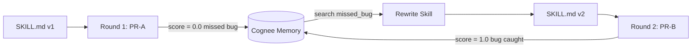
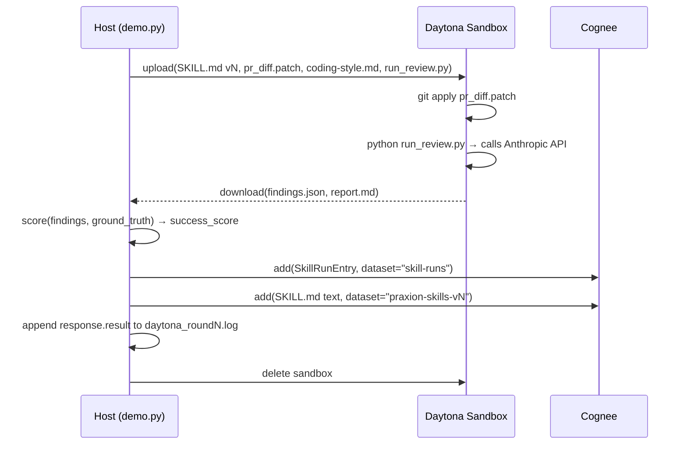
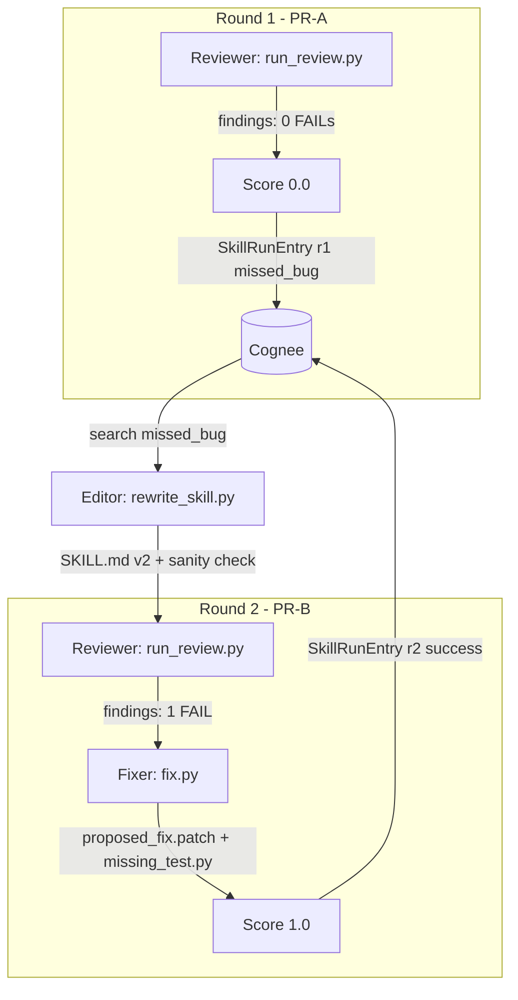
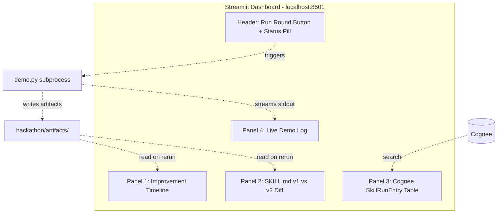

# Cognee Hackathon — Praxion Use Case

## What We Are Building (Simple Version)

We are teaching an AI agent to get better at its job by learning from its own mistakes.

The agent's "job" is reviewing code — specifically, spotting bugs in a Python pull request.
We give it a methodology document (a `SKILL.md` file) that tells it how to do that review.
In the first round, the agent misses a real bug. We record that failure. Then we automatically
rewrite the methodology document to add the missing rule. In the second round, the agent
catches the same class of bug in a different file — because it now has the rule it was missing.

That's the loop:



The "before" and "after" are visible as a two-line diff in the skill file. Judges trace the
full chain: failure → Cognee record → skill diff → successful rescue.

---

## Partners and Their Roles

### Cognee (knowledge graph + run memory)

Cognee stores two kinds of things:

- **Skill versions** — the `SKILL.md` file at each stage (`praxion-skills-v1`, `praxion-skills-v2`).
  Stored with `cognee.add(skill_text, dataset_name="praxion-skills-v1")`.

- **Run records** — every agent run is logged as a `SkillRunEntry` in the `skill-runs` dataset.
  The rewriter queries Cognee between rounds (`cognee.search("missed_bug")`) to find what went
  wrong and decide what rule to add.

Cognee is the memory that makes the loop possible — without it, there is no persistent record
of what failed and why.

### Daytona (isolated sandbox execution)

Every agent run happens inside an ephemeral Daytona sandbox. The sandbox receives:

- the current `SKILL.md`
- the `coding-style.md` rule
- the PR diff to review
- a small Python harness that calls the Anthropic API

It emits `findings.json` and `report.md`. The sandbox is destroyed after each round.
This gives judges a replayable, log-backed execution trace — no hidden local state.

### MOSS

Not used. MOSS provides sub-10ms semantic search but Cognee's `search()` already covers
our retrieval needs for this demo. Adding MOSS would add a third SDK with zero additional
rubric points.

---

## The Skill We Self-Improve

**`skills/code-review/SKILL.md`** — Praxion's structured code review methodology.

Why this skill:

- Its output is **mechanically scoreable**: findings carry `(severity, file, line, rule)` — directly
  comparable to a ground-truth answer key.

- Its improvement surface is **small and readable**: the `## Gotchas` section is a bullet list.
  Adding one bullet is a two-line diff a judge reads in five seconds.

- The gap we exploit is **real**: the skill knows about Python immutability conventions generically
  but does not specifically call out mutable default arguments (`def f(x=[])`). That is a genuine
  blind spot, not a manufactured one.

- Its `allowed-tools` list is `[Read, Glob, Grep, Bash]` — all sandbox-native, no auth needed.

---

## The Task Class

Both rounds ask the agent to do the same kind of job:

> "Review this Python PR diff against the coding-style rule and produce a structured findings list."

The agent receives the diff, the rule file, and the skill — and must output a JSON findings list
per the skill's report template.

### Round 1 — PR-A

A Python module adds a function `append_event(payload, history=[])`. The empty list default is
shared across all calls — a classic Python mutable default argument bug.

The skill's current Gotchas section covers immutability generically (frozen dataclasses, tuples)
but does **not** mention function signature defaults. The agent misses it.

### Round 2 — PR-B

A different Python module adds `cache_lookup(key, seen=set())`. Same defect class, different
surface. After the skill rewrite, the new Gotcha bullet covers `def f(x=set())` explicitly.
The agent catches it.

---

## Scoring Mechanism

A deterministic `score.py` compares `findings.json` against `ground_truth.json` per round.
Ground truth names exactly one critical finding per PR: `(file, line_range, defect_class)`.

| `success_score` | Condition |
| --- | --- |
| `1.0` | Finding overlaps ground-truth line range AND names the defect class (keyword match: "mutable default" / "shared state"). |
| `0.5` | Line range overlaps but defect class is wrong OR severity is WARN instead of FAIL. |
| `0.0` | No finding overlaps the ground-truth location. |

`feedback` follows directly: `1.0` on success, `-1.0` on `0.0` score, `0` on `0.5`.

---

## Error Taxonomy

Four `error_type` values cover the demo space:

| `error_type` | Meaning | Triggers rewrite? |
| --- | --- | --- |
| `missed_bug` | No finding overlaps ground truth. | Yes — append Gotcha bullet. |
| `weak_evidence` | Location matches but rule citation is wrong (e.g., flagged as "complexity"). | Yes — clarify rule reference. |
| `hallucinated_api` | Finding cites a `coding-style.md` section that does not exist. | No — safety failure, logged only. |
| `agent_failed` | Harness exited non-zero or JSON malformed. | No — would corrupt skill on a flaky run. |

For the demo, only `missed_bug` triggers a rewrite. The other paths are recorded and documented
as extension points.

---

## SkillRunEntry Schema

`SkillRunEntry` is **not** a Cognee primitive — we define it as a `pydantic.BaseModel` and serialize
to JSON via `model_dump_json()` before passing the string to `cognee.add(data=json_str, ...)`.
Round-trip retrieval uses `SkillRunEntry.model_validate_json(retrieved_text)`.

The canonical record per round:

```python
# Round 1 — baseline failure
SkillRunEntry(
    run_id="praxion:r1:code-review",
    selected_skill_id="code-review@v1",
    task_text="Review PR-A: adds append_event() with history=[] default",
    result_summary="Reported 1 WARN on naming, 0 FAILs. Did not flag mutable default at events.py:14.",
    success_score=0.0,
    feedback=-1.0,
    error_type="missed_bug",
    error_message="ground truth: events.py:14 mutable default argument; skill emitted no FAIL on that line",
)

# Round 2 — improved success
SkillRunEntry(
    run_id="praxion:r2:code-review",
    selected_skill_id="code-review@v2",
    task_text="Review PR-B: adds cache_lookup() with seen=set() default",
    result_summary="Reported 1 FAIL at cache.py:22: mutable default set() — proposed None guard + unit test.",
    success_score=1.0,
    feedback=1.0,
    error_type="",
    error_message="",
)
```

---

## Cognee Integration Details

Three datasets — naming follows the `<project>-<artifact-type>-<version-label>` pattern:

| Dataset name | Contents | Purpose |
| --- | --- | --- |
| `praxion-code-review-v1` | `SKILL.md` text before rewrite | Baseline snapshot |
| `praxion-code-review-v2` | `SKILL.md` text after rewrite | Post-improvement snapshot |
| `skill-runs` | All `SkillRunEntry` records (both rounds) | Cross-round retrieval; drives rewrite |

Between rounds, `rewrite_skill.py` calls `cognee.search("error_type:missed_bug", query_type=SearchType.CHUNKS)`
to retrieve the Round 1 record, then uses the `result_summary` and `error_message` to guide the
LLM prompt that generates the new Gotcha bullet.

Versioning is by dataset name suffix (`-v1`, `-v2`). Simple, readable, and sufficient for a demo.

> ⚠ **Cognee LLM provider gotcha.** Cognee's `cognify()` step uses **OpenAI by default** for
> entity/relationship extraction during graph build. For the demo we either (a) configure
> Cognee to use Anthropic, (b) provide a separate `OPENAI_API_KEY`, or (c) skip `cognify()` and
> rely only on `add()` + `search(query_type=SearchType.CHUNKS)` for chunk-level retrieval.
> Option (c) is the simplest path — it avoids a second API key and keeps the demo single-provider.
> Architect resolves this in an ADR.

---

## Daytona Execution Per Round



`run_review.py` (~80 lines) is the only code that runs inside the sandbox. It reads the skill
body and rule from disk, constructs a prompt, calls the Anthropic API, and writes structured
JSON output. The Anthropic API key is injected via `CreateSandboxFromImageParams(env_vars={...})`.

**Sandbox image strategy.** We use a custom Daytona image with `anthropic` pre-installed:

```python
image = Image.debian_slim("3.12").pip_install(["anthropic==0.97.0", "pydantic"])
```

Custom images break Daytona's warm pool (sub-90ms) and cold-start in seconds. Mitigation:
**pre-create the Round 1 sandbox** during slide setup so only Round 2 lives on the demo clock.
The alternative — running `pip install anthropic` inside a vanilla sandbox via `process.exec()` —
is slower and noisier in logs.

---

## The Improvement Loop

`rewrite_skill.py` runs on the host between rounds:

1. `cognee.search("error_type:missed_bug")` — retrieve Round 1 failure.
2. Map `error_type` → rewrite policy. For `missed_bug`: **append one Gotcha bullet**.
3. LLM call (Claude, ~200-token prompt) produces the bullet given:
   - `result_summary` from the Cognee record
   - relevant section of `coding-style.md`
   - existing `## Gotchas` section of the skill
4. Patch `SKILL.md` in place — append-only into `## Gotchas`. No structural change.
5. Upload new version to Cognee as `praxion-skills-v2`.

The rewriter is intentionally narrow: **one policy, one section, one round**.
This makes the diff readable and the safety story clean.

---

## The Before/After Skill Diff

The visible artifact that closes the loop for judges:

```diff
  ## Gotchas

  - **Structural findings belong to refactoring**: When review findings indicate
    structural issues (module too large, deep coupling, misplaced responsibility),
    flag them but defer remediation to the `refactoring` skill rather than
    prescribing structural fixes inline.
+
+ - **Mutable default arguments**: In Python, `def f(x=[])` and `def f(x=set())`
+   share the default object across all calls — a silent state mutation bug.
+   Flag any function signature whose default value is a list, dict, or set literal
+   as a FAIL under the Immutability convention, citing the file:line and proposing
+   `x: list[T] | None = None` with an early `if x is None: x = []` guard.
```

Two lines added. The Round 1 `error_message` points to `events.py:14`. The diff shows exactly
what rule was missing. The Round 2 success trace shows `cache.py:22` caught with the new rule.

---

## Three-Role Pipeline

Three roles, each a plain Python harness on disk:

### Roles, Triggers, and Handoffs

| Role | Script | Runs When | Inputs | Outputs |
| --- | --- | --- | --- | --- |
| **Reviewer** | `run_review.py` (in sandbox) | Round 1 + Round 2 | `SKILL.md` (vN), `coding-style.md`, `pr_diff.patch` | `findings.json`, `report.md` |
| **Editor** | `rewrite_skill.py` (on host) | Between rounds, only on `missed_bug` | Round 1 `SkillRunEntry` from Cognee, current `SKILL.md`, `coding-style.md` | `SKILL.md` v2 (Gotcha bullet appended) + inline sanity check |
| **Fixer** | `fix.py` (on host) | Round 2 only, after a successful catch | Round 2 `findings.json`, `pr_diff.patch` (PR-B), `coding-style.md` | `proposed_fix.patch` (one-line code fix) + `missing_test.py` (one pytest case) |

### Pipeline Flow



### Inline Sanity Check

The Editor's rewrite is gated by a 5-line check inside `rewrite_skill.py` before the new
skill is written to disk:

```python
def is_safe_rewrite(old: str, new: str) -> bool:
    return (
        len(new) - len(old) < 400                  # body grew by less than 400 chars
        and new.split("---")[1] == old.split("---")[1]  # frontmatter unchanged
        and new.count("## ") == old.count("## ")   # no new sections
    )
```

If the check fails, the demo falls back to `SKILL.md` v1 and logs the rejection.

---

## Web App: Skill Improvement Dashboard

A single-page **Streamlit** app (~140 lines) that makes the improvement loop visible to judges
in real time. One file, one command, no JS, no templates.

### Why Streamlit

| Criterion | Streamlit 1.56 | Gradio 6.13 | FastAPI + SSE |
| --- | --- | --- | --- |
| Async (Cognee SDK) | `asyncio.run()` wrapper (2-line tax) | Native `async def` | Native `async def` |
| Diff display | `st.code(text, language='diff')` built-in | `difflib` + `gr.HTML()` | `difflib` + hand-rolled CSS |
| Live subprocess stream | `st.write_stream()` + generator, ~10 lines | `yield` in handler, verbose layout | SSE + vanilla JS, two files |
| LOC estimate | ~130 | ~150 | ~170 (two files) |
| One-command start | `streamlit run dashboard.py` | `python app.py` | `fastapi dev app.py` |

Streamlit wins on total effort for this combination of panels, subprocess streaming, and
demo polish. Wrap each Cognee async call in `asyncio.run()` and all four features land
in ~130 lines.

### Four Panels, One Screen



| Panel | Source | Render |
| --- | --- | --- |
| **Header** | n/a | `st.button("Run Round")` + status pill backed by `st.session_state` |
| **Timeline** | `artifacts/timeline.json` (appended by `demo.py` at each phase) | Emoji step list — ✗ missed → ◆ recorded → ✓ approved → ✓ caught → 🔧 fixed |
| **SKILL.md Diff** | current `SKILL.md` vs `artifacts/SKILL_v1.md.bak` | `difflib.unified_diff` → `st.code(diff, language='diff')` — `+` lines highlight green |
| **Cognee Records** | `cognee.search("run_id:praxion:r*")` | `st.dataframe` — two rows: r1/0.0/missed_bug → r2/1.0/(empty). Score delta is the headline. |
| **Live Log** | `subprocess.Popen` stdout | `st.empty()` placeholder updated line-by-line; capped at 200 lines |

Button-click flow: `Run Round` → spawns `demo.py --round N` → Panel 4 streams live →
on exit, `st.rerun()` refreshes Panels 1/2/3 from fresh artifacts. Round 1 and Round 2
are separate button presses so judges can pause and inspect Panel 3 transitioning from
one row to two.

### File Structure

```text
hackathon/
  dashboard.py            # ~140 lines — Streamlit dashboard
  demo.py                 # ~120 lines — host orchestrator
  run_review.py           # ~80 lines — Reviewer (in sandbox)
  rewrite_skill.py        # ~60 lines — Editor + inline sanity check
  fix.py                  # ~50 lines — Fixer (Round 2 only)
  score.py                # ~30 lines — deterministic scorer
  run_dashboard.sh        # 3-line wrapper: pip install + streamlit run
  requirements.txt        # streamlit, cognee, daytona, anthropic, pydantic
  artifacts/              # gitignored; populated by demo.py at runtime
    timeline.json
    SKILL_v1.md.bak
    daytona_round1.log
    daytona_round2.log
    findings_r1.json
    findings_r2.json
    proposed_fix.patch    # produced by fix.py in Round 2
    missing_test.py       # produced by fix.py in Round 2
  fixtures/
    pr_A.patch
    pr_B.patch
    ground_truth_A.json
    ground_truth_B.json
  README.md
```

### One-Command Startup

```bash
./hackathon/run_dashboard.sh
# opens http://localhost:8501 automatically
```

---

## What Gets Built (~2 hours)

### Must work end-to-end

| File | Lines | Role |
| --- | --- | --- |
| `demo.py` | ~120 | Host orchestrator: rounds, Daytona, Cognee, scoring |
| `run_review.py` | ~80 | Reviewer (in sandbox): Anthropic API call, JSON findings output |
| `rewrite_skill.py` | ~60 | Editor: single-policy skill patcher + inline sanity check |
| `fix.py` | ~50 | Fixer (Round 2 only): proposed fix patch + missing test |
| `score.py` | ~30 | Deterministic ground-truth comparator |
| `dashboard.py` | ~140 | Streamlit visualization app |
| `fixtures/` | — | PR-A patch, PR-B patch, two ground-truth JSON files |

Total ~480 lines of Python.

### Scaffolded for demo (documented extension points, not built)

- Only `missed_bug` triggers a rewrite; other `error_type` values are recorded only.
- Only one rewrite policy (Gotchas-append); severity-clarification is listed as future.
- Only one defect class (mutable default); fixture schema accepts more.
- Cognee versioning by dataset suffix; production would use a version graph.

---

## Rubric Coverage

| Dimension | Points | How We Score |
| --- | --- | --- |
| PR rescue quality | 40 | Round 2 finds the real defect, names `cache.py:22`, Fixer produces `proposed_fix.patch` and `missing_test.py` |
| Self-improvement evidence | 25 | Two `SkillRunEntry` rows in Cognee (`0.0 → 1.0`), readable `SKILL.md` diff, inline sanity check log |
| Review clarity | 20 | Structured findings JSON with severity, file:line, rule citation |
| Reproducibility | 10 | `python demo.py` is the single entrypoint; two `daytona_roundN.log` files |
| Safety | 5 | `allowed-tools: [Read, Glob, Grep, Bash]`; sanity check rejects unsafe rewrites; no hallucinated APIs |

---

## Open Questions (for systems-architect)

The researcher surfaced six concrete decisions the architect needs to resolve. Each becomes an
ADR or a sentence in `SYSTEMS_PLAN.md`.

1. **Cognee LLM provider.** `cognify()` defaults to OpenAI. Resolve to: (a) skip `cognify()` and use `SearchType.CHUNKS` only — single-provider, simplest, lowest latency; (b) configure Cognee to use Anthropic; (c) accept a second API key. Recommend (a).
2. **Custom image vs runtime install.** Pre-built `Image.debian_slim("3.12").pip_install([...])` cold-starts in seconds and breaks the warm pool; vanilla sandbox + `process.exec("pip install anthropic")` is slower and noisier in logs. Pre-create the Round 1 sandbox during slide setup either way.
3. **Anthropic SDK version alignment.** Project has `anthropic==0.71.0` installed; current is `0.97.0`. The sandbox image should pin to current. The host `rewrite_skill.py` and `fix.py` should also align to avoid drift.
4. **Structured output strategy.** Anthropic SDK now offers `messages.parse(output_format=PydanticModel)` for native typed output. Use it inside `run_review.py` and `fix.py` (cleaner than a system prompt + JSON-parse pattern), or fall back to plain JSON if the SDK feature lands inconsistently.
5. **Prompt caching for skill body.** Skill body + rule may be below the 1024-token minimum for caching. Verify token count before deciding whether to enable; if eligible, cache once per round and save tokens on the second sandbox invocation.
6. **Anthropic SDK vs CLI inside sandbox.** Resolved: use the SDK. One `httpx` POST equivalent, no second auth layer, JSON output via `messages.parse`.

### Resolved by the simplification

- **Rewriter safety** is now an inline 5-line check in `rewrite_skill.py` (skill body grew by <400 chars, frontmatter unchanged, no new sections). No separate Critic agent needed.

---

## Why This Is Worth Merging After the Hackathon

The improved `SKILL.md` Gotcha bullet is a **genuine quality improvement** — the mutable default
argument check is a real gap in the current skill. The demo produces something we would actually
commit to Praxion. The harness scripts establish a **reusable template** for self-improving any
Praxion skill that has a checklist surface and a ground-truth rule. The hackathon submission is
a prototype of an ongoing capability, not a one-off.
