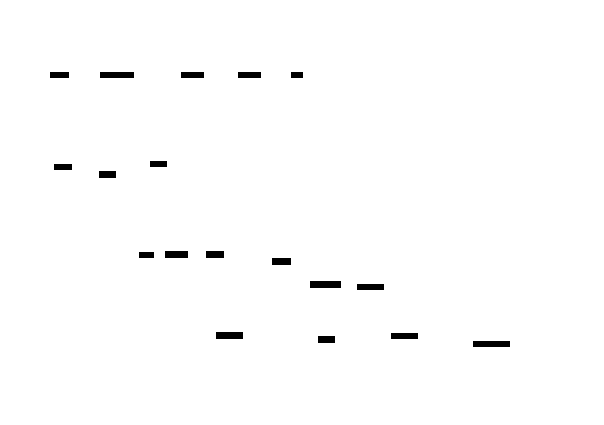

# Architecture Guide

<!-- Developer navigation guide. Every component name and file path in this document has been
     verified against the codebase. Only components that exist on disk are included.
     For design rationale, planned components, and architectural evolution, see .ai-state/ARCHITECTURE.md.
     Maintained by pipeline agents: created by systems-architect, updated by implementer,
     verified by doc-engineer at pipeline checkpoints.
     See skills/software-planning/references/architecture-documentation.md for the full methodology. -->

## 1. Overview

<!-- OWNER: doc-engineer (verification) | LAST UPDATED: 2026-04-28 (deduplicated — system attributes live in the architect doc; this section provides developer orientation only) -->

| Attribute | Value |
|-----------|-------|
| **System** | Praxion |
| **Last verified against code** | 2026-04-24 |

This document is the **developer-facing** navigation guide: every component, file path, and interface listed here exists on disk and resolves at the cited path. It is the code-verified subset of [`.ai-state/ARCHITECTURE.md`](../.ai-state/ARCHITECTURE.md), which is the design-target architect-facing document. Use this guide to navigate the codebase; consult the architect doc for system attributes (type, language, pattern), design rationale, planned components, and architectural evolution.

## 2. System Context

<!-- OWNER: doc-engineer (verification) | LAST UPDATED: 2026-04-28 (deduplicated — L0 diagram is byte-identical to architect doc) -->

The system-boundary L0 diagram is rendered in [`.ai-state/ARCHITECTURE.md` §2](../.ai-state/ARCHITECTURE.md#2-system-context). External actors: Developer, Claude Code, Claude Desktop, Cursor, Arize Phoenix, GitHub.

> **Component detail:** [Components](#3-components)

## 3. Components

<!-- OWNER: implementer (as-built), doc-engineer (verification) | LAST UPDATED: 2026-04-28 by implementer (migrated L1 Mermaid block to LikeC4-sourced SVG — structurizr-d2-diagrams pipeline) -->
<!-- L1 diagram: major building blocks and their relationships.
     Every component listed here MUST exist on disk — verify with ls/Glob before including.
     Source: docs/diagrams/architecture.c4 | Generated: docs/diagrams/architecture/components.d2
     Regen: likec4 gen d2 docs/diagrams/ -o docs/diagrams/architecture/ && d2 docs/diagrams/architecture/components.d2 docs/diagrams/architecture/components.svg -->

*LikeC4 source: [`docs/diagrams/architecture.c4`](diagrams/architecture.c4). The pre-commit hook (`scripts/diagram-regen-hook.sh`) regenerates the SVG above when the source changes.*

| Component | Responsibility | Key Files |
|-----------|---------------|-----------|
| Skills | Delivers domain expertise via progressive disclosure (metadata at startup, body on activation, references on demand). 35 skills on disk (2026-04-16); recent addition: `llm-prompt-engineering` | `skills/*/SKILL.md`, `skills/*/references/`, `skills/llm-prompt-engineering/` |
| Agents | Runs as autonomous subprocesses for multi-step software engineering work | `agents/*.md` |
| Rules | Provides declarative conventions auto-loaded by relevance into every session | `rules/swe/`, `rules/writing/` |
| Commands | Exposes user-invoked slash commands for repeatable workflows | `commands/*.md` |
| Hooks | Executes Python/shell scripts on Claude Code lifecycle events for enforcement and observability | `hooks/*.py`, `hooks/*.sh`, `hooks/hooks.json` |
| Praxion-as-first-class enforcement | Three-layer enforcement that carries Praxion's behavioral contract to every subagent including host-native ones. `inject_subagent_context.py` fires on PreToolUse(Agent\|Task) and prepends a compact preamble to every subagent prompt via `updatedInput.prompt`. `inject_process_framing.py` fires on UserPromptSubmit and emits a compact `additionalContext` reminder for non-trivial prompts in Praxion projects. Both hooks fast-skip on absent `.ai-state/` and opt-out env vars, exiting 0 unconditionally on any error | `hooks/inject_subagent_context.py`, `hooks/inject_process_framing.py`, `hooks/hooks.json` |
| Install-path completeness | First-session auto-completion that converges marketplace-only installs on the same end state as clone installs. `auto_complete_install.py` fires on SessionStart, checks for missing global surfaces, and runs the completion logic using git-config defaults or an interactive prompt with 30-second timeout-accept. Idempotent — fast-skips in <50 ms after the first successful run via a marker file. `render_claude_md.py` provides the shared template-substitution helper used by both the install scripts and this hook | `hooks/auto_complete_install.py`, `scripts/render_claude_md.py`, `hooks/hooks.json` |
| Memory MCP | Stores persistent dual-layer memory: curated knowledge (JSON) + automatic observations (JSONL) | `memory-mcp/src/memory_mcp/` |
| Chronograph MCP | Provides agent pipeline observability via OpenTelemetry spans | `task-chronograph-mcp/src/task_chronograph_mcp/` |
| `.ai-state/` | Holds persistent project intelligence: ADRs, specs, sentinel reports, architecture docs, memory | `.ai-state/decisions/`, `.ai-state/memory.json` |
| `.ai-work/` | Contains ephemeral pipeline documents scoped by task slug | `.ai-work/<task-slug>/` |
| Installers | Deploys target-specific configurations (Claude Code, Claude Desktop, Cursor) | `install.sh`, `install_claude.sh`, `install_cursor.sh` |
| Scripts | Provides developer tooling: worktree management, merge drivers, daemon control | `scripts/` |
| Greenfield project onboarding | Scaffolds a Claude-ready project into an empty directory and hands off to an interactive Claude session pre-loaded with `/new-project`. Bash handles deterministic prereqs + minimal scaffold; the slash command runs the conversational flow, generates the default Python + `uv` + Claude Agent SDK + FastAPI app, writes a per-run `onboarding_for_mushi_busy_ppl.md`, and chains to `/onboard-project` for the remaining surfaces (git hooks, merge drivers, `.ai-state/` skeleton, `.claude/settings.json` toggles). Integration-tested via bash. See [docs/greenfield-onboarding.md](greenfield-onboarding.md) for the user-facing guide | `new_project.sh` (repo root), `commands/new-project.md`, `docs/greenfield-onboarding.md`, `tests/new_project_test.sh` |
| Existing-project onboarding | Phased, gated `/onboard-project` slash command that retrofits an existing repo with Praxion's surfaces: `.gitignore` AI-assistants block, `.ai-state/` skeleton (`decisions/drafts/`, `DECISIONS_INDEX.md`, `TECH_DEBT_LEDGER.md`, `calibration_log.md`), `.gitattributes` + `git config` merge driver registration, git hooks (pre-commit id-citation discipline + post-merge ADR finalize/tech-debt dedupe/squash-safety), `.claude/settings.json` PRAXION_DISABLE_* toggles via multi-select, `CLAUDE.md` blocks (Agent Pipeline + Compaction Guidance + Behavioral Contract). Each phase has an idempotency predicate so re-runs are no-ops. Pre-flight detects greenfield-shape and redirects to `/new-project`. See [docs/existing-project-onboarding.md](existing-project-onboarding.md) for the user-facing guide | `commands/onboard-project.md`, `docs/existing-project-onboarding.md` |
| Concurrency & collaboration model | Unifies multi-worktree and multi-user coordination around shared primitives: fragment-named draft ADRs under `.ai-state/decisions/drafts/<YYYYMMDD-HHMM>-<user>-<branch>-<slug>.md` promoted to `<NNN>-<slug>.md` at merge-to-main, unified worktree home at `.claude/worktrees/`, two-layer squash-merge safety (command refuse + post-merge warn), opt-in auto-memory orphan cleanup. Post-merge hook runs reconcile → finalize → squash-safety in that order | `scripts/finalize_adrs.py`, `scripts/check_squash_safety.py`, `scripts/migrate_worktree_home.sh`, `scripts/git-post-merge-hook.sh`, `commands/clean-auto-memory.md`, `commands/create-worktree.md`, `commands/merge-worktree.md`, `rules/swe/vcs/pr-conventions.md`, `rules/swe/adr-conventions.md`, `.ai-state/decisions/drafts/` |
| Project metrics command | `/project-metrics` slash command computes curated complexity/health metrics (SLOC, CCN, cognitive complexity, cyclic deps, churn, entropy, truck factor, hotspots, coverage) on any Praxion-onboarded repo. Two-tier collector plugin architecture: Tier 0 universal (`git` + stdlib, optional `scc`) and Tier 1 Python (`lizard` / `complexipy` / `pydeps` / `coverage.py` artifact parse) for v1. Produces a per-run JSON+MD artifact pair under `.ai-state/metrics_reports/METRICS_REPORT_YYYY-MM-DD_HH-MM-SS.{json,md}` plus an append-only sibling `.ai-state/metrics_reports/METRICS_LOG.md`. Frozen aggregate-block column contract; graceful degradation with uniform skip markers when optional tools are absent. Draft ADRs under `.ai-state/decisions/drafts/` carry the design rationale (storage-schema-for-project-metrics, collector-protocol, graceful-degradation-policy, hotspot-formula) and finalize to stable NNN at merge-to-main | `commands/project-metrics.md`, `scripts/project_metrics/` (package: `cli.py`, `schema.py`, `runner.py`, `hotspot.py`, `trends.py`, `report.py`, `logappend.py`, `collectors/` with six collectors), `scripts/project_metrics/tests/` (16 test modules + `build_fixtures.py`-generated fixture repos), `docs/metrics/README.md` (complete JSON schema reference) |
| Tech-debt ledger | Living, append-only `.ai-state/TECH_DEBT_LEDGER.md` — single Markdown table with stable `td-NNN` IDs and a 15-field schema (14 row fields + structural `dedup_key`). Producers: verifier (per-change Phase 5/5.5 writes) and sentinel (repo-wide TD dimension TD01–TD04 writes; TD05 audits only). Consumers: five existing agents (`systems-architect`, `implementation-planner`, `implementer`, `test-engineer`, `doc-engineer`) read the ledger, filter by their `owner-role`, and update `status` in place — framed as permission-not-obligation, not a mandate. Promethean, roadmap-cartographer, `/project-metrics`, and `/project-coverage` are signal sources only and never write ledger rows. Notes-merge separator is ` // ` (chosen to avoid collision with the Markdown table column delimiter `|`). Worktree concurrency handled by append-only convention plus a post-merge dedupe step (`scripts/finalize_tech_debt_ledger.py`, modeled on `scripts/finalize_adrs.py`; chained into `scripts/git-post-merge-hook.sh` after `finalize_adrs.py`). Schema, owner-role heuristic, and worktree-merge dedupe semantics are canonical in `rules/swe/agent-intermediate-documents.md`; design rationale lives in the draft ADRs under `.ai-state/decisions/drafts/` (promoted to stable `dec-NNN` at merge-to-main; see `.ai-state/decisions/DECISIONS_INDEX.md`). Ledger file exists on disk (empty header-only at first producer write); producer wiring (`agents/verifier.md` Phase 5/5.5 + `agents/sentinel.md` TD dimension), consumer contracts (single-line input on the five reader agents), and template migration (`## Technical Debt` removed from `skills/software-planning/references/document-templates.md`) all landed in the tech-debt-integration pipeline | `.ai-state/TECH_DEBT_LEDGER.md`, `rules/swe/agent-intermediate-documents.md`, `scripts/finalize_tech_debt_ledger.py`, `scripts/git-post-merge-hook.sh`, `agents/verifier.md`, `agents/sentinel.md`, `agents/{systems-architect,implementation-planner,implementer,test-engineer,doc-engineer}.md`, `skills/software-planning/references/document-templates.md` |

## 4. Interfaces

<!-- OWNER: implementer (as-built) | LAST UPDATED: 2026-04-12 -->
<!-- Key APIs, contracts, and integration points between components.
     Only interfaces that are implemented and callable. -->

| Interface | Type | Provider | Consumer(s) | Contract |
|-----------|------|----------|-------------|----------|
| Plugin manifest | JSON | `plugin.json` | Claude Code plugin system | Skills/commands via directory globs, agents via explicit paths, MCP via command+args |
| Hook lifecycle | JSON (stdin/stdout) | Claude Code | `hooks/*.py` | Exit 0 = allow + process stdout JSON; exit 2 = block + stderr feedback |
| Hook events HTTP | HTTP POST | `hooks/send_event.py` | Chronograph MCP | `localhost:8765/api/events` with event payload |
| Memory MCP | stdio (MCP) | `memory-mcp` | Claude Code, agents, hooks | 18 tools + 2 resources; schema v2.0 |
| Chronograph MCP | stdio (MCP) + HTTP | `task-chronograph-mcp` | Claude Code (stdio), hooks (HTTP) | 3 MCP tools; HTTP daemon on port 8765 |
| OTLP export | HTTP | Chronograph MCP | Arize Phoenix | OTLP HTTP to `localhost:6006/v1/traces` |
| Pipeline documents | Markdown files | Upstream agents | Downstream agents | Shared `.ai-work/<task-slug>/` directory; fragment files for parallel writes |
| Skill progressive disclosure | YAML frontmatter + Markdown | `SKILL.md` files | Claude Code skill loader | 3 tiers: metadata (startup), body (activation), references (on-demand) |
| Hook registration | JSON | `hooks/hooks.json` | Claude Code plugin system | Event type, command, timeout, sync/async per hook |
| Git post-merge hook chain | Shell | `scripts/git-post-merge-hook.sh` | Git (post-merge event) | Runs `reconcile_ai_state.py --post-merge`, then `finalize_adrs.py --merged`, then `check_squash_safety.py`. Load-bearing order — reconcile handles memory/observations, finalize promotes drafts, squash-safety is diagnostic-only |
| Draft ADR lifecycle | Markdown + YAML | Pipeline agents (architect, planner) | `scripts/finalize_adrs.py` | Drafts at `.ai-state/decisions/drafts/<YYYYMMDD-HHMM>-<user>-<branch>-<slug>.md` with `id: dec-draft-<8-char-hash>` and `status: proposed`; finalize renames to `<NNN>-<slug>.md`, rewrites cross-references across sibling ADRs, `.ai-work/*/LEARNINGS.md`, `SYSTEMS_PLAN.md`, `IMPLEMENTATION_PLAN.md`; idempotent |

## 5. Data Flow

<!-- OWNER: doc-engineer (verification) | LAST UPDATED: 2026-04-28 (deduplicated — diagrams are byte-identical to architect doc) -->

The agent-pipeline execution sequence, the memory + observability flow, and the tech-debt ledger flow are diagrammed in [`.ai-state/ARCHITECTURE.md` §5](../.ai-state/ARCHITECTURE.md#5-data-flow). The architect doc additionally diagrams the ADR finalize flow.

For developers: the entry point for tracing a pipeline run is `EnterWorktree` (main agent) → researcher → systems-architect → implementation-planner → (implementer ∥ test-engineer) → verifier, with all artifacts under `.ai-work/<task-slug>/`. Memory and observation correlation goes through the OpenInference `session.id` attribute and W3C trace-context (`traceparent`) — see [`task-chronograph-mcp/src/task_chronograph_mcp/otel_relay.py`](../task-chronograph-mcp/src/task_chronograph_mcp/otel_relay.py) and [`memory-mcp/src/memory_mcp/correlation.py`](../memory-mcp/src/memory_mcp/correlation.py).

## 6. Dependencies

<!-- OWNER: doc-engineer (verification) | LAST UPDATED: 2026-04-28 (deduplicated — single source of truth is the architect doc) -->

External dependencies, versions, and criticality classifications are listed in [`.ai-state/ARCHITECTURE.md` §6](../.ai-state/ARCHITECTURE.md#6-dependencies). Verified against `pyproject.toml` and project config.

## 7. Constraints

<!-- OWNER: doc-engineer (verification) | LAST UPDATED: 2026-04-28 (deduplicated — developer-relevant constraints were a strict subset of the architect doc's; the architect doc is the single source) -->

System constraints (performance, compatibility, technical, behavioral, architectural) are listed in [`.ai-state/ARCHITECTURE.md` §7](../.ai-state/ARCHITECTURE.md#7-constraints). Three additional architect-only rows live there: the four-behavior agent contract, git as the sole synchronization substrate, and ADR fragment-naming.

## 8. Decisions

<!-- OWNER: doc-engineer (verification) | LAST UPDATED: 2026-04-28 (deduplicated per dec-021's "never duplicate ADR rationale" intent) -->

Architectural decisions are recorded as ADRs in [`.ai-state/decisions/`](../.ai-state/decisions/). The canonical, auto-generated cross-reference is [`DECISIONS_INDEX.md`](../.ai-state/decisions/DECISIONS_INDEX.md). For design-target rationale, see [`.ai-state/ARCHITECTURE.md`](../.ai-state/ARCHITECTURE.md) — this developer guide intentionally does not summarize decisions inline.

## 9. Test Topology

<!-- Developer-facing navigation guide. Components named in this section have been verified
     against the codebase. Items marked Designed are not on disk yet (they ship in this pipeline);
     items marked Planned are not on disk and will be created by future projects.
     For design rationale and ADR cross-references, see .ai-state/ARCHITECTURE.md §9. -->

### 9.1 Where to find what

The test-topology subsystem lets each implementation step run only the tests covering its affected subsystems plus their integration boundaries. Three execution tiers (`step` / `phase` / `pipeline`) and a sentinel-driven refactor trigger emerge from a per-project topology declaration.

| You want to... | Look at | Status |
|---|---|---|
| Read the language-agnostic schema | `skills/testing-strategy/references/test-topology.md` | Designed (lands in this pipeline) |
| Read the Python-specific tooling concretization | `skills/testing-strategy/references/python-testing.md` (test-topology section) | Designed (lands in this pipeline) |
| See whether your project has populated its topology | `.ai-state/TEST_TOPOLOGY.md` (per-project) | Planned (no Praxion population by design) |
| Read the sentinel checks for topology health | `agents/sentinel.md` `### Test Topology (TT)` | Designed (lands in this pipeline) |
| See the debt class for topology drift | `rules/swe/agent-intermediate-documents.md` (`class` enum) | Designed (`topology-drift` value lands in this pipeline) |
| Add a Tests: field to a step in your IMPLEMENTATION_PLAN.md | `skills/software-planning/SKILL.md` step schema | Designed (additive optional field lands in this pipeline) |

### 9.2 Activation status in Praxion

Praxion itself ships the schema and conventions but does **not** populate `.ai-state/TEST_TOPOLOGY.md` — see [`dec-087`](../.ai-state/decisions/drafts/20260428-2335-fperezsorrosal-worktree-test-partitioning-pilot-strategy-trunk-only-then-defer-behavioral-pilot.md). The first consumer project that adopts the i-am plugin and decides to activate the protocol creates the populated topology in its own `.ai-state/`.

For Praxion development today, this means:

- The implementer continues to run the project's default test command (`uv run pytest` or `cd <pocket> && uv run pytest`) per pocket. The `Tests:` step-schema field, while documented, is not emitted in Praxion plans.
- Sentinel TT01–TT05 self-deactivate (no `.ai-state/TEST_TOPOLOGY.md` to check).
- The full-suite integration checkpoint at the end of each pipeline remains today's behavior.

### 9.3 Adding a new language leaf (procedure)

If a future contributor extends the test-topology to a new language (Go, TypeScript, Rust, etc.), the procedure is purely additive:

1. Create `skills/testing-strategy/references/<language>-testing.md` (or extend an existing language reference).
2. In the trunk reference (`skills/testing-strategy/references/test-topology.md`), append rows to the two registry tables:
   - `selector_strategy` — at minimum one identifier (e.g., `go-test-packages`) with its argument shape.
   - `parallel_runner` — at minimum one identifier (e.g., `go-test-parallel`) with its concrete invocation.
3. Document the leaf's `shared_fixture_scope` mapping (which language-framework scope keyword maps to each of `none / per-test / per-file / per-process / per-suite`).
4. Provide a worked invocation example.

No edits to the trunk schema, the sentinel TT01–TT05 wording, the closure semantics, or any other agent definition are required. The hypothetical Go module worked example in this pipeline's `.ai-work/test-partitioning/SYSTEMS_PLAN.md` (Hypothetical Go Module Worked Example section) is the proof artifact.

### 9.4 Caveats developers should know

- **Marker name shape**: when a project does populate the topology and its language leaf is Python, group ids in `TEST_TOPOLOGY.md` are kebab-case (`memory-store-core`) but the corresponding pytest marker is snake_case (`memory_store_core`). The kebab → snake mapping is mechanical (`-` → `_`).
- **Reserved marker names**: do NOT use `parametrize`, `skipif`, `usefixtures`, `xfail`, `xdist_group`, `parallel_unsafe`, or any of `unit / integration / contract / e2e` as group ids — they collide with built-in or reserved markers. Sentinel TT05 enforces this.
- **`integration_boundaries` are one-hop**: a `phase`-tier selection runs the named groups plus their direct boundary neighbors, not the transitive closure. The `pipeline`-tier (full suite) covers the transitive case.
- **Lightweight tier**: the protocol does NOT activate at Lightweight tier. Lightweight tasks run today's default test command. If a Lightweight task grows beyond 3 files, escalate to Standard rather than half-engaging the topology.

For the design rationale behind any of the above, see [`.ai-state/ARCHITECTURE.md` §9](../.ai-state/ARCHITECTURE.md#9-test-topology).
