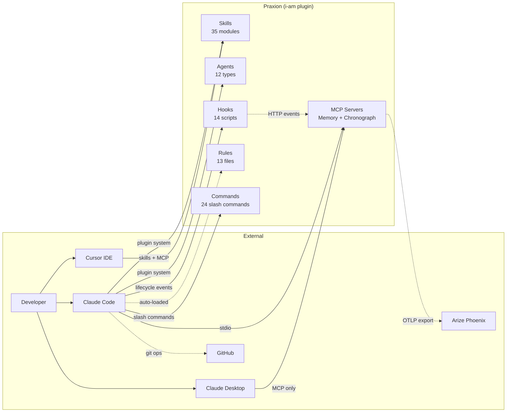
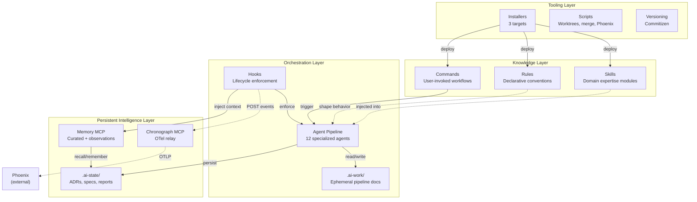
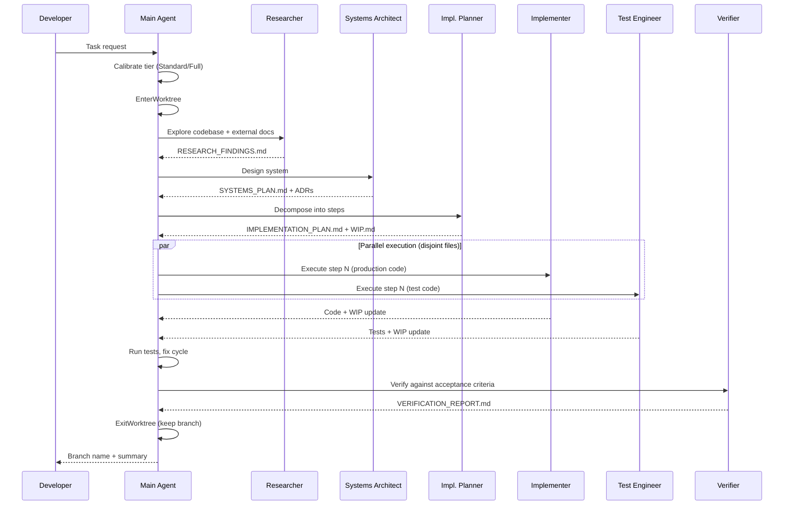
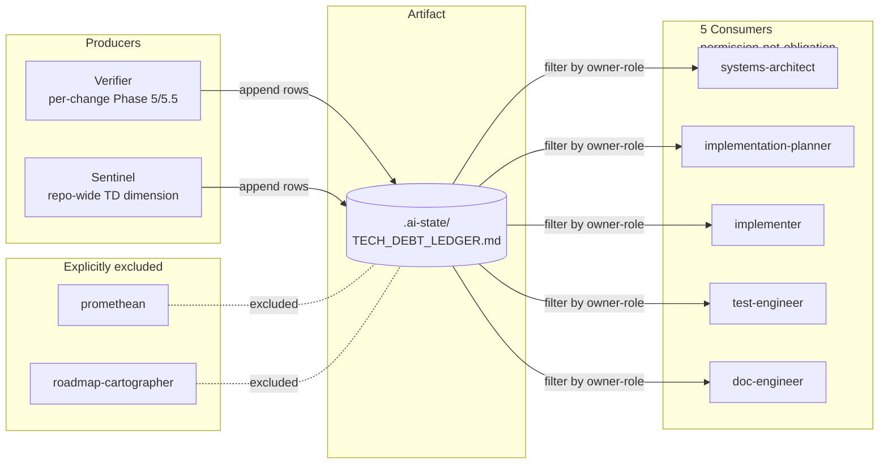

# Architecture Guide

<!-- Developer navigation guide. Every component name and file path in this document has been
     verified against the codebase. Only components that exist on disk are included.
     For design rationale, planned components, and architectural evolution, see .ai-state/ARCHITECTURE.md.
     Maintained by pipeline agents: created by systems-architect, updated by implementer,
     verified by doc-engineer at pipeline checkpoints.
     See skills/software-planning/references/architecture-documentation.md for the full methodology. -->

## 1. Overview

| Attribute | Value |
|-----------|-------|
| **System** | Praxion |
| **Type** | AI development meta-framework (plugin + MCP servers + knowledge artifacts) |
| **Language / Framework** | Python 3.13+ (MCP servers), Markdown (skills/agents/rules/commands), Shell/Python (hooks, scripts) |
| **Architecture pattern** | Plugin-based knowledge ecosystem with progressive disclosure and agent pipeline orchestration |
| **Last verified against code** | 2026-04-24 (project-metrics feature shipped Built: `/project-metrics` slash command + `scripts/project_metrics/` package + `docs/metrics/README.md` schema reference + `docs/metrics/index.html` trend visualization; five draft ADRs under `.ai-state/decisions/drafts/` awaiting finalize at merge-to-main) |

<!-- OWNER: systems-architect (creation), doc-engineer (verification) | LAST UPDATED: 2026-04-12 -->

Praxion provides the operational infrastructure for AI-assisted software development. It is an ecosystem of reusable skills, specialized agents, declarative rules, slash commands, lifecycle hooks, and MCP servers that compose into a coherent development workflow. It ships as the `i-am` Claude Code plugin, with secondary targets for Claude Desktop and Cursor.

The architecture is organized around three core concerns: **knowledge delivery** (skills and rules that bring domain expertise into agent context windows), **agent orchestration** (a pipeline of specialized agents that collaborate through shared documents), and **persistent intelligence** (MCP servers that maintain memory and observability state across sessions). For design rationale and architectural evolution, see [.ai-state/ARCHITECTURE.md](../.ai-state/ARCHITECTURE.md).

## 2. System Context

<!-- OWNER: systems-architect, doc-engineer (verification) | LAST UPDATED: 2026-04-12 -->
<!-- L0 diagram: system boundary + external actors/dependencies. Only existing integrations. -->



> **Component detail:** [Components](#3-components)

## 3. Components

<!-- OWNER: implementer (as-built), doc-engineer (verification) | LAST UPDATED: 2026-04-24 by implementer (added Tech-debt ledger row — `.ai-state/TECH_DEBT_LEDGER.md` empty artifact verified on disk; schema registered in `rules/swe/agent-intermediate-documents.md`; producer wiring and consumer contracts pending downstream steps) -->
<!-- L1 diagram: major building blocks and their relationships.
     Every component listed here MUST exist on disk — verify with ls/Glob before including. -->



| Component | Responsibility | Key Files |
|-----------|---------------|-----------|
| Skills | Delivers domain expertise via progressive disclosure (metadata at startup, body on activation, references on demand). 35 skills on disk (2026-04-16); recent addition: `llm-prompt-engineering` | `skills/*/SKILL.md`, `skills/*/references/`, `skills/llm-prompt-engineering/` |
| Agents | Runs as autonomous subprocesses for multi-step software engineering work | `agents/*.md` |
| Rules | Provides declarative conventions auto-loaded by relevance into every session | `rules/swe/`, `rules/writing/` |
| Commands | Exposes user-invoked slash commands for repeatable workflows | `commands/*.md` |
| Hooks | Executes Python/shell scripts on Claude Code lifecycle events for enforcement and observability | `hooks/*.py`, `hooks/*.sh`, `hooks/hooks.json` |
| Memory MCP | Stores persistent dual-layer memory: curated knowledge (JSON) + automatic observations (JSONL) | `memory-mcp/src/memory_mcp/` |
| Chronograph MCP | Provides agent pipeline observability via OpenTelemetry spans | `task-chronograph-mcp/src/task_chronograph_mcp/` |
| `.ai-state/` | Holds persistent project intelligence: ADRs, specs, sentinel reports, architecture docs, memory | `.ai-state/decisions/`, `.ai-state/memory.json` |
| `.ai-work/` | Contains ephemeral pipeline documents scoped by task slug | `.ai-work/<task-slug>/` |
| Installers | Deploys target-specific configurations (Claude Code, Claude Desktop, Cursor) | `install.sh`, `install_claude.sh`, `install_cursor.sh` |
| Scripts | Provides developer tooling: worktree management, merge drivers, daemon control | `scripts/` |
| Greenfield project onboarding | Scaffolds a Claude-ready project into an empty directory and hands off to an interactive Claude session pre-loaded with `/new-project`. Bash handles deterministic prereqs + minimal scaffold; the slash command runs the conversational flow, generates the default Python + `uv` + Claude Agent SDK + FastAPI app, writes a per-run `onboarding_for_mushi_busy_ppl.md`, and chains to `/onboard-project` for the remaining surfaces (git hooks, merge drivers, `.ai-state/` skeleton, `.claude/settings.json` toggles). Integration-tested via bash. See [docs/greenfield-onboarding.md](greenfield-onboarding.md) for the user-facing guide | `new_project.sh` (repo root), `commands/new-project.md`, `docs/greenfield-onboarding.md`, `tests/new_project_test.sh` |
| Existing-project onboarding | Phased, gated `/onboard-project` slash command that retrofits an existing repo with Praxion's surfaces: `.gitignore` AI-assistants block, `.ai-state/` skeleton (`decisions/drafts/`, `DECISIONS_INDEX.md`, `TECH_DEBT_LEDGER.md`, `calibration_log.md`), `.gitattributes` + `git config` merge driver registration, git hooks (pre-commit id-citation discipline + post-merge ADR finalize/tech-debt dedupe/squash-safety), `.claude/settings.json` PRAXION_DISABLE_* toggles via multi-select, `CLAUDE.md` blocks (Agent Pipeline + Compaction Guidance + Behavioral Contract). Each phase has an idempotency predicate so re-runs are no-ops. Pre-flight detects greenfield-shape and redirects to `/new-project`. See [docs/existing-project-onboarding.md](existing-project-onboarding.md) for the user-facing guide | `commands/onboard-project.md`, `docs/existing-project-onboarding.md` |
| Concurrency & collaboration model | Unifies multi-worktree and multi-user coordination around shared primitives: fragment-named draft ADRs under `.ai-state/decisions/drafts/<YYYYMMDD-HHMM>-<user>-<branch>-<slug>.md` promoted to `<NNN>-<slug>.md` at merge-to-main, unified worktree home at `.claude/worktrees/`, two-layer squash-merge safety (command refuse + post-merge warn), opt-in auto-memory orphan cleanup. Post-merge hook runs reconcile → finalize → squash-safety in that order | `scripts/finalize_adrs.py`, `scripts/check_squash_safety.py`, `scripts/migrate_worktree_home.sh`, `scripts/git-post-merge-hook.sh`, `commands/clean-auto-memory.md`, `commands/create-worktree.md`, `commands/merge-worktree.md`, `rules/swe/vcs/pr-conventions.md`, `rules/swe/adr-conventions.md`, `.ai-state/decisions/drafts/` |
| Project metrics command | `/project-metrics` slash command computes curated complexity/health metrics (SLOC, CCN, cognitive complexity, cyclic deps, churn, entropy, truck factor, hotspots, coverage) on any Praxion-onboarded repo. Two-tier collector plugin architecture: Tier 0 universal (`git` + stdlib, optional `scc`) and Tier 1 Python (`lizard` / `complexipy` / `pydeps` / `coverage.py` artifact parse) for v1. Produces a per-run JSON+MD artifact pair under `.ai-state/METRICS_REPORT_YYYY-MM-DD_HH-MM-SS.{json,md}` plus an append-only `.ai-state/METRICS_LOG.md`. Frozen aggregate-block column contract; graceful degradation with uniform skip markers when optional tools are absent. Draft ADRs under `.ai-state/decisions/drafts/` carry the design rationale (storage-schema-for-project-metrics, collector-protocol, graceful-degradation-policy, hotspot-formula) and finalize to stable NNN at merge-to-main | `commands/project-metrics.md`, `scripts/project_metrics/` (package: `cli.py`, `schema.py`, `runner.py`, `hotspot.py`, `trends.py`, `report.py`, `logappend.py`, `collectors/` with six collectors), `scripts/project_metrics/tests/` (16 test modules + `build_fixtures.py`-generated fixture repos), `docs/metrics/README.md` (complete JSON schema reference) |
| Tech-debt ledger | Living, append-only `.ai-state/TECH_DEBT_LEDGER.md` — single Markdown table with stable `td-NNN` IDs and a 15-field schema (14 row fields + structural `dedup_key`). Producers: verifier (per-change Phase 5/5.5 writes) and sentinel (repo-wide TD dimension TD01–TD04 writes; TD05 audits only). Consumers: five existing agents (`systems-architect`, `implementation-planner`, `implementer`, `test-engineer`, `doc-engineer`) read the ledger, filter by their `owner-role`, and update `status` in place — framed as permission-not-obligation, not a mandate. Promethean, roadmap-cartographer, `/project-metrics`, and `/project-coverage` are signal sources only and never write ledger rows. Notes-merge separator is ` // ` (chosen to avoid collision with the Markdown table column delimiter `|`). Worktree concurrency handled by append-only convention plus a post-merge dedupe step (`scripts/finalize_tech_debt_ledger.py`, modeled on `scripts/finalize_adrs.py`; chained into `scripts/git-post-merge-hook.sh` after `finalize_adrs.py`). Schema, owner-role heuristic, and worktree-merge dedupe semantics are canonical in `rules/swe/agent-intermediate-documents.md`; design rationale lives in the draft ADRs under `.ai-state/decisions/drafts/` (promoted to stable `dec-NNN` at merge-to-main; see `.ai-state/decisions/DECISIONS_INDEX.md`). Ledger file exists on disk (empty header-only at first producer write); producer wiring (`agents/verifier.md` Phase 5/5.5 + `agents/sentinel.md` TD dimension), consumer contracts (single-line input on the five reader agents), and template migration (`## Technical Debt` removed from `skills/software-planning/references/document-templates.md`) all landed in the tech-debt-integration pipeline | `.ai-state/TECH_DEBT_LEDGER.md`, `rules/swe/agent-intermediate-documents.md`, `scripts/finalize_tech_debt_ledger.py`, `scripts/git-post-merge-hook.sh`, `agents/verifier.md`, `agents/sentinel.md`, `agents/{systems-architect,implementation-planner,implementer,test-engineer,doc-engineer}.md`, `skills/software-planning/references/document-templates.md` |

## 4. Interfaces

<!-- OWNER: implementer (as-built) | LAST UPDATED: 2026-04-12 -->
<!-- Key APIs, contracts, and integration points between components.
     Only interfaces that are implemented and callable. -->

| Interface | Type | Provider | Consumer(s) | Contract |
|-----------|------|----------|-------------|----------|
| Plugin manifest | JSON | `plugin.json` | Claude Code plugin system | Skills/commands via directory globs, agents via explicit paths, MCP via command+args |
| Hook lifecycle | JSON (stdin/stdout) | Claude Code | `hooks/*.py` | Exit 0 = allow + process stdout JSON; exit 2 = block + stderr feedback |
| Hook events HTTP | HTTP POST | `hooks/send_event.py` | Chronograph MCP | `localhost:8765/api/events` with event payload |
| Memory MCP | stdio (MCP) | `memory-mcp` | Claude Code, agents, hooks | 18 tools + 2 resources; schema v2.0 |
| Chronograph MCP | stdio (MCP) + HTTP | `task-chronograph-mcp` | Claude Code (stdio), hooks (HTTP) | 3 MCP tools; HTTP daemon on port 8765 |
| OTLP export | HTTP | Chronograph MCP | Arize Phoenix | OTLP HTTP to `localhost:6006/v1/traces` |
| Pipeline documents | Markdown files | Upstream agents | Downstream agents | Shared `.ai-work/<task-slug>/` directory; fragment files for parallel writes |
| Skill progressive disclosure | YAML frontmatter + Markdown | `SKILL.md` files | Claude Code skill loader | 3 tiers: metadata (startup), body (activation), references (on-demand) |
| Hook registration | JSON | `hooks/hooks.json` | Claude Code plugin system | Event type, command, timeout, sync/async per hook |
| Git post-merge hook chain | Shell | `scripts/git-post-merge-hook.sh` | Git (post-merge event) | Runs `reconcile_ai_state.py --post-merge`, then `finalize_adrs.py --merged`, then `check_squash_safety.py`. Load-bearing order — reconcile handles memory/observations, finalize promotes drafts, squash-safety is diagnostic-only |
| Draft ADR lifecycle | Markdown + YAML | Pipeline agents (architect, planner) | `scripts/finalize_adrs.py` | Drafts at `.ai-state/decisions/drafts/<YYYYMMDD-HHMM>-<user>-<branch>-<slug>.md` with `id: dec-draft-<8-char-hash>` and `status: proposed`; finalize renames to `<NNN>-<slug>.md`, rewrites cross-references across sibling ADRs, `.ai-work/*/LEARNINGS.md`, `SYSTEMS_PLAN.md`, `IMPLEMENTATION_PLAN.md`; idempotent |

## 5. Data Flow

<!-- OWNER: systems-architect | LAST UPDATED: 2026-04-12 -->

### Agent Pipeline Execution (Standard/Full Tier)



### Memory and Observability Flow

```mermaid
graph LR
    subgraph Session
        Hook[Lifecycle Hooks]
        Agent[Agent Work]
    end
    subgraph Memory["Memory MCP"]
        Curated[(memory.json<br/>Curated)]
        Obs[(observations.jsonl<br/>session.id + trace_id + span_id)]
    end
    subgraph Chronograph["Chronograph MCP"]
        ES[EventStore<br/>In-memory]
        OTel[OTel Exporter<br/>session.id on every span]
    end
    Phoenix[(Arize Phoenix<br/>SQLite)]

    Hook -->|inject_memory| Agent
    Agent -->|remember()| Curated
    Hook -->|capture_session| Obs
    Hook -->|capture_memory + trace_id/span_id| Obs
    Hook -.->|send_event HTTP| ES
    ES --> OTel
    OTel -.->|OTLP| Phoenix
    Agent -->|recall/search| Curated
```

**Correlating observations and spans.** Both layers carry the OpenInference canonical `session.id` attribute — chronograph spans set it on every span type including tool spans (see `task-chronograph-mcp/src/task_chronograph_mcp/otel_relay.py`). Observations additionally carry top-level `trace_id`, `span_id`, `traceparent`, and `parent_span_id` fields, extracted from the MCP `params._meta.traceparent` envelope by the memory-mcp tool handlers and forwarded to the hook via `additionalContext`. Filter by trace with `ObservationStore.query(trace_id=...)`. Historical rows without these fields parse cleanly as `None`.

### Tech-Debt Ledger Flow



The verifier writes per-change debt entries during Phase 5/5.5. The sentinel writes repo-wide entries via the TD dimension (`TD01–TD04` LLM-judgment-gated reads of `METRICS_REPORT_*.md`; `TD05` audits status discipline, never writes). Five existing consumer agents read the ledger, filter by their `owner-role`, and update row status in place — framed as permission, not obligation. `/project-metrics` and `/project-coverage` feed the sentinel as signal sources but never write rows. Promethean and roadmap-cartographer are intentionally excluded — they operate on strategic horizons, not in-flight debt. Worktree-merge dedupe runs in the post-merge hook chain via `scripts/finalize_tech_debt_ledger.py`; see `rules/swe/agent-intermediate-documents.md § TECH_DEBT_LEDGER.md` for the schema, owner-role heuristic, and merge-time sequence.

## 6. Dependencies

<!-- OWNER: implementer (as-built), doc-engineer (verification) | LAST UPDATED: 2026-04-12 -->
<!-- External dependencies verified against pyproject.toml and project config. -->

| Dependency | Version | Purpose | Criticality |
|-----------|---------|---------|-------------|
| Claude Code | latest | Host runtime for plugin, hooks, agents, commands | Critical |
| Python | 3.13+ | MCP server runtime, hook execution | Critical |
| uv | latest | Python project management, MCP server launch | Critical |
| FastMCP | latest | MCP server framework (memory, chronograph) | Critical |
| OpenTelemetry SDK | latest | Span creation and OTLP export in chronograph | Non-critical (observability degrades) |
| Arize Phoenix | latest | Trace storage and visualization | Non-critical (external, optional) |
| Commitizen | latest | Version bumping and changelog generation | Non-critical (manual workflow) |
| ruff | latest | Python formatting and linting in hooks | Non-critical (code quality degrades) |
| Git | 2.x+ | Worktree management, merge drivers, version control | Critical |
| Cursor | latest | Secondary installation target | Non-critical (alternative IDE) |

## 7. Constraints

<!-- OWNER: systems-architect | LAST UPDATED: 2026-04-12 -->
<!-- Known limitations that affect developers working in this codebase. -->

| Constraint | Type | Rationale |
|-----------|------|-----------|
| Always-loaded content under 25,000 tokens | Performance | Root CLAUDE.md + rules share a finite context window budget; exceeding it degrades all sessions |
| Skills target under 500 lines per SKILL.md | Performance | Progressive disclosure keeps activation cost manageable; overflow goes to `references/` |
| 10-12 nodes max per Mermaid diagram | Quality | Readability ceiling for architecture and flow diagrams |
| Hooks must have finite timeouts | Performance | Runaway hooks block the agent lifecycle; all hooks in hooks.json specify timeout |
| Async hooks cannot deliver agent feedback | Technical | Exit code and stderr from async hooks are silently dropped by Claude Code |
| Memory schema v2.0 required | Compatibility | MCP server crashes on v1.x files in non-praxion projects without migration |
| Python 3.13+ for MCP servers | Compatibility | uv venv with system Python 3.11 causes import failures in MCP subprojects |
| No `isolation: "worktree"` on Agent tool | Technical | Creates nested worktrees with opaque names when session is already in a worktree; use `EnterWorktree` instead |
| Single `hooks.json` authority | Configuration | All hooks registered in `hooks/hooks.json`; duplicating in `settings.json` causes double-firing |
| Agent depth 3+ requires user confirmation | Quality | Prevents runaway agent chains from compounding hallucination risk |

## 8. Decisions

<!-- OWNER: systems-architect | LAST UPDATED: 2026-04-12 -->
<!-- Architectural decisions are recorded as ADRs in .ai-state/decisions/.
     This section provides quick cross-references to decisions that shaped the architecture.
     Never duplicate ADR rationale here — just link. -->

| ADR | Decision | Impact on Architecture |
|-----|----------|----------------------|
| [dec-001](../.ai-state/decisions/001-skill-wrapper-over-mcp-server.md) | Skill wrapper for context-hub integration | Skills are the primary knowledge delivery mechanism, not MCP tools |
| [dec-002](../.ai-state/decisions/002-otel-relay-architecture.md) | Chronograph as OTel relay for hook telemetry | Hooks POST to chronograph HTTP; chronograph creates OTel spans — separation of collection from export |
| [dec-003](../.ai-state/decisions/003-phoenix-isolated-venv.md) | Dedicated Phoenix venv separate from chronograph | Phoenix heavy deps isolated at `~/.phoenix/venv/`; chronograph stays lightweight |
| [dec-004](../.ai-state/decisions/004-openinference-span-kinds.md) | CHAIN span kind for session root, AGENT for pipeline agents | OpenInference semantic conventions structure the trace hierarchy |
| [dec-005](../.ai-state/decisions/005-dual-storage-eventstore-otel.md) | Dual storage: EventStore (real-time) + Phoenix (persistent) | In-memory for MCP queries; OTel/Phoenix for historical traces |
| [dec-006](../.ai-state/decisions/006-commitizen-over-release-please.md) | Commitizen over Release Please for versioning | Local-first CLI workflow; PEP 440 dev releases; multi-file version sync |
| [dec-007](../.ai-state/decisions/007-skill-centric-security-watchdog.md) | Skill-centric security watchdog instead of dedicated agent | Shared skill consumed by CI and verifier; avoids agent proliferation |
| [dec-009](../.ai-state/decisions/009-dual-layer-memory-architecture.md) | Dual-layer memory (curated JSON + observations JSONL) | Two complementary stores: human-curated institutional knowledge + zero-cost automatic observations |
| [dec-010](../.ai-state/decisions/010-zero-llm-observation-capture.md) | Zero-LLM observation capture via pattern extraction | Observations use regex, not LLM — zero marginal cost per event |
| [dec-012](../.ai-state/decisions/012-command-hook-over-prompt-hook.md) | Deterministic duplication detection in hooks, LLM in verifier | AST/heuristic in PostToolUse hook; LLM judgment reserved for cross-module analysis |
| [dec-013](../.ai-state/decisions/013-layered-duplication-prevention.md) | Layered duplication: rule + hook + verifier (no new agent) | Three enforcement layers reuse existing agents; preserves boundary discipline |
| [dec-017](../.ai-state/decisions/017-deployment-skill-local-first-compose-center.md) | Docker Compose as deployment skill gravity center | Local-first deployment with primitives vocabulary |
| [dec-008](../.ai-state/decisions/008-diff-mode-default-security-review.md) | Diff mode by default for security review | Changed-files-only by default; full-scan on explicit command — balances speed with coverage |
| [dec-011](../.ai-state/decisions/011-adr-injection-memory-first-budget.md) | Memory-first budget allocation for ADR injection (SUPERSEDED by dec-023) | Original framing contradicted the shipping `hooks/inject_memory.py`; retained for audit trail |
| [dec-023](../.ai-state/decisions/023-adr-first-hook-injection.md) | ADR-first budget allocation with memory filling remainder | SubagentStart hook prioritizes ADRs (2,000-char soft cap) then fills the remaining budget with memory |
| [dec-014](../.ai-state/decisions/014-upstream-stewardship-skill-command-composition.md) | Skill+Command composition for upstream stewardship | Reusable skill + user-trigger command instead of dedicated agent; validates composition pattern |
| [dec-015](../.ai-state/decisions/015-project-exploration-skill-command-composition.md) | Skill+Command composition for project exploration | Interactive exploration requires main conversation context; agent would lose interactivity |
| [dec-016](../.ai-state/decisions/016-explore-project-naming.md) | Naming convention for project exploration components | `/explore-project` command + `project-exploration` skill; verb-first command, noun-first skill |
| [dec-018](../.ai-state/decisions/018-deployment-skill-opinionated-defaults.md) | Opinionated tool defaults in deployment skill | Recommends specific tools (Caddy, Railway/Render) rather than equal-weight comparison |
| [dec-019](../.ai-state/decisions/019-system-deployment-living-artifact.md) | Living SYSTEM_DEPLOYMENT.md in .ai-state/ | Persistent deployment doc with section ownership, staleness mitigation |
| [dec-020](../.ai-state/decisions/020-architecture-md-living-artifact.md) | Living ARCHITECTURE.md in .ai-state/ | Persistent architecture doc maintained by pipeline agents (superseded by dec-021) |
| [dec-021](../.ai-state/decisions/021-dual-audience-architecture-docs.md) | Dual-audience architecture documentation | Splits architecture docs into design target (.ai-state/) and navigation guide (docs/); distinct validation models |
| [dec-022](../.ai-state/decisions/022-coordination-detail-extraction.md) | Coordination procedural content extracted to skill reference | Coordination rules slimmed; procedural detail loads on-demand from `skills/software-planning/references/coordination-details.md` |
| [dec-024](../.ai-state/decisions/024-ci-test-pipeline.md) | CI test pipeline via GitHub Actions matrix | Single SHA-pinned workflow runs ruff + pytest across both MCP servers |
| [dec-025](../.ai-state/decisions/025-memory-hygiene-rules.md) | Memory hygiene disposition rules (R1–R7) | Deterministic rules replace ad-hoc judgment for condense/consolidate/supersede operations |
| [dec-027](../.ai-state/decisions/027-principles-embedding-strategy.md) | Principles embedded via compact CLAUDE.md bullet + README prose | Four durable principles cross-referenced in `CLAUDE.md`; rich narrative in `README.md#guiding-principles` |
| [dec-028](../.ai-state/decisions/028-diagram-conventions-path-scoping.md) | Narrow `diagram-conventions.md` path scope | Reclaims budget on non-doc sessions by scoping the rule to doc-authoring surfaces only |
| [dec-049](../.ai-state/decisions/049-reaffirm-dec022-coord-cohort.md) | Re-affirm dec-022; ship D1–D6 coordination cohort instead of extracting delegation checklists | Delegation Checklists remain always-loaded in the coordination rule; `claude/config/CLAUDE.md` condensed block gets conditional-deliverable symmetry; new satellite `skills/software-planning/references/tier-templates.md` registers under software-planning; Lightweight tier gains 5 inline gap closures + tier-selector fast-path decision tree; no new validator tooling |

[Add new rows as architecture-related ADRs are created.]
