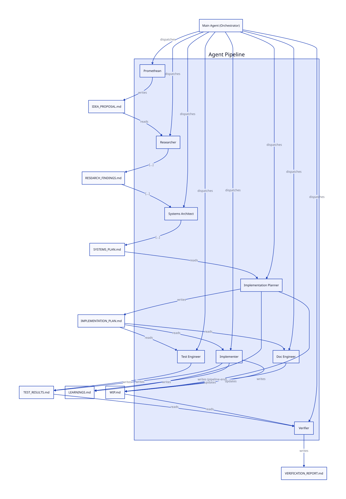
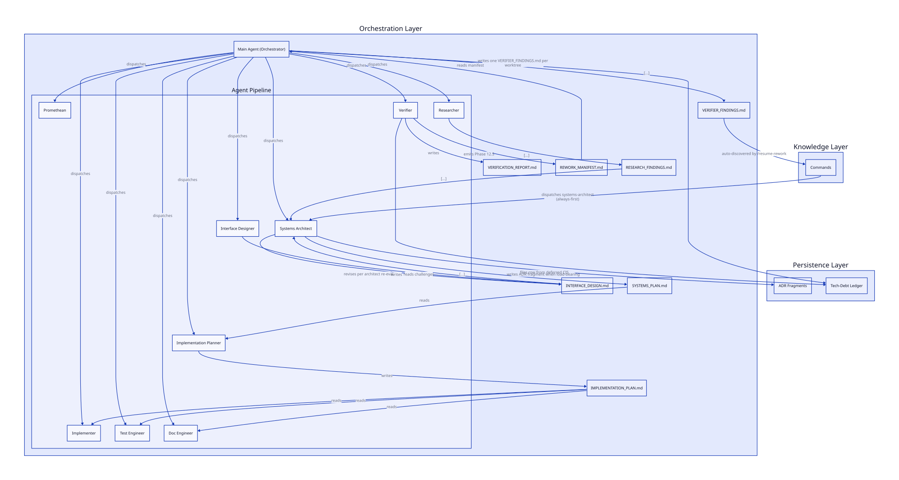

# Architecture Guide

<!-- Developer navigation guide. Every component name and file path in this document has been
     verified against the codebase. Only components that exist on disk are included.
     For design rationale, planned components, and architectural evolution, see .ai-state/DESIGN.md.
     Maintained by pipeline agents: created by systems-architect, updated by implementer,
     verified by doc-engineer at pipeline checkpoints.
     See skills/software-planning/references/architecture-documentation.md for the full methodology. -->

## 1. Overview

<!-- OWNER: doc-engineer (verification) | LAST UPDATED: 2026-04-28 (deduplicated — system attributes live in the architect doc; this section provides developer orientation only) -->

| Attribute | Value |
|-----------|-------|
| **System** | Praxion |
| **Last verified against code** | 2026-09-03 — §3 new Sidecar placement row (`scripts/_state_repo.py` + 14 `_sidecar_*.py` siblings + `scripts/praxion-sidecar` + `scripts/onboard_placement.sh` + two sidecar hooks, all verified present on disk; Scripts row Key Files updated); 2026-07-31 — §4 Draft ADR lifecycle row (finalize staging invariant: `_rename` `git add`s the promoted path after `git mv`; gate + `--staged` wiring verified on disk), reproduction executed against a throwaway repo, full local suite green — 2077 passed, 1 skipped; 2026-07-28 — §3 new Self-Healing Loop — Label Taxonomy Manifest + Reconciler row (`.github/labels.yml` + hub/caller reconciler + fleet templates + onboard/upgrade wiring, resolves #52, `dec-294`), full suite green — 558 passed; 2026-07-28 — §3 Self-Healing Loop — Cross-Model INTAKE Gate row (new: `.github/workflows/issue-intake-assessment.yml`) + Cross-Model Review Gate row (PROJECT-PRISM base-ref retrofit), full workflow-invariant + policy-schema suites green; 2026-07-28 — §3 Self-Healing Loop — Installable Core row (fixer hardening: `continue-on-error` + non-agent finalize/decline step, policy-gated JS/TS `js_test_runner` enum + `js_project_dir` prefix, full structural suite green — 62 tests); 2026-07-24 — §3 Self-Healing Loop — Praxion Issue Autofix row (P5 shipped: `.github/workflows/issue-autofix.yml` + `scripts/praxion_feedback/issue_triage.py`, full workflow-invariant suite green); 2026-07-22 — §3 Self-Healing Loop — Installable Core row (P1 shipped: hub reusable workflow + caller #1 + project-baseline templates + onboarding sub-step 8e.8); 2026-07-16 — §3 Observability-log row (skill_activation event + verified reconciler consumers) and new Eval-ledger-producer row; 2026-07-01 — §3 Pipeline Dashboard row (renderer registry + Diátaxis shells + per-artifact renderers); test-topology M2 — §9 agent wiring verified 2026-05-19; other sections last verified 2026-05-12 |

This document is the **developer-facing** navigation guide: every component, file path, and interface listed here exists on disk and resolves at the cited path. It is the code-verified subset of [`.ai-state/DESIGN.md`](../.ai-state/DESIGN.md), which is the design-target architect-facing document. Use this guide to navigate the codebase; consult the architect doc for system attributes (type, language, pattern), design rationale, planned components, and architectural evolution.

## 2. System Context

<!-- OWNER: doc-engineer (verification) | LAST UPDATED: 2026-04-28 (deduplicated — L0 diagram is byte-identical to architect doc) -->

The system-boundary L0 diagram is rendered in [`.ai-state/DESIGN.md` §2](../.ai-state/DESIGN.md#2-system-context). External actors: Developer, Claude Code, Claude Desktop, Cursor, Arize Phoenix, GitHub.

> **Component detail:** [Components](#3-components)

## 3. Components

<!-- OWNER: implementer (as-built), doc-engineer (verification) | LAST UPDATED: 2026-08-04 by orchestrator (split into 3a structural components / 3b capabilities, mirroring .ai-state/DESIGN.md §3; 3a is the code-verified subset of that doc's 3a) -->
<!-- L1 diagram: major building blocks and their relationships.
     Every component listed here MUST exist on disk — verify with ls/Glob before including.
     Source: docs/diagrams/architecture/src/architecture.c4 | Generated: docs/diagrams/architecture/rendered/components.d2
     Regen: likec4 gen d2 docs/diagrams/ -o docs/diagrams/architecture/ && d2 docs/diagrams/architecture/rendered/components.d2 docs/diagrams/architecture/rendered/components.svg -->

*LikeC4 source: [`docs/diagrams/architecture/src/architecture.c4`](diagrams/architecture/src/architecture.c4). The pre-commit hook (`scripts/diagram-regen-hook.sh`) regenerates the SVG above when the source changes.*

Two-tier, mirroring [`.ai-state/DESIGN.md` §3](../.ai-state/DESIGN.md#3-components). **§3a** is
the structural building blocks, each corresponding to a `component` element in the LikeC4 model
above. **§3b** is capabilities — cross-cutting features composed from those blocks, owning no
single directory and no model element. Both remain code-verified: every name and path here
resolves on disk. The split is what allows 3a to be reconciled against the model mechanically
while 3b stays a narrative feature log.

### 3a. Structural components

<!-- Every row corresponds to a `component` element in architecture.c4 AND exists on disk. -->

| Component | Responsibility | Key Files |
|-----------|---------------|-----------|
| Skills | Delivers domain expertise via progressive disclosure (metadata at startup, body on activation, references on demand). 51 skills on disk (2026-06-18); recent additions: `llm-prompt-engineering`, `ml-training`, `llm-training-eval`, `neo-cloud-abstraction`, `experiment-tracking`, `web-ui-design`, `tui-design`, `agentic-interface-design`, `api-design-craft`, `agentic-transactions`, `multi-perspective-analysis` | `skills/*/SKILL.md`, `skills/*/references/`, `skills/llm-prompt-engineering/`, `skills/ml-training/`, `skills/llm-training-eval/`, `skills/neo-cloud-abstraction/`, `skills/experiment-tracking/`, `skills/web-ui-design/`, `skills/tui-design/`, `skills/agentic-interface-design/`, `skills/api-design-craft/`, `skills/agentic-transactions/`, `skills/multi-perspective-analysis/` |
| Agent runtime / Pipeline | Runs the **runtime** side of agents: spawned subprocesses each in their own context window, executing definitions from the Knowledge layer. Coordinates through shared `.ai-work/<task-slug>/` documents and persists to `.ai-state/`. This row is the Orchestration-layer counterpart to the "Agents (authored definitions)" Knowledge row below — see the dual-representation note. Receives skill / rule / command / agent injection from the Knowledge layer and lifecycle enforcement from Hooks | `.ai-work/<task-slug>/`, agent-spawning protocol in `rules/swe/swe-agent-coordination-protocol.md` |
| Rules | Two-channel delivery, discriminated by frontmatter rather than by a count: rules carrying `install: symlink` (or no `install:` key) are symlinked into `~/.claude/rules/`; rules carrying `install: hook-deliver` are injected at SessionStart by `inject_rules.py`. Orthogonally, `paths:` scopes a rule to matching files and its absence makes the rule always-loaded. Counts are deliberately omitted — they drift on the next rule added; derive them from the filesystem (`grep -L '^paths:' rules/**/*.md`). Per-project `.claude/praxion-rules.yaml` disable list reaches both channels uniformly — hook-deliver rules filtered from `additionalContext`; symlinked rules suppressed via `claudeMdExcludes` reconciliation into `.claude/settings.json`. Core rules remain non-disableable. Manifest-driven taxonomy via auto-generated `rules/_manifest.yaml`. ML-specific rules added under `rules/ml/` (ai-training-onramp v1) | `rules/swe/`, `rules/writing/`, `rules/ml/`, `rules/_manifest.yaml`, `hooks/inject_rules.py`, `scripts/regenerate_rules_manifest.py`, `docs/rules-taxonomy.md` |
| Commands | Exposes user-invoked slash commands for repeatable workflows; ai-training-onramp v1 added `/run-experiment` and `/check-experiment` | `commands/*.md`, `commands/run-experiment.md`, `commands/check-experiment.md` |
| Agents (authored definitions) | The `.md` family on disk under `agents/` — peer authoring surface to skills/rules/commands. Each file is a subprocess *specification* (system prompt, tool/skill access, model tier) that installers deploy alongside the other Knowledge-layer surfaces. 17 agents on disk (2026-07-30); recent additions: `interface-designer` (interface-layer design specialist, peers with systems-architect for UI/API/MCP surface decisions), `agentic-transactions-architect` (transaction-domain expert, shadow + on-demand sub-architect for agentic payments/trading), `discipline-consultant` (discipline-parameterized adversarial consultant, gated peer sub-architect for multi-perspective deliberation). Distinguished from the Orchestration-layer "Agent runtime / Pipeline" row above — Praxion's LikeC4 model dual-represents these two axes; see `.ai-state/DESIGN.md` §3 for the rationale | `agents/*.md`, `agents/interface-designer.md`, `agents/agentic-transactions-architect.md`, `agents/discipline-consultant.md` |
| Hooks | Executes Python/shell scripts on Claude Code lifecycle events for enforcement and observability | `hooks/*.py`, `hooks/*.sh`, `hooks/hooks.json` |
| Chronograph MCP | Provides agent pipeline observability via OpenTelemetry spans | `task-chronograph-mcp/src/task_chronograph_mcp/` |
| `.ai-state/` | Holds persistent project intelligence: ADRs, specs, sentinel reports, architecture docs, observability log | `.ai-state/decisions/`, `.ai-state/observations.jsonl` |
| `.ai-work/` | Contains ephemeral pipeline documents scoped by task slug | `.ai-work/<task-slug>/` |
| Installers | Deploys target-specific configurations (Claude Code, Claude Desktop, Cursor) | `install.sh`, `install_claude.sh`, `install_cursor.sh` |
| Scripts | Provides developer tooling: worktree management, merge drivers, daemon control. Includes the `praxion-sidecar` CLI family for state placement (§3b Sidecar placement row) | `scripts/`, `scripts/_state_repo.py`, `scripts/praxion-sidecar`, `scripts/onboard_placement.sh` |
| Tech-debt ledger | Living `.ai-state/TECH_DEBT_LEDGER.md` + `TECH_DEBT_RESOLVED.md` pair — one Markdown table per file with stable `td-NNN` IDs and a schema of 14 row fields + structural `dedup_key`. Producers: verifier (per-change Phase 5/5.5 writes) and sentinel (repo-wide TD dimension TD01–TD04 writes; TD05 audits only). Consumers: five existing agents (`systems-architect`, `implementation-planner`, `implementer`, `test-engineer`, `doc-engineer`) read the ledger, filter by their `owner-role`, and update `status` in place — framed as permission-not-obligation, not a mandate. Promethean, roadmap-cartographer, `/project-metrics`, and `/project-coverage` are signal sources only and never write ledger rows. Notes-merge separator is ` // ` (chosen to avoid collision with the Markdown table column delimiter `\|`). Worktree concurrency handled by append-only convention plus a post-merge dedupe step (`scripts/finalize_tech_debt_ledger.py`, modeled on `scripts/finalize_adrs.py`; chained into `scripts/git-finalize-hook.sh` after `finalize_adrs.py`). Schema, owner-role heuristic, and worktree-merge dedupe semantics are canonical in `skills/software-planning/references/tech-debt-ledger.md`; design rationale lives in the draft ADRs under `.ai-state/decisions/drafts/` (promoted to stable `dec-NNN` at merge-to-main; see `.ai-state/decisions/DECISIONS_INDEX.md`). Ledger file exists on disk (empty header-only at first producer write); producer wiring (`agents/verifier.md` Phase 5/5.5 + `agents/sentinel.md` TD dimension), consumer contracts (single-line input on the five reader agents), and template migration (`## Technical Debt` removed from `skills/software-planning/references/document-templates.md`) all landed in the tech-debt-integration pipeline | `.ai-state/TECH_DEBT_LEDGER.md`, `rules/swe/agent-intermediate-documents.md`, `scripts/finalize_tech_debt_ledger.py`, `scripts/git-finalize-hook.sh`, `agents/verifier.md`, `agents/sentinel.md`, `agents/{systems-architect,implementation-planner,implementer,test-engineer,doc-engineer}.md`, `skills/software-planning/references/document-templates.md` |
| Pipeline Dashboard | Next.js App Router + TypeScript dashboard service providing the per-project visual entry point. Seven surfaces (Architecture / Workshops / ADRs / Sentinel / Roadmap / Metrics / Documentation) read `.ai-state/`, `.ai-work/<task-slug>/`, and selected project-root surfaces directly — no new persistence layer; read-only by design. Served through `scripts/praxion-dashboard` with deterministic per-project ports and a user-scoped Node home under `~/.praxion-dashboard/`. Redesign layer: interactive SVG diagram viewer (pan/zoom, `usePanZoom`), ADR relationship graph and workshop step DAG (`DecisionGraph`), recharts trend charts (`TrendChart`, `Sparkline`), server-side SVG sanitization (`sanitize-html`), `/api/diagram` route handler streaming allowlisted project-root SVGs. Diátaxis-typed renderer registry — `resolveRenderer(renderer?, diataxis?, contentType?)` keys on the manifest `renderer:` field first (highest priority), then `diataxis`, then `contentType`, falling back to `DefaultShell`; every existing call site kept working once updated to pass the new leading, optional argument. Six Diátaxis shells (`ReferenceShell`, `ExplanationShell`, `DefaultShell`, `TutorialShell`, `HowToShell`, `ConceptsShell` — the latter three are dedicated components, not `DefaultShell` aliases) plus an `api_reference` shell embedding vendored Scalar over OpenAPI/AsyncAPI/GraphQL specs auto-discovered by `build_doc_manifest.py` (dispatched via a `renderMode: "api"` branch that routes by `renderer` regardless of `type`). Five per-artifact renderers live in `src/components/renderers/` (`MetricsViewRenderer`, `PlanViewRenderer`, `VerificationReportRenderer`, `IdeaGridRenderer`, `ArchitectureExplorerRenderer`), each reached solely by the manifest `renderer:` key and each falling back to `DefaultShell` on malformed/absent input; `metrics_view` and `architecture_explorer` are thin Pathway-B previews reached through the documentation page, distinct from the existing Pathway-A full pages (`/metrics`, `/architecture`). No change to `src/server/view-models/documentation.ts` was required (draft ADR `dec-265`). CSS is split into six cascade-ordered layer files — `globals.css` is now an `@import` manifest of `tokens.css` / `base.css` / `app-chrome.css` / `surfaces.css` / `widgets.css` / `pages-and-viz.css` (td-030). Replaced an earlier Streamlit prototype (`streamlit_app/`, removed in commit `313a50e`). | `dashboard_app/` (incl. `src/app/{globals,tokens,base,app-chrome,surfaces,widgets,pages-and-viz}.css`, `src/app/api/diagram/route.ts`, `src/app/documentation/page.tsx`, `src/components/viz/`, `src/components/shells/` (`tutorial.tsx`, `how-to.tsx`, `concepts.tsx`), `src/components/renderers/` (`metrics-view.tsx`, `plan-view.tsx`, `verification-report.tsx`, `idea-grid.tsx`, `architecture-explorer.tsx`), `src/components/chrome/`, `src/components/registry.ts`, `src/server/diagrams/`, `src/server/aac/`, `src/server/sentinel/`), `scripts/praxion-dashboard`, `commands/dashboard.md` |
| Eval framework | Out-of-band quality evaluation through a single `/eval-praxion` entrypoint (CLI `praxion-evals`): `--task-slug <slug>` adds the in-flight artifact-manifest scan over `.ai-work/<slug>/`, `--mechanical-only` runs the free, auth-less structural surface via a `NullJudgeClient` sentinel. The `harness/` sub-package runs Family 1 (pipeline-outcome fidelity: ADR structure, supersession reciprocity, traceability, option-depth substantiveness via LLM) and Family 2 (behavioral-contract adherence: reads `VERIFICATION_REPORT.md`, judges the four-behavior rubric via LLM). A single `JudgeClient` adapter encapsulates the auth-mode seam (`CLAUDE_CODE_OAUTH_TOKEN` → Agent SDK; `ANTHROPIC_API_KEY` → Messages API); family code never imports SDKs directly. The Agent SDK route is bounded and guarded: `AgentSdkJudgeClient.__init__()` refuses construction (three-part `RuntimeError`) when `CLAUDECODE=1` (nested-Claude-Code-session deadlock, SDK issue #573); `AgentSdkJudgeClient.judge()` enforces a 120 s ceiling via `asyncio.wait_for`, with an `API_TIMEOUT_MS` defense-in-depth on the subprocess. The orchestrator emits per-family and per-LLM-check progress via `print(..., flush=True)`. The `eval/` package is in the CI matrix alongside `task-chronograph-mcp`. Reports land in `.ai-state/praxion_eval_reports/` with an append-only log. The `regression/` sub-package was retired (448 LOC, broken-by-design per td-005). The standalone `/eval` command and the `behavioral/` sub-package were collapsed into Family 1 in commit `b42cc59` (breaking, no shim); the manifest scan now lives in `harness/task_manifest.py`, and the only remaining sibling sub-package is `stubs/`, holding the deferred cost and decision-quality family sentinels. Invocation is strictly out-of-band per dec-040 clause 1 and 2; dec-204 narrows clause 3 to allow LLM-as-judge calls over completed artifacts; dec-206 re-affirms dec-204 and adds the refusal/bounding behavior. | `eval/src/praxion_evals/harness/` (`schemas.py`, `judge_client.py`, `corpus_reader.py`, `orchestrator.py`, `cli.py`, `report_writer.py`, `task_manifest.py`, `families/family1_pipeline_fidelity.py`, `families/family2_bc_adherence.py`), `eval/src/praxion_evals/stubs/`, `commands/eval-praxion.md`, `.ai-state/praxion_eval_reports/`, `.github/workflows/test.yml` |
| ADR fragments | Holds draft ADRs written by in-flight pipelines under `.ai-state/decisions/drafts/`, promoted to stable `dec-NNN` records at merge-to-main by `scripts/finalize_adrs.py` (chained from `scripts/git-finalize-hook.sh`). Modelled separately from `.ai-state/` because the promotion lifecycle is an enforced edge, not a storage detail: the pipeline writes fragments, finalize renames them and rewrites `dec-draft-<hash>` cross-references over a bounded walk scope, and only then do they join the durable record indexed by `.ai-state/decisions/DECISIONS_INDEX.md` | `.ai-state/decisions/drafts/`, `scripts/finalize_adrs.py`, `scripts/git-finalize-hook.sh`, `.ai-state/decisions/DECISIONS_INDEX.md`, `rules/swe/adr-conventions.md` |
| Versioning | Drives the Commitizen SemVer release flow: conventional-commit parsing, version-file synchronisation across `.claude-plugin/plugin.json` and `pyproject.toml`, changelog generation, and the release tag that marketplace installs resolve against. Configuration lives in `pyproject.toml` under `[tool.commitizen]` — there is no standalone `.cz.toml` | `pyproject.toml` (`[tool.commitizen]`), `commands/release.md`, `skills/versioning/`, `CHANGELOG.md`, `.claude-plugin/plugin.json` |

### 3b. Capabilities

<!-- Composed from 3a's building blocks; no model element. Still code-verified. -->

| Capability | Responsibility | Key Files |
|-----------|---------------|-----------|
| multi-perspective-analysis skill | Thin composition-layer skill for structured multi-perspective deliberation: calibrated-confidence schema (verbal+numeric anchors, GRADE downgrade factors), lens-independence discipline, heterogeneous Haiku-proposer/Opus-aggregator orchestration, two-tier disconfirmation. HARD-gated to high-stakes stages. Consumed by `researcher`, `systems-architect`, `roadmap-cartographer`, and `verifier` | `skills/multi-perspective-analysis/SKILL.md`, `skills/multi-perspective-analysis/references/calibrated-confidence.md`, `skills/multi-perspective-analysis/references/lens-independence.md`, `skills/multi-perspective-analysis/references/heterogeneous-orchestration.md`, `skills/multi-perspective-analysis/references/disconfirmation-tiers.md` |
| Polyglot Skills (TypeScript / Node) | Language-agnostic skill bodies with per-language `contexts/<language>.md` (and `references/<language>.md` for some skills), formalized by the polyglot skill template ADR at `.ai-state/decisions/<NNN>-polyglot-skill-template.md`. Covers Python and TypeScript (Node.js, React, Vue). Two satellite directories per polyglot skill: `references/` for language-agnostic conceptual depth, `contexts/` for runnable language-specific mechanics. Frontend-framework nesting (React, Vue) layers above `contexts/typescript.md` inside the language-rooted `typescript-development` skill. Cross-skill version conflicts (e.g., Zod v3/v4) housed in `node-prj-mgmt`. | `skills/node-prj-mgmt/` (with `contexts/typescript.md`), `skills/typescript-development/` (with `contexts/typescript.md`, `contexts/react.md`, `contexts/vue.md`), `skills/architectural-fitness-functions/contexts/typescript.md`, `skills/deployment/contexts/typescript.md`, `skills/mcp-crafting/contexts/typescript.md`, `skills/software-planning/contexts/typescript.md`, `skills/agent-evals/references/typescript.md`, `skills/test-coverage/references/typescript.md` |
| Praxion-as-first-class enforcement | Three-layer enforcement that carries Praxion's behavioral contract to every subagent including host-native ones. `inject_subagent_context.py` fires on PreToolUse(Agent\|Task) and prepends a compact preamble to every subagent prompt via `updatedInput.prompt`. `inject_process_framing.py` fires on UserPromptSubmit and emits a compact `additionalContext` reminder for non-trivial prompts in Praxion projects. Both hooks fast-skip on absent `.ai-state/` and opt-out env vars, exiting 0 unconditionally on any error | `hooks/inject_subagent_context.py`, `hooks/inject_process_framing.py`, `hooks/hooks.json` |
| Install-path completeness | First-session auto-completion that converges marketplace-only installs on the same end state as clone installs. `auto_complete_install.py` fires on SessionStart, checks for missing global surfaces, and runs the completion logic using git-config defaults or an interactive prompt with 30-second timeout-accept. Idempotent — fast-skips in <50 ms after the first successful run via a marker file. `render_claude_md.py` provides the shared template-substitution helper used by both the install scripts and this hook | `hooks/auto_complete_install.py`, `scripts/render_claude_md.py`, `hooks/hooks.json` |
| Observability log | Append-only capture of tool/session events by the `capture_*` hooks. Event types: `tool_use`, `session_start/stop`, `agent_start/stop`, `context_surface_measurement`, and `skill_activation` — the first-class skill-usage event carrying a `skill_name` field, emitted by `capture_memory.py`'s `Skill`-tool branch (`build_observation()`). Consumed by `reconcile_pipeline_state.py` (recovery localization hint) and post-merge dedup (`reconcile_ai_state.py`) | `.ai-state/observations.jsonl`, `hooks/capture_memory.py`, `hooks/capture_session.py` |
| Eval-ledger producer | Appends one 11-column row per kept eval run to the managed-project eval ledger via the stdlib helper `append_eval_log_row(project_root, row_fields)`: creates `.ai-state/eval_ledger/` + the canonical header on first write, appends-only thereafter, validates all 11 schema columns before any write (ValueError names missing fields), and truncates `prompt_hash`/`dataset_sha`/`git_sha` to their documented short prefixes. Lifecycle `optional-lazy` — absence means the project ran no eval loop. Distinct from Praxion's own self-eval log (`.ai-state/praxion_eval_reports/`) | `skills/agent-evals/scripts/append_eval_log.py`, `.ai-state/eval_ledger/EVAL_LOG.md`, `skills/agent-evals/references/run-ledger-schema.md` |
| Pipeline Recovery Loop | Verifies pipeline step-completion against ground truth so a subagent truncated at its context ceiling cannot advance the pipeline on a false `[COMPLETE]`. `reconcile_pipeline_state.py` reads `WIP.md` claims, the `observations.jsonl` WAL (localization hint), and `git diff` + `TEST_RESULTS.md`, emitting per-step verdicts (`verified-complete` / `mismatch` / `partial` / `in-flight` / `unknown` / `pending`); `/resume-pipeline` auto-marks verified work, auto-resumes partials scoped to the unfinished remainder, and surfaces the ambiguous — every auto-action recorded in five audit surfaces incl. `.ai-work/<task-slug>/RECOVERY_LOG.md`. Tier-1 (git+tests) is the arbiter; the WAL only localizes (degrades to `unknown`, never a guessed verdict). The 4th pipeline feedback loop (alongside Verifier-Rework / CIS / Skill-Genesis) | `scripts/reconcile_pipeline_state.py`, `commands/resume-pipeline.md`, `skills/software-planning/references/agent-pipeline-details.md`, `rules/swe/swe-agent-coordination-protocol.md`, `agents/implementer.md` |
| Artifact registry | The single source of truth for the `.ai-work/<slug>/` artifact set: a typed `ARTIFACTS` tuple whose projection helpers the three hard-coded consumer lists are checked against by `scripts/test_artifact_registry.py` (drift gate + gate-liveness canaries). Each `Artifact` declares a `production_gate` (`"<kind>:<ref>"`, kind ∈ `_GATE_KINDS`) naming the gate that makes it exist, a `detection_gate` (`"sentinel:<id>"`, kind ∈ `_DETECTION_GATE_KINDS`) naming the sentinel check that detects its absence, and a `cleanup_policy` (∈ `_CLEANUP_POLICIES`) governing its removal. `production_gate`/`detection_gate` are populated but not consumer-read (validated only by the registry's self-consistency tests); `cleanup_policy` is read by `clean_work_safety` via `cleanup_policy_for()` as the file→severity-class source that drives `/clean-work` deletion verdicts (dec-259). The consumer drift assertions read none of these fields. | `scripts/artifact_registry.py`, `scripts/test_artifact_registry.py` |
| Project onboarding | One phase engine behind one user-invocable skill (`skills/onboard-project/`, `disable-model-invocation: true`, invoked `/praxion:onboard-project`) and one entry script (`scripts/onboard-project`, absorbing the former `new_project.sh`). Four entry modes — `new` / `existing` / `hackathon` / `promote` — parameterize which phases run; phase identifiers (`0.5, 1–7, 5b, 6, 7, 8, 8b–8e, 9`, plus `0s`/`5b.t`) stay verbatim so every `Phase N` citation elsewhere in this document stays valid, while everything user-facing speaks capability IDs (`core`, `arch`, `quality`, `ci`, `aac`, `ml`, `obsidian`, `observability`) joined to phases by one table in `SKILL.md`. `new` mode scaffolds an empty directory and hands off to the seed pipeline (default Python + `uv` + Claude Agent SDK + FastAPI app, per-run `onboarding_for_mushi_busy_ppl.md`); `existing` mode retrofits an already-populated repo (`.gitignore` block, `.ai-state/` skeleton, `.gitattributes` + merge driver, git hooks, `.claude/settings.json` toggles, `CLAUDE.md` blocks, opt-in architecture/quality/CI/AaC/ML/Obsidian tiers); `hackathon` installs six minimal-ceremony artifacts; `promote` (`--full`) tears them down and runs the full phase set. Three gates total (`G1` mode-confirm, `G2` build-intent, `G3` capability Profile) replace the former 25 pacing fires. See [docs/onboarding.md](onboarding.md) for the user-facing guide | `skills/onboard-project/{SKILL.md,references/{detection,phases-core,phases-optional,claude-md-blocks,seed-pipeline,shared-procedures}.md}`, `scripts/onboard-project`, `docs/onboarding.md`, `tests/onboard_project_test.sh` |
| Canonical block refresh mechanism | Makes onboarded `CLAUDE.md` canonical blocks safely refreshable in managed projects. Manifest-only version identity: `scripts/sync_canonical_blocks.py --write-history` derives a deterministic historical-hash manifest (`claude/canonical-blocks/block-history.json`) from the canonical files' git history, pre-commit-gated by `--check-history`; the shared module `scripts/canonical_block_identity.py` owns the single normalize/hash + `REFRESHABLE_SLUGS` boundary (four unconditional blocks) imported by both producer and consumer. The consumer script `scripts/refresh_claude_blocks.py` (plugin-path-resolved, self-onboard-guarded, no git at consumer sites) resolves its write target through the project's state placement — the tracked `CLAUDE.md` at repo root in-repo, or the manifest's `block_target()` (the shadowed `.praxion/CLAUDE.local.md`) under sidecar placement, so a sidecar-placed project's blocks land where the team's tracked file stays byte-identical — then classifies each live block `absent`/`current`/`stale`/`modified` and in `--apply` mode appends absent, replaces stale in place, and refuses to clobber modified blocks (unified diff + pointer). `/refresh-claude-blocks` drives the interactive Replace/Keep/Skip disposition for modified blocks; `skills/onboard-project/`'s Phase 6 delegates to the script in apply mode; `new`-mode's seed pipeline intentionally carries no refresh logic (greenfield is first-run-only). Zero always-loaded token cost in managed projects | `scripts/canonical_block_identity.py`, `scripts/refresh_claude_blocks.py`, `scripts/sync_canonical_blocks.py`, `claude/canonical-blocks/block-history.json`, `commands/refresh-claude-blocks.md`, `skills/onboard-project/references/phases-core.md`, `scripts/test_refresh_claude_blocks.py`, `scripts/test_canonical_block_identity.py`, `.pre-commit-config.yaml` |
| Concurrency & collaboration model | Unifies multi-worktree and multi-user coordination around shared primitives: fragment-named draft ADRs under `.ai-state/decisions/drafts/<YYYYMMDD-HHMM>-<user>-<branch>-<slug>.md` promoted to `<NNN>-<slug>.md` at merge-to-main, unified worktree home at `.claude/worktrees/`, two-layer squash-merge safety (command refuse + post-merge warn), opt-in auto-memory orphan cleanup. Post-merge hook runs reconcile → finalize → squash-safety in that order | `scripts/finalize_adrs.py`, `scripts/check_squash_safety.py`, `scripts/migrate_worktree_home.sh`, `scripts/git-finalize-hook.sh`, `commands/clean-auto-memory.md`, `commands/create-worktree.md`, `commands/merge-worktree.md`, `rules/swe/vcs/pr-conventions.md`, `rules/swe/adr-conventions.md`, `.ai-state/decisions/drafts/` |
| Project metrics command | `/project-metrics` slash command computes curated complexity/health metrics (SLOC, CCN, cognitive complexity, cyclic deps, churn, entropy, truck factor, hotspots, coverage) on any Praxion-onboarded repo. Two-tier collector plugin architecture: Tier 0 universal (`git` + stdlib, optional `scc`) and Tier 1 Python (`lizard` / `complexipy` / `pydeps` / `coverage.py` artifact parse) for v1. Produces a per-run JSON+MD artifact pair under `.ai-state/metrics_reports/METRICS_REPORT_YYYY-MM-DD_HH-MM-SS.{json,md}` plus an append-only sibling `.ai-state/metrics_reports/METRICS_LOG.md`. Frozen aggregate-block column contract; graceful degradation with uniform skip markers when optional tools are absent. Draft ADRs under `.ai-state/decisions/drafts/` carry the design rationale (storage-schema-for-project-metrics, collector-protocol, graceful-degradation-policy, hotspot-formula) and finalize to stable NNN at merge-to-main | `commands/project-metrics.md`, `scripts/project_metrics/` (package: `cli.py`, `schema.py`, `runner.py`, `hotspot.py`, `trends.py`, `report.py`, `logappend.py`, `collectors/` with six collectors), `scripts/project_metrics/tests/` (16 test modules + `build_fixtures.py`-generated fixture repos), `docs/metrics/README.md` (complete JSON schema reference) |
| Agent Readiness | Default-on readiness engine embedded in `/project-metrics`. `ReadinessCollector` scores a project against 8 Factory pillars × 5 maturity levels × 80%-per-level gate + a separate Pillar 9 Manageability sub-score. Emits a `readiness` block in the metrics JSON (`schema_version 1.1.0`). 25 criteria are mechanical (deterministic filesystem checks); 4 LLM-judged criteria (`naming_conventions`, `test_quality`, `readme_quality`, `docs_agent_friendliness`) use a stdlib-`urllib` Anthropic Messages API call with no `anthropic` SDK import and no subprocess. LLM criteria degrade gracefully (`llm_skipped`) when no auth is present; `--mechanical-only` skips LLM entirely; `--require-readiness-ai` hard-fails if LLM tier cannot run. The `enrich_readiness()` step in `cli.py` runs outside the deterministic collect pass to preserve `collect()` byte-identity. Dashboard renders an Agent Readiness section (level badge, 8-pillar radar, Pillar-9 chip, failing criteria list). The `agent-readiness` skill documents rubric interpretation and remediation. | `scripts/project_metrics/collectors/readiness/` (`criteria.py`, `checks.py`, `score.py`, `judge.py`), `scripts/project_metrics/collectors/readiness_collector.py`, `scripts/project_metrics/cli.py` (`enrich_readiness()`), `dashboard_app/src/components/readiness-section.tsx`, `dashboard_app/src/lib/metrics.ts`, `dashboard_app/src/server/view-models/metrics.ts`, `skills/agent-readiness/SKILL.md`, `skills/agent-readiness/references/rubric.md` |
| ML training subsystem (v1) | Skill set, rules, and command extensions for managing ML/AI pre-training projects — Praxion's third project archetype. **Skills**: `ml-training` (pre-training conventions, distributed training, operational modes A/B/C), `llm-training-eval` (eval methodology, val_bpb/perplexity, `TRAINING_RESULTS.md` schema), `experiment-tracking` (MLflow / W&B / Aim conventions; distinct from app observability). **Reference extensions**: `gpu-compute-budgeting` under `deployment`; `ml-experiment-ci` under `cicd`. **Rules**: `rules/ml/eval-driven-verification.md`, `rules/ml/gpu-budget-conventions.md`, `rules/ml/experiment-tracking-conventions.md` (all three path-scoped — every `rules/ml/` rule carries `paths:` and `core: false`). **Rule extensions**: determinism waiver in `rules/swe/testing-conventions.md`; experiment-mode addendum in `rules/swe/vcs/git-conventions.md`. **Agent extensions**: verifier Phase 3a (eval-aware sub-branch); cicd-engineer ML detection step. **Commands**: `/run-experiment`, `/check-experiment`. **Command extension**: `/onboard-project` Phase 8c (ML detection + scaffold). **Artifact categories**: `program.md` (project-local meta-prompt) and `TRAINING_RESULTS.md` (training run result, archival to `.ai-state/training_runs/`) | `skills/ml-training/SKILL.md`, `skills/llm-training-eval/SKILL.md`, `skills/experiment-tracking/SKILL.md`, `skills/deployment/references/gpu-compute-budgeting.md`, `skills/cicd/references/ml-experiment-ci.md`, `rules/ml/eval-driven-verification.md`, `rules/ml/gpu-budget-conventions.md`, `rules/ml/experiment-tracking-conventions.md`, `commands/run-experiment.md`, `commands/check-experiment.md`, `agents/verifier.md` (Phase 3a), `agents/cicd-engineer.md` (ML detection step) |
| Neo-cloud abstraction | Mode-invariant abstraction surface for ML training compute lifecycle. Defines `training_job_descriptor` schema (shared across modes A/B/C; no `mode:` field — backend inferred from project config) and 8 lifecycle operations (create, start, status, log_stream, cancel, artifact_fetch, list, pricing_query). Tiered backend strategy: local default (modes A/B), SkyPilot 0.12.1 default-remote (mode C, 20+ providers), RunPod direct adapter v1 reference | `skills/neo-cloud-abstraction/SKILL.md`, `skills/neo-cloud-abstraction/references/local-backend.md`, `skills/neo-cloud-abstraction/references/skypilot-backend.md`, `skills/neo-cloud-abstraction/references/runpod-direct-adapter.md` |
| Roadmap cartographer | Project-level audit-to-roadmap generator: a project-derived evaluation-lens set drives a parallel multi-lens audit, then synthesis, then user-gated `ROADMAP.md` emission for any project (deterministic / agentic / hybrid). SPIRIT is one exemplar lens set among DORA / SPACE / FAIR / CNCF Platform Maturity / Custom. Invoked via `/roadmap` (modes: fresh / diff / `<focus-area>`); per `dec-092` Praxion itself does not carry a living `ROADMAP.md` instance — the cartographer regenerates on demand | `agents/roadmap-cartographer.md`, `skills/roadmap-synthesis/`, `commands/roadmap.md` |
| Agentic-Transactions onboarding capability | Praxion-internal capability for onboarding managed projects onto the agentic-transactions stack (agentic payments Space A + agentic trading Space B). Agent `agentic-transactions-architect` shadows researcher + systems-architect when payments/trading are in scope, owns mandate models / settlement finality / broker ToS / HITL spend-gating, emits `TRANSACTIONS_DESIGN.md` with `## Architecture Challenges`, registered in `plugin.json` (17 agents), H/`opus` tier. Skill `agentic-transactions` delivers a language-independent `Provider` contract (two-space decision rubric, six core verbs, `TransactionError` grammar, `rail_detail`/`venue_detail` extension) in the body with per-provider specifics in `references/`: `robinhood.md` (v1, MCP transport, `supports_sandbox: false`, HITL interceptor + capital-segregated budget mandate as real-money guardrails), `provider-contract.md` (formal spec + Python binding sketch), `_provider-template.md` (blank-slate for future providers). Praxion-internal; nothing ships into managed projects; `/onboard-project` has opt-in discoverability mention only | `agents/agentic-transactions-architect.md`, `skills/agentic-transactions/SKILL.md`, `skills/agentic-transactions/references/provider-contract.md`, `skills/agentic-transactions/references/robinhood.md`, `skills/agentic-transactions/references/_provider-template.md` |
| Discipline-Consultant framework | Gated peer sub-architect for structured multi-perspective deliberation. Agent `discipline-consultant` is parameterized at spawn time by a `Discipline: <name>` directive resolved against the data-only roster in `skills/multi-perspective-analysis/references/discipline-registry.md`; writes falsifiable, decision-naming challenges to `.ai-work/<task-slug>/CONSULT_<discipline>.md` for per-challenge orchestrator disposition (`switch-now` / `defer-with-rationale` / `dismiss-with-rationale`). Adversarial-only: challenges existing knowledge, never decides or authors production code; one disposition `.ai-state/CONSULT_LEDGER.md` row per challenge. Registry (`discipline-registry.md`) is the complete roster — no new discipline without a registry row. Binds each discipline to a skill loaded at runtime via the `Skill` tool — two disciplines shipped to date: `statistician` (Wave 1, bound to `applied-statistics`) and `evidence-appraiser` (Wave 2, discipline #2, bound to `evidence-appraisal`). Invoked when a signal matches a registry trigger predicate, nominated by pipeline agents citing the decision at stake, or convened by orchestrator/user. | `agents/discipline-consultant.md`, `skills/multi-perspective-analysis/SKILL.md`, `skills/multi-perspective-analysis/references/discipline-registry.md`, `skills/applied-statistics/SKILL.md`, `skills/evidence-appraisal/SKILL.md`, `.ai-state/CONSULT_LEDGER.md`, `commands/consult.md` |
| Self-Healing Loop — Installable Core (Subsystem A) | Distributes Praxion's P0 CI autofixer to managed projects as a **hub reusable workflow** (`.github/workflows/reusable-ci-autofix.yml`, `on: workflow_call`) invoked by thin, SHA-pinned per-repo callers. Each managed project installs a caller template + an `autofix-policy.yml` policy file; Praxion itself is **caller #1** (same-repo local ref; dogfoods first). All security-critical logic (log sanitization, budget cap, sensitive-path tripwire, loop prevention, no `track_progress`/`pull_request_target`) lives in the hub once; per-repo behavior is policy-sourced. Event-intrinsic values (default branch, run id, conclusion) come from `github.event` — a generalization from the P0 hardcoded `main`. Secrets pass by **explicit mapping**, never `inherit` (cross-org constraint). Onboarding installs via the `project-baseline` file-existence-idempotent pattern, records in the onboard manifest, and **prints** (never auto-injects) the secret-setup + one-time org Actions-allowlist instructions. P2 adds `reusable-cross-model-review.yml` (Cursor gate) + per-repo callers. P3a adds the `pr_checks` + `dependabot` fix-commit surfaces (new `classify` + `autofix-same-repo-pr` jobs; P5 structural containment — no git in the agent allowlist, non-agent `HEAD:<branch>` push without `--force`; PR-branch-scoped `Autofix-Attempt` cap + `autofix:declined` label + Dependabot probe-main gate) and a suggest-only `fork_prs` surface (`autofix-fork`, inverted `contents: read` privilege, never writes to an untrusted head) — additive, the main `autofix` job byte-unchanged. **P3b fleet-installs these surfaces + the P2 gate**: onboard §8e.8 installs the cross-model caller (policy-gated) alongside the ci-autofix caller for new onboards, and `/upgrade-project` (via `upgrade_project_pins.sh --hub-sha`, SHA resolved in the command layer) re-points an already-onboarded caller's pinned hub SHA in place + adds the cross-model caller if absent — edit-only-the-token, foreign/hand-edited/multi-match callers left untouched. **Hardening (Bug A + Bug B):** the `autofix-same-repo-pr` fixer step now carries `continue-on-error: true` plus a non-agent `Finalize terminal state (decline if no fix)` step, so every non-fix terminal state (crash, ambiguous exit, self-decline) converges on an idempotent decline — a bounded comment + `autofix:declined` label + a green job — rather than a stranded, red PR. A policy-gated `provider.js_test_runner` enum (`off | vitest | jest | npm-test | pnpm-test`, default `off`) lets the fixer verify a JS/TS fix: `classify` maps the enum through a hardcoded table (never a raw policy string) to a non-agent `--ignore-scripts` lockfile install and a single templated `Bash(...)` runner grant appended to the existing `--allowedTools` line; an optional `provider.js_project_dir` applies a uniform `cd <dir> &&` prefix for JS/TS projects living in a subdirectory (Praxion's own policy sets `vitest` + `dashboard_app`, dogfooding the dashboard's suite). P1 finalized: `dec-273`; P3a: `dec-286` (seam + privilege) / `dec-285` (fork suggest-only); P3b: `dec-288` (upgrade SHA-rewrite) / `dec-287` (cross-model fleet-install); hardening: `dec-290` (finalize/decline) / `dec-291` (JS/TS runner allowlist, PROCEED). | `.github/workflows/reusable-ci-autofix.yml` (hub), `.github/workflows/ci-autofix.yml` (caller #1), `.github/autofix-policy.yml` (Praxion's own policy), `claude/project-baseline/ci-autofix/{ci-autofix.yml.tmpl, autofix-policy.yml.tmpl, cross-model-review.yml.tmpl}` (templates), `skills/onboard-project/references/phases-optional.md` (install phase, 8e.8) |
| Self-Healing Loop — Cross-Model Review Gate (Subsystem A, P2) | A second-model-family, **non-generative** review gate on every agent-authored fix PR. Hub `reusable-cross-model-review.yml` (`on: workflow_call`) invoked by thin SHA-pinned `pull_request` caller. Reads `review.*` policy from `autofix-policy.yml`, resolves non-Anthropic reviewer model live via `agent --list-models` (never the fixer family, never hardcoded), fetches PR diff+body as sanitized DATA, runs Cursor headless with gate-only JSON verdict, posts verdict as PR comment. Request-changes marks PR draft but never counter-fixes. **Inverted privilege:** job has `pull-requests: write` + `contents: read` only — no write-code permissions, no git step. Fails open on any Cursor error/timeout/malformed-output (`cross-model-review:unavailable`, exit 0); misconfiguration (`reviewer_family == claude`) labeled distinct but also exits 0. Cost bounded by `timeout-minutes`. Praxion is caller #1 (dogfoods on `ci-autofix/*` PRs). **P3b fleet-installs it** — onboard §8e.8 (new onboards) + `/upgrade-project` add-caller-if-absent (already-onboarded), both policy-gated on `review.cross_model_gate != off`; the `CURSOR_API_KEY` secret is printed, never auto-injected. **PROJECT-PRISM retrofit:** a new non-agent "Fetch prism as sanitized DATA (base ref)" step reads the caller repo's own `CLAUDE.md` from the PR's **base ref** (`github.event.pull_request.base.sha`, never the head — a PR cannot mutate its own prism), sanitizes it (ANSI-strip + byte-cap) into `tmp/prism.md`, and a new `REVIEW_PROMPT` paragraph instructs the reviewer to judge fitness-to-this-project in addition to correctness/minimality; `review.project_prism` (default `CLAUDE.md`, `off` disables) is fail-safe-parsed alongside the existing policy keys. Absent `CLAUDE.md` or `project_prism: off` degrades to an empty/sentinel `tmp/prism.md` and today's generic-correctness review — no failure. The `{verdict, findings[]}` schema, permission ceiling, and fail-open owner are byte-unchanged. See `dec-277` (role split) + `dec-276` (fail-open); P3b: `dec-287`; prism retrofit: `dec-293` (pending promotion to `dec-NNN` at merge-to-main). | `.github/workflows/reusable-cross-model-review.yml` (hub), `.github/workflows/cross-model-review.yml` (Praxion caller #1), `claude/project-baseline/ci-autofix/cross-model-review.yml.tmpl`, `claude/project-baseline/ci-autofix/autofix-policy.yml.tmpl`, `tests/test_cross_model_review_hub_invariants.py` |
| Healing sidecar — managed-project → Praxion feedback (Subsystem B) | The self-healing loop's return edge: reports a defect rooted in a shipped Praxion artifact back to the Praxion repo. Managed-project capture points append fingerprinted, mechanically-sanitized candidates to `.ai-state/praxion_feedback/PENDING.md` (`sha256(category + normalized-artifact-path + normalized-error)`); a SessionStart hook (`hooks/surface_praxion_feedback.py`) advises the operator when candidates are pending; `/report-praxion-issue` dedups (fingerprint + keyword + trackers), renders the `.github/ISSUE_TEMPLATE/ecosystem-defect.md` markdown body, sanitizes (judgment pass), security-gates, and files an `ecosystem-defect` issue on the Praxion repo through the operator's own `gh` auth after explicit human confirmation — HITL-only in v1, no unattended cross-repo filing. Adapted from the `/report-upstream` stack (`upstream-stewardship` skill, `UPSTREAM_ISSUES.md` tracker, and pipeline shape reused verbatim). Reporter logic is split into a `scripts/praxion_feedback/` package by responsibility (`fingerprint.py`/`sanitizer.py`/`candidate_store.py`/`render.py`/`cli.py`) behind a thin `scripts/report_praxion_issue.py` CLI entry, which resolves the managed-project root via `git` (never `__file__` — it runs from the plugin cache). `/onboard-project` §Phase 2 installs the per-project `PENDING.md` skeleton — the only per-project install footprint, since the reporter, command, and SessionStart hook ship plugin-wide. | `.github/ISSUE_TEMPLATE/ecosystem-defect.md`, `scripts/report_praxion_issue.py`, `scripts/praxion_feedback/{__init__,fingerprint,sanitizer,candidate_store,render,cli}.py`, `commands/report-praxion-issue.md`, `hooks/surface_praxion_feedback.py`, `.ai-state/praxion_feedback/PENDING.md`, `skills/onboard-project/references/phases-core.md` |
| Self-Healing Loop — Praxion Issue Autofix (Subsystem C) | The loop-closing edge: a **Praxion-only** GitHub Actions workflow (`on: issues, types: [labeled]`) that auto-fixes Praxion's own `ecosystem-feedback`-labeled defect issues. Triage-first, label-gated: the job's `if:` arms only on the exact label from a non-Bot actor. A chain of non-agent steps runs before any agent step: a daily run-budget gate, an idempotency guard (skips issues already carrying a terminal triage label or an open fix PR), a fetch-and-sanitize step that reads the issue body/title as a file (never interpolated into a prompt), and a template-validate + fingerprint-dedup step calling `scripts/praxion_feedback/issue_triage.py` (reusing Subsystem B's `render.py` `SECTION_HEADINGS`) that applies `triage:invalid`/`duplicate` and stops. A single `claude-code-action` step then reproduces via an allowlisted test-runner command only, and classifies the defect **mechanical** (opens an `issue-autofix/<n>-autofix` PR with `Fixes #<n>` in the body) vs **behavioral/architectural** (posts a root-cause comment + `needs-adr` label, no PR — governance surfaces such as `agents/`, `rules/`, skills, and `.ai-state/decisions/` are off-limits to auto-fix). The fix branch is pre-created by a non-agent step before the agent runs, and the agent's `--allowedTools` excludes `git checkout`/`git branch`, so it holds no tool that can reach the default branch — `gh pr create` is the only push path, and it can only push the pre-created branch. A reused tripwire step (adapted from the Subsystem A hub) auto-converts the PR to draft and posts a warning comment when the diff touches a sensitive path (`.github/`, `scripts/`, `hooks/`). Every resulting `issue-autofix/*` PR is reviewed by the Subsystem A hub's cross-model gate — no P5-side gate code, since that gate's PR-branch scope already matches. Job permissions are least-privilege (`contents`/`pull-requests`/`issues`/`id-token` write; no `actions:`), every `uses:` is SHA-pinned to the same commits the hub uses, and `track_progress` is never set. | `.github/workflows/issue-autofix.yml`, `scripts/praxion_feedback/issue_triage.py` |
| Self-Healing Loop — Cross-Model INTAKE Gate (Subsystem C) | The read-side peer of Subsystem C's autofix workflow: a **Praxion-only**, read-only `on: issues, types: [opened, labeled]` workflow that gives every filed `auto-filed` + `from-managed-project` issue a cross-model second opinion *before* a human applies the `ecosystem-feedback` arming label — closing the loop's problem-side asymmetry (the review gate validates the *solution* cross-model; this gate validates the *problem*). Job permissions are `issues: write` + `contents: read` **only** — no `pull-requests` grant, narrower than the review gate; it never opens a PR, pushes, or writes code (structurally verified: no `gh pr`/`git push`/`git commit`/`git checkout -b` anywhere in the file). A "Read review policy" step fail-safe-parses `review.intake_gate` (default `agent-issues`) and `review.project_prism` (default `CLAUDE.md`) from `autofix-policy.yml`; an idempotency guard skips issues already carrying an `intake-assessment:*`/`intake:*` label; a same-family guard diverges to `intake-assessment:misconfigured` + exit 0 when `reviewer_family` resolves to the fixer's own `claude` family. Non-agent steps fetch+sanitize the issue body (`tmp/issue.md`) and this repo's own `CLAUDE.md` prism (`tmp/prism.md`, base-branch checkout — no PR context exists for an issue event) as DATA; the Cursor CLI is installed and a non-`claude` model resolved live, duplicated (not extracted) from the review hub's install/resolve block. The agent posts **one** `{assessment: defect\|improvement\|non-issue\|unclear, in_scope, confidence, rationale}` verdict; a fail-open owner (`if: always()`) with tolerant JSON extraction converges every failure — Cursor error, timeout, malformed JSON, no model of the configured family — on one `intake-assessment:unavailable` comment + exit 0. It never applies `ecosystem-feedback`/`needs-adr`/`triage:invalid`/`duplicate` (the autofix workflow's owned labels) — it informs, never arms. Every `uses:` is SHA-pinned to the same commits the hub uses. See `dec-277` (role split), `dec-276` (fail-open), `dec-282` (direct-workflow precedent), `dec-293` (this gate + the shared PROJECT-PRISM; pending promotion to `dec-NNN` at merge-to-main). | `.github/workflows/issue-intake-assessment.yml`, `tests/test_issue_intake_assessment_invariants.py` |
| Self-Healing Loop — Label Taxonomy Manifest + Reconciler (Subsystem A/C) | Guarantees every self-healing-loop label *exists* on the target repo so no `gh issue create --label` / workflow label-add call ever fails on a missing label (resolves #52). A single-file, two-block manifest `.github/labels.yml` holds a Praxion-owned `baseline:` block plus a project-owned `additional:` block, each a flat `{name, color, description}` list; family labels (`category:*`, `reviewed-by:*`, `intake:*`, `cross-model-review:*`, `intake-assessment:*`) are pre-expanded to concrete entries, closing the live `reviewed-by:{gemini,composer}` gaps by declaring all 3 `reviewer_family` enum values unconditionally. The reconciler is **additive-only**: a **hub reusable workflow** (`reusable-labels-reconcile.yml`, `on: workflow_call` only, top-level `permissions: {}`, single job granting `issues: write` + `contents: read`, built-in `GITHUB_TOKEN` — no `secrets:` mapping) checks out the caller's default branch, reads the `manifest_path` input, and loops `gh label create <n> -c <c> -d <d> --force` per entry — it never deletes an off-manifest label and, structurally, never applies a label to an issue/PR (re-affirms `dec-281`'s human-only arming invariant). A thin, same-repo caller `labels-reconcile.yml` (Praxion caller #1) owns the `push`-to-manifest-path + `workflow_dispatch` trigger and re-declares the permission ceiling; fleet callers SHA-pin `{{PRAXION_HUB}}/…@{{HUB_SHA}}`. Fleet templates `claude/project-baseline/labels/{labels.yml.tmpl, labels-reconcile.yml.tmpl}` install via `/onboard-project` sub-step 8e.9 (file-existence idempotency guard, mirroring 8e.8); `/upgrade-project` refreshes the `baseline:` block while preserving a project's hand-edited `additional:` entries byte-for-byte via the deterministic `scripts/refresh_labels_baseline.py`, and `scripts/upgrade_project_pins.sh --hub-sha` re-points the labels caller alongside the ci-autofix and cross-model-review callers. A drift-gate test asserts `_CATEGORY_CHOICES` + `reviewer_family` enums stay a subset of the baseline. See `dec-294` (pending promotion to `dec-NNN` at merge-to-main). | `.github/labels.yml`, `.github/workflows/reusable-labels-reconcile.yml`, `.github/workflows/labels-reconcile.yml`, `claude/project-baseline/labels/{labels.yml.tmpl, labels-reconcile.yml.tmpl}`, `skills/onboard-project/references/phases-optional.md` (8e.9), `commands/upgrade-project.md`, `scripts/refresh_labels_baseline.py`, `scripts/upgrade_project_pins.sh` |
| Sidecar placement | A second onboarding axis (`in-repo` default / `sidecar`) letting one operator run Praxion on a repository they do not own: `.ai-state/` keeps the same on-disk path contract, only its git ownership moves to a sidecar repository (`${PRAXION_SIDECAR_ROOT:-~/.praxion/sidecars}/<project-id>/`), projected back into each checkout as a **state mount** — `<checkout>/.praxion/` is a `git worktree` of the sidecar on a per-checkout branch, with the shadows (`CLAUDE.md`, `.claude/settings.local.json`, etc.) as relative symlinks pointing inward, hidden in `.git/info/exclude`. `scripts/_state_repo.py` resolves which git repository owns `.ai-state/` as a stdlib-only, subprocess-free sum type (`InRepo` / `SidecarOwned` / `Dangling` / `Foreign`, plus a CLI-only `NotYetLinked` discovery case for a worktree not yet linked). `scripts/praxion-sidecar` is the sole writer of the sidecar and the exclude block, decomposed into fourteen `_sidecar_*.py` sibling modules by responsibility (mount/convergence, manifest, link reconciliation, commit locking, checks, publish/absorb, CLI plumbing) behind a 545-line entry point, each module under the 800-line ceiling. State convergence (`merge-back --auto`) classifies every `wt/<name>` branch against positive merge evidence and runs from three idempotent channels (project `post-merge` finalize, `praxion-sidecar link` at SessionStart, explicit `/merge-worktree`) with no new hook and no new CLI verb. **`hooks/worktree_guard.py`, `hooks/inject_worktree_banner.py`, and `scripts/praxion-dashboard` are unmodified** — the state mount's in-checkout realpath invariant already makes their existing checks correct; `dashboard_app/src/server/artifacts/project-root.ts` keeps both existing containment checks and gains one allowlist entry (`.praxion/.ai-state`). Design decisions are recorded as draft ADRs under `.ai-state/decisions/drafts/` pending promotion to `dec-NNN` at merge-to-main. The two sidecar hooks (`inject_sidecar_banner.py`, `sidecar_autocommit.py`) share one CLI-resolution + subprocess module, `hooks/_sidecar_hook_common.py` — finding the plugin root, locating the CLI, running it against the payload's own cwd, and resolving `sys.executable` as the interpreter rather than trusting the CLI's shebang — so the two hooks cannot drift on that contract; the banner renders only when the resolved placement is `sidecar` (an in-repo project sees no banner at all). Full operator walkthrough (every flag, subcommand, and the merge-back ordering constraint): [`docs/onboarding.md` § Placement](onboarding.md#placement). | `scripts/_state_repo.py`, `scripts/_sidecar_manifest.py`, `scripts/_sidecar_mount.py`, `scripts/_sidecar_git.py`, `scripts/_sidecar_link.py`, `scripts/_sidecar_checks.py`, `scripts/_sidecar_commit.py`, `scripts/_sidecar_cli.py`, `scripts/_sidecar_init.py`, `scripts/_sidecar_inputs.py`, `scripts/_sidecar_render.py`, `scripts/_sidecar_identity.py`, `scripts/_sidecar_publish.py`, `scripts/_sidecar_mergeback.py`, `scripts/praxion-sidecar`, `hooks/_sidecar_hook_common.py`, `hooks/inject_sidecar_banner.py`, `hooks/sidecar_autocommit.py`, `scripts/onboard_placement.sh`, `dashboard_app/src/server/artifacts/project-root.ts`, `claude/canonical-blocks/sidecar-placement.md`, `docs/onboarding.md` |

## 4. Interfaces

<!-- OWNER: implementer (as-built) | LAST UPDATED: 2026-04-12 -->
<!-- Key APIs, contracts, and integration points between components.
     Only interfaces that are implemented and callable. -->

| Interface | Type | Provider | Consumer(s) | Contract |
|-----------|------|----------|-------------|----------|
| Plugin manifest | JSON | `plugin.json` | Claude Code plugin system | Skills/commands via directory globs, agents via explicit paths, MCP via command+args |
| Hook lifecycle | JSON (stdin/stdout) | Claude Code | `hooks/*.py` | Exit 0 = allow + process stdout JSON; exit 2 = block + stderr feedback |
| Hook events HTTP | HTTP POST | `hooks/send_event.py` | Chronograph MCP | `localhost:8765/api/events` with event payload |
| Chronograph MCP | stdio (MCP) + HTTP | `task-chronograph-mcp` | Claude Code (stdio), hooks (HTTP) | 3 MCP tools; HTTP daemon on port 8765 |
| OTLP export | HTTP | Chronograph MCP | Arize Phoenix | OTLP HTTP to `localhost:6006/v1/traces` |
| Pipeline documents | Markdown files | Upstream agents | Downstream agents | Shared `.ai-work/<task-slug>/` directory; fragment files for parallel writes |
| Skill progressive disclosure | YAML frontmatter + Markdown | `SKILL.md` files | Claude Code skill loader | 3 tiers: metadata (startup), body (activation), references (on-demand) |
| Hook registration | JSON | `hooks/hooks.json` | Claude Code plugin system | Event type, command, timeout, sync/async per hook |
| Git finalize hook chain (client-side) | Shell | `scripts/git-finalize-hook.sh` → `scripts/finalize_chain.sh` | Git (`post-merge` / `post-commit` / `post-checkout` events) | State-driven, not event-driven. On `main`, runs the on-main composition `_finalize_chain_run_on_main`: `finalize_adrs.py --all` (when drafts present) → `finalize_tech_debt_ledger.py --all` (always) → `build_doc_manifest.py --root` (when a manifest exists), in that load-bearing order; `post-merge` additionally runs `reconcile_ai_state.py --post-merge` first and `check_squash_safety.py` (diagnostic) last. Under sidecar placement the composition also brackets draft promotion with two `praxion-sidecar commit --quiet` calls — once before promotion, so a draft written since the mount's last commit is a tracked rename rather than untracked when `finalize_adrs.py` runs, and once after, once composition has finished mutating the mount — and invokes the `praxion-sidecar` CLI through the chain's own resolved interpreter (`PRAXION_PYTHON` → the project venv → ambient `python3`), never its shebang's bare `env python3`, so a consumer whose ambient interpreter lacks PyYAML still runs it. **Client-side only** — a GitHub web-UI merge runs server-side where these hooks cannot fire (issue #45), covered by the server-side backstop below |
| Hook-chain reconciler (observe-then-compose) | Python (stdlib) | `scripts/install_git_hooks.py` + `scripts/assets/praxion-hook-wrapper.sh.tmpl` | `skills/onboard-project` §Phase 4, `scripts/upgrade_project_pins.sh`, `hooks/heal_hook_chain.py` (SessionStart) | Single writer of both hook surfaces. *Observes* `core.hooksPath` (`HooksPathState = Unset \| PraxionWrapper \| Foreign \| Unresolvable`) and each slot (`HookSlotState`), then installs the shape that **composes** with an existing hook manager (husky/lefthook via `core.hooksPath`, `pre-commit` framework via an occupied slot) instead of displacing it. When a slot is occupied, the occupant is preserved at `<name>.pre-praxion` and run first by a wrapper whose exit-code policy is baked at render time so a delegate's non-zero exit fails the chain (no silent gate-swallow). Plain (unwrapped) slots resolve through the git **common** directory (`hooks_dir_for()`, never `repo_root/.git/hooks`), so `--install`, `--status`, and `--uninstall` agree from a linked worktree, where `.git` is a file rather than that directory. `--status` also reports, per wrapper slot, whether its body still contains the literal call to Praxion's own step (`chain_intact`) — the `hooks-chained` doctor row's source; a hand-edited or template-stale wrapper still shows a `PraxionWrapperFile` slot but fails `hooks-chained` rather than reading falsely healthy. `heal_hook_chain.py` restores the chain when a package manager re-points `core.hooksPath`, idempotently (the non-ping-pong invariant is enforced at install/heal time). See `dec-draft-c66a19a6`, `dec-draft-ec3883f6` |
| Server-side finalize backstop | GitHub Actions | `.github/workflows/finalize-adrs.yml` (`push:main`) | Git / `main` branch | Symmetric backstop for web-UI merges: sources `finalize_chain.sh` and invokes the shared `finalize_chain_run_on_main` (same composition) in fail-loud mode (`FINALIZE_CHAIN_STRICT`), then commits the promotion back to `main` with `GITHUB_TOKEN` (loop-proof — a `GITHUB_TOKEN` push does not re-trigger `push` workflows), gated on `git status --porcelain`. See dec-284. Praxion-only; fleet propagation deferred |
| Draft ADR lifecycle | Markdown + YAML | Pipeline agents (architect, planner) | `scripts/finalize_adrs.py` | Drafts at `.ai-state/decisions/drafts/<YYYYMMDD-HHMM>-<user>-<branch>-<slug>.md` with `id: dec-draft-<8-char-hash>` and `status: proposed`; finalize renames to `<NNN>-<slug>.md`, rewrites cross-references across sibling ADRs, `.ai-work/*/LEARNINGS.md`, `SYSTEMS_PLAN.md`, `IMPLEMENTATION_PLAN.md`; idempotent. The rename goes through `git mv`, which stages the *index* blob — so `_rename` follows it with a `git add` of the destination, otherwise the frontmatter rewrite applied moments earlier stays unstaged behind the staged rename (the `RM` shape, which reads as done). Staging is best-effort and logged-on-failure; the `Path.rename` fallback (no git worktree) stages nothing. `scripts/check_adr_frontmatter_promotion.py` guards the result independently — `--staged` reads index blobs, the mode wired into `.pre-commit-config.yaml` |

## 5. Data Flow

<!-- OWNER: doc-engineer (verification) | LAST UPDATED: 2026-04-28 (deduplicated — diagrams are byte-identical to architect doc) -->

The agent-pipeline execution sequence, the memory + observability flow, and the tech-debt ledger flow are diagrammed in [`.ai-state/DESIGN.md` §5](../.ai-state/DESIGN.md#5-data-flow). The architect doc additionally diagrams the ADR finalize flow.

For developers: the entry point for tracing a pipeline run is `EnterWorktree` (main agent) → researcher → systems-architect → implementation-planner → (implementer ∥ test-engineer) → verifier, with all artifacts under `.ai-work/<task-slug>/`. Observation correlation goes through the OpenInference `session.id` attribute and W3C trace-context (`traceparent`) — see [`task-chronograph-mcp/src/task_chronograph_mcp/otel_relay.py`](../task-chronograph-mcp/src/task_chronograph_mcp/otel_relay.py).

## 6. Dependencies

<!-- OWNER: doc-engineer (verification) | LAST UPDATED: 2026-04-28 (deduplicated — single source of truth is the architect doc) -->

External dependencies, versions, and criticality classifications are listed in [`.ai-state/DESIGN.md` §6](../.ai-state/DESIGN.md#6-dependencies). Verified against `pyproject.toml` and project config.

## 7. Constraints

<!-- OWNER: doc-engineer (verification) | LAST UPDATED: 2026-04-28 (deduplicated — developer-relevant constraints were a strict subset of the architect doc's; the architect doc is the single source) -->

System constraints (performance, compatibility, technical, behavioral, architectural) are listed in [`.ai-state/DESIGN.md` §7](../.ai-state/DESIGN.md#7-constraints). Three additional architect-only rows live there: the four-behavior agent contract, git as the sole synchronization substrate, and ADR fragment-naming.

## 8. Decisions

<!-- OWNER: doc-engineer (verification) | LAST UPDATED: 2026-04-28 (deduplicated per dec-021's "never duplicate ADR rationale" intent) -->

Architectural decisions are recorded as ADRs in [`.ai-state/decisions/`](../.ai-state/decisions/). The canonical, auto-generated cross-reference is [`DECISIONS_INDEX.md`](../.ai-state/decisions/DECISIONS_INDEX.md). For design-target rationale, see [`.ai-state/DESIGN.md`](../.ai-state/DESIGN.md) — this developer guide intentionally does not summarize decisions inline.

## 9. Test Topology

<!-- Developer-facing navigation guide. Components named in this section have been verified
     against the codebase. Rows whose Status names a per-project opt-in are not on disk
     here — consumer projects create them, Praxion does not.
     For design rationale and ADR cross-references, see .ai-state/DESIGN.md §9.
     Last verified against code: 2026-05-19. -->

### 9.1 Where to find what

The test-topology subsystem lets each implementation step run only the tests covering its affected subsystems plus their integration boundaries. Three execution tiers (`step` / `phase` / `pipeline`) and a sentinel-driven refactor trigger emerge from a per-project topology declaration. At M2 the six pipeline agents are wired to author and honor the topology when a project has one.

| You want to... | Look at | Status |
|---|---|---|
| Read the language-agnostic schema | `skills/testing-strategy/references/test-topology.md` | Built |
| Read the Python-specific tooling concretization | `skills/testing-strategy/references/python-testing.md` (test-topology section) | Built |
| Read the growth-trigger policy and `--init` path | `skills/testing-strategy/references/test-topology.md` §"Growth-Trigger Policy" | Built (M2) |
| See whether your project has populated its topology | `.ai-state/TEST_TOPOLOGY.md` (per-project) | Opt-in per project — Praxion deliberately does not populate its own |
| Read the sentinel checks for topology health | `agents/sentinel.md` `### Test Topology (TT)` (TT01–TT06) | Built |
| See the debt class for topology drift | `rules/swe/agent-intermediate-documents.md` (`class` enum) | Built (`topology-drift`) |
| Add a Tests: field to a step in your IMPLEMENTATION_PLAN.md | `skills/software-planning/SKILL.md` step schema | Built |
| Create or refresh a project's topology | `commands/refresh-topology.md` (`--init` / default) | Built (M2) |

### 9.2 Activation status in Praxion

Praxion ships the schema, conventions, agent wiring, and the `/refresh-topology` command, but does **not** populate `.ai-state/TEST_TOPOLOGY.md` for itself — Praxion's ~35 s test fleet is below the growth-trigger thresholds, and the behavioral pilot is deliberately deferred to the first consumer project that crosses the gate. A consumer project that adopts the praxion plugin and grows past the thresholds runs `/refresh-topology --init` to create its topology.

For Praxion development today, this means:

- The implementer continues to run the project's default test command (`uv run pytest` or `cd <pocket> && uv run pytest`) per pocket. The `Tests:` step-schema field is not emitted in Praxion plans because Praxion has no populated topology.
- Sentinel TT01–TT05 self-deactivate (no `.ai-state/TEST_TOPOLOGY.md` to check). TT06 (advisory growth trigger) is evaluated but does not fire — Praxion's runtime is below threshold.
- The systems-architect's Phase 2 topology-readiness check is evaluated but does not fire.
- The full-suite integration checkpoint at the end of each pipeline remains today's behavior.

### 9.3 Adding a new language leaf (procedure)

If a future contributor extends the test-topology to a new language (Go, TypeScript, Rust, etc.), the procedure is purely additive:

1. Create `skills/testing-strategy/references/<language>-testing.md` (or extend an existing language reference).
2. In the trunk reference (`skills/testing-strategy/references/test-topology.md`), append rows to the two registry tables:
   - `selector_strategy` — at minimum one identifier (e.g., `go-test-packages`) with its argument shape.
   - `parallel_runner` — at minimum one identifier (e.g., `go-test-parallel`) with its concrete invocation.
3. Document the leaf's `shared_fixture_scope` mapping (which language-framework scope keyword maps to each of `none / per-test / per-file / per-process / per-suite`).
4. Provide a worked invocation example.

No edits to the trunk schema, the sentinel TT01–TT06 wording, the closure semantics, or any agent definition are required. The hypothetical Go module worked example in the trunk reference (`skills/testing-strategy/references/test-topology.md` §"Go Module — Portability Proof") is the proof artifact.

### 9.4 Caveats developers should know

- **Marker name shape**: when a project does populate the topology and its language leaf is Python, group ids in `TEST_TOPOLOGY.md` are kebab-case (`memory-store-core`) but the corresponding pytest marker is snake_case (`memory_store_core`). The kebab → snake mapping is mechanical (`-` → `_`).
- **Reserved marker names**: do NOT use `parametrize`, `skipif`, `usefixtures`, `xfail`, `xdist_group`, `parallel_unsafe`, or any of `unit / integration / contract / e2e` as group ids — they collide with built-in or reserved markers. Sentinel TT05 enforces this.
- **`integration_boundaries` are one-hop**: a `phase`-tier selection runs the named groups plus their direct boundary neighbors, not the transitive closure. The `pipeline`-tier (full suite) covers the transitive case.
- **Lightweight tier**: the protocol does NOT activate at Lightweight tier. Lightweight tasks run today's default test command. If a Lightweight task grows beyond 3 files, escalate to Standard rather than half-engaging the topology.

For the design rationale behind any of the above, see [`.ai-state/DESIGN.md` §9](../.ai-state/DESIGN.md#9-test-topology).

## 10. Pipeline Feedback Loops

<!-- OWNER: doc-engineer (verification), systems-architect (loop semantics) | LAST UPDATED: 2026-05-14 — pipeline-loops-docs pipeline -->

Praxion's agent pipeline is no longer linear. Two feedback edges close the forward flow into a graph:

- **Forward-feeding (CIS)** — the researcher's Hat 2 surfaces a strictly-better library or framework and writes it into `RESEARCH_FINDINGS.md § Continuous Improvement Signals`; the systems-architect dispositions each signal during Phase 7 trade-off analysis. See [§10.2](#102-continuous-improvement-signals-cis-loop).
- **Backward-feeding (Rework)** — the verifier's Phase 12.5 clusters FAIL/WARN findings into `REWORK_MANIFEST.md` rows; the main agent spawns rework worktrees and `/resume-rework` dispatches `systems-architect` (always first per the routing invariant). See [§10.1](#101-verifier-rework-loop).

Both loops share a single disposition vocabulary — `switch-now` / `defer-with-rationale` / `dismiss-with-rationale` — defined in [`skills/software-planning/references/disposition-vocabulary.md`](../skills/software-planning/references/disposition-vocabulary.md) and consumed by both surfaces ([`dec-179`](../.ai-state/decisions/179-verifier-rework-loop-shared-disposition-vocabulary.md)).

<!-- aac:generated source=docs/diagrams/architecture/src/architecture.c4 view=agent_pipeline last-regen=2026-08-13 -->

<!-- aac:end -->

<!-- aac:generated source=docs/diagrams/architecture/src/architecture.c4 view=feedback_loops last-regen=2026-08-13 -->

<!-- aac:end -->

### 10.1 Verifier Rework Loop

<!-- OWNER: implementer (as-built) | LAST UPDATED: 2026-05-14 — Step 24 Group H, verifier-rework-loop pipeline -->
<!-- Only Built components appear here. For the Designed-phase narrative and data-flow diagrams,
     see .ai-state/DESIGN.md §3 (Verifier rework loop row) and §5 (Verifier Rework Loop sub-section). -->

Automated self-healing loop that replaces today's manual user action after a failed verification. When the verifier's `VERIFICATION_REPORT.md` contains FAIL/WARN findings, Phase 12.5 clusters them into rework rows and emits a `REWORK_MANIFEST.md`. The main agent reads the manifest, spawns one rework worktree per row via `EnterWorktree`, and writes a `VERIFIER_FINDINGS.md` into each worktree. The user opens a fresh session in the rework worktree, where the SessionStart banner hook surfaces the `/resume-rework` command. That command auto-discovers the findings file and dispatches `systems-architect` (always first, per routing invariant); for implementation-class clusters the architect's `SYSTEMS_PLAN.md` feeds the standard pipeline. Subagent isolation is enforced by `hooks/worktree_guard.py` and verified by the controlled-test harness before GA.

<!-- aac:generated source=docs/diagrams/architecture/src/architecture.c4 view=rework_loop_detail last-regen=2026-08-13 -->

<!-- aac:end -->

| Component | File | Role |
|-----------|------|------|
| Verifier Phase 12.5 | `agents/verifier.md` (lines 317–448) | Cluster FAIL/WARN findings; emit `REWORK_MANIFEST.md` with stable `rw-<8-char-hash>` row IDs |
| Manifest helper module | `scripts/rework_manifest.py` | Pure functions: `compute_row_id`, `parse_json_blocks`, `render_table_from_rows` |
| Architect Phase 1 intake adapter | `agents/systems-architect.md` (line 47) | One sentence: accept `VERIFIER_FINDINGS.md` as primary intake when no `RESEARCH_FINDINGS.md` exists |
| Planner Phase 1 intake adapter | `agents/implementation-planner.md` (line 45) | One sentence: same intake contract as the architect, preserving `SYSTEMS_PLAN.md`-required invariant |
| `/resume-rework` command | `commands/resume-rework.md` | Fresh-session entry point; cwd-driven auto-discovery of `VERIFIER_FINDINGS.md`; validates schema + manifest-match; dispatches `systems-architect` |
| Banner affordance | `hooks/inject_worktree_banner.py` (lines 107–138) | SessionStart hook detects `VERIFIER_FINDINGS.md` under `.ai-work/*/`; appends two-line `/resume-rework` hint to the worktree banner |
| Subagent isolation test harness | `hooks/test_worktree_guard_subagent.py` + `hooks/MANUAL_VERIFICATION.md` | td-034 SHIP GATE — controlled-test Path A + manual-fallback Path B |
| Hybrid dispatch script | `scripts/dispatch-reworks` | Default `--bg` headless mode (`claude --bg /resume-rework` per row, marker-file correlation, osascript Stop hook) + opt-in `--terminals` mode (`claude-cli://` fan-out); `--dry-run` previews the dispatch plan |
| Notification hook | `hooks/notify_bg_session_state.py` | macOS `display notification` via osascript on `--bg` session Stop; correlates the Stop event's `session_id` against `~/.claude/rework_sessions/<short_id>` markers written by the dispatcher |
| Slash command wrapper | `commands/dispatch-reworks.md` | `/dispatch-reworks` with flag passthrough to the script |

**See also**: [`rework-dispatch.md`](rework-dispatch.md) — user-facing how-to for dispatching reworks, monitoring `--bg` sessions in a fresh Cursor pane via `claude agents`, handling mid-rework prompts, and troubleshooting the notification path.
| Disposition vocabulary | `skills/software-planning/references/disposition-vocabulary.md` | Shared reference for `switch-now` / `defer-with-rationale` / `dismiss-with-rationale`; cited by verifier, researcher, architect, and `/resume-rework` |

**Data flow:** verifier Phase 12.5 emits `REWORK_MANIFEST.md` → main agent reads manifest, calls `EnterWorktree` per row, writes `VERIFIER_FINDINGS.md` into each rework worktree, and flips linked `td-NNN` rows from `open` to `in-flight` → user opens a fresh Claude Code session inside the rework worktree → `inject_worktree_banner.py` appends the `/resume-rework` hint → user runs `/resume-rework` → command validates the findings file and dispatches `systems-architect` with absolute paths → architect produces `SYSTEMS_PLAN.md` (reading `VERIFIER_FINDINGS.md` as primary intake) → implementation-planner decomposes into steps → implementer + test-engineer execute → verifier re-runs on the parent task slug to confirm clean → `/merge-worktree` promotes the fix and `scripts/finalize_tech_debt_ledger.py` migrates `td-NNN` to resolved.

**Last verified against code:** 2026-05-14

**Built:** all components above resolve to files on disk; subagent-isolation manual verification pending per `hooks/MANUAL_VERIFICATION.md` before GA.

### 10.2 Continuous Improvement Signals (CIS) Loop

<!-- OWNER: doc-engineer (verification), systems-architect (loop semantics) | LAST UPDATED: 2026-05-14 — pipeline-loops-docs pipeline -->
<!-- Only Built components appear here. CIS is forward-feeding: it adds an edge from the
     researcher stage to the systems-architect stage that does not change what is built in
     the current task. The disposition vocabulary is shared with the rework loop (§10.1)
     so the ecosystem speaks with one voice across forward and backward flows. -->

Forward-feeding loop that turns ecosystem opportunity into recorded architectural intent. During Phase 3 external research the researcher wears **Hat 2** — a continuous-improvement obligation to surface a library, framework, or approach that appears strictly better than the incumbent for the same capability, **even when the current task does not require switching**. Each such opportunity becomes a row in `RESEARCH_FINDINGS.md § Continuous Improvement Signals` with explicit criteria and trade-offs. The systems-architect reads that section during Phase 7 (Trade-off Analysis) and **must** record an explicit disposition for every surfaced signal — `switch-now`, `defer-with-rationale`, or `dismiss-with-rationale` — in `SYSTEMS_PLAN.md` (and, for load-bearing decisions, in an ADR fragment under `.ai-state/decisions/drafts/`). Silent dismissal is a behavioral-contract violation. A `defer-with-rationale` disposition is the canonical input for a future `.ai-state/TECH_DEBT_LEDGER.md` row, filed by the verifier, sentinel, orchestrator, or architect-validator from the documented rationale.

<!-- aac:generated source=docs/diagrams/architecture/src/architecture.c4 view=cis_loop_detail last-regen=2026-08-13 -->

<!-- aac:end -->

| Component | File | Role |
|-----------|------|------|
| Researcher Hat 2 obligation | `agents/researcher.md` (lines 44–52, 101, 133) | Hat 2 — External Researcher; mandatory modern library/framework survey when selection is in scope; current-stack contrast that escalates to CIS when one or more candidates appear strictly better |
| `## Continuous Improvement Signals` section | `agents/researcher.md` (lines 203–220) | Authored into `RESEARCH_FINDINGS.md`; included only when Hat-2 research surfaced strictly-better candidates; bar is "strict improvement on multiple criteria the project demonstrably cares about, with trade-offs honestly stated" |
| Architect Phase 7 disposition obligation | `agents/systems-architect.md` (lines 121, 184–188) | Phase 5 alternatives evaluation acknowledges CIS signals; Phase 7 trade-off analysis resolves them with an explicit disposition; silent dismissal flagged as Register Objection violation |
| Disposition vocabulary | `skills/software-planning/references/disposition-vocabulary.md` | Shared reference for `switch-now` / `defer-with-rationale` / `dismiss-with-rationale`; one vocabulary across CIS (forward) and rework (backward) surfaces |
| Tech-debt ledger eligibility | `.ai-state/TECH_DEBT_LEDGER.md` + `skills/software-planning/references/tech-debt-ledger.md` | Deferred CIS dispositions are the canonical input for `defer-with-rationale` debt rows; ledger writers (verifier, sentinel, orchestrator, architect-validator) file from the recorded rationale |

**Data flow:** researcher Phase 3 external research surfaces a strictly-better library/framework via Hat 2 → researcher Phase 4 comparative-analysis grades the incumbent against modern candidates on equal axes → researcher Phase 5 emits `## Continuous Improvement Signals` into `RESEARCH_FINDINGS.md` (one row per signal: candidate name, current-stack incumbent, evaluation axes, recommendation framing) → architect Phase 5 acknowledges signals in alternatives evaluation, deferring resolution to Phase 7 → architect Phase 7 (Trade-off Analysis) records a disposition for each signal in `SYSTEMS_PLAN.md`; load-bearing dispositions also land in an ADR fragment under `.ai-state/decisions/drafts/` → for `switch-now`, the migration work is added to the implementation plan; for `defer-with-rationale`, the architect documents the future-switch criteria and the signal becomes eligible for a tech-debt-ledger row; for `dismiss-with-rationale`, the architect states the reason the comparison does not hold under the project's constraints.

**Last verified against code:** 2026-05-14

**Built:** all components above resolve to files on disk; CIS semantics canonical in the researcher and systems-architect agent definitions, with the shared disposition vocabulary in [`disposition-vocabulary.md`](../skills/software-planning/references/disposition-vocabulary.md) ([`dec-179`](../.ai-state/decisions/179-verifier-rework-loop-shared-disposition-vocabulary.md)).

### 10.3 Discipline-Consult Dialogue Loop

<!-- OWNER: implementer (as-built) | LAST UPDATED: 2026-07-30 — step 16 discipline-consultant Built, smoke test passed -->
<!-- Only Built components appear here — every path and file reference was verified against the filesystem.
     For design-target rationale and orchestrator-mediated loop structure, see .ai-state/DESIGN.md §3 (Discipline-Consultant Framework) and §5 (Discipline-Consult Dialogue Loop sub-section). -->

Gated multi-perspective deliberation loop that gives structured standing to existing knowledge objecting to load-bearing decisions. Agent `discipline-consultant` is parameterized at spawn time by a `Discipline: <name>` directive resolved against a data-only roster in `skills/multi-perspective-analysis/references/discipline-registry.md`. The registry is the complete, authoritative list of disciplines — no new discipline without a registry row. When a registry trigger predicate matches, a pipeline agent nominates a discipline citing the signal and the decision at stake, or the orchestrator/user convenes one directly. The agent reads the decision context independently (Round 0) and challenges the draft (Round 1), writing falsifiable, decision-naming challenges to `CONSULT_<discipline>.md` for per-challenge orchestrator disposition. The orchestrator dispositions each challenge individually with `switch-now` / `defer-with-rationale` / `dismiss-with-rationale` (the same vocabulary as the CIS and Rework loops), and records one row per disposition in `.ai-state/CONSULT_LEDGER.md`. The consultant is adversarial-only: it challenges, never decides, never authors production code or ADR fragments — those belong to the convener.

**Registry** — a data-only **7-column** table in `skills/multi-perspective-analysis/references/discipline-registry.md`: `discipline`, `fires-when`, `binds-to`, `challenge-obligations`, `difficulty-hint`, `attaches-to`, `lens-collision`. Adding a new discipline costs exactly one registry row plus at most one skill file (if the skill doesn't already exist).

**Invocation signals** — nominated when a pipeline agent witnesses a load-bearing decision matching a registry `fires-when` predicate, or convened by orchestrator/user during deliberation. An unresolvable `Discipline: <name>` directive (missing from registry, skill unloadable, registry itself unreadable) returns `[BLOCKED]` naming the unresolvable value, never an improvised discipline.

**Data flow:** signal matches a registry trigger → pipeline agent nominates citing the decision and signal, or orchestrator convenes → consultant Round 0 (independent reading, no draft access; `## Sources Read` makes the isolation checkable) → consultant Round 1 (challenges, written to `CONSULT_<discipline>.md`) → orchestrator dispositions per challenge (one `.ai-state/CONSULT_LEDGER.md` row each) → architect/planner may incorporate findings into next-phase work. Bounded at **one** orchestrator-mediated loop-back.

| Component | File | Role |
|-----------|------|------|
| Registry (data-only roster) | `skills/multi-perspective-analysis/references/discipline-registry.md` | Authoritative list of available disciplines; trigger predicates; per-discipline skill bindings and challenge obligations; lookup table for nominating agent and convener |
| Agent definition | `agents/discipline-consultant.md` | Prompt, tools, skill access (`multi-perspective-analysis`; discipline-specific skills loaded at runtime via the `Skill` tool). Frontmatter `model: sonnet` is a deliberate capability **floor** so a `routine` consult can route down; the convener routes per the row's `difficulty-hint` (`routine`→`sonnet`, `standard`/`high-stakes`→`opus`, `high-stakes` adds `ultrathink`) |
| Disposition ledger | `.ai-state/CONSULT_LEDGER.md` | Append-only, single-writer (the convener), 11 columns — `timestamp`, `task-slug`, `discipline`, `stage`, `challenge-id`, `claim`, `decision-at-stake`, `disposition` (`switch-now` / `defer-with-rationale` / `dismiss-with-rationale`), `rationale-ref`, `model`, `difficulty`. Dismiss rate is `grep`-countable via a column-anchored filter |
| Command surface | `commands/consult.md` | User-facing entry point for convening a discipline-consultant on an existing decision (CLI: `/consult`) |
| Bind-to skill (exemplar) | `skills/applied-statistics/SKILL.md` | One exemplar discipline skill; listed in discipline registry `binds-to` column; loaded on consultant demand; multiple disciplines may bind to one skill |

**Last verified against code:** 2026-07-30

**Built:** all components above resolve to files on disk; discipline-consultant agent (status: Built) registered in `plugin.json`; registry, CONSULT_LEDGER, command, and exemplar skills verified on disk.

## 11. Hackathon Mode

<!-- OWNER: implementer (as-built) | LAST UPDATED: 2026-05-15 — hackathon-mode pipeline Step 14; diagram added by doc-engineer -->
<!-- Only Built components appear here — every path was verified with `test -e` before listing.
     For the design-target rationale (four-channel activation, independence guarantee), see
     .ai-state/DESIGN.md §3 (Hackathon Mode row). -->

### 11.1 Where to find what

Hackathon mode is a project-scoped, opt-in **second process path**. When a project sets `PRAXION_HACKATHON_MODE=1`, the 5-tier Direct/Lightweight/Standard/Full/Spike selector is replaced by the **Hackathon Spine** — a fixed-order, variable-membership pipeline (`promethean → researcher → systems-architect → implementation-planner → (implementer ∥ test-engineer) → verifier`) the user enters at a natural-language-inferred entry point, moves around in freely, and exits. With the env var unset, every agent, hook, and rule behaves byte-identically to the pre-hackathon baseline.

The mode activates through **four channels**: the `PRAXION_HACKATHON_MODE=1` env var (runtime source of truth for hooks), the `## Hackathon Mode` CLAUDE.md block (instruction text every agent reads each session — the spine definition), the `praxion-rules.yaml` hackathon preset (suppresses three non-core rules), and the `praxion-hackathon` wrapper script (launch-time skill-surface trim). For the design rationale, see [`.ai-state/DESIGN.md` §3](../.ai-state/DESIGN.md#3-components) (Hackathon Mode row) and [`dec-189`](../.ai-state/decisions/189-hackathon-mode-activation-and-tier-integration.md).

| Component | File | Role |
|-----------|------|------|
| Canonical block | `claude/canonical-blocks/hackathon-mode.md` | Source of truth for the `## Hackathon Mode` CLAUDE.md block; embedded into the two onboarding commands and sync-checked by `scripts/sync_canonical_blocks.py` |
| Spine definition channel | `skills/onboard-project/references/phases-core.md` (Phase 5b), `scripts/onboard-project` (`--hackathon`) | Phase 5b idempotently writes the six hackathon artifacts on opt-in; `onboard-project <name> --hackathon` auto-enables the mode end-to-end |
| Always-loaded pointer | `rules/swe/swe-agent-coordination-protocol.md` | ~25-token pointer sentence after the Tier Selector fast-path block — the single always-loaded exception to the independence guarantee |
| AaC template set | `claude/aac-templates/praxion-rules.hackathon-preset.yaml`, `claude/aac-templates/praxion-hackathon.sh.tmpl`, `claude/aac-templates/hackathon-directive.md.tmpl`, `claude/aac-templates/hackathon-settings.json.tmpl`, `claude/aac-templates/hackathon-mode.md.tmpl` | Install-time payloads Phase 5b copies into an opted-in project to produce the six artifacts |
| Praxion-dogfooding companions | `scripts/praxion-hackathon` (executable wrapper), `.claude/hackathon-directive.md`, `.claude/hackathon-settings.json` | The project-local copies Praxion itself uses when a developer works on Praxion in hackathon mode |
| ADR-reminder silencing | `hooks/remind_adr.py` | Early-exits when `PRAXION_HACKATHON_MODE=1`, suppressing the ADR advisory in hackathon mode |
| Exit-procedure consistency check | `hooks/inject_process_framing.py` | When the env var is off but the `## Hackathon Mode` block is still present, emits a consistency warning and a test-discipline-reactivated reminder |
| Graduation advisory | `agents/sentinel.md` (`HK01` check) | Advisory finding when a hackathon project exceeds the PoC-size threshold (>40 source files OR >150 commits); inert on non-hackathon projects |
| Behavioral test suite | `tests/test_hackathon_mode.py` | Exercises the hackathon path and the flag-OFF independence guarantee; verifies the canonical block passes `sync_canonical_blocks.py --check` |

**Last verified against code:** 2026-05-15 — every path above confirmed present on disk with `test -e`.

**Built:** all components above resolve to files on disk.
