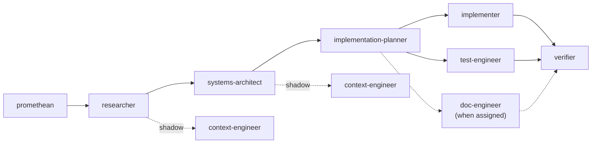

# Getting Started

A walkthrough of developing a small application using the Praxion agent pipeline. Each stage shows the prompt you type, what the agent produces, and how it feeds the next stage.

## Prerequisites

1. Install the ecosystem: `./install.sh` (see [README.md](../README.md#installation))
2. Verify: `./install.sh --check`
3. Start a Claude Code session in your project directory

## Parallel Reading: Claude Ecosystem Foundations

To maximize collaboration with Claude, read the [Claude Ecosystem Learning Resources](claude-ecosystem-learning-resources.md) in parallel with this walkthrough:

- **First time?** Start with [How Serious Builders Co-Work With Claude](claude-ecosystem-learning-resources.md#how-serious-builders-co-work-with-claude) to understand the shift from one-off queries to sustained collaboration
- **Configuring your setup?** See [Claude Cowork Setup Guide](claude-ecosystem-learning-resources.md#claude-cowork-setup-the-complete-guide) for context files, global instructions, and persistent context patterns
- **Choosing a Claude model?** Consult [Claude Opus 4.6 Guide](claude-ecosystem-learning-resources.md#claude-opus-46-practical-guide) and [Sonnet 4.6 Guide](claude-ecosystem-learning-resources.md#sonnet-46-capabilities--computer-use) for model selection by task complexity

The agent pipeline below automates many of these patterns — but understanding the underlying collaboration principles accelerates your effectiveness.

## The Agent Pipeline

Agents communicate through documents in `.ai-work/<task-slug>/`, not through direct invocation. Each pipeline run gets its own task-scoped subdirectory (a kebab-case 2–4 word identifier generated at pipeline start). Each agent reads upstream documents and writes its own, forming a chain:



You drive the pipeline by telling Claude what you need. It delegates to the right agent based on context. You can also name agents explicitly.

## Walkthrough: Building a URL Shortener

This example walks through building a small URL shortener service to illustrate every pipeline stage. For simpler tasks, you'll skip stages — see [Shortcuts](#shortcuts) below.

### Step 1: Ideation (promethean)

Use when you don't have a clear idea yet. The promethean analyzes your project and proposes improvements.

```
I want fresh ideas for a small utility I can build to practice with this ecosystem.
```

The promethean presents 3–5 candidate ideas and asks you to pick one. After a brief dialog refining scope, it writes:

- `.ai-work/<task-slug>/IDEA_PROPOSAL.md` — validated idea with problem statement, proposed solution, impact, and scope
- `.ai-state/IDEA_LEDGER_*.md` — permanent ideation history

> **Note:** The promethean requires a sentinel report to exist (ecosystem health baseline). If none exists, Claude runs the sentinel first.

**Skip this stage** when you already know what you want to build.

### Step 2: Research (researcher)

Use when the task involves technologies, libraries, or patterns you need to evaluate.

```
Research what's needed to build a URL shortener — storage options, hashing
strategies, and Python web frameworks suitable for a small service.
```

Or, following the promethean:

```
Research the feasibility of the idea in IDEA_PROPOSAL.md.
```

The researcher explores the codebase and the web, then writes:

- `.ai-work/<task-slug>/RESEARCH_FINDINGS.md` — structured findings with codebase analysis, external sources, comparative tables, and open questions

The researcher presents options with trade-offs but does **not** recommend a solution — that's the architect's job.

**Skip this stage** when you're already familiar with the technology and don't need external research.

### Step 3: Architecture (systems-architect)

Use when you need a design with trade-off analysis before building.

```
Design the architecture for the URL shortener based on the research findings.
```

The architect reads `RESEARCH_FINDINGS.md`, assesses your codebase, and writes:

- `.ai-work/<task-slug>/SYSTEMS_PLAN.md` — architecture overview, component design, data flow, interface contracts, acceptance criteria, risk assessment

For medium/large tasks, the plan includes a **behavioral specification** with requirement IDs (e.g., `REQ-01: Shortened URL redirects to original within 50ms`) that thread through the rest of the pipeline.

### Step 4: Planning (implementation-planner)

Breaks the architecture into small, safe, incremental steps.

```
Break down the architecture into implementation steps.
```

The planner reads `SYSTEMS_PLAN.md` and writes three documents:

- `.ai-work/<task-slug>/IMPLEMENTATION_PLAN.md` — numbered steps, each with: what to implement, what to test, done-when criteria, and which files to touch
- `.ai-work/<task-slug>/WIP.md` — tracks the current step, status, and blockers
- `.ai-work/<task-slug>/LEARNINGS.md` — initialized for capturing discoveries during implementation

Steps are paired: each implementation step has a matching test step. The planner assigns them to run concurrently on disjoint file sets (production code vs test code).

### Step 5: Implementation (implementer + test-engineer + doc-engineer)

The planner delegates steps to agents that run in parallel:

```
Implement the next step from the plan.
```

- **implementer** — writes production code for one step, runs format/lint/typecheck/test, self-reviews, marks the step complete in `WIP.md`
- **test-engineer** — writes behavioral tests from acceptance criteria (not from the production code), runs them, reports status
- **doc-engineer** — when the planner assigns a doc step (files added/removed/renamed, new APIs), updates affected documentation concurrently

After all agents complete, an integration checkpoint runs the full test suite. Failing tests trigger a fix cycle until everything passes.

Each step = one logical change. The implementer stops after completing its assigned step.

### Step 6: Verification (verifier)

After all implementation steps are done:

```
Verify the implementation against the acceptance criteria.
```

The verifier reads the entire pipeline trail — `SYSTEMS_PLAN.md`, `IMPLEMENTATION_PLAN.md`, `WIP.md`, `LEARNINGS.md`, and the git diff — then writes:

- `.ai-work/<task-slug>/VERIFICATION_REPORT.md` — verdict (PASS / PASS WITH FINDINGS / FAIL), acceptance criteria validation, convention compliance findings, test coverage assessment

The verifier is **read-only** — it identifies issues but does not fix them. If findings need action, the implementer runs again.

### Step 7: Cleanup

After the feature is complete and verified:

```
/clean-work
```

This removes `.ai-work/<task-slug>/` after merging learnings into permanent locations. Commit your code with `/co`.

## Shortcuts

Not every task needs the full pipeline. Match pipeline depth to task complexity:

| Task | Start at | Skip |
|------|----------|------|
| "I have no idea what to build" | promethean | — |
| "Build X" (unfamiliar tech) | researcher | promethean |
| "Build X" (known tech) | systems-architect | promethean, researcher |
| "I have a design, need steps" | implementation-planner | promethean, researcher, architect |
| "Fix this bug" / "Small change" | Work directly — no agents needed | Everything |

The pipeline scales proportionally. A one-line bug fix doesn't need twelve agents.

## Resuming Work

The pipeline supports multi-session work. If you close Claude and return later:

```
Resume work on the URL shortener — check WIP.md and continue.
```

The implementation-planner reads the existing `WIP.md` in the task's `.ai-work/<task-slug>/` directory, finds where you left off, and picks up from there.

## Supporting Agents

These agents operate alongside the main pipeline:

| Agent | When to use | Example prompt |
|-------|-------------|----------------|
| **context-engineer** | Modifying skills, rules, commands, or CLAUDE.md. Automatically shadows researcher/architect stages when work involves context artifacts | "Audit the project's context artifacts" |
| **doc-engineer** | Documentation needs updating after changes. Runs in parallel during implementation when the planner assigns doc steps | "Update the README to reflect the new feature" |
| **sentinel** | Ecosystem health check | "Run a sentinel audit" |
| **skill-genesis** | After a pipeline run, harvest learnings into reusable artifacts | "Harvest learnings from the last implementation" |
| **cicd-engineer** | Setting up CI/CD | "Create a GitHub Actions workflow for this project" |

## Key Commands

| Command | Purpose |
|---------|---------|
| `/co` | Create a commit following project conventions |
| `/cop` | Commit and push |
| `/create-worktree [branch]` | Work on a feature in an isolated worktree |
| `/merge-worktree [branch]` | Merge the worktree back |
| `/clean-work` | Remove `.ai-work/<task-slug>/` after pipeline completion |
| `/cajalogic` | Manage persistent memory across sessions |
| `/onboard-project` | Set up a new project for the ecosystem |

## Further Reading

- [Agent catalog and pipeline diagram](../agents/README.md)
- [Skills catalog](../skills/README.md)
- [External API docs](external-api-docs.md) — retrieve current API documentation for external libraries during development
- [Spec-driven development](spec-driven-development.md) — behavioral specifications for medium/large features
- [Developer guide](../README_DEV.md) — project structure and contributor conventions
