> **What this document is.** A process-first, design-quality analysis of every artifact Praxion's
> processes generate — ephemeral `.ai-work/<task-slug>/` coordination documents, persistent
> `.ai-state/` intelligence, and the adjacent generated surfaces (`observations.jsonl`,
> `doc_manifest.yaml`, the dashboard's reads). It treats **Praxion's processes as the drivers** and
> asks, for every artifact they touch: what is its purpose, is it *actually* produced, who *actually*
> produces and consumes it, is it redundant, can it be simplified, and does the information flowing
> in and out make sense. No code is written here — this is research and recommendation.

> **What this document is not.** It is not the prior lifecycle audit. That audit
> (`praxion-artifact-lifecycle-audit.md`, F-01..F-26, all closed and second-auditor-verified) fixed
> **contract drift** — stale names, manifests out of sync, the `ARCHITECTURE.md → DESIGN.md` rename,
> the post-`dec-225` memory purge. That is a *consistency-of-definitions* lens. This analysis occupies
> the next layer up: given the definitions are now consistent, does the artifact **system** earn its
> place? The two are complementary; this one never re-reports a closed F-finding.

---

## 0. Executive Summary

Praxion's artifact model is sound and its definitions are now coherent. The lifecycle split
(`.ai-work/` ephemeral, `.ai-state/` persistent, `docs/` permanent projection), the pointer-not-payload
handoffs, the fragment-file concurrency design, and the ADR draft→finalize machinery are all
well-designed and — where exercised — well-wired. **The core artifacts are not redundant.** Every
merge hypothesis tested in this analysis was *refuted* with evidence (see §5).

The problem is not the model and is no longer drift. The problem has one root cause, visible in four
of the five process clusters studied:

> **Praxion has invested in artifact *definition* and artifact *detection*, but not in artifact
> *production* and *closure*. The most load-bearing obligations live in prose — a rule sentence or an
> agent-prompt instruction — with no mechanical gate behind them. So they are aspirational, and on
> Praxion's own disk several of them simply do not fire.**

The five highest-leverage findings, each VERIFIED on disk:

1. **The criteria thread never fires.** `TASK_BRIEF.md` has **zero** live instances across 15+ task
   slugs, so the user-intent → acceptance-criteria → verifier-rubric chain exists only on paper. The
   verifier's "flag any Key Signal not carried forward" check has nothing to compare against.
   **[Critical]**
2. **A load-bearing safety mechanism does not exist.** `DESIGN.md` and `dec-248` both claim
   `observations.jsonl` "auto-rotates above 10 MiB"; there is **no rotation code** in either capture
   hook. The file is 6.8 MB, is now the recovery WAL, and is read whole on every recovery. **[Critical]**
3. **Spec archival has materially broken.** **Zero** archived specs since 2026-05-11, against ~113 new
   ADRs and ~30 `feat:` commits since. The SDD durable-traceability surface is starving because
   archival is a prose obligation with no gate. **[High]**
4. **The Learning Loop's "apply" phase is the weak link.** `LEARNINGS.md` promotion is "orchestration
   theater" (the durable paths bypass it; cleanup only *reminds*); the calibration loop is unenforced
   (9+ uncalibrated pipelines); the readiness score and `praxion_eval_reports` are write-only. The one
   loop that *is* closed — `sentinel → promethean` — is the template the others should copy. **[High]**
5. **A few peripheral artifacts genuinely waste.** The idea-ledger copies all prior entries into a new
   timestamped file per run (6 of 7 obsolete); 62 metrics + 39 sentinel reports accumulate unbounded in
   git with the large-file guard *excluding* them; `doc_manifest.yaml` is 484 KB because it embeds page
   summaries. These are the real simplification targets — not the core. **[Medium]**

The durable fix is the one the prior audit named and deferred: **grow the canonical artifact registry
from a passive drift-checker into a declarative spine** that names, per artifact, the gate that produces
it. `activation` already lives on the `Artifact` dataclass; adding a `production_gate` pointer and a
`cleanup_policy` does not *generate* the gates — each is still written by hand — but it turns "which
artifacts have a production gate, and what is it?" into one grep-able lookup instead of an obligation
scattered across rules and prompts.

---

## 0.1 Remediation Status

**Single source of truth for what has been fixed.** Updated as each wave lands; per-item detail uses the finding IDs from §4 and the R-IDs from §6.

| Wave | Scope | Items | Status |
|---|---|---|---|
| **1 — Honesty sweep** | Stop the design docs asserting capabilities that don't exist | B2, B3, A6, PF-06; partials R17/R19; doc-half of B1 | ✅ **Done** (2026-06-26) |
| 2 — Criticals | WAL rotation + windowed read; `TASK_BRIEF` floor (mandatory at Standard/Full) | R1, R2 | ✅ **Done** (2026-06-26) |
| 3 — Production-gate cohort | registry declarative spine + the production gates (+ A6 tail) | R3, R4, R5, R9, R13 | ✅ **Done** (2026-06-26) |
| **3.5 — Audit remediation** | Independent external audit of Waves 1–3 (`wave-1-3-external-audit.md`); re-verify each finding on disk, fix the confirmed blockers | EA-01, EA-03, EA-04 (5 of 12 findings refuted or by-design; rest → Wave 4/5) | ✅ **Done** (2026-06-26) |
| **4a — Waste pruning** | `doc_manifest` strip (484KB→163KB), `token_budgeting` retirement, retain-last-N report pruning, single living idea-ledger | R7, R11, R12, R17 | ✅ **Done** (2026-06-27) |
| **4b — Registry & dead seams** | `detection_gate` split (EA-02, dec-256), `build_doc_manifest` reads the registry (R18/EA-11 partial), R12b honesty fix (regen-hook deferred), dead-seam ledger row td-044 | R15, R18, EA-02, EA-11 | ✅ **Done** (2026-06-27) |
| 4c — Feedback & tail | readiness/eval feedback, P06 checker, id-citation dogfood asymmetry, hook `datetime.UTC` portability, `program.md` ML signal, R9-dashboard completion-state | R8, R19, EA-06, EA-09, EA-10, R9-dash | ✅ **Done** (2026-06-29; all 6 R-items + D2); deferred partials: R12b-hook, EA-11-reader |
| 5 — Capstone | integration eval over the criteria→spec path | R10 | planned |

**Wave 1 — landed 2026-06-26:**

- ✅ **B2** — `DESIGN.md` WAL row no longer claims dashboard/metrics consumption; it names the real consumers (`reconcile_pipeline_state.py`, post-merge dedup).
- ✅ **B3** — Pipeline Recovery Loop flipped `Designed → Built` (reconciler, command, tests, and handshake rules all verified on disk).
- ✅ **A6** — `DESIGN.md` §1 history (**1,830 → 193 chars**) moved into `DESIGN_CHANGELOG.md`; the intended split restored. *Assigning a standing producer so it cannot re-drift is deferred to Wave 3.*
- ✅ **PF-06** — `TECH_DEBT_RESOLVED.md` schema pointer corrected to the skill reference.
- ◑ **B1 (doc-half only)** — the false "auto-rotates above 10 MiB" claim in `DESIGN.md` / `dec-248` corrected to "documented intent, not yet implemented." **The rotation implementation is R1 (Wave 2).**
- ◑ **R17 (partial)** — dead `evals/baselines/` orphan removed; `token_budgeting/` removal **deferred** — it conflicts with the `historical-retained` state the prior audit sanctioned, so it becomes a Wave-4 policy call.
- ◑ **R19 (partial)** — `project_profile.yaml` absent-behavior note added; the `program.md` ML-signal tightening is **deferred** to Wave 4 (behavioral, not a doc truth-fix).

**Wave 2 — landed 2026-06-26** (branch `wave2-criticals`, commits `6213e82` + `10b66a5`):

- ✅ **R1 — and B1 now fully resolved.** `observations.jsonl` rotates to a gitignored `.1` at 10 MiB (best-effort, inside the fcntl lock); the reconciler reads active + segment within a 7-day window (active rows kept unconditionally per the pre-mortem scenario-6 refinement). The `DESIGN.md`/`dec-248` rotation claim is now *true*; dec-248 re-affirmed by `dec-250`. The cross-boundary recovery canary is green.
- ✅ **R2 — the criteria-thread floor (A1) is wired and mandatory going forward.** `TASK_BRIEF.md` is mandatory at Standard/Full (Intake Gate + `goal-disambiguation`, decoupled from the 2×2 blocking-question rule); sentinel **P06** + verifier WARN backstops. Proven by its own dogfood — the verifier's Key-Signal carry-forward check ran live against Wave 2's real `TASK_BRIEF` and **passed**. Always-loaded budget +193 chars (82,691 < 87,500). *Scope note (clarified by the 2026-06-26 audit, EA-03): "the gate is live forward" — not "every historical slug has a brief." On disk 2 of 6 `.ai-work/` slugs carry a `TASK_BRIEF`; the 4 without it predate the floor and are **intentionally not backfilled** — retroactive briefs for completed, merged, gitignored pipelines would be theater. Those slugs are stale-slug cleanup candidates (P08), not production gaps.*
- Verifier verdict: **PASS** (10/10 KS criteria, 1545 tests green). The two ADR drafts finalize to `dec-NNN` when `wave2-criticals` merges to `main`.

**Wave 3 — landed 2026-06-26** (branch `wave3-production-gates`, commits `4e55cfa` + `b2ab61f`; ADRs `dec-251` + `dec-252`):

- ✅ **Registry declarative spine** — `production_gate` + `cleanup_policy` on all 24 artifacts; **0 `deferred`** (every artifact names a real gate); back-compat by construction (consumers parse membership from source text, never see the new fields; the 6 drift assertions stay green). The §8 recommendation, realized.
- ✅ **R3 / R4 / R13 / R9 gates** — spec-archival (sentinel SH08 + detector), calibration-coverage (CA03 rewire + detector + non-blocking CI advisory), challenge-disposition (P07), stale-slug (P08); each with a gate-liveness proof (canary for CODE, golden bad-case for PROMPT). Two already report *true* findings on Praxion itself: R4 `covered:false` (**14** uncalibrated commits — the producer rows are owed; **appended in Wave 3.5 → now `covered:true`**, see below), R3 armed-but-green.
- ✅ **R5 / A6** — verifier harvests `LEARNINGS ### Technical Debt → td-NNN` (four-writer ledger contract intact); `DESIGN_CHANGELOG` producer assigned (closes the Wave-1 A6 deferral).
- ✅ **Dogfood** — Wave 3 archived its own 13-REQ behavioral spec (the first since 2026-05-11) and ran the R3 gate against it → `gap:false`, closing the very PF-02 gap the analysis found.
- Verifier verdict: **PASS** after one rework loop (id-citation + plugin-cache guard fixed in-place); 1561 tests green. **R9-dashboard** completion-state separation deferred to Wave 4 (TypeScript UX, not a gate).

**Wave 3.5 — audit remediation, landed 2026-06-26** (source: `docs/independent-analysis/wave-1-3-external-audit.md`; every finding independently re-verified on disk before disposition):

- The external auditor raised **12 findings (EA-01…EA-12), 5 marked blocking.** Independent re-verification in the canonical environment (Python 3.11.5, full suite **1561 passed**) dispositioned them: **3 confirmed-and-fixed**, **2 refuted**, **7 deferred to Wave 4/5 or accepted by design**.
- ✅ **EA-01 (confirmed, fixed)** — `dec-250`'s "every event is committed to git history before rotation" was a commit-cadence convention stated as an invariant; an uncommitted tail can rotate into the gitignored `.1`. Reworded to the real guarantee (local active file + archived `.1` within the 7-day reconciler window); **decision unchanged**. `DESIGN.md` was already honest (corrected in Wave 1/2). Reclassified from the auditor's "Critical" to doc-honesty — no data-loss risk in practice.
- ✅ **EA-04 (confirmed, fixed)** — R4 was red on dogfood (14 uncalibrated commits, not the "12" stated above). Appended post-hoc calibration rows for Waves 1/2/3 → detector now `covered:true`.
- ✅ **EA-03 (confirmed, fixed by wording)** — the prior "A1 closed" line overclaimed retroactive coverage; tightened above. The auditor's backfill option was **refused** as theater (see scope note).
- ⊘ **EA-02 (refuted as a bug)** — `production_gate="sentinel:P06"` is not a mislabel: `artifact_registry.py` documents `sentinel:<check-id>` as a valid gate kind ("a sentinel check enforces presence/quality"), used consistently for P06 + 2× P07. The auditor's underlying point (the spine conflates *production* with *presence-detection*) is fair and is logged as a **Wave 4 design refinement** alongside EA-11 (wire a registry consumer).
- ⊘ **EA-05 (refuted)** — the "1561 green" claim reproduces exactly in the canonical environment; the auditor's 10 failures were Codex install/bridge tests sensitive to their isolated py3.13-venv home layout (they pass here), which the auditor acknowledged.
- **Deferred / by-design:** EA-06, EA-07 (PROMPT-gate liveness — dec-252 deliberately chose golden fixtures; CODE gate → R10/Wave 5), EA-08 (cosmetic), EA-09 (intentional dogfood asymmetry), EA-10 (pre-existing `datetime.UTC` hook portability — predates Wave 2), EA-11 (dec-251's own recorded dissent), EA-12 (not reproduced) → **Wave 4 hygiene**.

**Wave 4a — waste pruning, landed 2026-06-27** (branch `wave4a-waste-pruning`; the §5 "genuine waste" set, sequenced first per the user's call; ADR drafts dec-draft for R7/R11/R17):

- ✅ **R12 (C3)** — `build_doc_manifest` dropped the per-surface `summary` (25%) **and** the redundant `frontmatter` embed (47%); `doc_manifest.yaml` **484KB → 163KB**, schema v2. Grounding showed the `frontmatter` embed was the larger, equally on-demandable half, so both go (the analysis named only summaries).
- ✅ **R17 (C4)** — deleted the dead `.ai-state/token_budgeting/` dir and **retired the `historical-retained` lifecycle state** it was the sole member of (5 states → 4); git history is the archive. ADR records the reversal of the prior-audit sanction.
- ✅ **R11 (C2)** — new `prune_reports.py --keep N` (default 10; `*_LOG.md`/`.lock` exempt; `.md`+`.json` runs grouped; a bites-canary proves it deletes), producer-triggered (sentinel Phase 7 + `/project-metrics`), PATH-installed. Dogfood: pruned **70** backlog reports (metrics 64→22, sentinel 39→11).
- ✅ **R7 (C1)** — `promethean` now updates **one living `IDEA_LEDGER.md`** in place instead of a copy-forward `IDEA_LEDGER_<timestamp>.md` per run; the 7 files consolidated to 1 (6 in git history); two `build_doc_manifest` globs widened so the date-less file is discovered.
- **Scope refinements (Register Objection):** **R18 moved to 4b** — it is the EA-11 "make the registry *read*" work (an ordered projection + drift-test rewrite), not waste-pruning; and **R12's regen-wiring (R12b) moved to 4b** with R18 (same `doc_manifest` machinery). 4a stayed the clean §5-waste set.
- Full suite **1568 green** throughout (+7 from `prune_reports` tests); each item one logical commit; calibration row appended.

**Wave 4b — registry & dead seams, landed 2026-06-27** (branch `wave4b-registry-seams`; the "make the spine honest + read" work, with one architectural fork the user decided; ADR draft → dec-256):

- ✅ **EA-02** — added a `detection_gate` field; split the gate vocabulary (production = producer/script/hook; detection = sentinel); reclassified `TASK_BRIEF`/`INTERFACE_DESIGN`/`TRANSACTIONS_DESIGN` from `sentinel:Pxx` production to `producer:* ` production + `sentinel:Pxx` detection. A canary forbids any future `sentinel:` in `production_gate`.
- ✅ **R18 / EA-11 (partial)** — `build_doc_manifest` now *imports* `dashboard_artifacts_ordered()` instead of duplicating the list — the **first consumer that reads the spine**. EA-11 is only *partially* closed: per-artifact `cleanup_policy` still has no reader (the per-dir/per-file granularity gap — `clean_work_safety` classifies whole task-dirs, not files), recorded in dec-256's Disconfirmation.
- ✅ **R12b (honesty half)** — corrected the false "post-commit hook regenerates the manifest" claim in `document-api.md` + the builder docstring; reality is **manual** regen, with sentinel **F11** flagging staleness. The auto-regen *hook* is **deferred with rationale**: the builder has no content-aware write mode, so a naive finalize regen would churn `generated_at` on every on-main commit, and F11 already provides the freshness backstop. *(The manifest had silently missed dec-253/254/255 since the 4a merge — exactly the gap F11 detects; a manual regen dogfooded the workflow and recovered it.)*
- ✅ **R15** — filed **td-044** for the `project_profile.yaml` / `eval_ledger/` dead seam (designed schemas, no onboarding producer), so it stays visible.
- Full suite **1572 green**; one architectural fork (the `detection_gate` schema) surfaced to the user before implementing.

**Wave 4c (R8) — readiness/eval feedback, landed 2026-06-28** (branch `wave4c-r8-feedback`; ADR draft → dec-draft-89c07cfc; full agent pipeline architect→planner→implementer→verifier):

- ✅ **R8 / D1 (A1 — readiness loop closed)** — new mechanical sentinel check `RD01` reads `readiness.data.adjusted_level` and flags **Important** when `< 3`, routing a below-floor readiness level into the existing `sentinel → promethean` edge (the closed-loop template §7 named). A `dec-252`-style CODE gate: a pytest canary drives `adjusted_level: 2` and **bites**; no-false-positive control at `3`; sentinel golden bad-case + control fixtures. `RD01` emits an **Important finding only — no `td-NNN` row**, so the four-writer ledger contract is untouched. Three sub-questions resolved: JSON path → `readiness.data.adjusted_level` (the `collectors.*` skill-doc bug fixed in lockstep); `mechanical-only` → **fire-but-annotate** (don't go inert in auth-less CI); threshold → `< 3`.
- ✅ **R8 / D1 (B2 — eval loop documented)** — `commands/eval-praxion.md` records the eval human-gating as a **deliberate** feedback-model choice (not a gap), with a concrete reversal trigger (a multi-run history that makes "recurring FAIL" measurable). No machinery built on a 1-run history.
- ✅ **Dogfood (armed-and-red, intended)** — `RD01` fires Important-with-annotation on Praxion's own `adjusted_level: 2, mechanical-only` readiness — a *true* finding, exactly D1's point.
- Verifier verdict: **PASS WITH FINDINGS** (12/12 AC, 7/7 REQ, 1 WARN — a dangling `dec-draft` ADR ref that `finalize_adrs.py`'s literal replace would skip, fixed in the gated DESIGN-§5 Built-flip). Full suite **1288 green** (`tests/ scripts/`). Two orchestration catches worth recording: the architect prematurely tagged DESIGN §5 "Built" (Theme-B drift — corrected to "Designed" until verifier PASS), and the implementer return truncated (completion re-derived from ground truth per the handshake protocol, not from checkboxes).
- ✅ **Tail batch (EA-10 · R19b · EA-09), landed 2026-06-28** — three file-disjoint hygiene items run in parallel: **EA-10** swept `datetime.UTC` → `timezone.utc` across hooks + scripts (Python-3.9 portability for the shipped capture hooks; a per-file `UP017` ignore stops ruff reverting it; 3 docstring-only files dropped to stay surgical); **R19b** content-gated the `program.md` ML-detection signal so a bare file no longer false-triggers the ML scaffold default; **EA-09** documented the id-citation dogfood asymmetry in `README_DEV.md` (Praxion's meta-tests legitimately embed `REQ-*`/`AC-*` fixtures, so a self-run's ~180 violations are mostly false — the exemption is honest, dogfooding disproportionate). R19a was already shipped in Wave 1. `scripts/` suite 1077 green; each item one commit.
- ✅ **Tail batch 2 (EA-06 · R9-dash · D2), landed 2026-06-29** — three disjoint-domain items run in parallel: **EA-06** gave sentinel **P06** a mechanical CODE-kind checker (`scripts/check_p06_task_brief.py` + `run_p06`) with a `tmp_path` canary that bites — *not* a committed `.ai-work/` fixture (which is gitignored and would silently fail in CI; the bug was caught at the pre-commit ground-truth check, then reworked); **R9-dash** split the dashboard workshops view into Active/Done groups (a slug is `isDone` when `VERIFICATION_REPORT.md` exists or `PROGRESS.md` hit a terminal phase); **D2** ran `/skill-genesis` for the first time, validating the dormant harvest loop end-to-end (4 proposals pending `/skill-genesis-review`, incl. one formalizing the pinned-ruff version-skew footgun). Deliberately deferred as too risky/large for a parallel batch: **EA-11 `cleanup_policy` reader** (file-deletion logic), **R10** (the Wave-5 capstone eval), **R12b auto-regen hook** (deferred with rationale — naive regen churns `generated_at`).

**Remaining Wave 4:** **4c** — only **EA-06** (P06 PROMPT-gate liveness) and **R9-dashboard** (completion-state separation) remain (**R8 · R19b · EA-09 · EA-10 ✅** landed 2026-06-28; R19a shipped in Wave 1) + the deferred **R12b auto-regen hook** and the **EA-11 `cleanup_policy` reader** (the partial closures above).

Legend: ✅ done · ◑ partial / doc-half · ⊘ refuted/by-design · ▶ in progress · (blank) planned.

---

## 1. Scope, Method, and Relationship to the Prior Audit

**Method.** Praxion's own pipeline drove this analysis. Five lens-independent researchers each took one
process cluster, grounded every producer/consumer/active claim against actual code (`agents/*.md`,
`scripts/*.py`, `hooks/*.py`, `commands/*.md`, `dashboard_app/src/`, `eval/`) **and against the live
disk** (`.ai-work/` slugs, `.ai-state/` contents), then returned a fragment. The orchestrator
reconciled the five fragments at one synthesis seam and **independently re-verified every Critical/High
claim on disk** before publishing — precisely because the prior audit's taxonomy marked `TASK_BRIEF.md`
as `✅ wiring is explicit` by trusting prompts, when on disk it never fires. Documentation describes
intent; only the disk shows behavior. Where the two disagree, this analysis weights the disk and flags
the divergence.

**Evidence labels.** `VERIFIED` = reproduced on disk by this analysis. `INFERRED` = reasoned from
multiple observed references. `RISK` = a failure mode that follows. `RECOMMENDATION` = proposed
direction.

**Relationship to the prior audit.** The prior audit's "What Is Coherent" section *praises* the
artifact set and explicitly counsels "do not simplify by deleting core artifacts." This analysis agrees
on the core (§7) but goes where the prior audit did not: it asks whether each obligation is *mechanically
produced*, whether each loop *closes*, and whether the peripheral artifacts *earn their keep*. It also
benefits from timing — `dec-248` (the WAL-as-recovery-spine decision) landed *after* the prior audit
largely closed, opening a class of questions (WAL retention, report accumulation, loop closure) the
earlier pass could not have asked.

---

## 2. The Process Map: Processes as Drivers

Praxion is not one process; it is a federation of them, each producing and consuming artifacts across
two stores. Reading the ecosystem *by process* (rather than by artifact) is what surfaces the
cross-cutting findings, because most problems live at the **seam between a process and the store it
writes to** — not inside any single artifact.

The seven process drivers:

| Process driver | Primary store | Cadence | Closes a loop? |
|---|---|---|---|
| **Feature pipeline** (intake → research → architecture → planning → implement/test → verify) | `.ai-work/` ephemeral | per task | partially — see §4.A, §4.D |
| **Decision & traceability spine** (ADR draft→finalize, spec archival, DESIGN/architecture upkeep) | `.ai-state/` permanent | per decision / per feature | ADRs yes; specs **no** (§4.A3) |
| **Observability & recovery** (WAL capture, compaction snapshot, reconcile, resume) | `.ai-state/` + `.ai-work/` | continuous + on-recover | mechanically yes; producer-side gaps (§4.B) |
| **Out-of-band intelligence** (sentinel, metrics, skill-genesis, idea-ledger, readiness, roadmap) | `.ai-state/` permanent | on-demand / periodic | sentinel yes; readiness/eval **no** (§4.D) |
| **Calibration** (tier-selection accuracy logging) | `.ai-state/` permanent | per task | **no** — unenforced (§4.A4) |
| **Onboarding / cross-project contract** (skeleton seed, canonical blocks, the machine registry) | seeds `.ai-state/` | per project | n/a — contract, well-formed (§4.E) |
| **Ephemeral-store hygiene** (`/clean-work`, stale-slug advisory) | `.ai-work/` | manual | advisory-only (§4.F) |

Two design invariants hold the federation together and are genuinely well-executed: **(a)** the
`.ai-work/` ⟷ `.ai-state/` split by lifecycle, and **(b)** task-slug propagation so concurrent
pipelines never collide. Nothing in this analysis recommends touching either.

---

## 3. Artifact-by-Process Flow

This section walks each process cluster's produce/consume flow at a glance; the full per-artifact
9-dimension matrix is in Appendix A, and the cross-cutting findings are in §4.

### 3.1 The Feature Pipeline (the intake → verify spine)

The spine is real and mostly well-wired: `RESEARCH_FINDINGS → SYSTEMS_PLAN → IMPLEMENTATION_PLAN/WIP →
TEST_BASELINE/TEST_RESULTS → VERIFICATION_REPORT` are all VERIFIED on disk with live instances, and the
`VERIFICATION_REPORT → REWORK_MANIFEST → VERIFIER_FINDINGS` rework loop is the **best-mechanized flow in
the system** (`scripts/rework_manifest.py` + `scripts/dispatch-reworks`, with a round-trip self-check).
But the *entry* of the spine is broken (`TASK_BRIEF`, §4.A1) and the *exit to permanence* leaks
(`LEARNINGS` promotion, §4.A2; spec archival, §4.A3). **Eight of 18 pipeline artifacts have zero live
instances on Praxion** (§4.G).

### 3.2 The Decision & Traceability Spine

The ADR half is exemplary: 248 finalized ADRs, draft→finalize driven mechanically by the git-hook chain
(`finalize_chain.sh → finalize_adrs.py → regenerate_adr_index.py`), index row-count matching file-count,
supersession hygiene reasonable (4.4% superseded). The tech-debt ledger pair is equally healthy
(`finalize_tech_debt_ledger.py` runs on every main commit; 33 rows migrated to RESOLVED). The **spec
half is starving** (§4.A3), and the three architecture surfaces have collapsed from three to two because
`DESIGN_CHANGELOG.md` has no producer (§4.A6).

### 3.3 Position & Recovery Surfaces

The four "where are we" surfaces — `WIP.md`, `PROGRESS.md`, `observations.jsonl`, `PIPELINE_STATE.md` —
*look* redundant but are not (§5). After `dec-248` each occupies a distinct reliability tier: git+tests
are the Tier-1 arbiter, the WAL is a Tier-2 localization hint, `WIP`/`PROGRESS` are a Tier-3 validated
cache. The reconciler (`reconcile_pipeline_state.py`) is mechanical; the recovery *command*
(`/resume-pipeline`) is prompt-mediated; and the WAL the whole loop now leans on has a non-existent
rotation mechanism (§4.B1) and an unbounded full-file read (§4.B / Finding C5).

### 3.4 Out-of-Band Intelligence Loops

This is where feedback-loop integrity is decided. `sentinel → promethean` is a **fully closed** loop
(promethean halts if the latest sentinel report is missing or >7 days old). Against that template, the
readiness score and `praxion_eval_reports` are **write-only** (computed, dashboarded, never gate a
decision), `skill-genesis` has never run on Praxion, and the idea-ledger's loop closes for deduplication
but the artifact itself is a copy-forward anti-pattern (§4.C1).

---

## 4. Cross-Cutting Findings

Findings are grouped by the seven themes that emerged across clusters. Each carries severity, on-disk
evidence, a recommendation, and an effort estimate (XS≤1h · S≤4h · M≤1d · L≤3d). The dominant theme is
**A — obligation without mechanism**; it is the spine that ties most of the rest together.

### Theme A — Designed Obligation Without a Production Mechanism

Each finding here is the same shape: an obligation stated in prose, no gate, and the disk shows it
under-firing.

#### A1 — `TASK_BRIEF.md` is a dead gate; the criteria thread never fires **[Critical, VERIFIED]**

`find .ai-work -name TASK_BRIEF.md` → **0**. The obligation lives at
`swe-agent-coordination-protocol.md:135` and `goal-disambiguation/SKILL.md`, gated on "success is
non-obvious" — a subjective orchestrator judgment that, in practice, never resolves to *yes* at the
Direct/Lightweight tiers Praxion mostly runs. Consequence: the verifier's primary rubric check
(`verifier.md:48` — "flag any Key Signal not carried into `SYSTEMS_PLAN.md`") has nothing to compare
against; the architect derives acceptance criteria with no provenance anchor to user intent. The
criteria-first thread — one of Praxion's signature ideas — is paper-only on its own repo.

**Recommendation.** Pick one and make it real: **(a)** raise the floor — `TASK_BRIEF.md` mandatory at
Standard/Full regardless of "clarity," so the thread always exists where it matters; or **(b)** drop the
verifier's dependence on it and rely on `SYSTEMS_PLAN.md` acceptance criteria alone for sub-Standard
runs. The current subjective gate produces neither reliably. *Effort: S (policy) + the verifier-prompt
edit.*

#### A2 — `LEARNINGS.md` promotion is orchestration theater **[High, VERIFIED]**

The rule says "merge learnings into permanent locations at feature end"
(`agent-intermediate-documents.md:118`), naming CLAUDE.md / ADRs / issue tracker. On disk the durable
paths **bypass `LEARNINGS.md` entirely**: ADR fragments are written straight to `decisions/drafts/`
during the pipeline; tech-debt rows are written by the verifier directly to the ledger. The only path
that actually depends on `LEARNINGS.md` is `/skill-genesis`, which is *user-invoked*, and cleanup
(`commands/co.md:23`) merely emits a **text reminder**. So the `### Gotchas`, `### Patterns`, and
`### Edge Cases` sections evaporate at cleanup. The "durable knowledge bridge" the philosophy leans on
is, mechanically, a myth.

**Recommendation.** Make the promotion model honest and partly mechanical: route `### Technical Debt`
entries to a `td-NNN` row at pipeline end (the verifier already does this — extend to planner/implementer
findings), and explicitly document that the prose sections are `/skill-genesis`-harvested, user-driven,
and *will* be lost if not harvested. Stop describing an automatic merge that does not occur. *Effort: M.*

#### A3 — Spec archival has materially broken **[High, VERIFIED]**

`ls .ai-state/specs/` → 5 files, newest `SPEC_multi-language-support_2026-05-11.md`. Since then: ~30
`feat:` commits and ~113 new ADRs (`dec-135..dec-248`), several of them clearly Standard/Full behavioral
features (pipeline-truncation-recovery, agentic-transactions, agent-readiness, `/eval-praxion`). The
prior audit treated the one missing archive (`l3-readiness-config`) as a justified exception; the data
shows it is **systemic**. Archival is an implementation-planner Phase-7 prose obligation with no gate, so
the verifier's spec-conformance check silently skips on every recent feature and brownfield detection
finds no baseline.

**Recommendation.** A `grep`-amenable sentinel check (no LLM): WARN when the newest `SPEC_*` is more than
N days older than a cluster of ≥K ADRs sharing a tag — i.e., "a feature shipped without archiving its
spec." This matches the enforcement style Praxion already chose for calibration (CA03) and `doc_manifest`
freshness (F11). *Effort: M.*

#### A4 — Calibration logging is unenforced; the loop never closes **[High, VERIFIED]**

`swe-agent-coordination-protocol.md:26` mandates a calibration row on every task completion. There is
**no hook, script, or gate** that writes it; the producer is the orchestrator's voluntary compliance.
The log has 8 rows (newest 2026-06-22) against **9+ later uncalibrated** `.ai-work/` slugs. Sentinel CA03
*detects* under-logging but is LLM-evaluated and only runs on `/sentinel`. And nothing *acts* on
calibration trends — `relay_helpers.py:128` reads only the last row (stale when unwritten). The loop is
fully human-mediated end to end: produce (maybe) → detect (maybe) → read (a human) → adjust (a human).

**Recommendation.** Close the *producer* side first (the cheaper half): a `/record-calibration` helper or
an orchestrator post-task checklist line, plus a code-level CA03 variant comparing `calibration_log.md`
mtime against recent merges so detection does not require a full LLM sentinel run. *Effort: M.*

#### A5 — One of three loop-backs is advisory while the other two are mechanical **[Medium, VERIFIED]**

Praxion's forward-only pipeline has three sanctioned loop-backs. Two are mechanical:
`PRE_REFACTOR_PLAN.md` (`scripts/parse_pre_refactor_yaml.py`) and the verifier rework loop
(`scripts/rework_manifest.py`). The third — the interface-designer / transactions-architect
`## Architecture Challenges` loop — is **orchestrator-judgment only** (`coordination-details.md:189-200`):
no script, no trigger, and the durable-disposition obligation depends on the orchestrator remembering to
write it. On a busy pipeline the challenge can simply be missed, and its rationale lost at cleanup.

**Recommendation.** Bring it in line, **lighter fix first**: a sentinel check that flags a non-empty
`## Architecture Challenges` section with no recorded disposition. This path fires only when a specialist
sub-architect is active *and* raises a challenge, so a dedicated `parse_interface_design_challenges.py`
block (parallel to `parse_pre_refactor_yaml.py`) is likely over-built — escalate to it only if challenges
become frequent. *Effort: S (sentinel) / M (script).*

#### A6 — `DESIGN_CHANGELOG.md` has no producer; `DESIGN.md` §1 swelled to absorb it **[High, VERIFIED]**

> **Status (Wave 1, ✅ 2026-06-26):** split restored — §1 history (1,830→193 chars) moved to `DESIGN_CHANGELOG.md`. Assigning a standing producer is deferred to Wave 3. See §0.1.

`grep -rl DESIGN_CHANGELOG agents/ skills/ rules/` → **0**. The file is 44 days stale (last touched
2026-05-12) while `DESIGN.md` was updated through June. The intended split — `DESIGN.md` holds a one-line
"Last verified" pointer; `DESIGN_CHANGELOG.md` holds deep history — has **collapsed**: `DESIGN.md` §1 now
carries 1,800+ chars of inline history it was designed *not* to hold. This is a **per-read** cost
(`.ai-state/DESIGN.md` is *not* part of the 25 K always-loaded session budget — F-03 deliberately kept it
out), but it is among the most frequently re-read state files, loaded on essentially every
design-touching task. It is the same obligation-without-mechanism pattern: a surface exists, nothing
writes it, and the content backs up into the wrong place.

**Recommendation.** Deprecate `DESIGN_CHANGELOG.md` and let `DESIGN.md` §1 carry a bounded
`| Feature | Date | Summary |` table (git holds the deep history), **or** assign a one-line producer
instruction in `architecture-documentation.md`. Option (a) matches reality and is simplest. *Effort: S.*

### Theme B — Capability-Claim Drift Inside the Design Docs Themselves

A subtler drift than the prior audit's name-drift: `DESIGN.md` overstates what is *built*. Unlike
`docs/architecture.md` (which the verifier code-verifies at Phase 9), `DESIGN.md`'s "Built" claims have
**no verification gate** — so they rot silently.

#### B1 — The WAL's "auto-rotation" is documented but does not exist **[Critical, VERIFIED]**

> **Status (Wave 1, ◑ doc-half):** the false claim is corrected in `DESIGN.md` / `dec-248`; the rotation **implementation** is R1 (Wave 2). See §0.1.

`DESIGN.md:64` states the observability log "auto-rotates above 10 MiB (best-effort, never blocks)";
`dec-248`'s Considered-Options A repeats the WAL is "already hardened (auto-rotation)." Neither
`capture_memory.py` nor `capture_session.py` contains any size check or rotation logic (grep for
`rotat|getsize|st_size|10_000_000` → nothing). The file is **6.8 MB and growing ~11K events/month at
peak**; `dec-248` made it the recovery WAL, and `reconcile_pipeline_state.py:_read_wal()` reads the
**entire file** on every recovery. A future architect evaluating recovery reliability will trust a safety
property that is not there.

**Recommendation.** Because recovery now depends on it, *implement* the rotation the docs already promise
(best-effort size check in the append path, archive to `observations.jsonl.1`) rather than just deleting
the claim. Pair with a windowed read (Finding C5). *Effort: M.*

#### B2 — `DESIGN.md` claims dashboard/metrics consume the WAL; no code does **[Important, VERIFIED]**

> **Status (Wave 1, ✅ 2026-06-26):** claim corrected to name the real consumers. See §0.1.

Same `DESIGN.md:64` line: "Consumed by metrics and the dashboard." Exhaustive grep of `dashboard_app/src/`
finds **no reader** of `observations.jsonl` (the dashboard reads `metrics_reports/*.json`). The WAL's only
real consumers are `reconcile_pipeline_state.py` (recovery) and `reconcile_ai_state.py` (merge dedup). The
claim inflates the WAL's apparent utility and would mislead anyone reasoning about observability coverage.

**Recommendation.** Correct the description to name the two actual consumers and mark dashboard
consumption as planned-not-built. *Effort: XS.*

#### B3 — The recovery loop is labeled "Designed" while it ships and passes tests **[Suggested, VERIFIED]**

> **Status (Wave 1, ✅ 2026-06-26):** flipped `Designed → Built` in `DESIGN.md`. See §0.1.

`DESIGN.md` §3 and §161 mark the Pipeline Recovery Loop **"Designed,"** even tagging
`reconcile_pipeline_state.py` as "(new — Designed)" — but the script exists, is executable, and has
passing tests (landed 2026-06-22). Downstream agents reading `DESIGN.md` may skip `/resume-pipeline` or
duplicate the work.

**Recommendation.** Flip the §3 row and §161 heading to "Built." *Effort: XS.* (This trio — B1/B2/B3 —
argues for a small *standing* fix: give `DESIGN.md` a code-verification pass equivalent to the one
`docs/architecture.md` already gets, so "Built"/"auto-rotates"/"consumed by X" claims can't silently rot.)

### Theme C — Inconsistent Lifecycle Policy for Persistent Artifacts

Praxion has no coherent answer to "when does a persistent artifact **live-edit** vs **snapshot-per-run**
vs **roll-up** vs **prune**." Some artifacts get it right (`DESIGN.md`, `TECH_DEBT_LEDGER.md` live in
place); others don't.

#### C1 — The idea-ledger is a copy-forward anti-pattern **[High, VERIFIED]**

`promethean` writes a *new* `IDEA_LEDGER_<timestamp>.md` each run, copying all prior entries forward
(7 files on disk; 6 fully superseded by the latest). Consumers find "current state" by sorting filenames
— fragile — and old files are dead weight in git. This is the timestamped-snapshot pattern (correct for
sentinel/metrics, where history *is* the value) misapplied to a **state** artifact where only the current
state matters.

**Recommendation.** Single living `IDEA_LEDGER.md`, edited in place; git is the history. Mirrors
`DESIGN.md`/`TECH_DEBT_LEDGER.md`. One-time archive of the 6 stale files. *Effort: S (direct-tier ADR).*

#### C2 — Report families accumulate unbounded; the guard *excludes* them **[Medium, VERIFIED]**

`metrics_reports/` = 62 files / 12 MB; `sentinel_reports/` = 39 files. No retention or rollup policy
exists, and `.pre-commit-config.yaml:24` *excludes* both from the large-file guard — a deferral dressed
as a policy. The `LOG.md` sibling of each is the intended durable rollup and works well (sentinel's own
trend read uses `SENTINEL_LOG.md`, not the full reports; promethean reads only the latest full report).

**Recommendation.** Retain the last N full reports (e.g., 5); the `LOG.md` carries history. A project-level
housekeeping policy, not new machinery. *Effort: S–M.*

#### C3 — `doc_manifest.yaml` is oversized and has no regen trigger **[Medium, VERIFIED]**

484 KB, because it embeds truncated page-content `summary` strings; path/title/type/renderer alone would
be ~10–20 KB (summaries are used only by the dashboard's description cards and could be fetched
on-demand). And `build_doc_manifest.py` is **not** in `finalize_chain.sh` or any hook/CI (grep confirms),
so it is stale by default — sentinel F11 *warns* but cannot *fix*.

**Recommendation.** Strip summaries (compute on demand) and add `build_doc_manifest.py` to
`finalize_chain.sh`. *Effort: S.*

#### C4 — Dead directories live inside the live-intelligence store **[Low, VERIFIED]**

`.ai-state/evals/baselines/` (regression mode *retired*, one orphan JSON) and
`.ai-state/token_budgeting/` (two 2026-02-09 one-offs, `historical-retained`, header says "references may
be outdated") have no producer and no consumer, yet sit in `.ai-state/` — which the sentinel and the doc
manifest scan as "persistent project intelligence." Their presence is noise that implies currency they
lack.

**Recommendation.** Delete, or move to `docs/independent-analysis/archive/`. *Effort: XS.*

#### C5 — The WAL is read whole on every recovery; no windowing **[Medium, VERIFIED]**

`reconcile_pipeline_state.py:_read_wal()` parses all 6.8 MB / 15.5K lines every invocation, though
recovery correlation only needs the current session's events (hours–days). Degrades linearly and, absent
rotation (B1), unbounded.

**Recommendation.** An optional `--since` / `max_age_days` window (default ~7 days). Synergistic with B1.
*Effort: S.*

### Theme D — Feedback-Loop Integrity (learn → recall → apply)

#### D1 — Readiness and `praxion_eval_reports` are write-only **[High, VERIFIED]**

The agent-readiness score is computed by `/project-metrics`, embedded in `METRICS_REPORT_*.json`,
displayed on the dashboard, and interpreted by a *human-consultation* skill — **no pipeline agent reads
it to gate or modify behavior**. A Level-1 and a Level-5 project run identical pipelines. Likewise
`/eval-praxion`'s one recorded run scored 219 FAIL and triggered nothing downstream. This is the clearest
write-only pattern in the system: the "apply" phase of the Learning Loop is absent.

**Recommendation.** Apply the *closed-loop template Praxion already owns* (`sentinel → promethean`): have
sentinel emit an Important finding when readiness < Level 3, and route recurring `/eval-praxion` failures
into the tech-debt ledger. Or consciously accept the human-gated design and *document* that choice so it
reads as intentional, not as a gap. *Effort: M.* **[Contrast — the model to copy]** `sentinel → promethean`
is fully closed (`promethean.md:59-67`): learn (sentinel writes) → recall (promethean reads latest) →
apply (ideation accounts for health grade); it even halts on stale input. It is the proof the pattern is
achievable here.

#### D2 — `skill-genesis` has never run on Praxion **[Medium, VERIFIED]**

`.ai-state/skill_genesis_reports/` does not exist on disk, though the inventory marks it `active`. The
learning-harvest loop — the designed bridge from `LEARNINGS.md` to durable skills/rules — has never fired
on the project that authored it. Combined with A2 (LEARNINGS promotion is theater), the *entire*
gotcha/pattern knowledge-capture path is, in practice, dormant on Praxion.

**Recommendation.** Run `/skill-genesis` once to exercise the loop and validate the harvest path; treat a
persistently-absent directory on an active project as a sentinel signal. *Effort: S (operational).*

### Theme E — Dead Seams and the Cross-Project Contract

#### E1 — `project_profile.yaml` + `eval_ledger/EVAL_LOG.md` are a co-blocked, *invisible* dead seam **[Medium, VERIFIED]**

Both are `future-designed` with **no producer**; they are mutually dependent (the eval ledger needs the
profile's `run_store_backend`), so neither can bootstrap the other. The consuming code (`/scores`,
dashboard `evals.ts`) handles absence gracefully. The real problem is **invisibility**: a designed-but-
unwired seam that appears in *no* tracking ledger reads as either forgotten or dead.

**Recommendation.** File a `status: deferred` / `future-designed` row in `TECH_DEBT_LEDGER.md` so the seam
is *visibly* deferred (the ledger is exactly the right home for "designed but not wired"), or wire the
minimal `/onboard-project` producer. Make the deferral a decision, not an accident. *Effort: S to track / M
to wire.*

#### E2 — The registry is "checked-against, not read-from" — justified, with one exception **[Suggested, VERIFIED]**

The canonical `artifact_registry.py` is enforced into 4 consumers by a 187-line drift test rather than
imported. Grounded assessment: this is *correct* for 3 of 4 — the TypeScript dashboard cannot import a
Python module, the precompact hook ships standalone into user projects, and the eval package has its own
`uv.lock`. Only `build_doc_manifest.py` (same language, same process) could import directly and shed one
duplicated list. The drift test is ~300 lines of ceremony for a 23-artifact set and scales with artifact
count — manageable today.

**Recommendation.** Low priority: import the registry in `build_doc_manifest.py`; keep the drift test for
the three genuinely-isolated consumers. Do **not** over-engineer a code-gen step for the other three.
*Effort: S.* (The higher-value move on the registry is in §6: grow its *schema*, not its wiring.)

#### E3 — Minor cross-project polish **[Suggested, VERIFIED]**

`run-ledger-schema.md` references `project_profile.yaml` without stating "absent → fall back to live
detection" (the inventory says this; the skill doesn't — risk of a future agent assuming the file exists).
And Phase-8c's `test -f program.md` is a too-broad ML signal (a non-ML project with a `program.md` trips
the default). Both are doc/condition fixes. *Effort: XS each.* **Good news worth recording:** the
optional-/threshold-lazy absent-behavior contract (`principles.yaml`, `TEST_TOPOLOGY.md`,
`UPSTREAM_ISSUES.md`) is honored by *every* consumer checked — no false "absent = defect" warnings. The
onboarding skeleton (4 files + 1 dir) is coherent and intentional, and greenfield/existing paths produce
byte-identical CLAUDE.md blocks.

### Theme F — Ephemeral-Store Hygiene

#### F1 — Stale `.ai-work/` slugs accumulate, with a measurable recurring cost **[Important, VERIFIED]**

16 slugs / 66 files on disk; 2 BLOCK, 8 WARN, 6 SAFE; three idle 30–32 days. The F-21 stale-slug advisory
exists (`clean_work_safety.py`, `STALE_DAYS=14`) but is **manual-only** — surfaced solely when a user runs
`/clean-work`; no sentinel check, no dashboard badge, no CI. The concrete cost: the precompact hook
snapshots **every** slug, injecting ~9,600 tokens of context noise into `PIPELINE_STATE.md` at **every
compaction event**; the dashboard workshops page lists all 16 unsorted by status; and non-canonical files
(`skills-conformance/` holds 15: `PLAN.md`, `REPORT_G*.md`…) are invisible to the canonical-name-only gate.

**Recommendation.** (a) A sentinel advisory when `stale_safe ≥ 3`; (b) dashboard completion-state
separation (a slug with a `VERIFICATION_REPORT.md` or terminal `PROGRESS.md` is "done"); (c) periodic
enforced prune. The advisory built by F-21 needs a *trigger* to become a process. *Effort: M.*

### Theme G — The Conditional Tail Is Unexercised (a confidence gap)

#### G1 — Eight pipeline artifacts and three sub-pipelines have never run on Praxion **[Important framing, VERIFIED]**

Zero live instances of `TASK_BRIEF`, `IDEA_PROPOSAL`, `INTERFACE_DESIGN`, `TRANSACTIONS_DESIGN`,
`SPEC_DELTA`, `PRE_REFACTOR_PLAN`, `traceability.yml`, `VERIFIER_FINDINGS`; and the spec-archival path,
the pre-refactor mini-pipeline, and the rework-worktree loop have **never completed end-to-end** on the
repo that defines them. This is not a defect — conditional artifacts *should* be rare — but the "best
software-development factory" ships assembly lines it has never test-driven, so their integration
behavior is design-only. (This is *why* A1/A3 went unnoticed: nothing forces the conditional tail to fire.)

**Recommendation.** Add one integration/eval that exercises the full `TASK_BRIEF → SYSTEMS_PLAN →
traceability.yml → SPEC archival` path, so the spine's far end has *live* evidence, not just prose.
*Effort: M.*

---

## 5. Redundancy & Simplification Verdict

The user's framing was redundancy and simplification. The grounded result **inverts** it: the core is not
redundant; the waste is peripheral.

**Merge hypotheses tested and REFUTED (do not merge — each is load-bearing):**

| Hypothesis | Verdict | Why (evidence) |
|---|---|---|
| `PROGRESS.md` ≈ `observations.jsonl` (WAL) | **Refuted** | After `dec-248` PROGRESS is Tier-3, but uniquely carries semantic phase names + hashtag summaries for human forensics & post-compaction orientation the WAL lacks. |
| `TEST_BASELINE.md` ≈ `TEST_RESULTS.md` | **Refuted** | Temporally distinct: baseline = *before* change, results = *after*. The verifier needs both to classify regression vs pre-existing (`verifier.md:247`). Merging destroys the classification. |
| The 4 position surfaces collapse to one | **Refuted** | Each occupies a distinct reliability tier (git/tests · WAL · WIP/PROGRESS · snapshot). The overlap is narrower than it looks. |
| `WIP.md` ≈ `IMPLEMENTATION_PLAN.md` | **Refuted** | Immutable spec vs mutable runtime tracker — complementary by design. |
| `VERIFIER_FINDINGS.md` ≈ `REWORK_MANIFEST.md` | **Refuted** | Different consumers/lifetimes: main-agent/script summary vs isolated rework-session handoff. |

**Genuine waste CONFIRMED (the real simplification targets — all peripheral):**

| Artifact | Waste | Fix (finding) |
|---|---|---|
| `idea_ledgers/` | 6 of 7 files fully obsolete (copy-forward) | single living file (C1) |
| `metrics_reports/` + `sentinel_reports/` | 101 files growing unbounded; guard excludes them | retain-last-N (C2) |
| `doc_manifest.yaml` | 484 KB; ~95% is on-demandable summaries | strip summaries (C3) |
| `.ai-state/evals/baselines/`, `token_budgeting/` | dead dirs in the live store | delete/archive (C4) |
| `DESIGN_CHANGELOG.md` | no producer; content backed into `DESIGN.md` | deprecate + inline (A6) |

**Net:** simplify the periphery, *strengthen* the core (production gates), and the artifact system gets
materially better without losing a single load-bearing surface.

---

## 6. Ranked Recommendation Backlog

Effort: XS≤1h · S≤4h · M≤1d · L≤3d. "Kind" distinguishes a **mechanism** (new gate/producer/script) from
a **policy** (a documented decision) from **content** (a doc edit).

> **Live status of every R-item is tracked in §0.1 Remediation Status — the single source of truth for what is fixed.**

| ID | Finding | Severity | Effort | Kind | Suggested owner |
|---|---|---|---|---|---|
| R1 | B1 — implement WAL rotation (docs already promise it; recovery depends on it) | Critical | M | mechanism | systems-architect + implementer |
| R2 | A1 — resolve the `TASK_BRIEF` gate (raise floor *or* drop verifier dependence) | Critical | S | policy | systems-architect |
| R3 | A3 — sentinel spec-archival-gap check (grep-amenable) | High | M | mechanism | sentinel / context-engineer |
| R4 | A4 — calibration producer helper + code-level CA03 | High | M | mechanism | implementation-planner |
| R5 | A2 — honest LEARNINGS promotion model (`### Technical Debt` → td-row; document the rest) | High | M | policy + mechanism | systems-architect |
| R6 | A6 — deprecate `DESIGN_CHANGELOG.md`, inline a bounded table | High | S | content | doc-engineer |
| R7 | C1 — single living `IDEA_LEDGER.md` | High | S | policy | systems-architect (direct-tier ADR) |
| R8 | D1 — make readiness/eval feed back (or document human-gating as intentional) | High | M | mechanism/policy | systems-architect |
| R9 | F1 — stale-slug sentinel advisory + dashboard completion-state + prune | Important | M | mechanism | context-engineer + dashboard |
| R10 | G1 — one integration/eval exercising the full criteria→spec path | Important | M | mechanism | test-engineer |
| R11 | C2 — report retention policy (retain-last-N) | Medium | S–M | policy | context-engineer |
| R12 | C3 — strip `doc_manifest` summaries + add to `finalize_chain.sh` | Medium | S | mechanism | doc-engineer + implementer |
| R13 | A5 — sentinel-check the challenge-loop disposition (script only if frequent) | Medium | S | mechanism | sentinel / interface-designer |
| R14 | C5 — windowed `_read_wal()` | Medium | S | mechanism | implementer |
| R15 | E1 — track the `project_profile`/`eval_ledger` dead seam in the ledger | Medium | S | policy | systems-architect |
| R16 | B2/B3 — correct the WAL-consumer + recovery-loop status claims in `DESIGN.md` | Important/Suggested | XS | content | doc-engineer |
| R17 | C4 — remove dead dirs from `.ai-state/` | Low | XS | content | context-engineer |
| R18 | E2 — import the registry in `build_doc_manifest.py` only | Suggested | S | mechanism | implementer |
| R19 | E3 — `project_profile` absent-fallback note; tighten the `program.md` ML signal | Suggested | XS | content | doc-engineer |

**The one structural move that subsumes many rows:** grow `artifact_registry.py` from a passive
drift-checker into the **declarative spine** the prior audit scoped but deferred. `activation` already
exists on the `Artifact` dataclass; extend it with a `production_gate` (a pointer to the sentinel check,
hook, or prompt that makes the artifact exist or flags its absence) and a `cleanup_policy`. This does
**not** auto-generate the gates — each is still authored by hand, exactly as `finalize_chain`, the rework
scripts, and the reconciler already are. What it changes is *visibility*: A1/A3/A4/F1 stop being prose
obligations scattered across rules and agent prompts and become rows in one grep-able registry that
names, per artifact, whether a production gate exists and what it is. That is the difference between "we
defined the artifact" and "we can see, in one place, whether the process is made to produce it."

---

## 7. What Is Working Well (Do Not Break)

Per the prior audit's wisdom and confirmed here against the disk — these surfaces earn their keep and
should not be "simplified":

- **The `.ai-work/` ⟷ `.ai-state/` lifecycle split** and **task-slug propagation** — the two invariants
  that make multi-agent coordination tractable.
- **The ADR draft→finalize machinery** — 248 ADRs, hook-driven, index in sync, healthy supersession.
- **The tech-debt ledger pair** — active/resolved split, finalize on every main commit, real consumers.
- **The verifier rework loop** (`VERIFICATION_REPORT → REWORK_MANIFEST → VERIFIER_FINDINGS`) — the
  best-mechanized flow in the system, with a round-trip self-check.
- **`PRE_REFACTOR_PLAN` mechanics** — YAML blocks parsed by a tested script; the model for how a loop-back
  should be wired.
- **`sentinel → promethean`** — the one fully closed learn→recall→apply loop; the template for D1.
- **`TEST_BASELINE`/`TEST_RESULTS` separation** and the **dual `DESIGN.md` / `docs/architecture.md` model**
  — correct, deliberate, maintained.
- **The optional-artifact absent-behavior contract** — "absent = OK" honored across all consumers.

---

## 8. The Unifying Observation

The prior audit asked *"do the artifact definitions agree with each other?"* and made them agree. This
analysis asks *"do the processes actually produce and close what they define?"* and the answer is: for the
mechanized surfaces (ADRs, tech-debt, rework, recovery-reconciler), **yes**; for the prose-obligation
surfaces (criteria thread, calibration, spec archival, learnings promotion, changelog, challenge loop),
**no**.

The pattern is consistent enough to be actionable as a single principle: **an artifact obligation that
lives only in a rule sentence or an agent prompt is aspirational; on its own dogfooding repo, Praxion
shows which ones quietly stop firing.** Praxion already knows how to close this gap — `finalize_chain.sh`,
the rework scripts, the reconciler, and `sentinel → promethean` are all proof. The work is to extend that
same discipline — a gate, a sentinel check, or an honest down-scoping of the obligation — to the surfaces
still running on hope. Doing so, plus pruning the five peripheral wastes in §5, would move Praxion from a
factory with excellent *blueprints* to one whose *assembly lines verifiably run* — which is the standard
its own philosophy sets.

---

## Appendix A — Artifact × Dimension Matrix (condensed)

Legend — **Active:** ✓ live instances on disk · ◐ conditional/verified-when-fired · ✗ zero instances ·
▢ future-designed (no producer). **Loop:** ✓ closed · ◐ partial · ✗ write-only/none.

### A.1 Feature-pipeline ephemeral (`.ai-work/<slug>/`)

| Artifact | Active | Producer | Key consumer (wired?) | Redundant? | Loop | Finding |
|---|---|---|---|---|---|---|
| `TASK_BRIEF.md` | ✗ | orchestrator (intake) | researcher/architect/verifier (wired) | no | ✗ | A1 |
| `IDEA_PROPOSAL.md` | ✗ | promethean | **user** (not agent-wired) | minor w/ idea-ledger | ◐ | desc overstates agent-wiring (minor) |
| `RESEARCH_FINDINGS.md` | ✓ | researcher | architect, planner | no | fwd-only | — |
| `CONTEXT_REVIEW.md` | ◐ | context-engineer | architect, planner | no | fwd-only | — |
| `INTERFACE_DESIGN.md` | ✗ | interface-designer | planner, verifier | mild w/ SYSTEMS_PLAN | ◐ adv. | A5 |
| `TRANSACTIONS_DESIGN.md` | ✗ | transactions-architect | planner, verifier | parallels INTERFACE | ◐ adv. | A5 |
| `SYSTEMS_PLAN.md` | ✓ | systems-architect | planner, verifier, test-eng | no | ✓ | criteria-anchor gap (A1) |
| `SPEC_DELTA.md` | ✗ | architect (brownfield) | planner, verifier | no | fwd | untested (G1) |
| `PRE_REFACTOR_PLAN.md` | ✗ | architect (Phase 2.5) | orchestrator (**mechanical**) | no | ✓ mech | model loop-back |
| `IMPLEMENTATION_PLAN.md` | ✓ | implementation-planner | implementer, verifier | no (vs WIP) | session | — |
| `WIP.md` | ✓ | planner + step agents | reconciler, verifier | no | ◐ | Tier-3 cache (dec-248) |
| `LEARNINGS.md` | ✓ | all agents | verifier; skill-genesis (user) | dup w/ ADR drafts | ✗ | A2 |
| `TEST_BASELINE.md` | ◐ | planner | verifier Phase 10 | no (vs RESULTS) | once | — |
| `TEST_RESULTS.md` | ✓ | test-engineer/implementer | verifier | no | once | — |
| `traceability.yml` | ✗ | planner+impl+test | verifier; → archived SPEC | no | ✓ (when fires) | untested (G1) |
| `VERIFICATION_REPORT.md` | ✓ | verifier | user, rework, skill-genesis | no | ◐ | merge-reminder theater |
| `REWORK_MANIFEST.md` | ◐ | verifier Phase 12.5 | main agent (**mechanical**) | no | ✓ mech | best-wired |
| `VERIFIER_FINDINGS.md` | ✗ | orchestrator (rework) | `/resume-rework` | minor w/ MANIFEST | ◐ | untested (G1) |

### A.2 Persistent decision/traceability + observability (`.ai-state/`)

| Artifact | Active | Producer | Key consumer (wired?) | Redundant? | Loop | Finding |
|---|---|---|---|---|---|---|
| `decisions/<NNN>-*.md` + index | ✓ | architects → finalize | architect/verifier/sentinel | index derived | ✓ | healthy |
| `decisions/drafts/*` | ✓ (transient) | pipeline agents | `finalize_adrs.py` | no | ✓ | healthy |
| `specs/SPEC_*` + index | ◐ (stalled) | implementation-planner | architect/verifier/sentinel | no | ✗ recent | A3 |
| `DESIGN.md` | ✓ | architect/implementer | architect/verifier/sentinel/dashboard | no | ✓ | §1 bloat (A6); stale claims (B) |
| `DESIGN_CHANGELOG.md` | ✗ (no producer) | — | DESIGN.md link only | yes (vs DESIGN §1) | ✗ | A6 |
| `docs/architecture.md` | ✓ | architect/implementer/doc-eng | verifier/sentinel/dashboard | subset of DESIGN | ✓ | healthy (code-verified) |
| `TECH_DEBT_LEDGER.md` / `_RESOLVED.md` | ✓ | verifier/sentinel/orch/arch-val | 5 agent types | pair | ✓ | RESOLVED header cites old schema path (minor) |
| `SYSTEM_DEPLOYMENT.md` | ✓ | architect/impl/cicd | verifier/sentinel | no | ✓ | healthy |
| `observations.jsonl` | ✓ | capture hooks | reconciler, merge dedup | no (Tier-2) | ◐ | B1/B2/C5 |
| `PROGRESS.md` | ✓ | agents | precompact snapshot | no | n/a | Tier-3 (correct) |
| `PIPELINE_STATE.md` | ✓ | precompact hook | agent post-compaction (prompt) | snapshot | n/a | snapshots all stale slugs (F1) |
| `RECOVERY_LOG.md` | ✗ | `/resume-pipeline` | clean-work gate; snapshot | intentional 5-surface | n/a | prompt-mediated writer |
| `calibration_log.md` | ◐ (under-produced) | orchestrator (unenforced) | sentinel CA03; chronograph | no | ✗ | A4 |

### A.3 Out-of-band intelligence + cross-project (`.ai-state/` + contract)

| Artifact | Active | Producer | Key consumer (wired?) | Redundant? | Loop | Finding |
|---|---|---|---|---|---|---|
| `sentinel_reports/*` + LOG | ✓ | sentinel | **promethean (gate)**, skill-genesis, roadmap | no | ✓ | unbounded growth (C2) |
| `metrics_reports/*` + LOG | ✓ | `/project-metrics` | sentinel (TD dims), dashboard | MD+JSON dual | ◐ | C2; readiness write-only (D1) |
| `skill_genesis_reports/*` | ✗ (absent) | skill-genesis (user) | `/skill-genesis-review` | no | ✗ | D2 |
| `idea_ledgers/*` | ✓ | promethean | promethean (dedup), skill-genesis | **6/7 obsolete** | ◐ | C1 |
| `readiness_config.json` | ✓ | human | `/project-metrics` | could fold into profile | ✗ | D1 |
| `praxion_eval_reports/*` | ✓ (1 run) | `/eval-praxion` | **none (human only)** | distinct from sentinel | ✗ | D1 |
| `LANDSCAPE_WATCHLIST.md` | ✓ (aging) | `/landscape-refresh` (manual) | promethean, roadmap | no | ◐ | no staleness alert (minor) |
| `doc_manifest.yaml` | ✓ (stale) | `build_doc_manifest.py` | dashboard; sentinel F11 | no | ✗ | C3 |
| `project_profile.yaml` | ▢ | **none** | eval loop (graceful absent) | absorbs readiness_config | ✗ | E1 |
| `eval_ledger/EVAL_LOG.md` | ▢ | **none** | `/scores`, dashboard (graceful) | no | ✗ | E1 |
| `evals/baselines/`, `token_budgeting/` | ✗ (dead) | — | none | yes (vs git) | ✗ | C4 |
| `artifact_registry.py` (machine) | ✓ | maintainer | 4 consumers (**checked**, not read) | no | n/a | E2; grow to spine (§6) |
| onboarding skeleton (4 files) | ✓ | `/onboard-project` | downstream agents | no | n/a | coherent (E3 good-news) |
| ML family (`training_runs/`…) | ▢/◐ | ML workflow | ML skills/`/check-experiment` | no | n/a | clean partition (E3 edge) |

---

## Appendix B — Verification Log

Every Critical/High claim was reproduced on disk by the orchestrator on 2026-06-25 before publication:

| Claim | Command | Result |
|---|---|---|
| `TASK_BRIEF.md` zero instances | `find .ai-work -name TASK_BRIEF.md \| wc -l` | `0` |
| WAL rotation absent | `grep -nEi 'rotat\|getsize\|st_size\|10_000_000' hooks/capture_*.py` | no matches |
| `DESIGN.md` claims rotation + dashboard consumer | `grep -ni rotat .ai-state/DESIGN.md` | `:64 …auto-rotates above 10 MiB… Consumed by metrics and the dashboard` |
| `DESIGN_CHANGELOG` no producer | `grep -rl DESIGN_CHANGELOG agents/ skills/ rules/ \| wc -l` | `0` |
| Spec archival stalled | `ls .ai-state/specs/SPEC_*.md` | newest `…2026-05-11` |
| `doc_manifest` not auto-regen | `grep build_doc_manifest scripts/finalize_chain.sh` | no match |
| idea-ledger copy-forward | `ls .ai-state/idea_ledgers/ \| wc -l` | `7` |
| WAL whole-file read | `grep -n '_read_wal\|--since\|max_age' scripts/reconcile_pipeline_state.py` | `_read_wal` reads `text.splitlines()`; no window |
| recovery loop status | `grep -ni 'Pipeline Recovery Loop' .ai-state/DESIGN.md` | `… | Designed |` while scripts ship + pass tests |

Researcher fragments (full per-artifact tables, source-line citations) are retained for this analysis at
`.ai-work/artifact-flow-analysis/RESEARCH_*.md` until cleanup.
