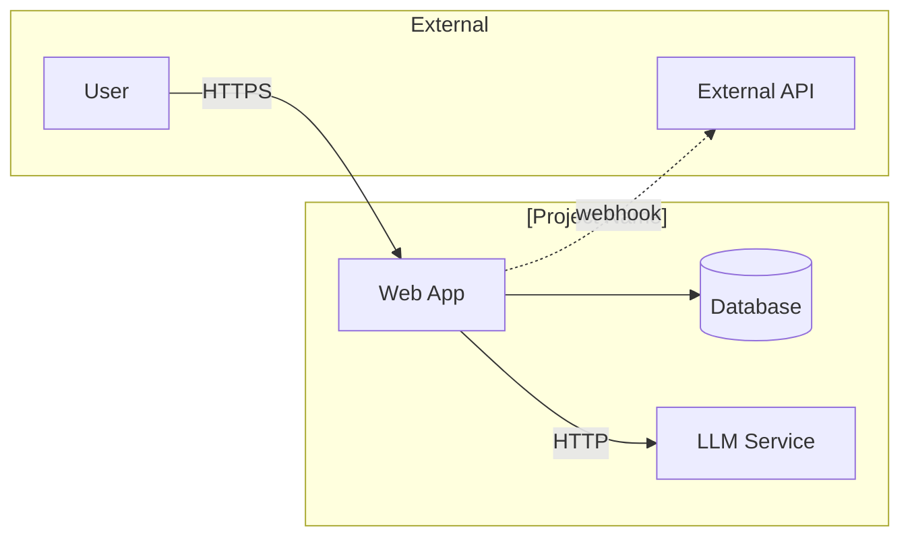
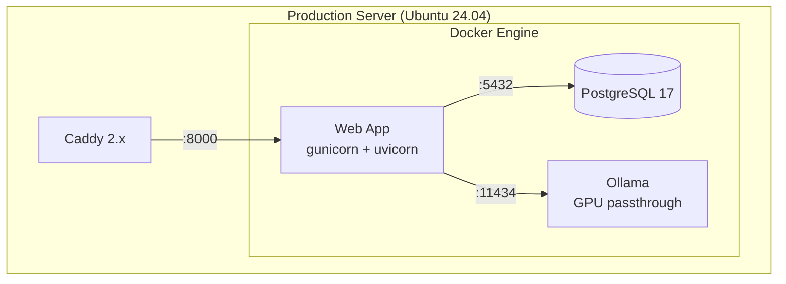
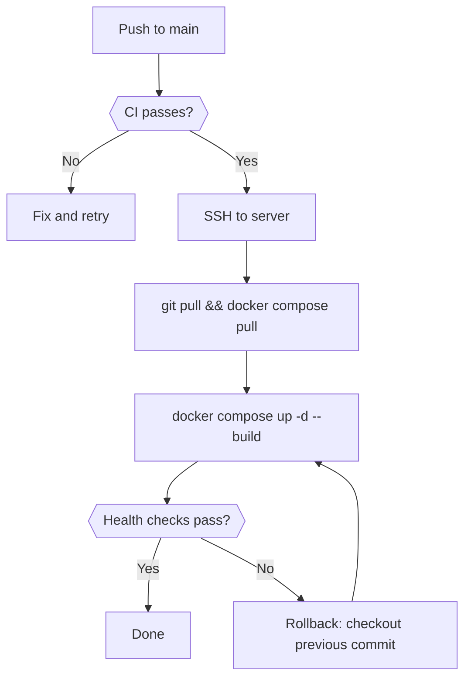

# System Deployment

<!-- Living deployment architecture document. Maintained by pipeline agents via section ownership.
     Created by systems-architect, updated by implementer/cicd-engineer, validated by verifier/sentinel.
     See skills/deployment/references/deployment-documentation.md for the full methodology. -->

## 1. Overview

| Attribute | Value |
|-----------|-------|
| **System** | [Project name] |
| **Primary runtime** | [e.g., Docker Compose on Ubuntu 24.04] |
| **Reverse proxy** | [e.g., Caddy 2.x with automatic HTTPS] |
| **Database** | [e.g., PostgreSQL 17] |
| **Deployment level** | [Dev Compose / Prod-Like Compose / Single-Server Production] |
| **Last verified** | [YYYY-MM-DD by agent or human] |

[One paragraph describing the system's deployment architecture at a glance.]

## 2. System Context

<!-- L0 diagram: system boundary + external actors. Max 6-8 elements.
     One diagram per environment if they differ significantly.
     Node shapes: rectangles for services, [(Database)] for storage, ([Queue]) for messaging. -->

> **Detail views:** [Service Topology](#3-service-topology)

### External Dependencies

| Dependency | Type | Strong/Weak | Shared SLO? | Notes |
|-----------|------|-------------|-------------|-------|
| PostgreSQL | Internal | Strong | Yes | App cannot function without it |
| Ollama | Internal | Weak | No | AI features degrade; core app works |
| Let's Encrypt | External | Weak | No | Caddy caches certs; outage delays renewal only |

## 3. Service Topology

<!-- L1 diagram: major building blocks per environment. Max 10-12 nodes.
     Use subgraphs for deployment boundaries (server, Docker engine).
     Solid arrows for direct deps, dotted for async/event-based. -->

### Production

| Service | Image/Build | Ports (host:container) | Health Check | Restart Policy |
|---------|-------------|----------------------|--------------|----------------|
| app | `build: .` | 8000:8000 | `GET /health` | `unless-stopped` |
| db | `postgres:17` | 5433:5432 | `pg_isready -U postgres` | `unless-stopped` |
| caddy | `caddy:2-alpine` | 80:80, 443:443 | -- | `unless-stopped` |
| ollama | `ollama/ollama` | 11434:11434 | `GET /api/tags` | `unless-stopped` |

### Development

[Simplified topology -- typically same services without Caddy, with watch mode enabled.]

## 4. Configuration

### Environment Variables

| Variable | Required | Default | Description | Sensitive |
|----------|----------|---------|-------------|-----------|
| `DATABASE_URL` | Yes | -- | PostgreSQL connection string | Yes |
| `SECRET_KEY` | Yes | -- | Application secret key | Yes |
| `OLLAMA_HOST` | No | `http://ollama:11434` | Ollama endpoint | No |
| `LOG_LEVEL` | No | `info` | Logging verbosity | No |

### Secrets Management

[How secrets are stored and injected. Reference `.env.example` for the committed template.
 For progression from solo to team secrets, see the deployment skill's `references/secrets-management.md`.]

### Environment Differences

| Setting | Development | Production |
|---------|-------------|------------|
| `DEBUG` | `true` | `false` |
| TLS | None (plain HTTP) | Automatic (Let's Encrypt via Caddy) |
| Workers | 1 (uvicorn --reload) | 4 (gunicorn + uvicorn) |
| Database port | 5432:5432 | 5433:5432 |

## 5. Deployment Process

<!-- Flowchart: max 10-12 nodes. Use {{Decision}} for decision points. -->

### Deploy Steps

1. Verify CI is green on the target commit
2. SSH to production server
3. `cd /opt/[project] && git pull origin main`
4. `docker compose pull` (for updated images)
5. `docker compose up -d --build` (rebuild app image)
6. Verify health: `curl -sf http://localhost:8000/health`
7. Monitor logs: `docker compose logs -f --tail=50`

### Rollback

1. `git checkout <previous-known-good-commit>`
2. `docker compose up -d --build`
3. Verify health checks pass
4. Investigate root cause before re-deploying

### CI/CD Integration

[Populated by cicd-engineer when deployment workflows are created.]

## 6. Failure Analysis

### Failure Mode Analysis

| Component | Risk | Likelihood | Impact / Mitigation | Outage Level |
|-----------|------|------------|---------------------|--------------|
| PostgreSQL | Service crash | Medium | Data unavailable. `docker compose restart db`. Health check auto-restarts within 30s. | Full |
| PostgreSQL | Data corruption | Low | Restore from backup. RPO: depends on backup frequency. | Full |
| PostgreSQL | Disk full | Low | Volume growth alert. `docker system prune`. Expand volume. | Full |
| App | OOM kill | Medium | Container restarts via policy. Resource limits cap memory. | Partial |
| App | Unhandled exception | Medium | 500 errors for affected endpoints. Fix and redeploy. | Partial |
| Caddy | Misconfiguration | Medium | External access lost. Rollback Caddyfile via git. `caddy validate`. | External only |
| Caddy | TLS cert expiry | Low | Caddy auto-renews. Manual: `caddy reload`. | External only |
| Ollama | GPU driver issue | Low | AI features unavailable. Core app continues. Check `nvidia-smi`. | Degraded |

### Dependency Classification

| Dependency | Type | Strong/Weak | Failure Impact |
|-----------|------|-------------|----------------|
| PostgreSQL | Internal | Strong | App cannot serve requests |
| Ollama | Internal | Weak | AI features unavailable; core functionality intact |
| Docker Engine | Infrastructure | Strong | All services down |
| Host OS | Infrastructure | Strong | Everything down |

## 7. Monitoring & Observability

### Health Checks

| Service | Endpoint | Interval | Timeout | Retries |
|---------|----------|----------|---------|---------|
| app | `GET /health` | 10s | 3s | 3 |
| db | `pg_isready -U postgres` | 5s | 3s | 5 |
| ollama | `GET /api/tags` | 10s | 5s | 3 |

### Logging

| Service | Log Driver | Access |
|---------|-----------|--------|
| All | Docker json-file (default) | `docker compose logs <service>` |

### Service Level Indicators (if defined)

| SLI | Target | Measurement |
|-----|--------|-------------|
| Availability | 99.5% | Health check success rate |
| Latency (p95) | <500ms | Application metrics |

## 8. Scaling

### Resource Limits

| Service | CPU Limit | Memory Limit | CPU Reservation | Memory Reservation |
|---------|-----------|--------------|-----------------|-------------------|
| app | 2.0 | 1G | 0.5 | 256M |
| db | 2.0 | 2G | 0.5 | 512M |
| ollama | -- | -- | -- | -- (GPU bound) |

### Scaling Model

[Single-server: vertical scaling only. Document when to consider horizontal scaling
 or migration to a platform with autoscaling. Reference the deployment skill's
 decision framework for upgrade triggers.]

## 9. Decisions

Deployment decisions are recorded as ADRs in `.ai-state/decisions/`. This section provides quick cross-references.

<!-- Template relative paths below resolve correctly when rendered at `.ai-state/SYSTEM_DEPLOYMENT.md`; suppressed from validator because the template source lives elsewhere. -->
| ADR | Decision | Impact on Deployment |
|-----|----------|---------------------|
| [dec-NNN](decisions/NNN-your-decision-slug.md) | [Short decision title] | [How it shapes deployment] | <!-- validate-references:ignore -->

[Add one row per deployment-related ADR in your project. Replace `NNN` with the ADR number and the slug with the decision's kebab-case title.]

## 10. Runbook Quick Reference

### Common Operations

| Task | Command |
|------|---------|
| Start all services | `docker compose up -d` |
| Stop all services | `docker compose down` |
| View logs (follow) | `docker compose logs -f` |
| Single service logs | `docker compose logs -f <service>` |
| Restart a service | `docker compose restart <service>` |
| Rebuild and restart | `docker compose up -d --build` |
| Check service status | `docker compose ps` |
| Enter a container | `docker compose exec <service> /bin/sh` |
| Database shell | `docker compose exec db psql -U postgres` |
| Check disk usage | `docker system df` |
| Clean unused images | `docker system prune -f` |

### Troubleshooting

| Symptom | Check | Fix |
|---------|-------|-----|
| Service won't start | `docker compose logs <service>` | Fix config, then `docker compose up -d` |
| Port conflict | `lsof -i :<port>` | Stop conflicting process or change host port |
| Database connection refused | `docker compose ps db` | Ensure db is healthy: `docker compose restart db` |
| Out of disk space | `docker system df` | `docker system prune -f`, expand disk |
| TLS cert error | Check Caddy logs | `caddy reload` or wait for auto-renewal |
| GPU not detected | `nvidia-smi` | Check driver install, restart Docker daemon |
