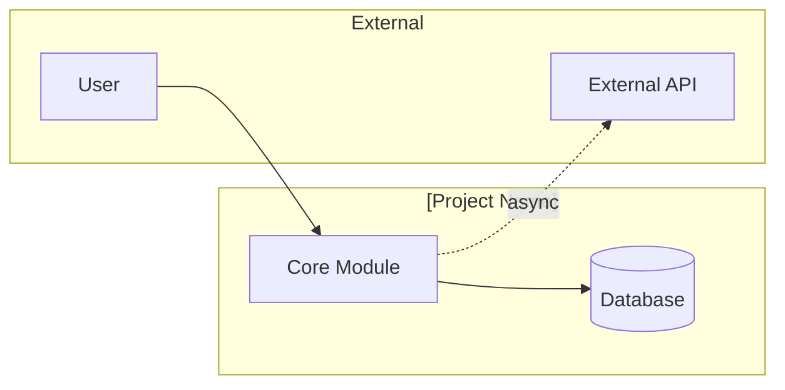
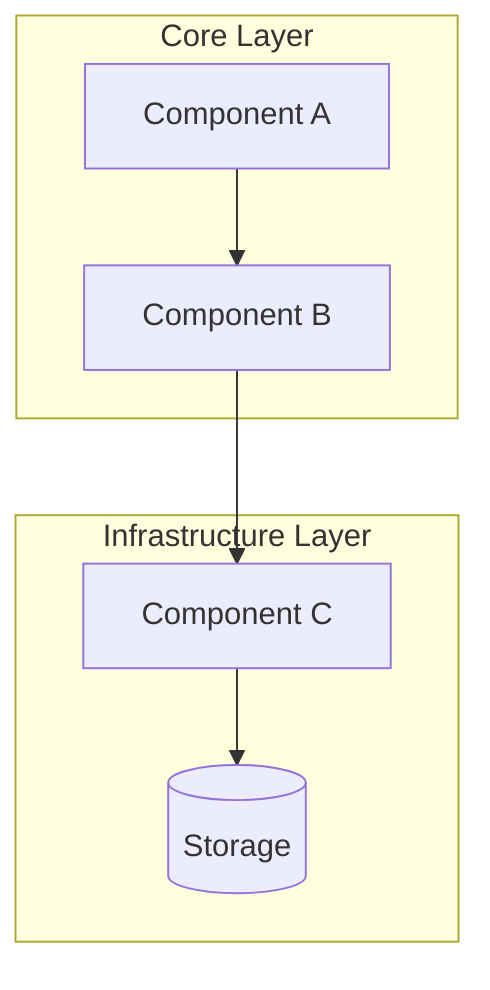

# Architecture Guide

<!-- Developer navigation guide. Every component name and file path in this document has been
     verified against the codebase. Only components that exist on disk are included.
     For design rationale, planned components, and architectural evolution, see .ai-state/ARCHITECTURE.md.
     Maintained by pipeline agents: created by systems-architect, updated by implementer,
     verified by doc-engineer at pipeline checkpoints.
     See skills/software-planning/references/architecture-documentation.md for the full methodology. -->

## 1. Overview

| Attribute | Value |
|-----------|-------|
| **System** | [Project name] |
| **Type** | [e.g., Web application, CLI tool, Library, API service] |
| **Language / Framework** | [e.g., Python 3.13 / FastAPI] |
| **Architecture pattern** | [e.g., Layered, Hexagonal, Microservices, Monolith] |
| **Last verified against code** | [YYYY-MM-DD] |

[One paragraph describing the system's purpose and high-level architectural approach.]

## 2. System Context

<!-- L0 diagram: system boundary + external actors/dependencies. Max 6-8 elements.
     Shows WHAT interacts with the system, not internals.
     Node shapes: rectangles for components, [(Database)] for storage, ([Queue]) for messaging.
     Only include integrations that exist in the current codebase. -->

> **Component detail:** [Components](#3-components)

## 3. Components

<!-- L1 diagram: major building blocks and their relationships. Max 10-12 nodes.
     Use subgraphs for logical boundaries (layers, bounded contexts).
     Solid arrows for direct dependencies, dotted for async/event-based.
     Every component listed here MUST exist on disk -- verify with ls/Glob before including. -->

| Component | Responsibility | Key Files |
|-----------|---------------|-----------|
| [Component A] | [What it does] | `src/component_a/` |
| [Component B] | [What it does] | `src/component_b/` |
| [Component C] | [What it does] | `src/component_c/` |

## 4. Interfaces

<!-- Key APIs, contracts, and integration points between components.
     Only include interfaces that are implemented and callable.
     Focus on boundaries that other components or external systems depend on. -->

| Interface | Type | Provider | Consumer(s) | Contract |
|-----------|------|----------|-------------|----------|
| [e.g., REST API] | HTTP | [Component A] | [External clients] | [e.g., OpenAPI spec at docs/api.yaml] |
| [e.g., Event bus] | Async | [Component B] | [Component C] | [e.g., JSON schema at schemas/events/] |

## 5. Data Flow

<!-- Data-flow diagrams are maintained in .ai-state/ARCHITECTURE.md §5 (the architect-facing doc).
     This section is a pointer — diagrams duplicated here drift against the architect doc.
     Add a brief developer-relevant orientation (entry points, key trace IDs) only if it adds
     navigation value beyond the architect doc. -->

Data flows are diagrammed in [`.ai-state/ARCHITECTURE.md` §5](../.ai-state/ARCHITECTURE.md#5-data-flow). [Optional: 1-2 sentences of developer-relevant orientation — entry points, where to start tracing, key correlation IDs.]

## 6. Dependencies

<!-- External dependencies are maintained in .ai-state/ARCHITECTURE.md §6.
     Single source of truth — never duplicate the dependency table here. -->

External dependencies, versions, and criticality classifications are listed in [`.ai-state/ARCHITECTURE.md` §6](../.ai-state/ARCHITECTURE.md#6-dependencies). Verified against `pyproject.toml` (or equivalent) and project config.

## 7. Constraints

<!-- System constraints are maintained in .ai-state/ARCHITECTURE.md §7.
     Single source of truth — never duplicate constraints here.
     Note any architect-only rows (behavioral, architectural) that exist there but are
     out-of-scope for developers. -->

System constraints (performance, compatibility, technical, behavioral, architectural) are listed in [`.ai-state/ARCHITECTURE.md` §7](../.ai-state/ARCHITECTURE.md#7-constraints).

## 8. Decisions

<!-- Architectural decisions are recorded as ADRs in .ai-state/decisions/.
     This section is a single pointer — never duplicate ADR titles or summaries here.
     The canonical, auto-generated index lives in .ai-state/decisions/DECISIONS_INDEX.md.
     For design-target rationale, the architect doc (.ai-state/ARCHITECTURE.md) is authoritative. -->

Architectural decisions are recorded as ADRs in [`.ai-state/decisions/`](../.ai-state/decisions/). The canonical, auto-generated cross-reference is [`DECISIONS_INDEX.md`](../.ai-state/decisions/DECISIONS_INDEX.md). For design-target rationale, see [`.ai-state/ARCHITECTURE.md`](../.ai-state/ARCHITECTURE.md) — this developer guide intentionally does not summarize decisions inline.
