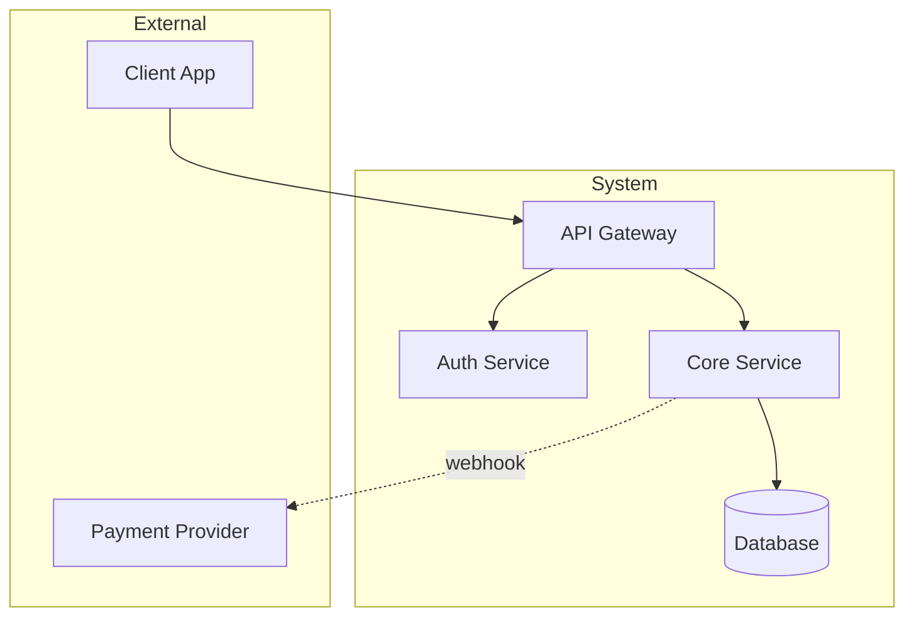
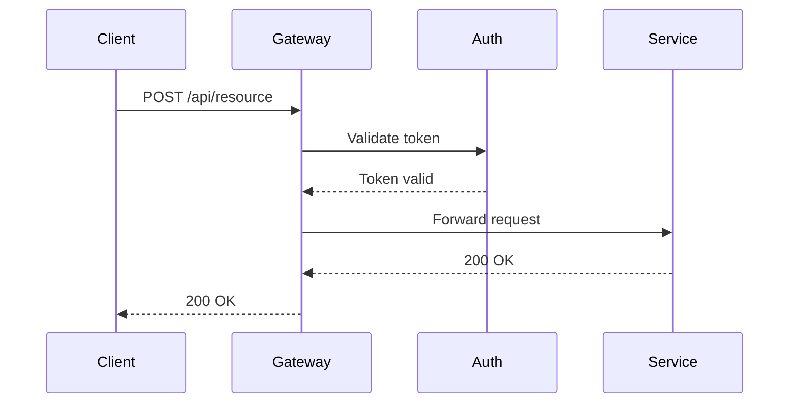
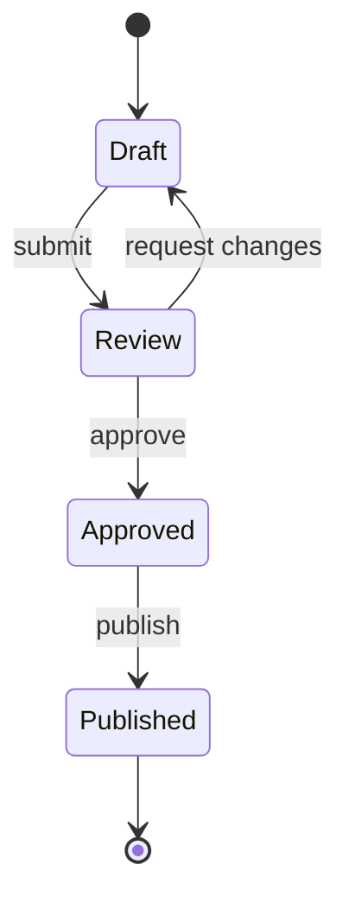
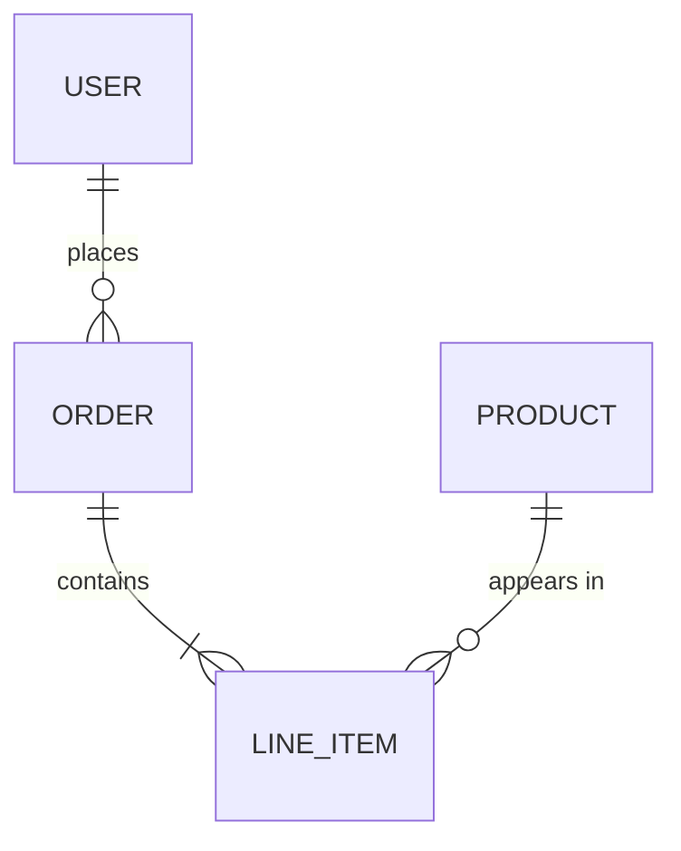

# Diagram Conventions

Procedural guidance for creating, decomposing, and maintaining Mermaid diagrams in project documentation. Back-reference: [../SKILL.md](../SKILL.md)

## When to Create a Diagram

Create a diagram when the relationship structure is the point — when the reader needs to see how things connect, not just what they are.

**Diagram warranted:**
- Architecture with 3+ interacting components
- Request flow crossing 2+ system boundaries
- State machines with non-obvious transitions
- Data models with relationships beyond simple containment

**Diagram not warranted:**
- Linear sequences better served by numbered lists
- Simple parent-child relationships a bullet list conveys
- File/directory structure (`tree` output is clearer)

## Decomposition Methodology

When a system exceeds 10-12 nodes, decompose rather than cluttering.

### Step 1 — Identify the Audience Question

Each diagram answers one question. Common questions and their decomposition:

| Question | Level | Content |
|----------|-------|---------|
| "What does this system interact with?" | L0 Context | External actors + system boundary |
| "What are the major parts?" | L1 Components | Building blocks + relationships |
| "How does this component work internally?" | L2 Internals | Sub-components of one L1 block |
| "What happens when X?" | Flow | Sequence or state diagram for one scenario |

### Step 2 — Draft the L1 Diagram First

Always start with L1. This forces you to identify the real building blocks before diving into details. If L1 has more than 12 nodes, some of your "components" are actually sub-components — group them.

### Step 3 — Create L2 Diagrams Only When Needed

An L2 diagram exists because a reader asked "how does X work?" about a specific L1 component. Never create L2 for every component preemptively.

### Step 4 — Cross-Reference Between Levels

When an L2 diagram exists, the L1 diagram should note which components have detail views:

```markdown
> **Detail views:** [Auth Service internals](#auth-service-internals), [Payment flow](#payment-flow)
```

## Diagram Type Recipes

### Architecture Diagram (Flowchart)

Best for component relationships and system structure.



**Tips:**
- `subgraph` for deployment or trust boundaries
- External systems outside the main subgraph
- Direction (`TD` vs `LR`) should match the dominant flow

### Sequence Diagram

Best for request/response flows and protocol interactions.



**Tips:**
- Limit to 5-6 participants — split into multiple diagrams for complex flows
- Use `-->>` (dashed) for responses, `->>` (solid) for requests
- Name participants with short aliases: `participant C as Client`

### State Diagram

Best for lifecycle and workflow states.



**Tips:**
- Include the trigger on each transition edge
- Omit states that don't affect behavior (internal bookkeeping states)

### Entity-Relationship Diagram

Best for data models with relationships.



**Tips:**
- Use relationship labels that read naturally left-to-right
- Only show relationships relevant to the current context

## Styling Guide

### Node Naming

Always use descriptive labels — the diagram must be readable without external context:

```
%% Good
Auth[Auth Service] --> DB[(User Database)]

%% Bad — requires a legend or mental mapping
A --> B
```

### Edge Labels

Label edges when the relationship is not obvious from context. Omit labels when the connection is self-evident (e.g., `Service --> Database` needs no label).

```
%% Labeled — relationship type matters
Core -->|REST| API
Core -.->|events| Queue

%% Unlabeled — obvious from context
Gateway --> Auth
```

### Subgraph Usage

Group by deployment boundary, trust boundary, or logical domain — not by technical layer:

```
%% Good — groups by domain
subgraph Order Domain
    OrderService
    OrderDB[(Orders)]
end

%% Avoid — groups by technical layer
subgraph Databases
    OrderDB
    UserDB
    ProductDB
end
```

## Maintenance

Diagrams decay faster than prose — a renamed service or removed dependency silently makes a diagram wrong.

**When modifying code that changes component relationships:**
1. Search for mermaid blocks in documentation that reference the changed components
2. Update affected diagrams in the same commit
3. Verify arrows still match actual dependency direction

**Validation heuristic:** For each arrow in a diagram, you should be able to point to the code (import, API call, config reference) that justifies it. If you cannot, the arrow is either wrong or the diagram is aspirational rather than factual.

## Integration with claude-mermaid

When the `claude-mermaid` plugin is available, use its MCP tools for diagram authoring:

- `mermaid_preview` — render a diagram for visual validation before committing
- `mermaid_save` — export to file when a persistent image is needed (e.g., GitHub issue embeds)

Use preview to check layout before committing — Mermaid's auto-layout can produce unexpected results with complex graphs. If the layout is unclear, restructure the graph (reorder nodes, change direction) rather than fighting the renderer.
