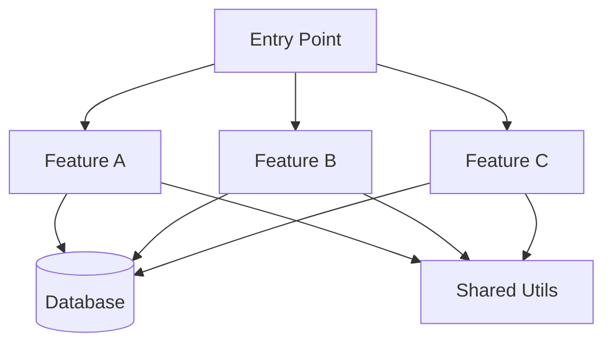
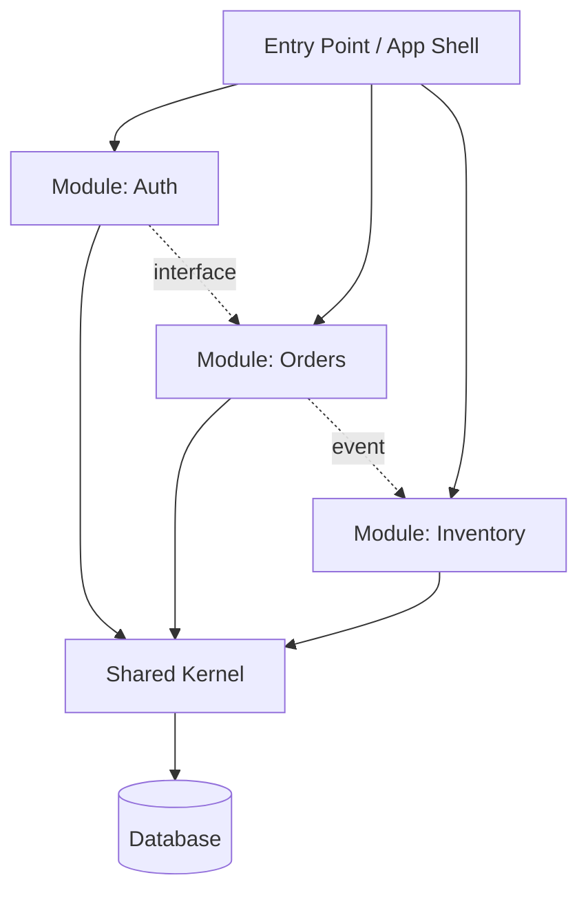
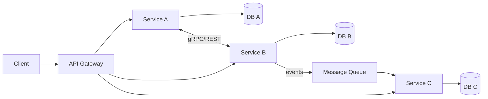
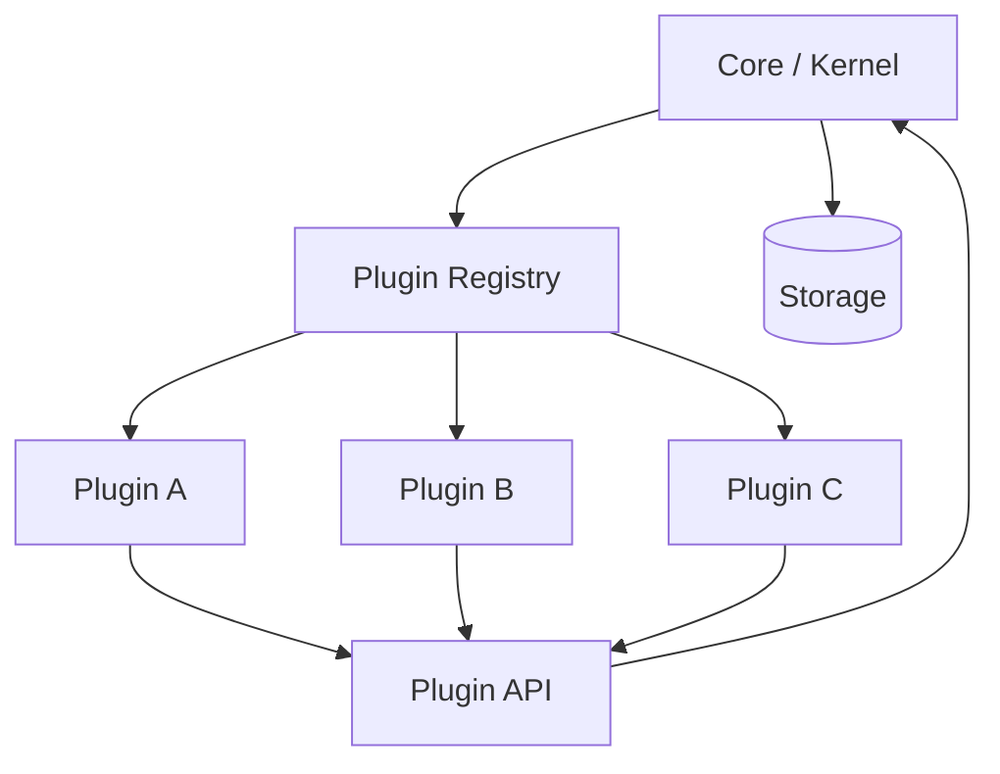
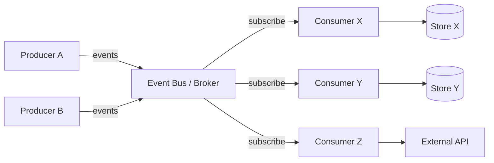
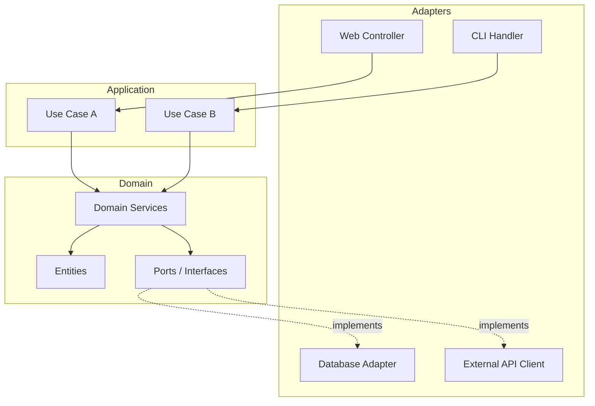
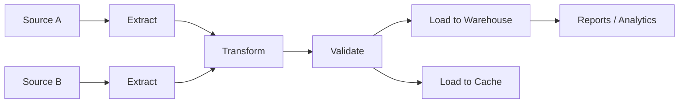
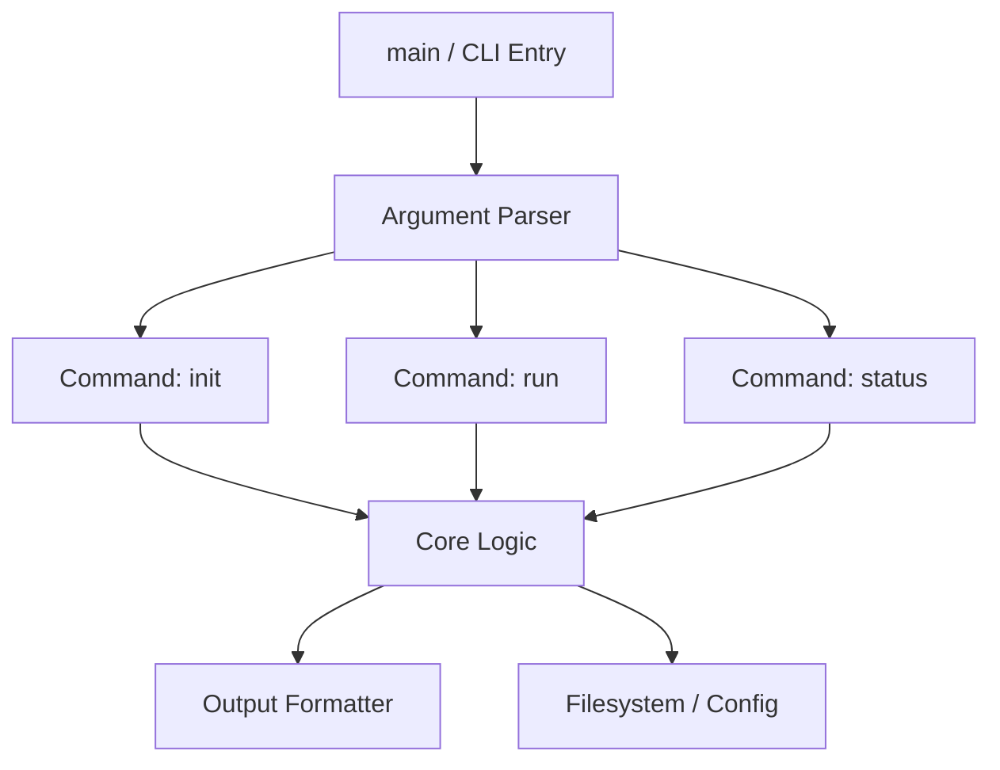
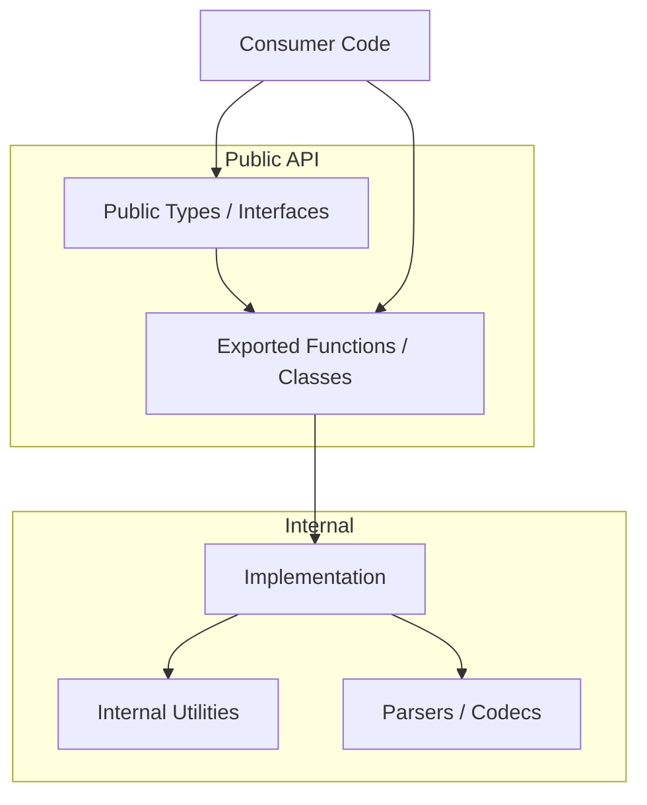
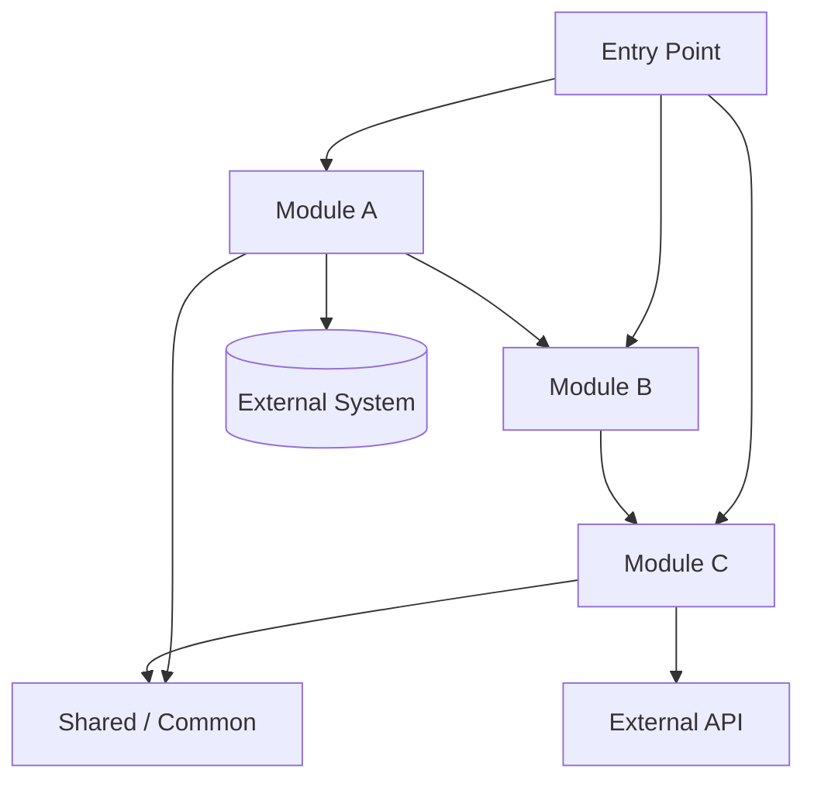

# Architecture Patterns

Guide for identifying common architecture patterns and generating project-specific Mermaid diagrams. Each pattern includes detection signals, typical structure, and a reusable Mermaid template. Back-reference: [../SKILL.md](../SKILL.md)

## How to Generate Project-Specific Diagrams

1. **Identify the pattern** using the detection signals below
2. **Select the matching template** from this file
3. **Fill in actual names** from the project's modules, packages, or services
4. **Adjust arrows** based on actual import/dependency direction found in code
5. **Add external systems** (databases, APIs, queues) as separate nodes
6. **Limit to 10-12 nodes** for readability -- group related files into their parent module
7. **Verify every arrow** against actual code -- source code is the truth

When the project doesn't match a single pattern cleanly, combine elements from multiple templates or use the Generic Modular template at the end.

## Monolith

**Detection signals**: Single deployment unit, single database, all code in one `src/` tree, no service boundaries, single Dockerfile (if any).

**Typical structure**: `src/` with feature directories, shared database, single entry point.

**Strengths**: Simple deployment, easy local development, no network boundaries.
**Trade-offs**: Coupling risk, scaling is all-or-nothing, larger blast radius for changes.

## Modular Monolith

**Detection signals**: Single deployment, but clear module boundaries. Modules have their own directories with internal structure. Limited cross-module imports. May have internal APIs between modules.

**Typical structure**: `modules/` or `packages/` with self-contained feature modules, each with own models/routes/services, shared kernel for cross-cutting concerns.

**Strengths**: Monolith simplicity with better boundaries. Easier future extraction to services.
**Trade-offs**: Discipline required to maintain boundaries. Still single deployment.

## Microservices

**Detection signals**: Multiple Dockerfiles, `docker-compose.yml` with multiple services, API gateway config, service-to-service communication (gRPC, REST, message queues), multiple independent databases.

**Typical structure**: Each service in its own directory or repository. Shared contracts (proto files, OpenAPI specs). Infrastructure config for orchestration.

**Strengths**: Independent deployment, team autonomy, technology diversity, isolated scaling.
**Trade-offs**: Network complexity, distributed debugging, data consistency challenges, operational overhead.

## Plugin Architecture

**Detection signals**: Core/kernel module with extension points, plugin registration mechanism, dynamic loading, hook/event system, plugin directories (`plugins/`, `extensions/`).

**Typical structure**: Small core with stable API, plugins that extend functionality, registration/discovery mechanism.

**Strengths**: Extensibility without modifying core, community contributions, feature isolation.
**Trade-offs**: Plugin API stability burden, version compatibility, testing surface area.

## Event-Driven

**Detection signals**: Event bus or message broker usage (Kafka, RabbitMQ, Redis Pub/Sub, EventEmitter), event/handler naming patterns, CQRS patterns, event sourcing, `events/`, `handlers/`, `subscribers/` directories.

**Typical structure**: Event producers and consumers, message broker as backbone, eventual consistency patterns.

**Strengths**: Loose coupling, temporal decoupling, natural audit trail, scalability.
**Trade-offs**: Eventual consistency complexity, debugging event chains, ordering guarantees.

## Hexagonal / Clean Architecture

**Detection signals**: `ports/` and `adapters/` directories, `domain/` separate from `infrastructure/`, dependency inversion (core doesn't import infrastructure), interface-heavy design, `usecases/` or `application/` layer.

**Typical structure**: Domain core with no external dependencies, application layer (use cases), adapter layer (infrastructure implementations), ports (interfaces) connecting them.

**Strengths**: Domain isolation, testability, swappable infrastructure, clear dependency direction.
**Trade-offs**: More boilerplate, indirection overhead, steeper onboarding curve.

## Pipeline / DAG

**Detection signals**: Stage-based processing, DAG definitions (Airflow, Prefect, Luigi, dbt), ETL/ELT patterns, `tasks/`, `stages/`, `pipelines/` directories, scheduler configuration.

**Typical structure**: Data sources feed into transformation stages, stages have clear input/output contracts, orchestrator manages execution order.

**Strengths**: Clear data lineage, parallelizable stages, retry at stage level, observable.
**Trade-offs**: Pipeline complexity for simple tasks, orchestrator dependency, data contract management.

## CLI Application

**Detection signals**: `main()` with argument parser, `cmd/` directory, `click`/`argparse`/`clap`/`cobra`/`commander` imports, subcommand pattern, help text definitions.

**Typical structure**: Entry point dispatches to subcommands, each subcommand handles one operation, shared utilities for output formatting and error handling.

**Strengths**: Simple execution model, clear user interface, composable with other tools.
**Trade-offs**: Stateless (unless persisting to files/DB), limited UI, argument parsing complexity for rich CLIs.

## Library / SDK

**Detection signals**: Public exports (`__init__.py` with `__all__`, `index.ts` re-exports, `pub` in `lib.rs`), no `main()` entry point, extensive API documentation, versioned releases, examples directory.

**Typical structure**: Public API layer (thin), internal implementation (thick), types/interfaces for consumers, examples and documentation.

**Strengths**: Reusability, clear API contract, version-controlled interface.
**Trade-offs**: API stability burden, backward compatibility, documentation maintenance.

## Generic Modular (Fallback)

Use this template when the project doesn't match a specific pattern, or when you need a starting point to customize.

