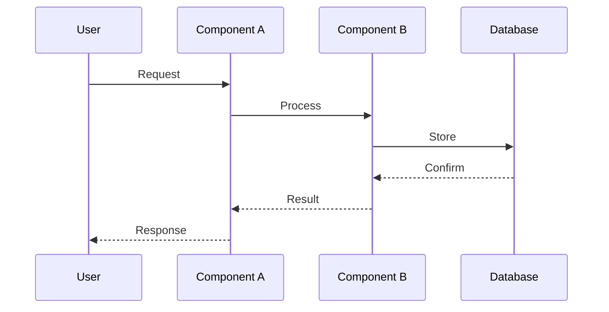

# Architecture

<!-- Design-target architecture document. Abstracts above concrete code to define the space of valid
     implementations. Component names may be abstract; file paths are illustrative; planned components
     are included with Status markers. For code-verified developer navigation, see docs/architecture.md.
     Maintained by pipeline agents via section ownership.
     Created by systems-architect, updated by implementer, validated by verifier/sentinel.
     See skills/software-planning/references/architecture-documentation.md for the full methodology. -->

## 1. Overview

| Attribute | Value |
|-----------|-------|
| **System** | [Project name] |
| **Type** | [e.g., Web application, CLI tool, Library, API service] |
| **Language / Framework** | [e.g., Python 3.13 / FastAPI] |
| **Architecture pattern** | [e.g., Layered, Hexagonal, Microservices, Monolith] |
| **Source stage** | [Phase 5 creation / Step N update / Pipeline `<slug>`] |
| **Last verified** | [YYYY-MM-DD by agent or human] |

[One paragraph describing the system's purpose and high-level architectural approach.]

## 2. System Context

<!-- L0 diagram: system boundary + external actors/dependencies. Max 6-8 elements.
     Shows WHAT interacts with the system, not internals.
     Node shapes: rectangles for components, [(Database)] for storage, ([Queue]) for messaging.
     May include planned external integrations with a note.
     Cross-reference docs/architecture.md for code-verified component details. -->

<!-- After editing diagrams/architecture.c4, run scripts/diagram-regen-hook.sh (or commit to trigger pre-commit) to regenerate this SVG. -->


<details>
<summary>LikeC4 source (edit diagrams/architecture.c4 to update this diagram)</summary>

```c4
// System Context view — L0
// Edit the shared .c4 model, then run the regeneration hook (pre-commit) or:
//   likec4 gen d2 diagrams/architecture.c4 -o diagrams/architecture/
//   d2 diagrams/architecture/context.d2 diagrams/architecture/context.svg
specification {
  element person
  element system
}

model {
  user = person "User" {
    description "Primary actor"
  }
  mySystem = system "[System Name]" {
    description "The system being documented"
  }
  user -> mySystem "uses"
}

views {
  view context of mySystem {
    title "System Context"
    include *
  }
}
```

</details>

> **Component detail:** [Components](#3-components)

## 3. Components

<!-- L1 diagram: major building blocks and their relationships. Max 10-12 nodes.
     Use subgraphs for logical boundaries (layers, bounded contexts).
     Dual ownership: systems-architect writes the skeleton, implementer fills as-built details.
     Solid arrows for direct dependencies, dotted for async/event-based.
     Status values: Designed (interface defined, not yet implemented), Built (code exists on disk),
     Planned (roadmap item, no interface yet), Deprecated (scheduled for removal). -->

<!-- After editing diagrams/architecture.c4, run scripts/diagram-regen-hook.sh (or commit to trigger pre-commit) to regenerate this SVG. -->


<details>
<summary>LikeC4 source (edit diagrams/architecture.c4 to update this diagram)</summary>

```c4
// Components view — L1
// Edit the shared .c4 model, then run the regeneration hook (pre-commit) or:
//   likec4 gen d2 diagrams/architecture.c4 -o diagrams/architecture/
//   d2 diagrams/architecture/components.d2 diagrams/architecture/components.svg
specification {
  element person
  element system
  element component
}

model {
  user = person "User" {
    description "Primary actor"
  }
  mySystem = system "[System Name]" {
    description "The system being documented"

    coreLayer = component "Core Layer" {
      description "Primary business logic"
    }
    infraLayer = component "Infrastructure Layer" {
      description "Storage and external adapters"
    }
  }
  user -> mySystem.coreLayer "calls"
  mySystem.coreLayer -> mySystem.infraLayer "reads/writes"
}

views {
  view components of mySystem {
    title "Components"
    include *
  }
}
```

</details>

| Component | Responsibility | Status | Key Files |
|-----------|---------------|--------|-----------|
| [Component A] | [What it does] | Built | `src/component_a/` |
| [Component B] | [What it does] | Built | `src/component_b/` |
| [Component C] | [What it does] | Designed | `src/component_c/` |

## 4. Interfaces

<!-- Key APIs, contracts, and integration points between components.
     Dual ownership: systems-architect documents design-time contracts,
     implementer updates as-built details.
     Focus on boundaries that other components or external systems depend on. -->

| Interface | Type | Provider | Consumer(s) | Contract |
|-----------|------|----------|-------------|----------|
| [e.g., REST API] | HTTP | [Component A] | [External clients] | [e.g., OpenAPI spec at docs/api.yaml] |
| [e.g., Event bus] | Async | [Component B] | [Component C] | [e.g., JSON schema at schemas/events/] |

## 5. Data Flow

<!-- How data moves through the system for key scenarios.
     Use sequence diagrams for request flows, flowcharts for data pipelines.
     Focus on the 2-3 most important scenarios, not exhaustive coverage. -->

### [Primary Scenario Name]



## 6. Dependencies

<!-- External dependencies the system relies on.
     Dual ownership: systems-architect lists initial dependencies,
     implementer updates as dependencies are added/removed.
     May include planned dependencies with a note. -->

| Dependency | Version | Purpose | Criticality |
|-----------|---------|---------|-------------|
| [e.g., PostgreSQL] | [17.x] | [Primary data store] | Critical |
| [e.g., Redis] | [7.x] | [Caching layer] | Non-critical (degrades gracefully) |

## 7. Constraints

<!-- Known limitations, performance boundaries, quality attributes, and compatibility requirements.
     Type: Performance, Security, Compatibility, Regulatory, Technical, Quality. -->

| Constraint | Type | Rationale |
|-----------|------|-----------|
| [e.g., Response time < 200ms for API endpoints] | Performance | [User experience requirement] |
| [e.g., Must run on Python 3.11+] | Compatibility | [Minimum supported runtime] |
| [e.g., All data at rest must be encrypted] | Security | [Compliance requirement] |

## 8. Decisions

<!-- Architectural decisions are recorded as ADRs in .ai-state/decisions/.
     This section is a single pointer — the canonical, auto-generated index lives in
     .ai-state/decisions/DECISIONS_INDEX.md. Do NOT duplicate ADR titles or summaries here:
     summaries drift, indexes regenerate. Inline `dec-NNN` references in the section bodies
     above (Components, Interfaces, Constraints) are validated by sentinel AC04. -->

Architectural decisions are recorded as ADRs in [`.ai-state/decisions/`](decisions/). The canonical, auto-generated cross-reference is [`DECISIONS_INDEX.md`](decisions/DECISIONS_INDEX.md). In-flight pipeline ADRs live as fragments under [`decisions/drafts/`](decisions/drafts/) and are promoted to stable `dec-NNN` at merge-to-main by `scripts/finalize_adrs.py`.
